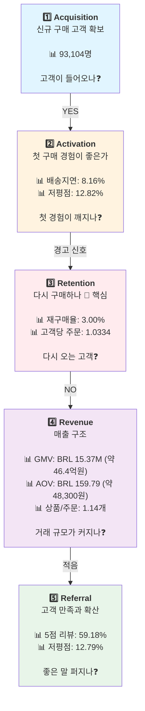

# AARRR 프레임워크 — Olist 고객 여정 진단

> **작성일**: 2026-03-31  
> **최종 업데이트**: 2026-04-04 | 고객 수 canonical 기준으로 수정 (93,094명 → 93,104명)  
> **목적**: 팀원들이 Olist 고객이 "어느 단계에서 떨어져나가는지" 이해하기  
> **환율 기준**: 1 BRL ≈ 302원 (2018년 연평균 기준)

---

## 프레임워크 개요

AARRR은 **고객이 서비스를 접하고, 첫 가치를 경험하고, 다시 사용하고, 매출을 만들고, 다른 사람에게 퍼뜨리는 여정**을 5단계로 나누는 도구입니다.

이번 프로젝트에서는 Olist의 **구매 고객 여정에서 가장 약한 단계가 어디인지** 찾는 데 사용합니다.

---

## 📌 중요: 이 분석은 BUYER(구매자) 관점입니다

### 93,104명은 누구인가?

**이들은 Olist에서 실제 상품을 구매한 최종 사용자입니다.**

Olist는 마켓플레이스이기 때문에 두 가지 "고객"이 있습니다:
- **Buyer(구매자)**: 상품을 사는 사람 ← **우리 분석의 메인**
- **Seller(판매자)**: 상품을 파는 사업자 ← 보조 참고

이 AARRR 문서는 **Buyer 중심**이므로, 모든 수치와 분석은 "구매 고객"을 대상으로 합니다.

### 🔴 BUYER vs 🔵 SELLER: 어떻게 다른가

| 항목 | BUYER(구매자) | SELLER(판매자) |
|------|---|---|
| **이들은?** | 상품을 **산** 사람 | 상품을 **파는** 사업자 |
| **Olist와의 관계** | 고객 (수수 거래 당사자) | 공급자 (입점 파트너) |
| **규모** | 93,104명 | 8,000명 (리드) / 842명 (계약) |
| **Acquisition** | "신규 구매 고객 유입" | "판매자 리드 유입" |
| **Activation** | "첫 구매 경험이 좋은가" | "계약 후 실제 판매 시작하는가" |
| **Retention** | "다시 구매하는가" (3%) | "계속 판매하는가" (70%+) |
| **Revenue** | "고객 구매액" (GMV BRL 15.37M / 약 46.4억원) | "판매자 판매액" |
| **우리 분석의 역할** | ✅ **메인** | ❌ **보조** (맥락 설명용) |

### 왜 BUYER를 메인으로 분석하는가?

**1️⃣ 프로젝트의 핵심 문제가 Buyer 쪽에 있음**
- 신규 고객 유입: 93,104명 ✅ (충분함)
- 재구매 고객: 2,789명 (3%) 🚨 **핵심 병목**
- 문제: "온 고객이 다시 안 온다"

**2️⃣ 해결 방향도 Buyer 대상**
- CRM(고객 관계 관리) → Buyer 대상
- 첫 구매 경험 개선 → Buyer 경험
- 다품목 구매 유도 → Buyer 추천
- 배송 품질 개선 → Buyer 만족

**3️⃣ Seller 데이터는 "공급" 맥락**
- MQL 8,000명, Closed Deal 842명 = "판매자 확보"
- 이는 "매출을 만들 상품의 공급자가 충분한가?"를 묻는 것
- Buyer의 재구매 문제를 해결하는 것이 아님

### 혼동하기 쉬운 부분 — 명확히 하기

#### ❌ 잘못된 해석
> "93,104명이 신규 고객이고, 8,000명이 그 중 일부인가?"

#### ✅ 올바른 해석
> "93,104명은 구매 고객이고, 8,000명은 판매자 리드로 완전히 다른 그룹이다."

#### ❌ 잘못된 해석
> "MQL이 8,000명인데 왜 고객은 93,000명이나 되나?"

#### ✅ 올바른 해석
> "MQL은 판매자 리드(B2B)이고, 93,104명은 구매자(B2C)다. 두 개는 비교 대상이 아니다."

#### ❌ 잘못된 해석
> "Seller 리드 전환율 10.52%와 재구매율 3%는 뭐가 다른가?"

#### ✅ 올바른 해석
> "Seller 전환율(판매자 계약)과 Buyer 재구매율(고객 반복 구매)은 완전히 다른 지표다."

---

## 📊 AARRR 5단계 다이어그램

---

## 📋 단계별 상세 해석

### **1️⃣ Acquisition (신규 구매 고객 확보)**

#### 📌 지표
- **신규 구매 고객 수**: 93,104명

#### 📖 쉽게 말하면
> "우리 서비스에 처음 들어와서 실제로 물건을 사본 고객이 몇 명인가?"

#### 📊 현황
- **93,104명** → 꽤 많은 수의 고객이 들어옵니다

#### 💡 해석
✅ **좋은 신호**: 신규 유입이 충분합니다.  
❌ **하지만**: 들어온 고객들이 **다시 오지 않는 것**이 문제입니다 (다음 단계 참고)

#### 🎯 액션 힌트
- 고객 확보 자체는 잘 되고 있으므로, 유입 채널을 더 늘리기보다는 **온 고객을 붙잡기**에 집중해야 함

---

### **2️⃣ Activation (첫 구매 경험이 좋은가?)**

#### 📌 지표들
| 지표 | 현황 |
|------|------|
| 첫 구매 배송 지연율 | **8.16%** |
| 첫 구매 저평점 비중 | **12.82%** |

#### 📖 쉽게 말하면
> "고객이 처음 물건을 받았을 때, 예상대로 왔는가? 만족했는가?"

#### 💡 해석

**첫 구매 배송 지연율 8.16%**
- 100명 중 약 8명이 예상보다 **늦게 상품을 받음**
- 처음 경험에서 "기다린다"는 스트레스를 받음 → 재구매 가능성 ↓

**첫 구매 저평점 비중 12.82%**
- 리뷰를 남긴 고객 중 12%가 **1~2점 별점** 남김
- 상품 기대 불일치, 배송 문제, 포장 등 → 신뢰 ↓

🚨 **핵심**: 첫 경험에서 이미 일정 비율의 고객이 **나쁜 신호**를 받고 있습니다.  
따라서 Retention이 약한 이유를 단순히 "유입 문제"가 아니라 **"첫 경험 설계 문제"**로도 봐야 합니다.

#### 🎯 액션 힌트
- 배송 지연 팔로업: 어떤 판매자/카테고리가 지연되는가?
- 첫 구매 품질: 저평점 주문의 패턴 분석
- 첫 구매 이후 고객 접점: 불만족한 고객에게 빠른 대응

---

### **3️⃣ Retention (다시 구매하나?) 🚨 우리의 핵심 병목**

#### 📌 지표들
| 지표 | 현황 | 해석 |
|------|------|------|
| 재구매 고객 수 | **2,789명** | 2회 이상 구매한 고객 |
| 재구매 고객 비중 | **3.00%** | 100명 중 3명만 재구매 |
| 고객당 평균 주문 수 | **1.0334** | 거의 1회 구매로 끝남 |

#### 📖 쉽게 말하면
> "들어온 고객 중 몇 명이 **두 번째 물건을 또 샀는가?**"

#### 💡 해석 — **이것이 Olist의 핵심 문제입니다**

- 신규 고객 93,104명이 들어왔습니다 ✓
- 하지만 그 중 **97%는 단 1회만 구매**하고 다시 안 옵니다 ✗
- 100명의 고객을 데려오려면 계속 새 고객만 데려와야 함
- 이는 매우 비효율적인 성장 모델입니다

**비유**:  
버킷에 물을 담는데, 위에서 계속 퍼붓기만 하고 **바닥에 구멍이 뚫려있는** 상태입니다.

#### 🚨 왜 중요한가?
- 신규 고객 확보에는 마케팅 비용이 많이 듭니다
- **재구매 고객 1명 = 신규 고객 여러 명의 가치**
- 지금 구조로는 성장이 계속 둔화될 수밖에 없습니다

#### 🎯 액션 힌트 (최우선 순위)
- **CRM**: 첫 구매 후 재구매 유도 메시지, 프로모션
- **상품 개선**: 고객이 "또 사고 싶은" 상품 발굴
- **카테고리 확장**: 다른 카테고리 상품 제안
- **배송/운영 개선**: Activation 단계의 지연율/저평점 개선

---

### **4️⃣ Revenue (매출 구조)**

#### 📌 지표들
| 지표 | 현황 |
|------|------|
| Delivered GMV | **BRL 15.37M** (약 **46.4억원**) |
| Delivered Orders | **96,211건** |
| AOV (주문당 평균가격) | **BRL 159.79** (약 **48,300원**) |
| 주문당 평균 상품 수 | **1.1421개** |
| 다품목 주문 비중 | **9.98%** |

#### 📖 쉽게 말하면
> "고객들이 실제로 얼마나 많이, 얼마 정도의 금액을 쓰나?"

#### 💡 해석

**GMV는 Order × AOV로 구성된다:**
- **96,211건의 주문** × **BRL 159.79** (약 48,300원) **평균 가격** = **BRL 15.37M** (약 46.4억원)

**주문당 상품 수가 1.14개 = 대부분 단품 구매**
- 100건의 주문 중 90건은 1개 상품만 담음
- 10건만 2개 이상 담음

🚨 **의미**: 현재 매출 구조는 **"고빈도 + 고가격"이 아니라 "저빈도 + 저가격"**입니다.

#### 🎯 액션 힌트
- **상품 추천**: "이 상품과 함께 사면 좋은 상품은?"
- **번들 제안**: "2개 세트 할인"처럼 다품목 구매 유도
- **카테고리 조합**: 카테고리 간 연결성 높이기

---

### **5️⃣ Referral (고객 만족과 입소문)**

#### 📌 지표들
| 지표 | 현황 |
|------|------|
| 5점 리뷰 비중 | **59.18%** |
| 저평점(1~2점) 비중 | **12.79%** |
| 리뷰 작성률 | **99.33%** |

#### 📖 쉽게 말하면
> "고객들이 우리 서비스에 만족해서 좋은 반응을 보이나?"

#### 💡 해석

**리뷰 작성률 99.33% = 거의 모든 고객이 리뷰를 남김**
- 이는 긍정적입니다 (고객 참여도가 높음)

**5점 리뷰 59.18% = 대다수가 만족**
- 절반 이상의 고객이 최고 만족도 표시

🚨 **하지만 저평점 12.79%는 무시할 수 없음**
- 100개 리뷰 중 12~13개가 저평점
- 이는 구전(입소문)에 부정적 영향

#### 💡 종합 해석
- 전반적으로 **만족도는 괜찮지만 불만도 존재**
- Retention이 낮은 이유가 완전히 "상품 품질"은 아니라는 신호
- Activation(첫 경험) 단계의 배송/저평점 개선이 중요

---

## 🎯 AARRR 5단계를 종합하면

| 단계 | 상태 | 의미 |
|------|------|------|
| **Acquisition** | ✅ 양호 | 신규 고객 유입 잘됨 |
| **Activation** | ⚠️ 주의 | 첫 경험에 일부 문제 신호 |
| **Retention** | 🚨 위험 | **핵심 병목** — 97% 이탈 |
| **Revenue** | ⚠️ 취약 | 단발성, 저가격 구조 |
| **Referral** | ✅ 준수 | 전반적 만족도 괜찮음 |

### **한 줄 결론**
> Olist는 **고객을 잘 데려오지만, 붙잡지 못합니다.**  
> 따라서 CRM, 첫 경험 개선, 재구매 유도가 **최우선 과제**입니다.

---

## 📌 팀 토론 질문

1. 재구매 3%를 개선하려면 어디서부터 손을 봐야 할까?
2. 첫 구매 배송 지연 8.16%, 저평점 12.82%를 줄일 수 있을까?
3. AOV BRL 159.79 (약 48,300원)를 늘리려면 상품 개선인가, 추천 개선인가?
4. 리뷰 저평점 12.79%는 배송 때문일까, 상품 때문일까?
