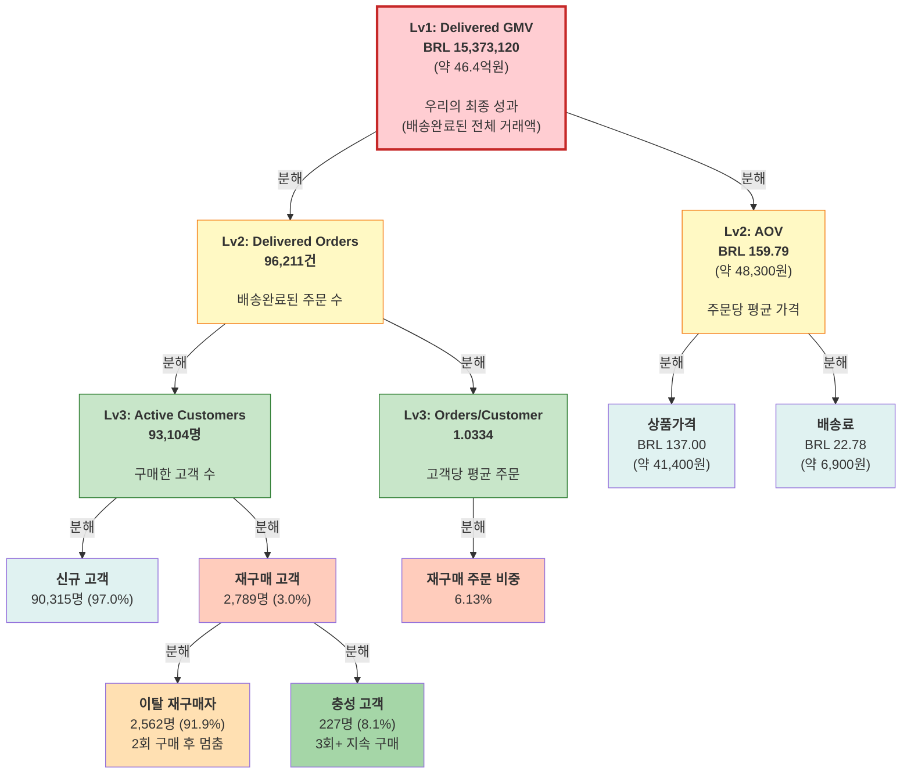

# KPI 트리 — Olist 성장 구조 분석

> **작성일**: 2026-03-31  
> **최종 업데이트**: 2026-04-04 | 전체 수치 canonical_metrics.py 기준으로 통일 (신규 90,315명 / 이탈재구매 2,562명 / 충성 227명 / 재구매주문비중 6.13%)  
> **목적**: 팀원들이 "매출이 어디서 만들어지는지" 단계별로 이해하기  
> **환율 기준**: 1 BRL ≈ 302원 (2018년 연평균 기준)

---

## 프레임워크 개요

KPI 트리는 **최종 결과(매출)를 만드는 부품들로 분해해서 보는 도구**입니다.

"매출이 왜 안 늘지?"라는 질문에 답하려면, 전체 매출을 **고객 수, 재구매, 주문 빈도, 주문당 가격** 같은 작은 부품으로 나누어 어디가 약한지 봐야 합니다.

---

## 📌 중요: 이 분석은 BUYER(구매자) 관점입니다

### "고객 93,104명"은 누구인가?

**이들은 Olist에서 실제 상품을 구매한 최종 사용자입니다.**

마켓플레이스 Olist에는 두 가지 "고객"이 있습니다:
- **Buyer(구매자)**: 상품을 사는 사람 ← **이 KPI 트리의 중심**
- **Seller(판매자)**: 상품을 파는 사업자 ← 공급 맥락용

이 KPI 트리는 **Buyer의 거래 행동**을 분석하는 것입니다.

### 🔴 BUYER vs 🔵 SELLER: 이 트리가 측정하는 것

| 항목 | BUYER(구매자) | SELLER(판매자) |
|------|---|---|
| **"고객"의 정의** | 상품을 **산** 사람 | 상품을 **파는** 사업자 |
| **규모** | 93,104명 | 842명 (계약) / 376명 (판매 시작) |
| **KPI 트리의 대상** | ✅ **이 문서** | ❌ 포함 안 함 |
| **Orders 96,211건은?** | 구매자가 주문한 건수 | (판매자는 별도 분석) |
| **AOV BRL 159.79는?** | 구매자 주문당 평균가격 | (판매자의 판매가는 다름) |
| **Delivered GMV BRL 15.37M은?** | 구매자들의 전체 구매액 | (판매자 공급은 다름) |

### 왜 이 KPI 트리는 BUYER 중심인가?

**1️⃣ 메인 문제가 Buyer 구매 행동에 있음**
- Customers: 93,104명 (충분함) ✅
- Orders/Customer: 1.0334 (거의 1회) 🚨
- Multi-item rate: 9.98% (단품 위주) 🚨

"고객은 충분히 들어오지만, 그들이 한 번 사고 끝내고, 다품목을 못 산다"

**2️⃣ 개선 방향도 Buyer 행동 유도**
- 재구매 유도 (CRM)
- 다품목 추천
- AOV 상향 (번들, cross-sell)
- 배송 경험 개선

**3️⃣ Seller 데이터는 보조 맥락**
- MQL 8,000명 → Seller 리드 (B2B)
- Closed Deal 842명 → Seller 계약 (B2B)
- 이들은 "공급자 확보"의 이야기
- Buyer의 구매액 향상과는 직접 연결 안 됨

### 자주 헷갈리는 부분

#### ❌ "93,104명과 8,000명 중 누가 더 중요한가?"
#### ✅ "다른 대상이다. 93,104명은 구매 고객, 8,000명은 판매자 리드다."

#### ❌ "Delivered Orders 96,211건은 몇 명이 주문한 거인가?"
#### ✅ "93,104명의 구매 고객이 총 96,211번 주문했다는 뜻. 평균 1.03회/명."

#### ❌ "Seller가 842명인데 왜 구매자 고객은 93,104명이나 된다?"
#### ✅ "Seller는 판매자(공급 측), 93,104명은 구매자(수요 측). 다른 그룹이다."

#### ❌ "그럼 8,000명 seller lead로부터 93,000명의 고객이 나온 건가?"
#### ✅ "아니다. Seller의 매출액(GMV)이 최종적으로 고객이 되는 게 아니라, Seller가 공급한 상품을 구매한 최종 사용자가 93,104명이다."

---

## 📊 KPI 트리 구조도



---

## 📋 단계별 상세 해석

### **🏆 Lv1: Delivered GMV (최종 성과)**

#### 📌 지표
- **Delivered GMV**: **BRL 15,373,120** (~BRL 1,537만 / 약 **46.4억원**)

#### 📖 쉽게 말하면
> "우리가 실제로 고객들로부터 받은 전체 거래액은 얼마인가?"  
> (배송완료된 주문의 상품가격 + 배송료)

#### 💡 해석
- 이것이 Olist의 **최종 성과 지표**입니다
- 모든 활동(마케팅, CRM, 상품 개선, 배송)의 결과가 이 숫자에 반영됩니다
- **하지만 이 숫자만으로는 "왜 이 정도일까?"를 알 수 없습니다**

#### 🎯 다음 질문
"이 매출이 주문이 많아서인가, 아니면 주문당 가격이 높아서인가?" → **Lv2로 분해**

---

### **📊 Lv2: Delivered Orders (주문 수 축)**

#### 📌 지표
- **Delivered Orders**: **96,211건**

#### 📖 쉽게 말하면
> "배송이 완료된 주문이 총 몇 건인가?"

#### 💡 해석
- GMV를 주문 수로 보는 관점입니다
- **96,211건 × BRL 159.79 (약 48,300원)/건 = BRL 15.37M (약 46.4억원)**
- "주문이 부족한 건 아닐까?" → Lv3로 분해

#### 🎯 다음 질문
"이 주문들이 많은 고객으로부터 오는가, 아니면 적은 고객이 많이 반복 구매하는가?" → **Customers, Frequency로 분해**

---

### **📊 Lv2: AOV (주문당 가격 축)**

#### 📌 지표
- **AOV (Average Order Value)**: **BRL 159.79** (약 **48,300원**)

#### 📖 쉽게 말하면
> "고객이 한 번 주문할 때, 평균 얼마를 쓰는가?"

#### 💡 해석
- 주문당 가격이 **BRL 159.79** (약 48,300원) → 중간 정도 수준
- "주문당 가격을 더 높일 수 있을까?" → Lv3로 분해

#### 🎯 다음 질문
"상품 가격을 높이거나, 더 많은 상품을 담도록 유도할 수 있을까?" → **ItemPrice, Frequency로 분해**

---

### **👥 Lv3: Active Purchasing Customers (고객 수)**

#### 📌 지표
- **Active Customers**: **93,104명**
  - 신규 고객: **90,315명**
  - 재구매 고객: **2,789명** (3%)

#### 📖 쉽게 말하면
> "우리로부터 물건을 산 고객이 총 몇 명인가?"

#### 💡 해석

**신규 vs 재구매의 비율이 중요합니다**

| 구분 | 수치 | 해석 |
|------|------|------|
| **신규 고객** | 90,315명 (97.0%) | 계속 새로운 고객만 들어옴 |
| **재구매 고객** | 2,789명 (3.0%) | 다시 오는 고객이 매우 적음 |

🚨 **이것이 Olist의 핵심 문제입니다**

#### 🎯 액션 힌트
- 고객 확보는 잘되는데, **붙잡기**가 문제
- CRM, 재구매 유도, 경험 개선이 필요

---

### **🔄 Lv3: Orders per Customer (고객당 주문 수)**

#### 📌 지표
- **Orders per Customer**: **1.0334**
- **재구매 주문 비중**: **6.13%**

#### 📖 쉽게 말하면
> "고객 1명이 평균 몇 번 주문하는가?"

#### 💡 해석

**1.0334 = 거의 1에 가깝다**

| 의미 | 수치 |
|------|------|
| 전체 주문 96,211건 중 | |
| 일회성 고객의 주문 | 90,315건 (93.87%) |
| 재구매 고객의 전체 주문 | 5,896건 (6.13%) |

🚨 **해석**: 대부분의 매출이 **일회성 고객**에 의존하고 있습니다.

**비유**:
- 회원권을 100번 팔았는데, 98명은 1번만 이용하고 2명만 반복 이용하는 구조

#### 🎯 액션 힌트
- 신규 고객 확보 마케팅에만 집중해서는 성장이 한계에 봉착
- **재구매 유도 CRM, 재진입 상품 발굴, 경험 개선**이 필수

---

### **💰 Lv3: AOV 분해 (가격 구조)**

#### 📌 지표들
| 구성 요소 | BRL | 한화 (참고) |
|----------|-----|-----------|
| 상품 가격 | **BRL 137.00** | 약 **41,400원** |
| 배송료 | **BRL 22.78** | 약 **6,900원** |
| **합계 (AOV)** | **BRL 159.79** | 약 **48,300원** |

#### 📖 쉽게 말하면
> "주문당 159.79 중 얼마가 상품이고, 얼마가 배송료인가?"

#### 💡 해석
- 상품 가격 BRL 137 (약 41,400원) + 배송료 BRL 22.78 (약 6,900원) = BRL 159.79 (약 48,300원)
- 배송료 비중: **22.78 / 159.79 = 14.3%**

🚨 **배송료가 꽤 높은 편입니다**
- 만약 다품목 주문이 많아지면 배송료 비중이 낮아질 수 있음

#### 🎯 액션 힌트
- **상품당 평균 가격(BRL 137)을 높일 수 있을까?**
  - 더 비싼 상품 카테고리 발굴
  - 프리미엄 상품 추천
  
- **주문당 상품 수를 늘릴 수 있을까?** (다음 섹션 참고)
  - 다품목 구매로 배송료 효율화
  - AOV 상승

---

### **📦 주문당 평균 상품 수 & 다품목 구매 비중**

#### 📌 지표들
| 지표 | 현황 |
|------|------|
| 주문당 평균 상품 수 | **1.1421개** |
| 다품목 주문(2개 이상) 비중 | **9.98%** |

#### 📖 쉽게 말하면
> "고객이 한 번에 몇 개 상품을 담는가?"

#### 💡 해석

**평균 1.14개 = 대부분 단품 구매**

- 전체 주문 96,211건 중
- **약 86,000건은 1개 상품만** 담음 (90%)
- **약 10,000건만 2개 이상** 담음 (10%)

🚨 **의미**: 
- 장바구니가 비어있는 구조
- **Cross-sell, Bundle, 추천**의 여지가 큼

#### 🎯 액션 힌트 (우선순위 높음)
- "이 상품과 함께 살 만한 상품은?"
- "세트 할인" (2개 이상 구매 유도)
- "카테고리 조합" 제안
- AOV 개선의 큰 기회

---

---

## 🔍 Lv4: 재구매 고객 심화 분해 — 재구매자는 모두 같지 않다

> **분석 기준**: customer_unique_id / delivered 주문 기준  
> **스크립트**: workspace/claude/scripts/kpi_tree_repeat_analysis.py

재구매 고객 2,789명(3.0%)을 더 들여다보면 두 그룹이 섞여 있습니다.

### 세그먼트 구조

```
재구매 고객 2,789명 (3.0%)
├── 이탈 재구매자  2,562명 (91.9%) — 2회 구매 후 멈춤
└── 충성 고객       227명 ( 8.1%) — 3회 이상 지속 구매
```

| 항목 | 이탈 재구매자 | 충성 고객 |
|------|------------|---------|
| 평균 구매 횟수 | 2.0회 | 3.4회 |
| 1→2차 구매 간격 (중앙값) | **29일** | 114일 |
| 마지막 구매 후 경과 (중앙값) | 201일 | 164일 |
| 배송 지연 경험 비율 | 12.4% | 17.1% |
| 평균 리뷰 점수 | 4.20점 | **4.37점** |
| 저평점(≤2점) 비율 | 7.2% | **4.8%** |
| 중앙값 AOV | BRL 89 | BRL 94 |

**핵심 시사점**:
- 이탈 재구매자는 **29일 내 빠른 재구매** 결정 → 초기 만족은 있었으나 3차 구매로 이어지지 못함
- 충성 고객은 **더 높은 리뷰 점수(4.37)** 와 **더 낮은 저평점(4.8%)** → 만족 경험이 충성도를 만든다
- 두 그룹의 AOV 차이는 작음 → 이탈은 "가격 문제"가 아님

---

### 카테고리별 재구매 세그먼트 분포

| 카테고리 | 일회성 | 이탈재구매 | 충성고객 | 특징 |
|---------|-------|---------|--------|------|
| **bed_bath_table** | 9.6% | 14.7% | **16.3%** | 세그먼트 올라갈수록 비중 증가 — 재구매 최친화 |
| **sports_leisure** | 7.6% | 8.8% | 9.2% | 완만하게 상승 |
| **furniture_decor** | 7.1% | **11.8%** | 6.4% | 이탈에서 피크 — "2번 사고 끝" 패턴 |
| **health_beauty** | 8.7% | 7.6% | - | 일회성 비중이 더 높음 |
| **computers_accessories** | 6.9% | 7.3% | 7.3% | 세그먼트 간 비중 유사 |

**재구매 친화 카테고리**: bed_bath_table > sports_leisure (생필품·취미 소모품 중심)  
**이탈 유발 카테고리**: furniture_decor (고가 내구재, 2회 구매로 필요 충족)

---

### 지역별 재구매 세그먼트 비율

| 지역 | 총 고객 | 이탈재구매율 | 충성고객율 |
|-----|--------|-----------|---------|
| **SP** | 39,150명 | 2.9% | 0.23% |
| **RJ** | 11,913명 | 3.0% | **0.32%** |
| **MG** | 10,996명 | 2.7% | 0.24% |

- RJ의 충성 고객 비율(0.32%)이 SP(0.23%)보다 높음
- 세 지역 모두 재구매율이 낮음 → 지역보다 **플랫폼 구조 자체가 원인**

---

### 배송 지연 → 재구매 분석

| 배송 경험 | 총 고객 | 재구매율 |
|---------|--------|-------|
| 정시 배송 | 85,587명 | 2.85% |
| 지연 경험 | 7,771명 | 4.61% |

> **해석 주의**: 지연 경험자 재구매율이 높은 것은 **측정 편향** 때문입니다.  
> 충성 고객(3회+)은 주문이 많을수록 지연을 경험할 기회도 자연히 증가합니다.  
> → 올바른 후속 분석: **첫 주문에서 지연 경험 여부 → 2차 구매 전환율** 비교 필요

---

## ⚠️ Guardrail 지표 (주의해야 할 것들)

성장을 방해하는 요소들입니다. KPI 트리 최상단은 아니지만, 반드시 모니터링해야 합니다.

### **배송 지연율: 8.13%**

#### 📖 의미
- 100건의 주문 중 8건이 예상 배송일을 넘김
- 심각한 지연(7일 이상): 3.47%

#### 💡 영향
- 재구매율 ↓
- 리뷰 저평점 ↑
- 고객 신뢰 ↓

#### 🎯 액션
- 어떤 판매자가 지연하는가?
- 어떤 카테고리가 지연하는가?
- SLA 재점검

---

### **저평점 리뷰 비중: 12.79%**

#### 📖 의미
- 리뷰 100개 중 12~13개가 1~2점 저평점
- 평균 별점만 보면 4.157점 (나쁘지 않음)
- **하지만 tail risk가 있음**

#### 💡 영향
- 신규 고객의 구매 의욕 ↓
- 재구매 고객의 재방문율 ↓
- 부정적 입소문 → Referral 약화

#### 🎯 액션
- 저평점 리뷰의 원인 분석 (배송? 상품? 설명?)
- 해당 판매자/카테고리 개선

---

### **취소/미배송율: 1.19%**

#### 📖 의미
- 100건의 주문 중 1건이 취소되거나 미배송됨

#### 💡 영향
- Acquisition → 결제까지 했는데 fulfillment 실패
- 고객 신뢰 ↓

#### 🎯 액션
- 재고/공급 문제 확인
- 판매자 교육

---

## 📌 보조 지표: Seller Funnel

Olist는 **Marketplace**이므로, Buyer 성과만으로는 부족합니다. 공급(Seller) 측도 함께 봐야 합니다.

### **Seller 획득 퍼널**

| 지표 | 현황 |
|------|------|
| MQL (마케팅 리드) | **8,000건** |
| Closed Deals (계약 완료) | **842건** |
| 전환율 | **10.53%** |

#### 💡 의미
- Seller 마케팅 리드는 많지만, 실제 계약까지 이어지는 비율이 10%대
- **공급 확대 효율이 평범한 수준**

#### 🎯 액션
- Seller 온보딩 개선
- 계약 조건 재검토

---

## 🎯 KPI 트리 종합 해석

### **단계별 강약점**

| 구분 | 지표 | 현황 | 평가 |
|------|------|------|------|
| **수요 (Demand)** | Customers | 93,104명 | ✅ 충분 |
| | Frequency | 1.0334 | 🚨 심각 |
| | 재구매율 (전체) | 3.0% | 🚨 심각 |
| | — 이탈 재구매자 | 2,562명 (2.75%) | 🚨 2회 후 이탈 |
| | — 충성 고객 | 227명 (0.24%) | 🚨 극소수 |
| **가격 (Price)** | AOV | BRL 159.79 | ⚠️ 개선 여지 있음 |
| | 다품목율 | 9.98% | 🚨 매우 낮음 |
| **공급 (Supply)** | Seller 전환율 | 10.53% | ⚠️ 평범 |

### **한 줄 결론**

> Olist의 성장 문제는 **"고객 수 부족"이 아니라**  
> **"2회 구매자의 91.9%가 3회로 이어지지 않는" 충성도 단절 구조**입니다.

---

## 🧮 매출 개선 시뮬레이션

**현재**: 93,104명 × 1.0334회 × BRL 159.79 (약 48,300원) = **BRL 15.37M (약 46.4억원)**

### **시나리오 1: 재구매율 2배 개선 (3% → 6%)**
- Frequency: 1.0334 → 1.0668
- 매출: **BRL 15.37M → BRL 15.85M** (약 57억 → 58.6억원, +3.1%)

### **시나리오 2: 다품목 주문 2배 개선 (9.98% → 20%)**
- AOV: BRL 159.79 → BRL 175 (약 48,300원 → 약 52,850원, 추정)
- 매출: **BRL 15.37M → BRL 16.82M** (약 57억 → 62.2억원, +9.4%)

### **시나리오 3: 두 가지 동시 개선**
- Frequency ↑ + AOV ↑
- 매출: **BRL 15.37M → BRL 17.45M** (약 57억 → 64.6억원, +13.5%)

🎯 **의미**: 
- 신규 고객 획득보다 **기존 고객의 재구매 + 다품목 구매**가 성장 효율이 높음

---

## 📌 팀 토론 질문

1. 재구매율 3%를 어떻게 6% 이상으로 높일 수 있을까?
2. 다품목 주문(현재 10%)을 어떻게 20% 이상으로 높일 수 있을까?
3. 배송 지연 8.13%, 저평점 12.79%를 줄이면 재구매에 얼마나 영향을 줄까?
4. AOV를 높이려면 상품 가격 상향인가, 장바구니 가치 상향인가?
5. **[신규]** 이탈 재구매자(2,562명)의 2차 구매 후 30~60일 개입 전략을 어떻게 설계할 수 있을까?
6. **[신규]** bed_bath_table이 충성 고객 비중 1위인데, 이 카테고리 구매자를 위한 소모품 재구매 알림 시스템을 어떻게 만들까?
7. **[신규]** RJ가 SP보다 충성 고객 비율이 높은 이유는 무엇일까? (도시 특성? 카테고리? 배송 품질?)
