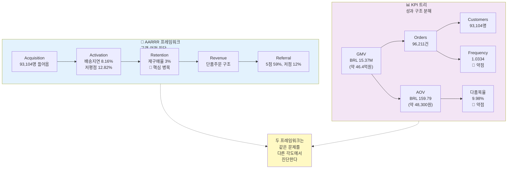

# 프레임워크 통합 가이드 — AARRR vs KPI 트리

> **작성일**: 2026-03-31  
> **최종 업데이트**: 2026-04-04 | 고객 수 canonical 기준으로 수정 (93,094명 → 93,104명)  
> **목적**: 두 프레임워크가 어떻게 다르고, 언제 어떻게 써야 하는지 이해하기  
> **환율 기준**: 1 BRL ≈ 302원 (2018년 연평균 기준)

---

## 📌 먼저 명확히: BUYER vs SELLER 관점

### 이 두 프레임워크는 모두 BUYER(구매자) 중심입니다

이 문서에서 설명하는 AARRR과 KPI 트리는 **최종 구매자의 행동**을 중심으로 설계되었습니다.

```
📍 BUYER 관점 (이 문서의 중심)
├── 고객 = 상품을 사는 사람 (93,104명)
├── Acquisition = 신규 구매 고객
├── Retention = 재구매 고객 (3%)
├── 문제 = "왜 고객이 다시 오지 않나?"
└── 솔루션 = CRM, 경험 개선, 추천

📍 SELLER 관점 (보조 맥락)
├── 고객 = 상품을 파는 사업자 (842명)
├── Acquisition = Seller 리드 (8,000명)
├── Activation = 실제 판매 시작 (376명)
├── 문제 = "왜 판매자가 활동 안 하나?"
└── 솔루션 = Onboarding, 마진 개선
```

### 🔴 BUYER vs 🔵 SELLER: 한눈에 보기

| 항목 | BUYER(구매자) | SELLER(판매자) |
|------|---|---|
| **이들은?** | 상품을 **산** 사람 | 상품을 **파는** 사업자 |
| **규모** | 93,104명 | 8,000명(리드) / 842명(계약) |
| **주요 지표** | 재구매 3%, 다품목 10% | 계약율 10.5%, 활동율 44% |
| **Activation 의미** | 첫 구매 경험 | 계약 후 판매 시작 |
| **Retention 의미** | 반복 구매 | 계속 판매 |
| **프레임워크 역할** | ✅ **메인** | ❌ 보조 |
| **우리 문제** | 재구매 3% (심각) | 계약율 10.5% (평범) |

### 왜 이 가이드에서 BUYER를 중심으로 하는가?

#### **1️⃣ 프로젝트의 핵심 문제가 BUYER 쪽에 있음**

- 신규 고객 유입: 93,104명 ✅ (문제 없음)
- 재구매 고객: 2,789명 (3%) 🚨 **핵심 병목**

**결론**: "온 고객이 떨어져나간다"는 것이 메인 문제

#### **2️⃣ 해결 방향도 BUYER 대상**

- CRM(고객 관계 관리)
- 첫 구매 경험 개선
- 다품목 추천
- AOV 상향

모두 구매 고객을 대상으로 합니다.

#### **3️⃣ SELLER 데이터는 "공급 맥락"일 뿐**

- MQL 8,000명, Closed Deal 842명
- 이는 "판매 상품의 공급자를 잘 확보했는가?"를 보는 것
- BUYER의 재구매 문제를 해결하지 않음

### 혼동하기 쉬운 부분 — 명확히 하기

#### ❌ "AARRR과 KPI 트리는 BUYER와 SELLER를 함께 본다?"
#### ✅ "아니다. 둘 다 BUYER 중심이다. SELLER는 보조 맥락일 뿐이다."

#### ❌ "93,104명의 Buyer와 8,000명의 Seller Lead 중 누가 더 중요한가?"
#### ✅ "비교 대상이 아니다. Buyer는 수요, Seller는 공급으로 다른 그룹이다."

#### ❌ "재구매율 3%와 Seller 계약율 10.5%를 비교하면?"
#### ✅ "비교할 수 없다. 3%는 Buyer 문제, 10.5%는 Seller 문제로 완전히 다르다."

#### ❌ "그럼 SELLER를 따로 분석하지 않는 건가?"
#### ✅ "SELLER 분석은 있지만, 이 프로젝트의 메인이 아니라 보조다. 왜냐하면 BUYER retention 3%가 더 심각한 병목이기 때문이다."

---

## 🎯 핵심 개념

두 프레임워크는 **경쟁하는 것이 아니라, 서로 다른 각도로 같은 문제를 본다**는 점이 중요합니다.  
(단, 이 두 프레임워크가 보는 "문제"는 모두 **BUYER 관점**입니다.)

| 구분 | AARRR | KPI 트리 |
|------|-------|---------|
| **핵심 질문** | "고객이 어디서 떨어져나가는가?" | "매출은 어디서 만들어지는가?" |
| **보는 방식** | 고객 여정의 단계별 진단 | 성과를 만드는 부품 분해 |
| **시각** | 이동 / 단계 | 구조 / 계층 |
| **사용 시점** | "어느 단계에 집중해야 할까?" | "어느 지표를 먼저 개선할까?" |

---

## 📊 두 프레임워크 비교도



---

## 📋 상세 비교표

### **AARRR: 고객 여정 관점**

```
신규 고객 93,104명 유입
      ⬇️
      ⬇️  (일부 좋은 첫 경험)
      ⬇️  (일부 나쁜 첫 경험 — 배송지연 8%, 저평점 12%)
      ⬇️
다시 오는 고객 2,789명 (3%) 🚨 거대한 누수!
      ⬇️
      ⬇️  (낮은 빈도)
      ⬇️  (낮은 주문가)
      ⬇️
매출 BRL 15.37M
```

**AARRR이 답하는 질문들:**
1. 고객이 충분히 들어오는가? → ✅ YES (93K명)
2. 들어온 고객이 좋은 첫 경험을 하는가? → ⚠️ 부분적 (8% 지연, 12% 저평점)
3. 첫 경험 후 다시 오는가? → 🚨 NO (3%만 재구매)
4. 다시 오는 고객이 많이 쓰는가? → 🚨 NO (1회/고객)
5. 만족해서 퍼뜨리는가? → ✅ 부분적 (59% 5점)

**액션 방향:**
- "Retention 단계를 강화해야 한다"
- "첫 경험(Activation) 품질을 개선하면 Retention이 나아질 것"

---

### **KPI 트리: 성과 구조 관점**

```
GMV = Orders × AOV
BRL 15.37M (약 46.4억원) = 96,211건 × BRL 159.79 (약 48,300원)

Orders = Customers × Frequency
96,211 = 93,104 × 1.0334
         ↑          ↑
         OK         🚨 약함

AOV = ItemPrice + Freight
BRL 159.79 (약 48,300원) = BRL 137 (약 41,400원) + BRL 22.78 (약 6,900원)
             ↑
             상품당 평균 1.14개 (🚨 단품 구조)
```

**KPI 트리가 답하는 질문들:**
1. 매출이 Orders 때문에 낮은가? → 부분적 (96K건은 나쁘지 않음)
2. 매출이 AOV 때문에 낮은가? → 부분적 (159.79는 중간 수준)
3. Orders가 Customers 때문에 낮은가? → 아니오 (93K명 충분)
4. Orders가 Frequency 때문에 낮은가? → 🚨 YES (1.03은 거의 1)
5. AOV가 다품목율 때문에 낮은가? → 🚨 YES (10%만 다품목)

**액션 방향:**
- "Frequency(재구매)를 2배로 늘리면 +3% 성장"
- "다품목율을 2배로 늘리면 +9% 성장"
- "둘 다 개선하면 +13% 성장"

---

## 🔄 두 프레임워크의 시너지

### **사례 1: 재구매율 개선**

```
🎯 목표: 재구매율 3% → 6%

AARRR 관점:
- Retention 단계 강화가 필요 → "어디서?"

KPI 트리 관점:
- Frequency 1.0334 → 1.067로 개선
- Orders 96,211 → 99,500으로 증가
- GMV +3.1% 기대 → "얼마나?"

액션:
- CRM 시작 (AARRR에서 힌트)
- 첫 구매 후 7일 내 프로모션 (구체적 터치포인트)
- 재구매 유도 효과 측정 (KPI로 추적)
```

### **사례 2: 다품목 구매 유도**

```
🎯 목표: 다품목율 10% → 20%

AARRR 관점:
- Activation 단계: 첫 구매 경험 개선
- Revenue 단계: 주문가치 상향 → "왜?"

KPI 트리 관점:
- AOV BRL 159.79 (약 48,300원) → BRL 175+ (약 52,850원+) 기대
- 주문당 상품 1.14 → 1.3개
- GMV +9% 이상 기대 → "얼마나?"

액션:
- "이 상품과 함께" 추천 시작
- 세트 할인 제안
- 카테고리 조합 최적화
```

---

## 🎯 언제 어떤 프레임워크를 쓸까?

### **상황 1: 문제 진단 단계**

**"우리는 왜 성장이 느린가?"**

→ **먼저 AARRR로 어느 단계가 약한지 본다**
- Acquisition? → 고객 유입 문제
- Activation? → 첫 경험 문제
- Retention? → 고객 유지 문제 ← 우리의 경우
- Revenue? → 가격/basket 문제
- Referral? → 고객 만족 문제

---

### **상황 2: 개선 방안 우선순위**

**"뭘 먼저 개선할까?"**

→ **KPI 트리로 임팩트를 계산한다**

| 개선 방안 | 현황 → 목표 | 예상 임팩트 |
|----------|-----------|----------|
| 재구매율 | 3% → 6% | +3.1% 성장 |
| 다품목율 | 10% → 20% | +9.4% 성장 |
| 배송지연 | 8% → 4% | 재구매율 ↑ |
| 저평점 | 12% → 8% | 재구매율 ↑ |

**결론**: 다품목 구매 유도가 가장 높은 임팩트

---

### **상황 3: 세부 액션 설계**

**"구체적으로 뭘 해야 하나?"**

→ **AARRR의 각 단계에서 어떤 액션이 필요한지 본다**

```
Retention 강화 액션 리스트:

1. Activation 개선 (첫 경험 강화)
   - 배송 지연 개선 (예상 도착일 조정, SLA 점검)
   - 첫 구매 저평점 감소 (고객 케어)
   
2. Retention 직접 액션
   - CRM: 첫 구매 후 7일 내 "감사 메시지" + "추천 상품"
   - 프로모션: "재구매 고객 한정 20% 할인"
   - 카테고리 재진입: "이전에 사신 카테고리 신상품"
   
3. Revenue 개선 (다품목 구매)
   - 추천 시스템: "함께 사면 좋은 상품"
   - 번들 상품: "2개 세트 할인"
```

---

## 📊 Olist 사례: 두 프레임워크 통합 분석

### **Step 1: AARRR으로 병목 진단**

```
Acquisition ✅ 93,104명 → 들어오는 것 문제 없음
Activation ⚠️ 8% 지연, 12% 저평점 → 일부 신호
Retention 🚨 3% → **핵심 병목**
Revenue ⚠️ 단품주문 구조 → 보조 이슈
Referral ✅ 59% 5점 → 만족도는 괜찮음
```

**진단**: "Retention이 가장 약하다"

---

### **Step 2: KPI 트리로 개선 우선순위 계산**

```
매출 개선 기회:

(1) 재구매율 개선 (3% → 6%)
    → Frequency 1.03 → 1.07
    → 임팩트: +3.1%

(2) 다품목율 개선 (10% → 20%)
    → AOV BRL 159.79 (약 48,300원) → BRL 175 (약 52,850원)
    → 임팩트: +9.4% ← 더 큼

(3) 고객 확보 확대 (현재 93K → 110K)
    → 임팩트: +18% (가장 큼)
    → But: 마케팅 비용 증가, Retention 여전히 3%

→ (2) + (1) 동시 진행이 효율적
```

**결론**: "다품목 구매 + 재구매 유도가 높은 ROI"

---

### **Step 3: AARRR의 각 단계에서 어떤 액션을 할지**

| AARRR 단계 | 진단 | 액션 | 담당팀 |
|-----------|------|------|--------|
| Acquisition | ✅ OK | 현수준 유지 | 마케팅 |
| Activation | ⚠️ 개선 필요 | 배송SLA, 고객케어 개선 | 운영 |
| **Retention** | 🚨 **우선** | CRM 시작, 재구매 유도, 카테고리 제안 | 마케팅/CRM |
| Revenue | ⚠️ 개선 필요 | 다품목 추천, 번들 상품, 세트 할인 | 상품/추천 |
| Referral | ✅ 준수 | 저평점 리뷰 대응 | 운영 |

---

## 🎨 Olist의 통합 전략

### **3개월 우선순위 로드맵**

```
┌─────────────────────────────────────────────────┐
│ Q2 전략: Retention × Revenue 동시 강화          │
├─────────────────────────────────────────────────┤
│                                                  │
│ 📍 Week 1-2: CRM 기초 설계                     │
│    - 첫 구매 후 이메일 시퀀스                   │
│    - 재구매 유도 프로모션                       │
│                                                  │
│ 📍 Week 3-4: 다품목 추천 시작                  │
│    - "함께 사면 좋은 상품" 알고리즘             │
│    - 첫 구매 고객 대상 Cross-sell              │
│                                                  │
│ 📍 Week 5-6: 배송 품질 개선                    │
│    - 지연 seller/카테고리 분석                 │
│    - SLA 재점검                                 │
│                                                  │
│ 📍 Week 7-8: 성과 측정 & 리뷰                  │
│    - 재구매율 → 3% → 3.5%?                    │
│    - 다품목율 → 10% → 12%?                    │
│    - GMV 변화 추적                              │
│                                                  │
└─────────────────────────────────────────────────┘
```

---

## 📝 팀원용 실전 체크리스트

### **AARRR로 분석할 때**

- [ ] 각 단계의 수치를 확인했는가?
- [ ] 어느 단계가 가장 떨어지는가?
- [ ] 그 단계에 영향을 미치는 원인은 무엇인가?
- [ ] 이전 단계의 경험이 영향을 주는가?

### **KPI 트리로 계획할 때**

- [ ] 각 지표를 정해진 값으로 분해했는가?
- [ ] 어느 지표가 가장 약한가?
- [ ] 그 지표를 개선했을 때 임팩트는?
- [ ] 실제 달성 가능한 목표는?

### **액션 시작할 때**

- [ ] AARRR으로 병목을 찾았는가?
- [ ] KPI 트리로 임팩트를 계산했는가?
- [ ] 구체적인 액션 리스트를 만들었는가?
- [ ] 어느 팀이 책임질 것인가?
- [ ] 어떤 KPI로 성과를 측정할 것인가?

---

## 📌 최종 정리

| 항목 | AARRR | KPI 트리 |
|------|-------|---------|
| **답하는 질문** | "고객이 어디서 떨어질까?" | "성과를 뭐가 만들까?" |
| **사용 타이밍** | 문제 진단, 우선순위 결정 | 임팩트 계산, 목표 설정 |
| **산출물** | 약한 단계 식별, 액션 방향 | 개선 목표치, 기대 효과 |
| **다음 단계** | KPI 트리로 세부화 | 액션 설계 & 실행 |

**💡 핵심 메시지**
> 두 프레임워크는 같은 문제를 다른 각도에서 본다.  
> **먼저 AARRR로 방향을 정하고, KPI 트리로 임팩트를 계산하고, 다시 AARRR로 구체적 액션을 설계한다.**

---

## 📌 팀 토론 질문

1. Olist 입장에서 AARRR과 KPI 트리 중 어느 것이 더 와닿는가?
2. Retention (재구매율 3%)을 정말 개선할 수 있을까? 어디서부터?
3. 다품목율을 10%에서 20%로 올리려면 무엇을 바꿔야 할까?
4. 배송 지연율과 저평점이 재구매에 직접 영향을 줄까?
5. KPI 트리의 Guardrail 지표들을 우리가 추적할 수 있을까?
