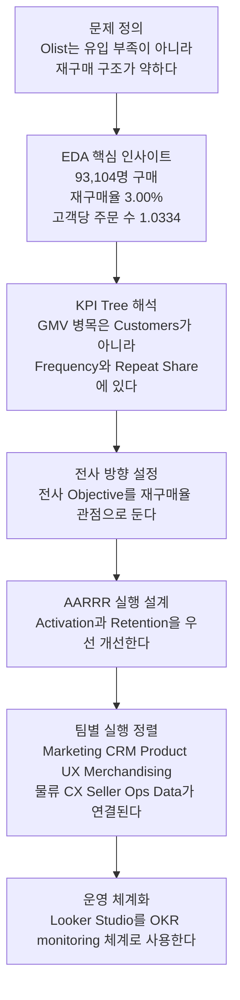
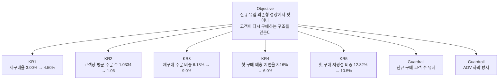

# Olist 전사 OKR 스토리라인 초안

> 목적: 팀원 모두가 동일한 수치와 핵심 지표를 기준으로 성과 개선 방향을 이해하고, 전사 OKR과 팀별 실행 방향을 정렬할 수 있도록 만드는 공유용 문서  
> 범위: 발표자료 제외, 공유용 Markdown 문서  
> 기준 문서: `01_AARRR_Framework_Guide.md`, `02_KPI_Tree_Guide.md`, `03_Framework_Integration_Guide.md`, `04_Consulting_Action_Plan.md`

---

## 1. 이 문서의 핵심 결론

Olist의 핵심 문제는 `고객 유입 부족`이 아니라 `재구매 구조 부족`입니다.

- 구매 고객 수는 충분하다: `93,104명`
- 하지만 재구매 고객은 매우 적다: `2,789명`, `재구매율 3.00%`
- 고객당 평균 주문 수는 거의 1회에 머문다: `1.0334`
- 따라서 전사 차원의 최우선 Objective는 `재구매율 관점의 구조 개선`으로 두는 것이 가장 타당하다

이 문서는 위 결론을 기준으로, `EDA 인사이트 → KPI Tree 해석 → 전사 OKR → AARRR 기반 팀별 실행` 흐름으로 정리한다.

---

## 2. 공통 기준 수치

### 2-1. 왜 공통 기준 수치가 필요한가

팀별로 서로 다른 수치를 보면 문제 정의가 갈라진다.

- Marketing은 신규 유입을 본다
- CRM은 재구매율을 본다
- Product/UX는 첫 구매 경험을 본다
- 물류팀은 배송 지연을 본다
- CX는 저평점과 VOC를 본다
- Merchandising은 basket/AOV를 본다

하지만 전사 차원에서는 이 지표들이 모두 하나의 구조로 연결되어야 한다.  
따라서 이 문서에서는 `공통으로 보는 canonical metric`을 먼저 고정한다.

### 2-2. Canonical metric table

| 구분 | 지표 | 기준값 | 의미 |
|------|------|--------|------|
| Demand | 구매 고객 수 | `93,104명` | 실제 구매한 buyer 수 |
| Demand | 신규 고객 수 | `90,315명` | 구매 고객 중 신규 고객 |
| Retention | 재구매 고객 수 | `2,789명` | 2회 이상 구매 고객 |
| Retention | 재구매율 | `3.00%` | 구매 고객 중 재구매 고객 비중 |
| Retention | 고객당 평균 주문 수 | `1.0334` | 고객 1명당 평균 주문 수 |
| Retention | 재구매 주문 비중 | `6.13%` | 전체 주문 중 재구매 고객 주문 비중 |
| Revenue | Delivered Orders | `96,211건` | 배송 완료 주문 수 |
| Revenue | Delivered GMV | `BRL 15.37M` | 배송 완료 기준 거래액 |
| Revenue | AOV | `BRL 159.79` | 주문당 평균 결제 금액 |
| Revenue | 주문당 평균 상품 수 | `1.1421개` | 주문 1건당 담기는 평균 상품 수 |
| Revenue | 다품목 주문 비중 | `9.98%` | 2개 이상 상품이 담긴 주문 비중 |
| Activation | 첫 구매 배송 지연율 | `8.16%` | 첫 구매 고객 중 배송 지연 경험 비중 |
| Activation | 첫 구매 저평점 비중 | `12.82%` | 첫 구매 리뷰 중 1~2점 비중 |
| Referral | 5점 리뷰 비중 | `59.18%` | 만족 경험 신호 |
| Referral | 전체 저평점 비중 | `12.79%` | 전반적 불만족 신호 |

### 2-3. 수치 기준 원칙

이번 프로젝트에서는 아래 원칙을 권장한다.

1. `Buyer 기준`만 전사 핵심 지표로 사용한다.
2. 전사 OKR과 Dashboard에는 위 canonical metric만 사용한다.
3. `04_Consulting_Action_Plan.md`의 일부 수치(`배송 지연율 6.8%`, `AOV BRL 138`)는 exploratory action note로 보고, 전사 alignment 자료에서는 사용하지 않는다.
4. 전사 공유 시에는 metric definition을 함께 적는다. 숫자만 공유하지 않는다.

### 2-4. 왜 Seller 지표는 전사 핵심 지표에서 분리하는가

이번 문서의 핵심 문제는 `Buyer의 재구매 구조`다.

- Buyer 지표는 수요/경험/재구매를 본다
- Seller 지표는 공급/입점/활동을 본다

Seller 관련 지표는 중요하지만, 이번 프로젝트의 전사 Objective를 설명하는 1차 지표로 쓰면 논점이 흐려진다.  
따라서 Seller 관련 내용은 `실행 보조 축`으로만 다룬다.

---

## 3. 스토리라인

### 3-1. 스토리라인 요약

이번 프로젝트의 메시지는 단순하다.

`유입은 되고 있다. 하지만 고객이 다시 오지 않는다. 따라서 전사 전략은 재구매 구조를 만드는 데 집중해야 한다.`

### 3-2. Mermaid 스토리라인

### 3-3. 각 단계에서 전달해야 할 메시지

| 단계 | 핵심 메시지 |
|------|-------------|
| 문제 정의 | 고객을 못 데려오는 회사가 아니라, 데려온 고객을 유지하지 못하는 회사다 |
| EDA | 재구매 고객과 재구매 주문 비중이 지나치게 낮다 |
| KPI Tree | 매출 병목은 고객 수가 아니라 주문 빈도와 repeat contribution이다 |
| 전사 방향 | 전사 OKR은 재구매율 관점으로 묶는 것이 가장 설득력 있다 |
| AARRR 실행 | Activation 개선 없이 Retention 개선은 어렵다 |
| 팀 정렬 | 재구매는 CRM만의 문제가 아니라 상품, 물류, CX, Seller quality까지 연결된 문제다 |
| 운영 체계 | Dashboard는 보고서가 아니라 metric alignment 도구가 되어야 한다 |

---

## 4. EDA 핵심 인사이트

### 4-1. 유입은 문제의 본질이 아니다

- 구매 고객 수는 `93,104명`으로 충분하다
- 신규 고객 비중은 `97.0%`로 매우 높다
- 즉, 현재 구조는 `계속 새로운 고객을 데려오는 구조`다

이 의미는 명확하다.  
전사가 신규 유입만 더 늘려도 성장은 가능하지만, 같은 구조를 반복하는 한 `획득 비용이 계속 필요한 비효율 성장`에 머무른다.

### 4-2. 핵심 병목은 Retention이다

- 재구매 고객 수: `2,789명`
- 재구매율: `3.00%`
- 고객당 평균 주문 수: `1.0334`
- 재구매 주문 비중: `6.13%`

이는 거의 모든 매출이 `일회성 고객`에 의존하고 있다는 뜻이다.  
전사 차원에서 보면 가장 먼저 해결해야 할 질문은 아래와 같다.

`왜 첫 구매 이후 두 번째 구매로 이어지지 않는가?`

### 4-3. 첫 구매 경험이 재구매를 방해한다

- 첫 구매 배송 지연율: `8.16%`
- 첫 구매 저평점 비중: `12.82%`

이 수치는 단순 운영 이슈가 아니라 `Retention 저하의 선행 지표`다.

- 배송이 늦으면 첫 구매 만족도가 깨진다
- 상품 기대 불일치나 저평점이 발생하면 신뢰가 하락한다
- 신뢰 하락은 재구매 포기와 연결된다

즉, Retention 문제는 CRM 메시지 부족만이 아니라 `Activation 품질 문제`와 연결된다.

### 4-4. Revenue 구조도 재구매 전략과 연결된다

- AOV: `BRL 159.79`
- 주문당 평균 상품 수: `1.1421개`
- 다품목 주문 비중: `9.98%`

현재 basket 구조는 대부분 `단품 구매`다.  
이 구조에서는 `한 번 사고 끝나는 고객`이 많을수록 매출이 쉽게 정체된다.

따라서 Olist의 성장 전략은 아래 두 축을 동시에 다뤄야 한다.

1. `재구매 고객을 늘린다`
2. `재구매 고객이 더 넓은 카테고리와 basket으로 확장되게 한다`

---

## 5. KPI Tree 해석

### 5-1. KPI Tree로 본 핵심 병목

KPI Tree 관점에서 보면,

`GMV = Orders × AOV`  
`Orders = Customers × Frequency`

여기서 가장 약한 지점은 `Customers`가 아니라 `Frequency`다.

- Customers: 충분함
- Frequency: `1.0334`로 매우 낮음
- Repeat Order Share: `6.13%`로 매우 낮음

즉, Olist는 `사람을 모으는 문제`보다 `다시 사게 만드는 문제`가 더 크다.

### 5-2. KPI Tree가 전사 OKR에 주는 시사점

전사 OKR을 설계할 때 중요한 것은 `최종 성과와 선행 지표가 연결되는가`다.

재구매율을 전사 Objective의 핵심으로 두면 아래와 같은 장점이 있다.

- Demand, Experience, Revenue를 동시에 연결할 수 있다
- CRM만이 아니라 Product/UX, 물류, CX, Merchandising까지 한 구조 안에 넣을 수 있다
- GMV 개선을 `고객 수 확대`보다 `구조 개선` 관점으로 설명할 수 있다

반대로 전사 Objective를 단순 `매출`로 두면 각 팀이 자기 지표만 보고 움직일 위험이 있다.

---

## 6. 전사 OKR 제안

### 6-1. 왜 전사 Objective를 재구매율 관점으로 두는가

전사 Objective는 모든 팀이 같은 방향으로 움직이게 만드는 문장이어야 한다.

이번 프로젝트에서 `재구매율 관점`이 유력한 이유는 다음과 같다.

1. 가장 큰 병목을 직접 겨냥한다.
2. Marketing, CRM, Product/UX, 물류, CX, Merchandising 모두가 연결된다.
3. 유입 의존형 성장에서 관계 기반 성장으로 전환한다는 메시지가 명확하다.
4. 단기 프로모션이 아니라 구조 개선 과제를 담을 수 있다.

### 6-2. 전사 Objective 문안 제안

#### 안 1. 추천

`신규 유입 의존형 성장에서 벗어나, 고객이 다시 구매하는 구조를 만든다.`

#### 안 2. 더 직설적인 표현

`첫 구매 고객을 재구매 고객으로 전환하는 전사 운영 체계를 구축한다.`

#### 안 3. 좀 더 사업적인 표현

`재구매율 개선을 통해 repeat-driven growth 기반을 만든다.`

추천은 `안 1`이다.  
이유는 전략 방향성과 구조 전환의 의미가 가장 분명하기 때문이다.

### 6-3. 전사 OKR 구조

### 6-4. KR별 의미

| KR | 제안값 | 의미 |
|----|--------|------|
| KR1 | 재구매율 `3.00% → 4.50%` | 전사 방향의 대표 성과 지표 |
| KR2 | 고객당 평균 주문 수 `1.0334 → 1.06` | repeat behavior가 실제 주문 구조로 이어졌는지 확인 |
| KR3 | 재구매 주문 비중 `6.13% → 9.0%` | repeat revenue contribution 확대 여부 확인 |
| KR4 | 첫 구매 배송 지연율 `8.16% → 6.0%` | Activation 품질 개선 |
| KR5 | 첫 구매 저평점 비중 `12.82% → 10.5%` | 첫 구매 신뢰도 개선 |

### 6-5. 왜 KR1은 재구매율이어야 하는가

재구매율은 이번 프로젝트에서 가장 상징적인 전사 지표다.

- 병목을 직접적으로 보여준다
- 각 팀이 결과적으로 함께 움직여야만 개선된다
- 경영진에게도 직관적이다

다만 재구매율만 보면 아래 한계가 있다.

- 카테고리별 구매주기 차이를 반영하지 못한다
- 일부 저빈도 카테고리에서는 자연스럽게 낮게 나올 수 있다

그래서 운영 실무에서는 아래처럼 보완하는 것이 좋다.

- 경영/전사 공유용 대표 지표: `재구매율`
- 실무 운영용 보조 지표: `재구매 주문 비중`, `고객당 평균 주문 수`, `category-adjusted repeat cohort`

### 6-6. 왜 KR2, KR3가 같이 필요할까

재구매율만 보면 `재구매 고객 수`는 늘었는데 실제 매출 기여는 크지 않을 수 있다.

그래서 아래 두 지표가 함께 가야 한다.

- `고객당 평균 주문 수`: 고객 행동 변화 확인
- `재구매 주문 비중`: 매출 구조 변화 확인

즉, KR1은 `누가 다시 사는가`, KR2와 KR3는 `그 변화가 실제 business impact로 이어졌는가`를 확인하는 지표다.

### 6-7. 왜 KR4, KR5가 전사 KR에 들어가야 하는가

많은 조직에서 배송 지연이나 저평점은 운영 KPI로만 남는다.  
하지만 이번 프로젝트에서는 이 둘이 `재구매율의 선행 지표`이기 때문에 전사 KR에 포함할 가치가 있다.

- KR4는 `물류/운영`이 전사 Objective에 기여하는 연결고리다
- KR5는 `상품 품질/CX/Seller quality`가 전사 Objective에 기여하는 연결고리다

즉, 전사 OKR은 CRM과 마케팅의 문서가 아니라, `고객 재구매를 만드는 공동 운영 문서`가 되어야 한다.

### 6-8. Guardrail이 필요한 이유

재구매율만 강하게 보면 아래 부작용이 생길 수 있다.

- 신규 고객 유입을 줄여서 분모만 관리하는 착시
- 과도한 할인으로 AOV와 margin이 하락하는 문제

따라서 최소한 아래 두 개는 함께 본다.

- Guardrail 1: 신규 구매 고객 수 유지
- Guardrail 2: AOV 하락 방지

### 6-9. 전사 OKR의 달성 기간은 어떻게 잡아야 하는가

전사 OKR의 기간은 임의로 정하면 안 된다.  
이번 프로젝트에서는 아래 세 가지를 기준으로 기간을 잡는 것이 가장 합리적이다.

1. `구매 주기`
- Olist는 저빈도 카테고리와 고가 카테고리가 섞여 있다.
- 따라서 재구매율은 short-term campaign만으로 급격히 바꾸기 어렵다.
- 기간이 너무 짧으면 `구조 개선`이 아니라 `프로모션 반응`만 보게 된다.

2. `실행 반영 속도`
- CRM, 추천, 할인 정책은 비교적 빠르게 반영된다.
- 반면 배송 SLA, seller quality, CX recovery, 상품 설명 표준화는 반영까지 시간이 더 걸린다.
- 전사 OKR은 여러 팀의 실행 속도를 함께 고려해야 한다.

3. `지표의 성격`
- 재구매율은 결과 지표다.
- 첫 구매 배송 지연율, 첫 구매 저평점 비중, 2차 구매 전환율은 선행 지표다.
- 따라서 짧은 기간에는 선행 지표, 긴 기간에는 결과 지표의 비중을 높게 보는 것이 맞다.

즉, `기간을 짧게 잡을수록 실행 반응과 early signal을 보고`, `기간이 길어질수록 구조적 개선과 business impact를 본다`는 원칙이 필요하다.

### 6-10. 3개월 / 6개월 / 1년으로 OKR을 운영하는 것에 대한 의견

`3개월 / 6개월 / 1년`으로 나누는 방식에 찬성한다.  
다만 가장 좋은 운영 방식은 아래와 같다.

- `1년`: 전사 Objective의 방향을 고정하는 horizon
- `6개월`: 구조 변화가 실제로 나타나는지 확인하는 checkpoint
- `3개월`: 실행 실험과 선행 지표 개선을 관리하는 operating cycle

즉, `전사 Objective는 1년 관점`, `KR은 3개월 단위 rolling update`, `6개월은 중간 검증 지점`으로 두는 것이 가장 현실적이다.

이 방식이 적절한 이유는 다음과 같다.

- 3개월만 보면 Black Friday나 프로모션 효과가 과대평가될 수 있다
- 1년만 보면 실행 피드백이 너무 늦다
- 6개월은 구조 변화와 계절성 사이를 확인하기 좋은 중간 구간이다

### 6-11. 기간별 OKR 설계 원칙

| 기간 | 성격 | 무엇을 봐야 하나 | 권장 활용 방식 |
|------|------|------------------|----------------|
| 3개월 | 단기 실행 | 실험 반응, early signal, 전환 개선 | 분기 운영 KR |
| 6개월 | 중기 구조 변화 | 재구매 구조의 실제 개선 여부 | 반기 checkpoint |
| 1년 | 장기 체질 개선 | repeat-driven growth 정착 여부 | 전사 Objective horizon |

### 6-12. 기간별 지표 운영 제안

| 기간 | 핵심 지표 | 설명 |
|------|-----------|------|
| 3개월 | 첫 구매 배송 지연율, 첫 구매 저평점, 2차 구매 전환율, repeat order share 초기 상승 | 실행의 초기 반응을 확인 |
| 6개월 | 재구매율, 고객당 평균 주문 수, 재구매 주문 비중 | 구조 변화가 실제 수치로 보이기 시작하는지 확인 |
| 1년 | 재구매율, repeat-driven GMV contribution, category-adjusted repeat, LTV uplift | 체질 개선 여부 확인 |

### 6-13. 기간별 OKR 예시

#### 3개월(단기)

목표 성격: `전환율 개선과 첫 구매 품질 안정화`

- 재구매율: `3.00% → 3.5%`
- 재구매 주문 비중: `6.13% → 7.0%`
- 첫 구매 배송 지연율: `8.16% → 7.0%`
- 첫 구매 저평점 비중: `12.82% → 11.8%`

단기에는 `구조를 완전히 바꾸는 것`보다 `첫 반응을 만드는 것`이 목표다.  
따라서 aggressive target보다 `달성 가능한 early win`을 잡는 것이 맞다.

#### 6개월(중기)

목표 성격: `실행이 누적되어 구조 변화가 보이기 시작하는 구간`

- 재구매율: `3.00% → 4.0%`
- 고객당 평균 주문 수: `1.0334 → 1.05`
- 재구매 주문 비중: `6.13% → 8.0%`
- 첫 구매 배송 지연율: `8.16% → 6.5%`
- 첫 구매 저평점 비중: `12.82% → 11.0%`

6개월은 CRM 반복 운영, seller quality 개선, 물류 안정화 효과가 수치에 반영되기 시작하는 구간이다.

#### 1년(장기)

목표 성격: `repeat-driven growth의 체질화`

- 재구매율: `3.00% → 4.5%`
- 고객당 평균 주문 수: `1.0334 → 1.06`
- 재구매 주문 비중: `6.13% → 9.0%`
- category-adjusted repeat metric 도입
- repeat-driven GMV contribution 추적

1년 horizon에서는 단순 캠페인 성과가 아니라 `고객 구조가 실제로 바뀌었는가`를 봐야 한다.

### 6-14. 단기 3개월 전략에 Black Friday를 어떻게 반영할 것인가

단기 OKR을 잡을 때는 `Black Friday 기간 전환율을 높이는 방향`을 별도 전략으로 포함하는 것이 좋다.  
다만 주의할 점은 `Black Friday 매출 증대`와 `전사 Objective인 재구매 구조 개선`을 분리해서 보지 않는 것이다.

즉, 단기 전략은 아래처럼 설계해야 한다.

- Black Friday에서 `첫 구매 전환율`을 높인다
- 동시에 Black Friday 신규 고객이 `재구매 cohort`로 이어지도록 설계한다

단기 관점에서 추천하는 방향은 다음과 같다.

1. `Black Friday 신규 고객의 첫 구매 전환 극대화`
- 한시적 bundle, set promotion, free shipping threshold 강화
- 구매 직전 hesitation을 낮추는 ETA, review, trust message 강화

2. `첫 구매 직후 재구매 설계 동시 삽입`
- 구매 완료 직후 thank-you flow
- 배송 완료 후 7일 내 category-based 추천
- Black Friday 구매자 전용 second-purchase coupon 운영

3. `고가 상품 구매자용 accessory attach 전략`
- 고가 품목만 단발로 끝나지 않도록 저가 연관 상품을 바로 연결
- Black Friday 구매 cohort를 장기 repeat funnel의 시작점으로 활용

4. `한 번의 할인행사`가 아니라 `재구매 cohort 확보 행사`로 정의
- 단기 KPI는 conversion uplift뿐 아니라 `BF cohort의 30일/60일 재구매 전환율`을 함께 본다

### 6-15. Black Friday 단기 전략 예시 KR

아래 KR은 3개월 단기 운영에 넣기 적합하다.

| 구간 | KR 예시 | 목적 |
|------|---------|------|
| BF 전환 | Black Friday 신규 구매 전환율 상승 | 단기 매출과 신규 구매 확대 |
| BF Activation | BF 첫 구매 배송 지연율 최소화 | 첫 구매 품질 방어 |
| BF Retention | BF cohort 30일 재구매 전환율 추적 | 행사 고객의 재구매 구조 확인 |
| BF Revenue | BF bundle/cross-sell 비중 확대 | 단기 AOV와 다품목율 개선 |

---

## 7. AARRR 기반 팀별 실행 정렬

### 7-1. 왜 팀별 정렬이 필요한가

재구매율은 한 팀이 혼자 개선할 수 있는 지표가 아니다.

- CRM이 메시지를 보내도
- Product/UX가 추천을 넣어도
- 물류가 지연되거나
- CX가 늦게 대응하거나
- 상품 품질과 seller quality가 낮으면

재구매 구조는 만들어지지 않는다.

따라서 전사 Objective를 각 팀의 AARRR 단계와 연결해야 한다.

### 7-2. 팀별 역할 정리

| 팀 | AARRR 주요 구간 | 핵심 역할 | 연결 KR |
|----|------------------|-----------|---------|
| Marketing/CRM | Acquisition, Retention | cohort 운영, lifecycle CRM, 재구매 캠페인 | KR1, KR2, KR3 |
| Product/UX | Activation, Retention, Revenue | 첫 구매 UX, 추천 구조, 재진입 UX | KR1, KR2, KR3 |
| Merchandising | Retention, Revenue | 연관 상품, bundle, category expansion | KR2, KR3 |
| 물류팀 | Activation | 배송 SLA, 지연율 관리 | KR4 |
| CX | Activation, Referral | 첫 구매 recovery, VOC, 저평점 고객 회복 | KR5 |
| Seller Ops/Partner | Activation | 상품 품질, 설명, 포장, 출고 기준 | KR5 |
| Data/BI | Across all | metric definition, cohort, dashboard, experiment | 전체 |

### 7-3. 팀별 실행 초안

#### Marketing/CRM

- 첫 구매 후 7일, 30일, 60일, 90일 lifecycle flow 설계
- 카테고리별 재구매 주기 기반 re-entry campaign 운영
- 재구매 고객 세그먼트와 non-repeat cohort 분리 운영

#### Product/UX

- 첫 구매 후 추천 노출 surface 강화
- PDP 신뢰 요소와 배송 ETA 노출 개선
- 구매 완료 후 후속 행동 유도 UX 설계

#### Merchandising

- 연관 카테고리 확장 기획
- 다품목 구매 유도 bundle 설계
- 고가 상품 구매자의 accessory attach 전략 운영

#### 물류팀

- 지연 다발 지역/카테고리/셀러 SLA 점검
- 첫 구매 고객 주문의 배송 안정성 우선 관리
- 배송 이슈 조기 감지 체계 구축

#### CX

- 첫 구매 저평점 고객 48시간 내 recovery flow
- 불만족 사유 태깅과 반복 원인 집계
- VOC를 Product, Seller Ops, 물류와 연결

#### Seller Ops/Partner

- 상품 설명/이미지/포장 quality standard 정립
- 저평점 유발 seller coaching
- 출고 리드타임 기준 재정비

#### Data/BI

- repeat cohort definition 통일
- metric dictionary 운영
- KR tracking dashboard 및 experiment readout 운영

---

## 8. Looker Studio 활용 방향

이번 프로젝트에서 Looker Studio는 `보고용 대시보드`보다 `OKR monitoring system`으로 설계하는 것이 적합하다.

### 8-1. 권장 구성

| 페이지 | 목적 | 주요 지표 |
|--------|------|-----------|
| Executive Overview | 전사 목표 현황 | 재구매율, 고객당 주문 수, 재구매 주문 비중, AOV, 신규 구매 고객 수 |
| Activation Health | 첫 구매 품질 관리 | 첫 구매 배송 지연율, 첫 구매 저평점 비중, 카테고리별 first-order issue |
| Repeat Cohort | Retention 진단 | cohort별 2차 구매 전환율, 재구매 간격, 카테고리별 repeat |
| Revenue Basket | Revenue 확장 | AOV, 다품목율, bundle/cross-sell 성과 |
| Ops & CX | 운영 개선 | 지연 다발 seller, VOC 유형, 회복률 |

### 8-2. 대시보드 설계 원칙

1. 모든 페이지는 전사 Objective와 KR에 연결되어야 한다.
2. 지표 정의를 대시보드 내부에 함께 적는다.
3. 팀별 상세 페이지가 있어도 Executive page와 숫자가 달라지면 안 된다.
4. `대표 수치`와 `원인 수치`를 분리해서 보여준다.

---

## 9. 문서 최종 정리

### 9-1. 이번 문서의 핵심 메시지

Olist는 신규 고객을 데려오지 못하는 회사가 아니다.  
문제는 `첫 구매 이후 다시 오지 않는 구조`에 있다.

따라서 전사 OKR은 단순 매출 목표가 아니라, `재구매율 개선을 중심으로 각 팀이 같은 병목을 함께 해결하는 구조`로 설계돼야 한다.

### 9-2. 바로 공유해도 되는 문장

아래 문장은 팀 공유용 summary로 바로 사용할 수 있다.

> Olist의 핵심 과제는 신규 유입 확대가 아니라 재구매 구조 개선입니다.  
> 구매 고객은 충분하지만 재구매율 3.00%, 고객당 평균 주문 수 1.0334, 재구매 주문 비중 6.13%로 repeat contribution이 매우 낮습니다.  
> 따라서 전사 OKR은 `고객이 다시 구매하는 구조를 만든다`는 방향으로 정렬하고, Activation 품질과 Retention 실행을 함께 관리해야 합니다.

### 9-3. 후속 정리 권장 사항

- `배송 지연율`, `AOV` 등 일부 문서 간 수치는 canonical 기준으로 재통일 필요
- category-adjusted repurchase metric은 후속 분석에서 추가 정의 권장
- Looker Studio 설계 시 metric dictionary 탭을 별도로 두는 것을 권장

---

## 10. 참고 문서

- `01_AARRR_Framework_Guide.md`
- `02_KPI_Tree_Guide.md`
- `03_Framework_Integration_Guide.md`
- `04_Consulting_Action_Plan.md`
