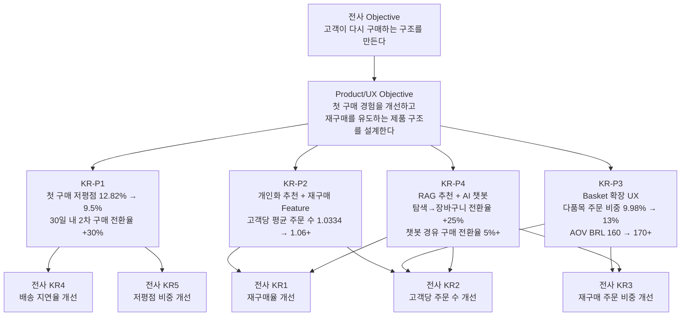

# Product/UX 관리자 OKR

> 작성 관점: Product/UX 관리자 입장에서 전사 Objective에 기여하는 4가지 KR  
> 연계 기준: `05_Company_OKR_Storyline_Draft.md` — 전사 OKR (Section 6) 및 기간별 운영 원칙 (Section 6-10~13)

---

## 전사 Objective 연계 맥락

전사 Objective: **신규 유입 의존형 성장에서 벗어나, 고객이 다시 구매하는 구조를 만든다.**

Product/UX 팀은 이 목표에 네 가지 축으로 기여한다.

| 축 | Product/UX 역할 | 연계 전사 KR |
|----|----------------|-------------|
| Activation | 첫 구매 경험 품질 안정화 → 재구매 기반 마련 | KR4, KR5 |
| Retention | 재구매를 유도하는 Product 구조 설계 | KR1, KR2 |
| Revenue | Basket 확장 UX 설계 → Revenue per customer 확대 | KR2, KR3, Guardrail AOV |
| Discovery | AI 기반 상품 발견성 강화 → 탐색→구매 전환율 개선 | KR1, KR2, KR3 |

---

## 전사 재구매율 4.5% 달성 정합성 체크

### 수치 역산

전사 KR1 달성을 위해 필요한 재구매 고객 수를 역산하면 다음과 같다.

| 구분 | 수치 |
|------|------|
| 현재 전체 구매 고객 | 93,104명 |
| 현재 재구매 고객 (3.00%) | 2,789명 |
| 목표 재구매 고객 (4.50%) | **4,190명** |
| **필요 추가 재구매 고객** | **+1,401명** |

Product/UX 팀의 4가지 KR은 이 +1,401명을 만들기 위한 선행 조건과 직접 레버를 커버한다.

### KR별 정합성 검토

| KR | 기여 경로 | 판정 | 보완 필요 사항 |
|----|-----------|------|--------------|
| **KR-P1** 첫 구매 경험 개선 | 저평점 감소 → 첫 구매 만족 → 2차 구매 전환 증가 | ✅ 선행 지표 직접 기여 | 목표치(9.5%)가 전사 KR5(10.5%)보다 aggressive → stretch goal 명시 필요 |
| **KR-P2** 재구매 유도 Feature | 재방문 고객 구매 전환율 개선 → 재구매 고객 수 직접 증가 | ✅ 가장 직접적 기여 | "재방문 후 전환율 +30%"가 신규/기존 고객 미분리 → 기존 고객 한정 추적 지표 추가 필요 |
| **KR-P3** Basket 확장 UX | 다품목 구매 → engagement 상승 → 장기 재구매율 상관 | ⚠️ 간접 기여 (AOV/Revenue 편중) | 재구매율로 이어지는 지표 보완 필요 (다품목 구매 고객의 30일 내 재구매율 추적) |
| **KR-P4** RAG 추천 + 챗봇 | 탐색 전환 개선 → 재방문 시 구매 진입 장벽 완화 | ⚠️ 신규 고객 편중 | 기존 고객 대상 AI 추천 경유 2차 구매 전환율 별도 지표 추가 필요 |

### 핵심 보완 결론

1. **KR-P1**: 전사 KR5 목표(10.5%)를 이미 초과하는 9.5% 목표 → stretch goal로 명시하고 근거 추가
2. **KR-P2**: 재방문 고객 중 "기존 구매 고객" 한정 전환율을 별도 추적해야 재구매율 기여를 정확히 측정 가능
3. **KR-P3**: 다품목 구매 고객의 재구매율 추적 지표 없이는 전사 KR1과 연결고리가 약함 → 보조 지표 추가
4. **KR-P4**: 탐색→장바구니 전환율만으로는 신규/재구매 기여가 혼재 → 기존 고객 재구매 전용 지표 분리 필요

---

## KR-P1: 첫 구매 경험 품질 개선

**KR 정의:**
첫 구매 저평점 비중을 `12.82% → 9.5%`로 낮추고, 첫 구매 고객의 30일 내 2차 구매 전환율을 baseline 대비 `+30%` 개선한다.

**연계 전사 KR:** KR4 (배송 지연율 8.16% → 6.0%), KR5 (첫 구매 저평점 12.82% → 10.5%)

> **[정합성 체크 노트]** 본 KR의 저평점 목표(9.5%)는 전사 KR5 목표(10.5%)를 초과하는 stretch goal이다. Product/UX 팀이 셀러 QA, 배송 UX, 포스트 구매 플로우를 직접 제어할 수 있다는 판단 하에 더 aggressive한 목표를 설정했다. 전사 KR5(10.5%)는 1년 목표의 최소 기준으로, 본 KR은 그 이상을 목표로 한다.

### 근거

첫 구매 경험은 재구매 여부를 결정하는 가장 중요한 선행 지표다.

- 첫 구매 저평점 비중 `12.82%`는 10명 중 1명 이상이 첫 구매에서 실망했다는 신호
- 저평점 원인의 상당 부분은 UX에서 해결 가능한 영역: 상품 정보 불일치, 배송 추적 UX 부재, 포스트 구매 커뮤니케이션 없음
- 첫 구매 만족 경험이 없으면 CRM 캠페인을 아무리 잘 해도 재구매 전환이 어렵다
- 5점 리뷰 고객의 재구매율이 저평점 고객보다 현저히 높을 것으로 추론 가능 → 만족도 개선 자체가 직접적인 재구매율 레버

### 상세 방안

1. **상품 정보 품질 표준화**
   - 상품 상세 페이지: 이미지 최소 기준, 규격/수량/내용물 명시 의무화
   - 셀러 가이드라인 개정 및 등록 시 자동 QA 체크 도입
   - 카테고리별 기대 불일치 유발 핵심 필드 식별 후 우선 개선 (e.g. 전자기기: 호환성, 의류: 사이즈/핏)

2. **배송 상태 투명성 UX 강화**
   - 실시간 배송 추적 UI 도입 (현재 추적 불명확 구간 해소)
   - 배송 지연 발생 시 앱/이메일 사전 알림 자동화
   - 예상 도착일 표시 방식 개선: "3~7일 내" → "4월 7일(화) 예정"처럼 날짜 고정 노출

3. **포스트 구매 UX 설계**
   - 구매 완료 → Thank-you 페이지에 "다음 구매를 위한 추천" 삽입
   - 배송 완료 후 리뷰 요청 + 다음 구매 nudge 동시 노출
   - 첫 구매 고객 전용 "2차 구매 쿠폰" CTA 삽입 (CRM 팀 협업)

### 타사 예시

| 회사 | 전략 | 효과 |
|------|------|------|
| **Shopee (동남아)** | 상품 QA score 시스템으로 낮은 품질 셀러 노출 제한, 배송 실시간 트래킹 전면화 | 첫 구매 저평점 감소 및 재구매율 개선 |
| **Mercado Libre** | Full Envios(자체 물류) 도입 후 배송 예측 정확도 향상, 배송 완료 후 자동 review prompt 설계 | 재구매율 및 리뷰 품질 향상 |
| **Coupang (한국)** | "로켓배송" = 배송 ETA 정확도 최우선 → 기대 대비 초과 달성으로 만족도 구조화 | 충성 고객 비율 및 재구매율 시장 최상위 수준 |

---

## KR-P2: 재구매 유도 Product Feature 도입

**KR 정의:**
개인화 추천, 재방문 유도 UX, 마이페이지 재구매 진입점 개선을 통해 **기존 구매 고객의** 재방문 후 구매 전환율을 현재 대비 `30% 개선`하고, 고객당 평균 주문 수를 `1.0334 → 1.06+`으로 끌어올린다.

**연계 전사 KR:** KR1 (재구매율 3.00% → 4.50%), KR2 (고객당 평균 주문 수 1.0334 → 1.06)

> **[정합성 체크 노트]** "재방문 후 구매 전환율 +30%"는 신규 방문자와 기존 구매 고객이 혼재될 경우 재구매율 기여를 정확히 측정할 수 없다. 측정 시 반드시 **기존 구매 고객(1회 이상 구매 이력 보유) 세그먼트를 분리**해서 추적해야 전사 KR1(재구매율) 기여도를 검증할 수 있다. 대시보드 설계 시 cohort 조건 명시 필수.

### 근거

재구매율이 3%에 머무는 가장 큰 원인 중 하나는 고객이 "다시 올 이유"를 Product이 만들어주지 않는다는 것이다.

- 재구매율 `3.00%`, 고객당 평균 주문 수 `1.0334` → 사실상 모든 고객이 한 번 사고 이탈
- CRM 캠페인만으로 재구매를 유도하는 데는 한계가 있음: 앱/웹에 돌아온 고객도 다음 구매 진입점이 명확하지 않으면 이탈
- 이전 구매 이력 기반 추천 → 재방문 고객의 구매 전환이 가장 효율이 높은 재구매 경로
- 추천 UX와 마이페이지의 재구매 트리거는 Paid 채널 없이 organic으로 재구매 구조를 만드는 핵심 Product 레버

### 상세 방안

1. **개인화 추천 엔진 강화**
   - 홈 화면: "내가 구매한 상품 기반 추천" 섹션 신설
   - 상품 상세: "이 상품을 산 사람이 다음에 구매한 것" 섹션 추가
   - 카테고리별 재구매 주기 분석 → 소모품 카테고리에 "재구매 알림" 기능 도입

2. **마이페이지 재구매 UX 개선**
   - "주문 내역" → "다시 구매하기" 1-click 재주문 버튼 추가
   - 찜 목록 / 위시리스트 기능 도입 + 가격 하락 알림 연동
   - "최근 본 상품 + 가격 변동 알림" 기능 신설

3. **재방문 첫 화면 최적화**
   - 재방문 고객 세그먼트 감지 후 홈 화면 개인화 (구매 이력 기반)
   - 비로그인 재방문 고객에게도 쿠키 기반 추천 노출
   - 구매 완료 후 30일/60일 시점 재방문 유도 push 알림 (CRM 협업)

### 타사 예시

| 회사 | 전략 | 효과 |
|------|------|------|
| **iHerb** | 구매 주기 기반 "다시 구매할 시간이 됐어요" 자동 알림 + 1-click 재주문 | 소모품 카테고리 재구매율 40%+ 유지 |
| **Amazon** | "Buy Again" 탭 전면 배치, Subscribe & Save 정기 구독 유도, 홈 개인화 피드 | 전체 주문의 60% 이상이 재구매 고객 기반 |
| **Shopee** | Flash deal + 개인화 feed 결합, 위시리스트에 담긴 상품 가격 하락 알림 | 재방문율 및 구매 전환율 동반 개선 |

---

## KR-P3: Basket 확장 UX 설계

**KR 정의:**
다품목 주문 비중을 `9.98% → 13.0%`로 개선하고, AOV를 `BRL 159.79 → BRL 170+`으로 향상시킨다.
보조 지표: 다품목 구매 고객의 30일 내 재구매율을 단품 구매 고객 대비 추적한다.

**연계 전사 KR:** KR2 (고객당 평균 주문 수), KR3 (재구매 주문 비중), Guardrail (AOV 하락 방지)

> **[정합성 체크 노트]** KR-P3의 핵심 지표(다품목 비중, AOV)는 Revenue 개선에는 직접 기여하지만, 전사 KR1(재구매율 4.5%) 달성과의 인과 경로가 현재 명시되지 않았다. 보조 지표로 **"다품목 구매 고객의 30일 내 재구매율 vs 단품 구매 고객 재구매율"** 을 함께 추적해야 basket 확장이 실제로 재구매 구조 개선에 기여하는지 검증할 수 있다. 이 상관관계가 데이터로 입증되면 KR-P3의 전사 KR1 기여도를 정량화할 수 있다.

### 근거

다품목 주문 비중 `9.98%`, 주문당 평균 상품 수 `1.14개`는 대부분의 고객이 목적 상품만 구매 후 이탈함을 의미한다.

- Basket 확장은 재구매율만큼 중요한 Revenue 레버: "자주 오는 고객"만큼이나 "올 때 더 많이 사는 고객"도 매출 구조에 기여
- 연관 상품 추천 UX가 없거나 약하면 고객은 목적 상품만 구매하고 이탈
- AOV Guardrail을 지키면서 매출을 늘리는 가장 안전한 경로가 basket 확장
- 다품목 주문 고객은 단품 주문 고객보다 재구매율이 높은 경향이 있음 → 카테고리 탐색 행동 자체가 engagement 신호

### 상세 방안

1. **상품 상세 페이지 Cross-sell/Upsell UX**
   - "함께 구매하면 좋은 상품" (Frequently Bought Together) 섹션 추가
   - "이 상품과 세트로 구매 시 X% 할인" bundle CTA 실험
   - 카테고리별 자주 함께 구매되는 상품 데이터 기반 자동 추천

2. **장바구니 페이지 Basket-building UX**
   - 장바구니 진입 시 "이 상품도 어때요?" 관련 상품 추천 섹션 추가
   - 무료 배송 기준 금액 도달까지 부족한 금액 표시 → 저가 상품 추가 유도 (e.g., "BRL 12 더 담으면 무료 배송")
   - 최근 본 상품 / 위시리스트 상품을 장바구니 페이지에 함께 노출

3. **카테고리별 Bundle 기획 (Merchandising 협업)**
   - 리뷰 데이터 기반 "실제로 함께 쓰는 상품" 시리즈 기획
   - 고가 품목 + 저가 액세서리 번들 패키지 상품 기획
   - 계절/이벤트 큐레이션 컬렉션 (묶음 배너)

### 타사 예시

| 회사 | 전략 | 효과 |
|------|------|------|
| **Magazine Luiza (브라질)** | 가전 구매 시 "설치 서비스 + 연장보증 + 연관 액세서리" 패키지 추천 전면화 | AOV 및 attach rate 개선 |
| **Amazon** | 장바구니에 "무료 배송까지 XX 남았어요" + 관련 상품 추천으로 basket 유도 | 다품목 주문 비중 대폭 향상 |
| **Mercado Libre** | "Compradores también vieron" (함께 본 상품) + 번들 할인 시스템 | 평균 basket size 개선 및 GMV 확대 |

---

## KR-P4: AI 기반 상품 발견성 강화 (RAG 추천 + AI 챗봇)

**KR 정의:**
RAG 기반 상품 추천 시스템과 AI 챗봇을 도입해 탐색 → 장바구니 전환율을 현재 대비 `+25%` 개선하고, 챗봇 경유 구매 전환율 `5%+` 달성을 목표로 한다.
보조 지표: **기존 구매 고객** 대상 AI 추천 경유 2차 구매 전환율을 별도 추적한다.

**연계 전사 KR:** KR1 (재구매율), KR2 (고객당 평균 주문 수), KR3 (재구매 주문 비중)

> **[정합성 체크 노트]** 현재 주요 지표인 "탐색→장바구니 전환율"과 "챗봇 경유 구매 전환율"은 신규/기존 고객이 혼재되어 전사 KR1(재구매율) 기여도를 분리 측정할 수 없다. 재구매율 4.5% 달성 기여를 검증하려면 **기존 구매 고객이 RAG 추천 또는 챗봇을 통해 2차 구매로 전환된 비율**을 별도 세그먼트로 추적해야 한다. 탐색 전환율 개선이 신규 고객 acquisition에 치우칠 경우 전사 Guardrail(신규 구매 고객 수 유지)에는 기여하지만 KR1에는 기여하지 않을 수 있음.

### 근거

현재 Olist의 상품 탐색 구조는 키워드 검색과 카테고리 브라우징 위주다. 이 방식은 명확한 구매 의도가 있는 고객에게는 작동하지만, 아래 상황에서는 발견성이 취약하다.

- 고객이 원하는 것을 정확히 표현하지 못할 때 (e.g., "아이 첫 생일 선물용 장난감, 안전한 것")
- 카테고리 경계를 넘는 연관 상품을 탐색할 때
- 구매 이력 기반 "다음에 살 만한 것"을 능동적으로 찾고 싶을 때

RAG(Retrieval-Augmented Generation) 기반 추천은 상품 속성, 리뷰, 구매 이력, 자연어 질의를 결합해 기존 필터 기반 추천보다 맥락에 맞는 상품을 제시할 수 있다.
AI 챗봇은 이 탐색 경험을 대화 형태로 지원해 이탈 전에 구매 결정을 돕는다.

### 상세 방안

1. **RAG 기반 상품 추천 시스템 구축**
   - 상품 설명, 리뷰 텍스트, 카테고리 메타데이터를 vector DB에 임베딩
   - 고객 구매/탐색 이력 + 자연어 쿼리를 결합한 semantic search 구현
   - 검색 결과 페이지 및 홈 화면에 "AI 추천" 섹션으로 노출
   - A/B test: 기존 키워드 검색 vs RAG 기반 검색 전환율 비교

2. **AI 챗봇 도입 (상품 추천 + CS 지원)**
   - 상품 추천 챗봇: "어떤 용도로 찾으세요?" → 조건 수집 → 맞춤 상품 제안
   - 구매 전 FAQ 자동 응답: 배송 일정, 반품 정책, 상품 규격 문의
   - 구매 후 챗봇: 배송 상태 확인, 리뷰 작성 유도, 다음 구매 추천
   - 챗봇 대화 → 장바구니 직접 추가 CTA 연동

3. **데이터 파이프라인 및 피드백 루프**
   - 챗봇 대화 로그 → 상품 정보 gap 분석 (자주 묻는 것 = 상세 페이지에 없는 정보)
   - 추천 클릭 → 구매 전환 데이터를 추천 모델 재학습에 활용
   - 카테고리별 추천 정확도 지표 정기 모니터링

### 타사 예시

| 회사 | 전략 | 효과 |
|------|------|------|
| **Shopee (동남아)** | AI 기반 개인화 검색 결과 + 챗봇 CS 통합 운영 | 검색 → 구매 전환율 개선, CS 응답 시간 단축 |
| **Zalando (유럽)** | 자연어 기반 패션 추천 ("캐주얼하면서 오피스에도 어울리는 재킷") → RAG 유사 구조 | 탐색 시간 단축 및 구매 만족도 향상 |
| **Mercado Libre** | Mercado Shops 내 AI 어시스턴트 도입, 구매 상담 + 상품 비교 지원 | 챗봇 경유 구매 전환율 개선 및 반품율 감소 |
| **Magazine Luiza (브라질)** | "Lu" AI 챗봇 전면 운영 — 상품 추천, 주문 추적, 프로모션 안내 통합 | 챗봇 경유 매출 비중 확대, CS 비용 절감 |

---

## Product/UX OKR 실행 전 전제 조건 점검

> **배경:** 현재 Olist의 실제 Product/UX 구성 상태(기능 존재 여부, 데이터 인프라, 측정 환경)가 확인되지 않은 상태다.  
> 이 OKR의 대부분은 "기존 기능의 개선" 관점으로 설계되어 있어, 실제 Product 현황에 따라 실행 기간과 목표치가 전면 재조정될 수 있다.

### 전제 조건별 리스크 분류

| KR | 핵심 전제 | 전제가 맞을 경우 | 전제가 깨질 경우 (기능 부재 시) |
|----|-----------|-----------------|-------------------------------|
| **KR-P1** | 배송 추적 UI, Thank-you 페이지가 존재함 | 개선 작업 → 3개월 내 가능 | 신규 구축 → 6개월 이상 소요 |
| **KR-P1** | 리뷰 데이터 및 저평점 원인 분석 인프라 존재 | 즉시 분석 가능 | 데이터 수집 체계부터 구축 필요 |
| **KR-P2** | 마이페이지, 주문 내역 화면이 존재함 | 재주문 버튼 추가 → 간단 | 회원 기반 UX 전체 설계부터 필요 |
| **KR-P2** | 재방문 고객 세그먼트 측정 가능 | cohort 분석 즉시 가능 | 사용자 인증/로그 인프라 구축 선행 필요 |
| **KR-P3** | 장바구니 페이지, 상품 상세 페이지 존재함 | UX 추가 삽입 → 빠름 | 페이지 자체 설계부터 필요 |
| **KR-P3** | 공동 구매 데이터(Frequently Bought Together) 존재 | 추천 섹션 즉시 구현 가능 | 데이터 파이프라인 구축 선행 필요 |
| **KR-P4** | 상품 설명, 리뷰 텍스트 데이터 정제 상태 | vector DB 구축 → 3개월 PoC 가능 | 데이터 클렌징부터 시작 → 일정 지연 |
| **KR-P4** | 챗봇 연동 가능한 API/채널 인프라 존재 | 기능 구현에 집중 가능 | 채널 인프라 구축 병행 필요 |

### 전제 조건 확인 전 KR 목표치 신뢰 수준

| 구분 | 현재 상태 | 목표치 신뢰도 |
|------|-----------|-------------|
| 기능이 이미 존재하는 경우 | baseline 측정 가능, 개선 여지 예측 가능 | **높음** — 목표치 그대로 유효 |
| 기능 일부 존재하는 경우 | 기존 기능 개선 + 신규 기능 병행 | **중간** — 일정 조정 필요 |
| 기능이 전혀 없는 경우 | 0→1 빌딩이 선행되어야 함 | **낮음** — 목표치 및 로드맵 전면 재설계 필요 |

---

## Phase 0: Product 현황 파악 (로드맵 시작 전 필수)

> 3개월 로드맵 진입 전, 아래 항목을 먼저 확인해야 한다.  
> 이 단계 없이 KR 목표치를 그대로 실행하면 일정 초과 또는 측정 불가 상황이 발생할 수 있다.

### 확인 항목 체크리스트

#### Product 기능 현황
- [ ] 회원가입 / 로그인 / 마이페이지 구조 존재 여부
- [ ] 주문 내역 화면 및 배송 추적 기능 존재 여부
- [ ] 상품 상세 페이지 구성 요소 (이미지, 설명, 리뷰, 배송 정보)
- [ ] 장바구니 및 결제 플로우 구성 여부
- [ ] 구매 완료 Thank-you 페이지 존재 여부
- [ ] 검색 기능 구조 (키워드 검색 / 카테고리 필터 수준)

#### 데이터 인프라 현황
- [ ] 사용자 행동 로그 수집 여부 (클릭, 페이지뷰, 전환 이벤트)
- [ ] 구매 이력 기반 cohort 분석 가능 여부
- [ ] 리뷰 데이터 수집 및 분류 체계 존재 여부
- [ ] 배송 상태 데이터 실시간 연동 여부

#### 측정 환경 현황
- [ ] Analytics 도구 연동 여부 (GA, Mixpanel, Amplitude 등)
- [ ] A/B test 실행 인프라 존재 여부
- [ ] KR 지표(저평점 비중, 재구매율, 전환율 등) 현재 측정 가능 여부

### Phase 0 결과에 따른 로드맵 분기

```
Phase 0 결과
    ├── 기능 대부분 존재 + 측정 가능
    │       → 현재 로드맵 그대로 실행 (3개월 Early Win 유효)
    │
    ├── 기능 일부 존재 + 측정 부분 가능
    │       → 3개월: 측정 인프라 구축 + 존재하는 기능 개선 병행
    │         6개월: 신규 기능 출시
    │         1년: 전사 KR 기여 검증
    │
    └── 기능 대부분 부재 + 측정 불가
            → 3개월: Product 0→1 설계 및 핵심 기능 구축
              6개월: 기능 안정화 + baseline 측정 시작
              1년: KR 목표치 재설정 후 개선 측정
```

---

## Product/UX OKR 로드맵

### 기간별 목표 수치 요약

| KR | 기준값 | 3개월 목표 | 6개월 목표 | 1년 목표 | 전사 KR1 기여 방식 |
|----|--------|-----------|-----------|---------|------------------|
| KR-P1: 첫 구매 저평점 비중 | 12.82% | 11.5% | 10.5% *(전사 KR5 목표)* | **9.5%** *(stretch)* | 선행 지표 → 만족 고객 재구매 전환 증가 |
| KR-P1: 기존 고객 30일 내 2차 구매 전환율 | baseline 미측정 | baseline 측정 완료 | +10% | +30% | 직접 재구매 고객 수 증가 |
| KR-P2: 고객당 평균 주문 수 | 1.0334 | 1.04 | 1.05 | **1.06+** *(전사 KR2 목표 일치)* | 직접 재구매 횟수 증가 |
| KR-P2: 기존 고객 재방문 후 구매 전환율 | baseline 미측정 | baseline 측정 완료 | +15% | +30% | 직접 재구매 고객 수 증가 |
| KR-P3: 다품목 주문 비중 | 9.98% | 11.0% | 12.0% | 13.0% | 간접 — engagement 상승 → 재구매 상관 |
| KR-P3: AOV | BRL 159.79 | 유지 (하락 없음) | BRL 163 | BRL 170+ | Guardrail 수호 |
| KR-P3: 다품목 고객 30일 재구매율 (보조) | baseline 미측정 | baseline 측정 | 단품 고객 대비 차이 확인 | 인과 검증 완료 | 재구매율 기여 경로 검증 |
| KR-P4: 기존 고객 AI 추천 경유 2차 전환율 (보조) | — | 세그먼트 분리 측정 시작 | 1%+ | 3%+ | 직접 재구매 기여 검증 |
| KR-P4: 탐색 → 장바구니 전환율 (전체) | baseline 미측정 | baseline 측정 + RAG PoC | +15% | +25% | 간접 — 발견성 개선 |
| KR-P4: 챗봇 경유 구매 전환율 | — | 챗봇 파일럿 출시 | 2%+ | 5%+ | 간접 — 이탈 방지 → 재구매 포함 |

> **[전사 KR1 달성 경로 요약]** 재구매율 3.00% → 4.50% (+1,401명) 달성은 KR-P1과 KR-P2가 직접 기여하며, KR-P3와 KR-P4는 engagement와 발견성 개선을 통해 간접 기여한다. KR-P2의 "기존 고객 재방문 후 구매 전환율"이 가장 핵심 선행 지표이며, 이 지표의 개선이 정체될 경우 전사 KR1 달성이 어려워지는 신호로 해석해야 한다.

---

### 3개월 로드맵: 기반 측정 + Early Win 확보 (Black Friday 시즌 포함)

**목표 성격:** 데이터 기반 설정, 빠른 실험 가동, 초기 개선 신호 확인  
**주의:** 3개월 시점이 Black Friday 시즌과 겹침 → 이벤트 전환 극대화와 재구매 cohort 확보를 동시에 설계

> **전제:** Phase 0에서 핵심 기능(마이페이지, 장바구니, 상세 페이지, 배송 추적)이 존재하고 측정 환경이 일부 갖춰진 것으로 확인된 경우에 한해 아래 목표치가 유효하다. 기능 부재 확인 시 각 항목을 "구축"으로 재분류하고 일정을 재산정해야 한다.

#### KR-P1 (3개월)
- [ ] 첫 구매 저평점 원인 카테고리별 분류 완료 (리뷰 텍스트 분석 + UX 리서치)
- [ ] 배송 추적 UI 개선 및 배송 지연 사전 알림 기능 출시
- [ ] 상품 상세 페이지 정보 표준화 가이드 v1 적용 (상위 판매 카테고리 우선)
- [ ] 구매 완료 Thank-you 페이지 재설계 (추천 + 쿠폰 CTA 삽입)
- **목표:** 첫 구매 저평점 비중 12.82% → **11.5%**

#### KR-P2 (3개월)
- [ ] 마이페이지 "다시 구매하기" 1-click 재주문 기능 출시
- [ ] 홈 화면 "최근 구매 기반 추천" 섹션 신설
- [ ] 2차 구매 전환율 측정 인프라 구축 (cohort 추적 대시보드 연동)
- [ ] 재방문 고객 개인화 홈 A/B test 시작
- **목표:** 2차 구매 전환율 **baseline 측정 완료**, 고객당 주문 수 **1.04** 달성

#### KR-P3 (3개월)
- [ ] 상품 상세 페이지 "Frequently Bought Together" 섹션 출시 (top 카테고리 우선)
- [ ] 장바구니 "무료 배송까지 얼마 남았어요" UX 적용
- [ ] 장바구니 내 관련 상품 추천 섹션 A/B test 시작
- **목표:** 다품목 주문 비중 9.98% → **11.0%**

#### KR-P4 (3개월)
- [ ] 상품 데이터 vector DB 구축 시작 (상품 설명 + 리뷰 텍스트 임베딩 PoC)
- [ ] AI 챗봇 파일럿 출시 (FAQ 자동 응답 + 기본 상품 추천 기능)
- [ ] 탐색 → 장바구니 전환율 baseline 측정 인프라 구축
- **목표:** RAG PoC 완료, 챗봇 **파일럿 출시**

#### Black Friday 시즌 특별 실행 (3개월 로드맵 연계)

> 전사 OKR 원칙 (Section 6-14) 준수: Black Friday를 단기 매출 행사가 아닌 **재구매 cohort 확보 행사**로 정의

- [ ] **룰렛 / 스핀 이벤트 출시**
  - 방문 고객 대상 일 1회 스핀 → 할인 쿠폰 / 무료 배송 / 포인트 즉시 지급
  - 비로그인 참여 허용 후 로그인 유도 → 회원가입 전환 funnel 연결
  - BF 신규 구매 고객에게 "2차 구매 전용 쿠폰" 스핀 보상 추가 제공

- [ ] **BF 전용 개인화 랜딩 페이지**
  - 구매 이력 보유 고객: 이전 구매 카테고리 기반 BF 특가 상품 노출
  - 신규 방문 고객: 인기 상품 + 리뷰 기반 큐레이션 노출

- [ ] **BF 구매 완료 후 재구매 설계 삽입**
  - 구매 완료 화면: "BF 특가 + 배송 완료 후 사용 가능한 쿠폰" CTA 노출
  - 배송 완료 D+7: "BF에서 사신 상품과 함께 쓰면 좋은 것" 추천 자동 발송 (CRM 협업)

- [ ] **BF cohort 재구매 전환율 추적**
  - BF 기간 신규 구매 고객 → 30일 / 60일 재구매 전환율 별도 cohort로 추적
  - 이벤트 참여 고객 vs 비참여 고객 재구매율 비교 분석

- **목표:** BF 기간 신규 구매 전환율 상승 + **BF cohort 30일 재구매 전환율 baseline 확보**

---

### 6개월 로드맵: 구조 변화 확인 + Feature 고도화

**목표 성격:** 실행 누적 효과가 수치에 나타나기 시작, A/B test 결과 기반으로 기능 확장

#### KR-P1 (6개월)
- [ ] 셀러 상품 QA 자동 체크 시스템 도입 (이미지/정보 기준 미달 시 경고 → 출고 제한)
- [ ] 포스트 구매 CRM 시퀀스 전면 가동 (배송 완료 D+7 추천 → D+30 쿠폰)
- [ ] 첫 구매 저평점 고객 48시간 내 recovery flow 도입 (CX 협업)
- [ ] 카테고리별 저평점 개선율 추적 대시보드 운영
- **목표:** 첫 구매 저평점 비중 → **10.5%**, 30일 내 2차 구매 전환율 **+10%**

#### KR-P2 (6개월)
- [ ] 개인화 추천 엔진 v2 출시 (구매 이력 + 탐색 이력 + 카테고리 친화도 통합)
- [ ] 위시리스트 / 찜 기능 도입 + 가격 하락 알림
- [ ] 재구매 주기 예측 기반 push 알림 시스템 가동 (소모품 카테고리 우선)
- [ ] A/B test 결과 기반 추천 모델 승자 고정 + 전체 확장 적용
- **목표:** 고객당 평균 주문 수 **1.05** 달성

#### KR-P3 (6개월)
- [ ] 카테고리별 번들 기획 상품 출시 (Merchandising 협업, top 10 카테고리)
- [ ] 고가 상품 구매 직후 "관련 액세서리 추천" 자동화
- [ ] 장바구니 이탈 고객 대상 "아직 담아두셨어요 + 관련 상품" 리타겟팅 실험
- **목표:** 다품목 주문 비중 → **12.0%**, AOV → **BRL 163**

#### KR-P4 (6개월)
- [ ] RAG 기반 상품 추천 시스템 v1 출시 (검색 결과 페이지 + 홈 화면 적용)
- [ ] 챗봇 기능 확장: 상품 비교, 구매 조건 필터링 대화 지원
- [ ] 챗봇 → 장바구니 직접 추가 CTA 연동 완료
- [ ] 추천 클릭 → 구매 전환 데이터 수집 → 추천 모델 첫 재학습
- [ ] BF cohort 재구매 전환율 분석 결과 반영 → 이벤트 설계 개선
- **목표:** 탐색 → 장바구니 전환율 **+15%**, 챗봇 경유 구매 전환율 **2%+**

---

### 1년 로드맵: 체질화 + 재구매 구조 정착

**목표 성격:** 단발 캠페인이 아닌 Product 구조 자체가 재구매를 만드는 상태 달성

#### KR-P1 (1년)
- [ ] 셀러 품질 스코어링 시스템 전면 운영 (노출 알고리즘 연동)
- [ ] 첫 구매 UX 전 여정 개인화 (카테고리 친화도 기반 랜딩 페이지 최적화)
- [ ] category-adjusted 첫 구매 만족도 지표 운영 (카테고리별 저평점 기준 차등화)
- [ ] 첫 구매 만족도 → 재구매 전환율 상관관계 정기 리포트 체계화
- **목표:** 첫 구매 저평점 비중 → **9.5%**, 30일 내 2차 구매 전환율 **+30%**

#### KR-P2 (1년)
- [ ] 추천 시스템 + CRM + push 알림 통합 자동화 파이프라인 완성
- [ ] 정기 구독 서비스 파일럿 출시 (소모품/반복 구매 카테고리 한정)
- [ ] LTV 기반 고객 세그먼트 운영 (고가치 재구매 고객 전용 혜택 트랙)
- [ ] 추천 경유 구매 비중 정기 추적 및 전사 공유
- **목표:** 고객당 평균 주문 수 **1.06+**, 전사 KR1 재구매율 개선에 기여

#### KR-P3 (1년)
- [ ] Basket-building UX 전 카테고리 확장 (우선 적용 카테고리 → 전체 롤아웃)
- [ ] AI 기반 동적 번들 추천 (고객별 구매 이력 + 시즌 + 재고 연동)
- [ ] 다품목 구매 고객 vs 단품 구매 고객 재구매율 비교 분석 → 전략 고도화
- [ ] repeat-driven GMV contribution 내 basket 확장 기여도 측정
- **목표:** 다품목 주문 비중 → **13.0%**, AOV → **BRL 170+**

#### KR-P4 (1년)
- [ ] RAG 기반 추천 + 구매 이력 + 실시간 재고 데이터 통합 → 추천 정확도 고도화
- [ ] 챗봇 멀티턴 대화 지원 (조건 수집 → 상품 제안 → 구매 완료까지 연속 지원)
- [ ] 챗봇 대화 로그 기반 상품 정보 gap 분석 → 셀러 가이드 자동 피드백 연동
- [ ] RAG 추천 경유 구매 vs 일반 검색 경유 구매 전환율 정기 비교 리포트
- [ ] 연간 이벤트 캘린더 기반 "시즌 맞춤 AI 추천" 자동화 (BF, 연말, 발렌타인 등)
- **목표:** 탐색 → 장바구니 전환율 **+25%**, 챗봇 경유 구매 전환율 **5%+**

---

## Product/UX OKR 전사 연계 구조



---

## 이 문서의 한계점

> 이 문서는 팀 내부 공유 및 논의를 위한 초안이다.  
> 아래 한계점을 인지한 상태에서 읽고, 실행 전 추가 검증이 필요하다.

### 1. Olist Product 현황 미확인

이 문서의 KR과 실행 방안은 **Olist의 실제 Product/UX 구성이 어느 정도 갖춰져 있다는 가정** 위에 작성되었다.

- 마이페이지, 장바구니, 상품 상세 페이지, 배송 추적 UI 등의 기능이 **실제로 존재하는지 확인되지 않았다.**
- 기능이 부재할 경우 대부분의 KR은 "개선"이 아닌 "신규 구축"으로 재분류되어야 하며, 로드맵 전체 일정이 재산정되어야 한다.
- **Phase 0 (Product 현황 파악)** 완료 전까지 KR 목표치를 확정 수치로 보지 않도록 한다.

### 2. Baseline 지표 미측정

이 문서에 명시된 목표 수치(저평점 비중 9.5%, 전환율 +30% 등)는 **Olist 공개 데이터셋의 EDA 결과를 기반으로 한 추정치**이며, 실제 측정 환경에서 수집된 baseline이 아니다.

- 사용자 행동 로그, A/B test 인프라, cohort 분석 환경이 갖춰지지 않으면 지표를 추적할 수 없다.
- 목표 수치는 실제 baseline 측정 후 재검토해야 한다.
- 특히 "2차 구매 전환율", "재방문 후 구매 전환율"은 별도 세그먼트 분리 없이는 재구매율 기여를 정확히 측정할 수 없다.

### 3. 단일 팀 실행 불가 KR 포함

이 문서의 KR 중 일부는 **Product/UX 팀 단독으로 달성할 수 없으며** 타 팀과의 긴밀한 협업이 필요하다.

| KR | 협업 필요 팀 |
|----|------------|
| KR-P1: 배송 지연 사전 알림 | 물류팀, 데이터팀 |
| KR-P1: 셀러 QA 자동화 | Seller Ops, 개발팀 |
| KR-P1: 포스트 구매 쿠폰 CTA | CRM팀 |
| KR-P2: 재구매 주기 push 알림 | CRM팀, 데이터팀 |
| KR-P3: 번들 기획 | Merchandising팀 |
| KR-P4: RAG 데이터 파이프라인 | 데이터팀, 개발팀 |

협업 팀의 우선순위 및 리소스 상황에 따라 실행 가능 범위와 일정이 달라질 수 있다.

### 4. 타사 예시의 규모 차이

이 문서에서 인용한 타사 사례(Amazon, Coupang, Shopee, Mercado Libre 등)는 **Olist와 비교했을 때 규모, 기술 인프라, 운영 인력에서 상당한 격차**가 있다.

- 타사의 효과 수치는 참고 방향으로만 활용하며, Olist에서 동일한 효과를 단기간에 기대하는 것은 무리가 있다.
- 특히 RAG 기반 추천 시스템, AI 챗봇은 해당 기업들이 수년간의 데이터 축적과 인프라 투자를 거친 결과물이다.

### 5. 재구매율 4.5% 목표의 외생 변수

재구매율은 Product/UX 개선만으로 달성할 수 있는 지표가 아니다.

- CRM의 캠페인 실행 품질, 물류의 배송 안정성, 셀러 상품 품질, 마케팅의 신규 유입 유지가 **동시에** 작동해야 한다.
- Product/UX 팀이 4가지 KR을 모두 달성하더라도, 타 팀의 실행이 따라오지 않으면 전사 KR1(재구매율 4.5%)은 달성되지 않을 수 있다.
- 이 문서는 전사 OKR 달성을 위한 **Product/UX 팀의 기여 계획**이며, 전사 목표 달성 보장 문서가 아니다.

---

*문서 작성 기준일: 2026년 4월*  
*작성 관점: Product/UX 관리자 (가상 시나리오 기반)*  
*기준 데이터: Olist Brazilian E-Commerce Public Dataset (EDA 기반 추정치)*
