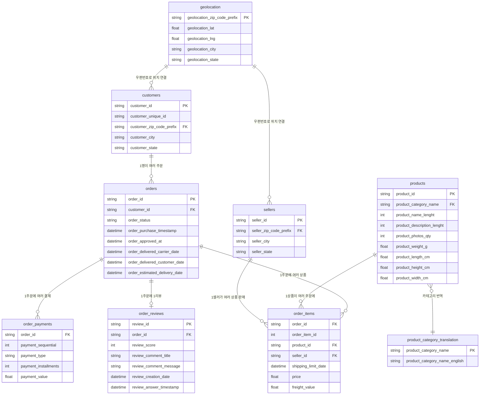
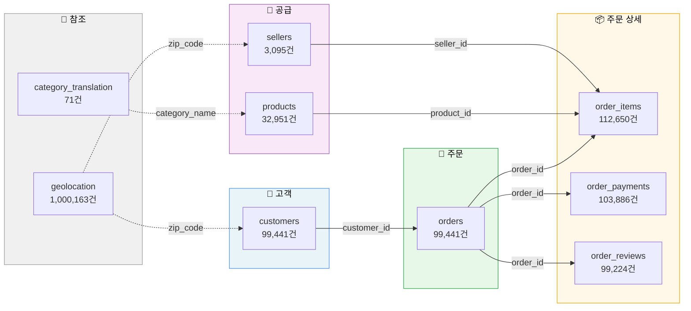
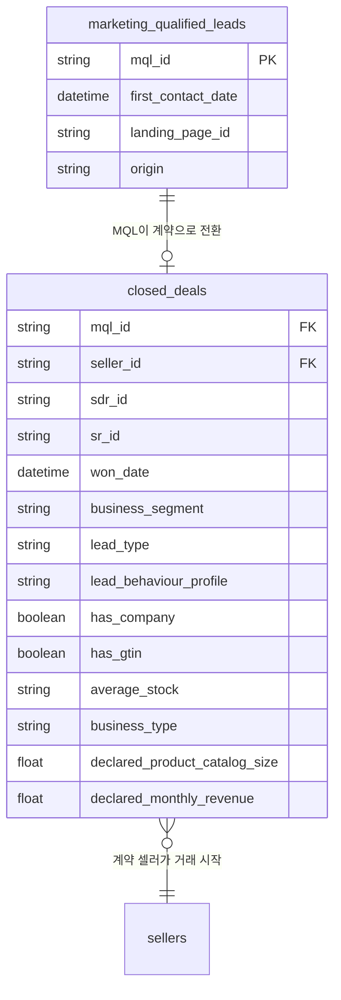
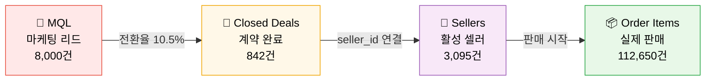
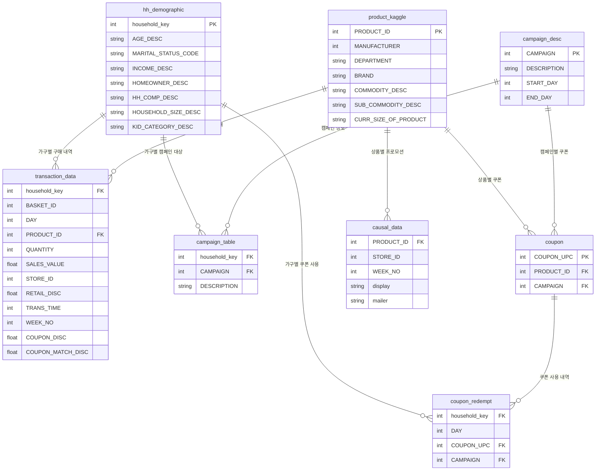
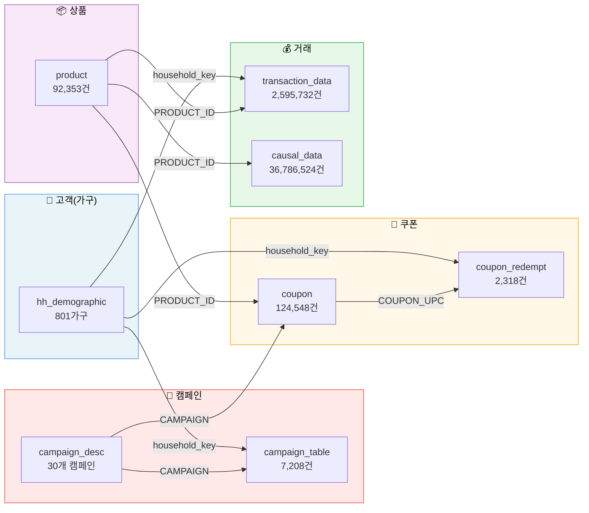

# Olist 프로젝트 ERD (Entity-Relationship Diagram)

> 작성일: 2026-04-14
> 목적: 프로젝트에서 사용하는 전체 데이터셋의 구조와 테이블 간 관계를 시각적으로 이해하기

---

## 1. 전체 구조 한눈에 보기

우리 프로젝트 데이터는 크게 **3개 영역**으로 나뉩니다.

```text
┌─────────────────────────────────────────────────────────┐
│                    우리 프로젝트 데이터                      │
│                                                         │
│  ┌───────────────┐  ┌──────────────┐  ┌──────────────┐  │
│  │  Olist B2C    │  │ Olist B2B    │  │  Kaggle      │  │
│  │  (거래 데이터)  │  │ (셀러 유치)   │  │ (CRM/쿠폰)   │  │
│  │  9개 테이블    │  │  2개 테이블   │  │  8개 테이블   │  │
│  └───────────────┘  └──────────────┘  └──────────────┘  │
└─────────────────────────────────────────────────────────┘
```

---

## 2. Olist B2C 거래 데이터 ERD (메인)

> 고객이 상품을 검색하고, 주문하고, 결제하고, 리뷰를 남기는 흐름



### 관계 읽는 법

| 기호 | 의미 | 예시 |
|------|------|------|
| `\|\|--o{` | 1 : N (일대다) | 고객 1명 → 주문 여러 개 |
| `\|\|--o\|` | 1 : 1 (일대일) | 주문 1개 → 리뷰 1개 |
| `}o--\|\|` | N : 1 (다대일) | 여러 상품 → 1개 카테고리 |
| PK | Primary Key | 그 테이블의 고유 식별자 |
| FK | Foreign Key | 다른 테이블을 참조하는 키 |

### 데이터 흐름 (고객 여정 순서)



---

## 3. Olist B2B 셀러 유치 데이터 ERD

> 셀러를 마케팅으로 모집하고, 영업을 통해 계약하는 흐름



### B2B 퍼널 흐름



---

## 4. Kaggle CRM/쿠폰 데이터 ERD

> 가구(household) 단위의 구매 행동, 쿠폰 사용, 캠페인 효과 분석용 데이터



### Kaggle 데이터 흐름



---

## 5. 전체 데이터셋 요약표

### Olist B2C (거래) — 9개 테이블

| 테이블 | 건수 | PK | 주요 FK | 역할 |
|--------|-----:|-----|---------|------|
| **customers** | 99,441 | customer_id | zip_code_prefix | 고객 정보 |
| **orders** | 99,441 | order_id | customer_id | 주문 정보 (상태, 일시) |
| **order_items** | 112,650 | order_id + order_item_id | product_id, seller_id | 주문 내 개별 상품 |
| **order_payments** | 103,886 | order_id + payment_sequential | order_id | 결제 수단/금액 |
| **order_reviews** | 99,224 | review_id | order_id | 리뷰 점수/코멘트 |
| **products** | 32,951 | product_id | product_category_name | 상품 속성 |
| **sellers** | 3,095 | seller_id | zip_code_prefix | 셀러 위치 정보 |
| **geolocation** | 1,000,163 | zip_code_prefix | — | 우편번호별 위경도 |
| **category_translation** | 71 | product_category_name | — | 포르투갈어→영어 번역 |

### Olist B2B (셀러 유치) — 2개 테이블

| 테이블 | 건수 | PK | 주요 FK | 역할 |
|--------|-----:|-----|---------|------|
| **marketing_qualified_leads** | 8,000 | mql_id | — | 셀러 마케팅 리드 |
| **closed_deals** | 842 | mql_id | seller_id | 계약 완료 셀러 |

### Kaggle CRM/쿠폰 — 8개 테이블

| 테이블 | 건수 | PK | 주요 FK | 역할 |
|--------|-----:|-----|---------|------|
| **hh_demographic** | 801 | household_key | — | 가구 인구통계 |
| **transaction_data** | 2,595,732 | BASKET_ID + PRODUCT_ID | household_key, PRODUCT_ID | 구매 거래 내역 |
| **product** | 92,353 | PRODUCT_ID | — | 상품 마스터 |
| **campaign_desc** | 30 | CAMPAIGN | — | 캠페인 정의 |
| **campaign_table** | 7,208 | household_key + CAMPAIGN | household_key, CAMPAIGN | 캠페인 대상 가구 |
| **coupon** | 124,548 | COUPON_UPC | PRODUCT_ID, CAMPAIGN | 쿠폰-상품 매핑 |
| **coupon_redempt** | 2,318 | household_key + COUPON_UPC | household_key, COUPON_UPC | 쿠폰 사용 내역 |
| **causal_data** | 36,786,524 | PRODUCT_ID + STORE_ID + WEEK_NO | PRODUCT_ID | 매장 프로모션 데이터 |

---

## 6. 자주 쓰는 JOIN 경로

데이터 분석할 때 테이블을 연결하는 핵심 경로입니다.

### Olist B2C

```text
"고객별 구매 분석"
customers → orders → order_items → products
    (customer_id)  (order_id)   (product_id)

"셀러별 성과 분석"
sellers → order_items → orders → order_reviews
  (seller_id)    (order_id)    (order_id)

"지역별 분석"
geolocation → customers (또는 sellers)
    (zip_code_prefix)

"카테고리 영문 변환"
products → product_category_translation
    (product_category_name)
```

### Olist B2B → B2C 연결

```text
"셀러 유치 → 실제 판매 연결"
marketing_qualified_leads → closed_deals → sellers → order_items
         (mql_id)            (seller_id)    (seller_id)
```

### Kaggle CRM

```text
"가구별 쿠폰 효과 분석"
hh_demographic → coupon_redempt → coupon → campaign_desc
  (household_key)   (COUPON_UPC)   (CAMPAIGN)

"가구별 구매 패턴"
hh_demographic → transaction_data → product
  (household_key)    (PRODUCT_ID)
```
