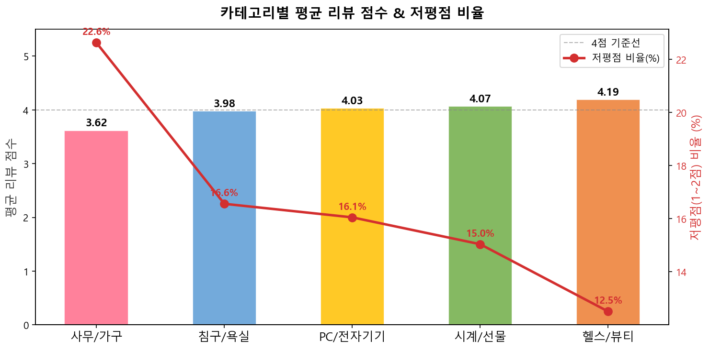
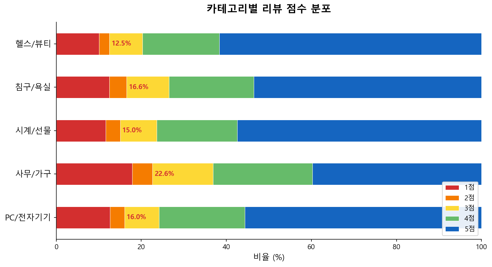
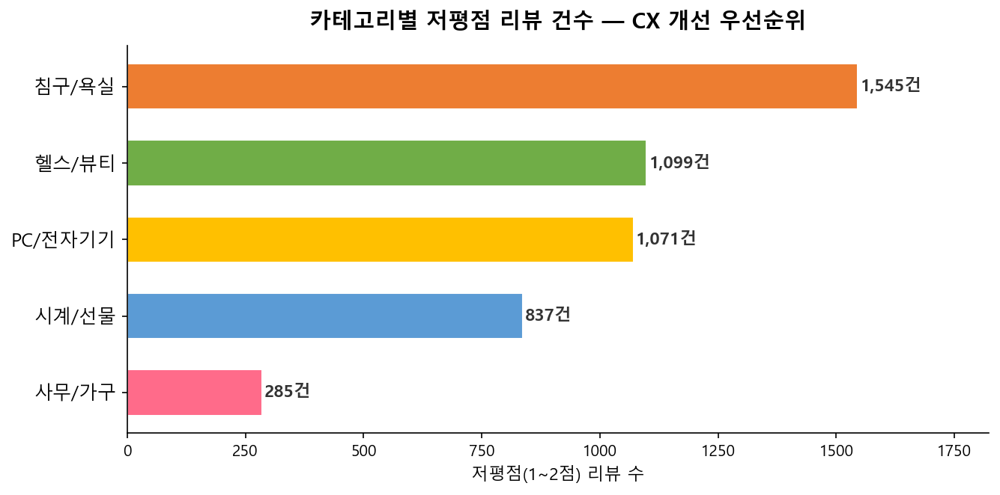
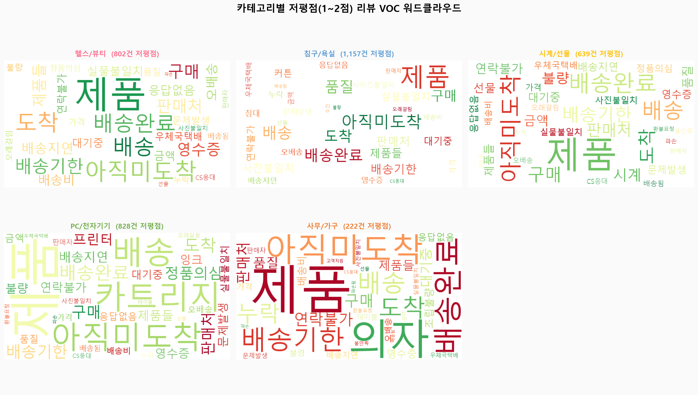
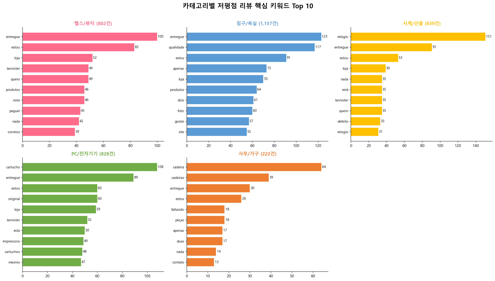
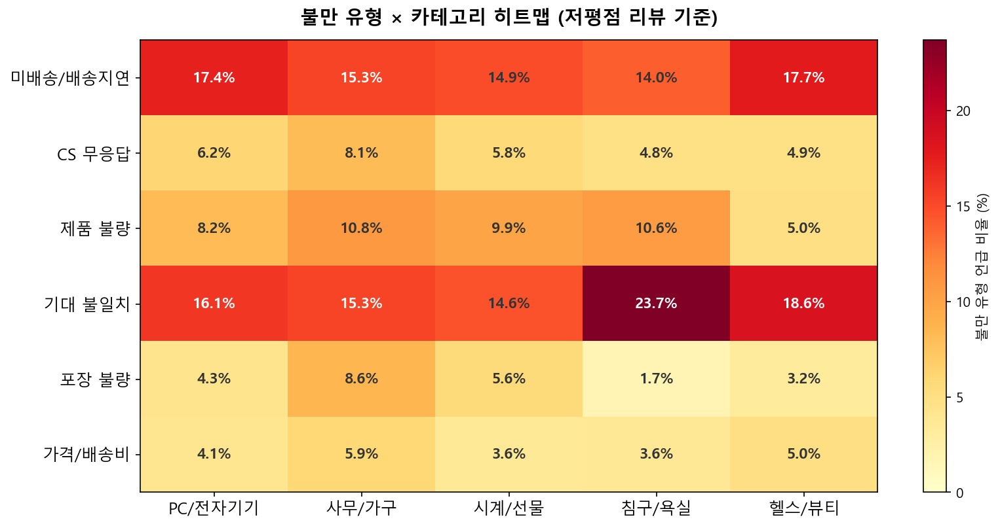
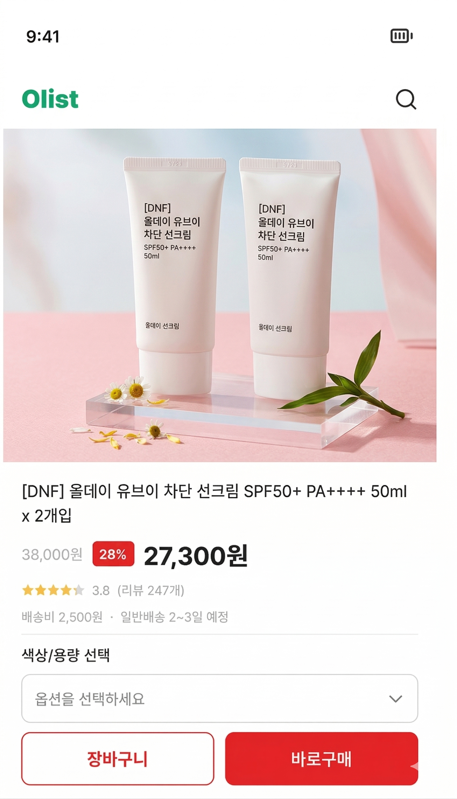
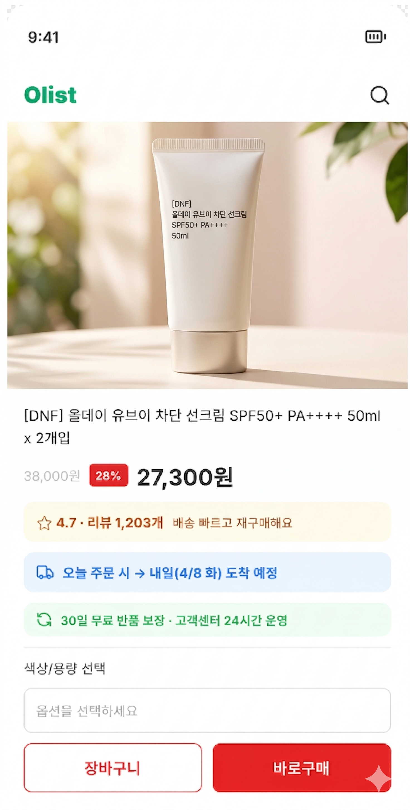

# Olist CX/UX Deep Dive Plan — Black Friday Conversion Focus

> 작성일: 2026-04-04  
> 역할 가정: 커머스 CX/UX 컨설팅 리드  
> 목적: CX/UX 관점에서 `현황 진단`, `문제점과 해결책`, `기간별 OKR`, `11~12월 Black Friday 임팩트 과제`를 정리한다.

---

## 0. 꼭 알아야 할 용어

| 용어 | 설명 |
|------|------|
| ETA | Estimated Time of Arrival. 고객에게 안내하는 `예상 배송 도착일` |
| PDP | Product Detail Page. `상품 상세 페이지` |
| Cart Abandonment | 장바구니에 담고도 결제를 완료하지 않고 이탈하는 현상 |
| Checkout Drop-off | 결제 단계에 진입한 뒤 최종 결제 전에 이탈하는 현상 |
| Bundle | 여러 상품을 묶어 할인 또는 추천하는 `세트 제안` |
| Repeat Contribution | 전체 주문/매출 중 `재구매 고객이 만든 비중` |

---

## 1. 이 문서의 핵심 결론

CX/UX 팀의 핵심 과제는 `첫 구매 전환율을 올리는 것`과 `첫 구매 품질을 안정화하는 것`을 동시에 설계하는 것이다.  
이 프로젝트에서 재구매율이 낮은 이유는 CRM만 약해서가 아니라, 첫 구매 전후 경험이 다시 돌아올 이유를 충분히 만들지 못하기 때문이다.

따라서 CX/UX는 아래 3가지를 동시에 잡아야 한다.

1. `전환 직전 망설임`을 줄이는 UX
2. `첫 구매 이후 실망`을 줄이는 CX
3. `한 번 산 고객이 다음 행동으로 넘어가게 하는 재진입 구조`

---

## 2. 분석 기준과 해석 원칙

### 확정된 기준 수치

| 항목 | 기준값 | 해석 |
|------|--------|------|
| 재구매율 | `3.00%` | 고객이 다시 돌아오는 구조가 약함 |
| 고객당 평균 주문 수 | `1.0334` | 대부분 1회 구매에 머묾 |
| 재구매 주문 비중 | `6.13%` | repeat contribution이 낮음 |
| 첫 구매 배송 지연율 | `8.16%` | 첫 경험 품질 리스크 |
| 첫 구매 저평점 비중 | `12.82%` | 첫 구매 만족도 방어 필요 |
| AOV | `BRL 159.79` | 단가 자체는 나쁘지 않음 |
| 다품목 주문 비중 | `9.98%` | bundle/cross-sell 구조가 약함 |

### 추가 근거

- 첫 주문 `정시 배송` 고객 재구매 전환율: `3.04%`
- 첫 주문 `지연 배송` 고객 재구매 전환율: `2.51%`
- 주중 AOV가 주말보다 높음: `208.34 vs 193.73`
- 월요일 주문 피크가 뚜렷함: 주말 탐색 후 월요일 결제 패턴 가능성

### 리뷰 딥다이브 확정 수치 (딥러닝 분류 기준)

저평점(1~2점) 리뷰 10,611건을 딥러닝(Zero-shot semantic classification)으로 재분류한 결과, TF-IDF에서 51.3%였던 미분류를 0%로 해소했다. 아래 수치는 확정 근거로 활용한다.

| 불만 원인 | 비율 | CX 시사점 |
|---------|-----:|-----------|
| 미배송 | `42.0%` | 고객 불만의 압도적 1위 — 배송 약속 관리가 핵심 |
| 환불/CS 무응답 | `19.8%` | 문의 후 응답 없는 경험이 2위 이탈 원인 |
| 제품 불량 | `9.2%` | 배송 외 독립 이탈 원인 |
| 배송 지연 | `8.7%` | 미배송과 합산 시 배송 관련 불만이 `50.7%` |
| 기대 불일치 | `8.5%` | 상품 설명과 실물 차이 — PDP 정보 강화 필요 |
| 가격/배송비 | `6.3%` | 다품목 구매의 실질적 장벽 (신규 발견) |
| 포장 불량 | `5.5%` | 부피/무게 큰 카테고리에서 집중 |

### 배송 지연의 임팩트 (확정)

- 배송 지연 시 저평점(1~2점) 비율: **`54%`** — 정시 배송(`9.2%`)의 **5.9배**
- 정시 배송인데도 1점인 고객: **`6,122명`** — 배송만 고쳐서는 저평점의 절반을 해결할 수 없음
- 정시 배송 1점 원인: 제품 불량(`12%`), CS 무응답(`11.4%`), 기대 불일치(`7.4%`)

### 카테고리별 재구매율 (확정)

| 카테고리 | 재구매율 | 해석 |
|---------|---------|------|
| `bed_bath_table` | `2.8%` | 소모/교체형 카테고리라 상대적으로 높음 |
| `sports_leisure` | `2.4%` | 운동용품 소모 교체 주기 있음 |
| `computers_accessories` | `1.9%` | IT 액세서리 추가 구매 가능 |
| `health_beauty` | `1.7%` | GMV 1위인데 재구매율은 낮음 — 첫 구매 실망 가능성 |
| `watches_gifts` | `1.2%` | 고가 + 선물 성격으로 반복 구매 구조 자체가 약함 |

### 해석 원칙

- 숫자로 확인된 문제와 컨설팅 가설을 분리한다.
- 실제 클릭스트림/퍼널 데이터가 없는 구간은 `가설`로 표기한다.
- Black Friday 과제는 `단기 매출 이벤트`가 아니라 `재구매 cohort 확보 이벤트`로 본다.
- 리뷰 딥다이브 결과는 딥러닝 기반 확정 수치로, 문제 정의와 우선순위 판단의 정량 근거로 활용한다.

---

## 3. CX/UX 핵심 문제 정의

### 문제 1. 첫 구매 전환 직전의 신뢰 장치가 약할 가능성

현재 데이터만으로는 세션 대비 conversion rate, cart abandonment, checkout drop-off를 직접 확인할 수 없다.  
다만 아래 신호를 보면 `첫 구매 직전 망설임`이 존재할 가능성이 높다.

- 배송 지연 시 저평점 `54%` (정시 `9.2%`의 5.9배) — 첫 구매 품질 이슈가 이후 재구매에 직접 연결됨
- 배송 관련 불만이 전체 저평점의 `50.7%`(미배송 42.0% + 지연 8.7%) — 배송 약속이 구매 확신의 핵심
- 다품목 주문 비중 `9.98%`, 배송비 불만 `6.3%` — 배송비가 basket expansion의 실질적 장벽

#### 해결 가설

- PDP와 checkout에서 `배송 ETA`, `리뷰 신뢰`, `반품/보상 정책`, `할인 조건`이 충분히 명확하지 않을 수 있다
- 프로모션 시즌에 `얼마나 아끼는지`, `언제 받는지`, `무엇을 같이 사야 하는지`가 UX상 명확히 드러나지 않을 수 있다

#### 우선 해결책

- PDP에 `예상 배송일`, `정시 배송 신뢰 문구`, `리뷰 요약`, `프로모션 적용 결과`를 상단에서 더 강하게 노출
- Cart/checkout에 `무료배송 기준`, `추가 혜택 적용 상태`, `지금 결제해야 하는 이유`를 한 화면에서 이해되게 정리
- Black Friday용으로 `추천 번들`, `set savings`, `재고/행사 종료 신호`를 별도 구성

---

### 문제 2. 첫 구매 이후 재진입 UX가 약하다

현재 구조는 고객을 한 번 데려오지만, 다시 들어올 이유를 충분히 설계하지 못하고 있다.

- 재구매율 `3.00%`
- 고객당 평균 주문 수 `1.0334`
- 일회성 고객 `90,315명`, 충성 고객 `227명`

#### 해결 가설

- 구매 완료 후 `다음 행동`이 약하다
- 카테고리별 재구매 주기나 accessory attach가 UX에 녹아 있지 않다
- 고객이 다시 방문했을 때 “무엇을 다시 사면 되는지”를 빠르게 찾기 어렵다

#### 우선 해결책

- 구매 완료 페이지에 `다음 추천 상품`, `함께 사면 좋은 상품`, `다음 혜택 조건` 노출
- 마이페이지/재방문 홈에 `최근 구매 기반 재추천`, `buy again`, `연관 카테고리 진입` 구조 추가
- 고가 상품 구매자에게는 accessory/consumable attach flow를 별도로 설계

---

### 문제 3. 첫 구매 이후 불만을 회복하는 CX recovery loop가 약하다

첫 주문 지연 고객의 재구매 전환율은 정시 배송 고객보다 낮다.  
즉, 문제는 지연 자체뿐 아니라 `지연 이후 회복 경험`의 부재일 가능성이 크다.

#### 확인된 근거

- 지연 배송 고객 재구매율 `2.51%` vs 정시 배송 `3.04%` — 지연이 재구매를 직접 깎음
- 배송 지연 시 저평점 `54%` vs 정시 `9.2%` — **5.9배 차이**
- 정시 배송인데도 1점인 고객 `6,122명` — 배송 외 이탈 원인이 독립적으로 존재
  - 제품 불량 `12%`, CS 무응답 `11.4%`, 기대 불일치 `7.4%`
- 딥러닝 분류 기준 환불/CS 무응답 불만 `19.8%` — 배송 다음으로 큰 이탈 원인
- 첫 구매 저평점 비중 `12.82%`

#### 우선 해결책

- 첫 구매 저평점/지연 고객 대상 `48시간 내 recovery flow` 설계
- 지연 감지 시 자동 사과, 보상 기준, 다음 주문 인센티브를 명문화
- 정시 배송 1점 고객의 원인(제품 불량 12%, CS 무응답 11.4%, 기대 불일치 7.4%)을 분리 대응
- VOC 유형을 Product/UX, 물류, Seller Ops backlog와 연결

---

### 문제 4. Black Friday용 전환 UX와 사후 전환 설계가 아직 분리되어 있지 않다

Black Friday는 단기 conversion uplift에는 유리하지만, 행사 고객이 곧바로 이탈하면 장기 가치가 작다.  
따라서 BF는 `전환`과 `사후 리텐션`을 같이 설계해야 한다.

#### 우선 해결책

- BF 랜딩/PDP/cart에서 `행사 혜택`, `배송 약속`, `추천 번들`을 명확히 구조화
- 구매 완료 직후 `BF 구매자 전용 second-purchase offer` 삽입
- 배송 완료 후 7일 이내 카테고리 기반 추천으로 2차 구매 전환 시도

---

## 4. 카테고리별 CX 우선순위

카테고리 우선순위는 `불만 강도`, `매출/볼륨 영향`, `재구매 구조 기여도`를 함께 봐야 한다.  
따라서 CX/UX 관점에서는 아래처럼 2개 축으로 나눠서 보는 것이 현실적이다.

> 사무/가구는 평균 점수가 가장 낮고(3.62) 저평점 비율이 22.6%로 가장 높다. 반면 헬스/뷰티는 평균 4.19로 양호하지만 볼륨이 크기 때문에 저평점 절대 건수는 많다.

### 4-1. 즉시 개선 우선 카테고리 (불만 강도 기준)

차트 기준, 저평점 비율이 높은 카테고리부터 즉시 개선이 필요하다.

| 카테고리 | 평균 점수 | 저평점 비율 | 저평점 건수 | CX/UX 시사점 | 협업 필요 팀 |
|----------|---------|-----------|-----------|-------------|-------------|
| `office_furniture` (사무/가구) | `3.62` | `22.6%` | 285건 | 5개 카테고리 중 가장 심각 — 배송 약속, 설치/수령 기대치, CS 응답이 모두 약함 | 물류팀, Seller Ops, MD |
| `bed_bath_table` (침구/욕실) | `3.98` | `16.6%` | **1,545건** | 비율은 중간이지만 절대 건수 1위 — 기대 불일치(`23.7%`)가 핵심 | MD, Seller Ops |
| `computers_accessories` (PC/전자기기) | `4.03` | `16.0%` | 1,071건 | 정품 의심, 카트리지 등 특정 상품군 불만 집중 | Seller Ops, MD |

### 4-2. 영향도 기준 우선 카테고리 (매출/볼륨 기준)

| 카테고리 | 왜 중요한가 | CX/UX 시사점 | 협업 필요 팀 |
|----------|-------------|-------------|-------------|
| `health_beauty` (헬스/뷰티) | GMV 1위(`9.3%`), 8,647건, 배송 지연율 **`32.6%`**(전체 평균의 4배) | 저평점 비율(`12.5%`)은 가장 낮지만, 볼륨이 커서 저평점 절대 건수 1,099건 — 작은 개선도 전체 만족도에 큰 영향 | 물류팀, MD, CRM |
| `bed_bath_table` (침구/욕실) | 판매량 1위(`9.9%`), 재구매율 `2.8%`(5개 카테고리 중 1위) | 재구매 친화 카테고리인데 기대 불일치가 `23.7%`로 가장 심각 — 옵션/색상/사이즈 안내가 핵심 | MD, Seller Ops |
| `watches_gifts` (시계/선물) | GMV 2위(`8.9%`), AOV `₩62,124`(최고), 재구매율 `1.2%`(최저) | 고가 선물 성격으로 CS 응답과 환불 경험에 민감 — 미배송 불만 `17.7%`로 5개 카테고리 중 최고 | CX, CRM, MD |

### 4-3. MD 협업 관점 우선순위 제안

| 우선순위 | 카테고리 | 재구매율 | MD와 함께 봐야 할 포인트 |
|---------|----------|---------|---------------------------|
| 1순위 | `health_beauty` | `1.7%` | GMV 1위인데 재구매율이 낮음 — 배송 지연율 `32.6%` 해소와 번들 전략 최적화로 재구매 전환 가능 |
| 2순위 | `bed_bath_table` | `2.8%` | 재구매율이 가장 높은 카테고리 — 기대 불일치(`23.7%`)만 줄이면 repeat 성장 엔진이 될 수 있음 |
| 3순위 | `watches_gifts` | `1.2%` | 고단가(AOV ₩62K) 상품군 — 선물 포장, 교환/환불, 신뢰 메시지 강화로 LTV 방어 |
| 4순위 | `office_furniture` | - | 저평점 비율 `22.6%`로 가장 심각하지만 볼륨이 작음(285건) — CS 무응답(`8.8%`) 해소가 우선 |

---

## 5. 리뷰 분석 기반 CX 인사이트

저평점(1~2점) 리뷰 10,611건을 딥러닝(Zero-shot semantic classification)으로 분류한 결과를 기반으로 한다.  
TF-IDF 단독으로는 51.3%가 미분류였으나, 딥러닝 적용으로 미분류 0%를 달성하여 아래 수치는 `확정 근거`로 활용한다.

### 5-1. 핵심 리뷰 인사이트

> 전 카테고리에서 5점 비율이 가장 높지만, 사무/가구는 1~2점 합산 비율이 22.6%로 5개 카테고리 중 가장 높다. 침구/욕실(16.6%), PC/전자기기(16.0%), 시계/선물(15.0%) 순으로 저평점 비율이 뒤따른다.

> 저평점(1~2점) 절대 건수 기준으로는 침구/욕실(1,545건)이 가장 많고, 헬스/뷰티(1,099건), PC/전자기기(1,071건)가 뒤따른다. 비율은 낮아도 볼륨이 크면 불만 총량이 크므로, CX 개선 우선순위는 비율과 건수를 함께 봐야 한다.

| 관찰 | 확정 수치 | CX 시사점 |
|------|----------|-----------|
| 배송이 불만의 핵심축 | 미배송 `42.0%` + 배송 지연 `8.7%` = **`50.7%`** | 저평점 리뷰의 절반 이상이 배송 문제 — 배송 약속 관리가 CX 최우선 |
| 배송 지연 시 저평점 폭증 | 지연 시 `54%` vs 정시 `9.2%` (**5.9배**) | 지연 감지와 선제 대응이 가장 강력한 레버 |
| CS 무응답이 2위 이탈 원인 | 환불/CS 무응답 **`19.8%`** | 고객은 상품보다 `답이 없는 경험`에 더 분노 — 응답 SLA 필수 |
| 정시 배송이어도 1점 고객 존재 | **`6,122명`** (제품불량 12%, CS무응답 11.4%, 기대불일치 7.4%) | 배송만 고쳐서는 절반만 해결 — 제품/CS/PDP를 분리 대응 |
| 배송비가 다품목 확장의 장벽 | 가격/배송비 불만 **`6.3%`** (679건, 신규 발견) | *"아이템 더 사도 더 비싸짐"* — 번들/무료배송 기준을 UX에서 더 명확히 |
| 사무/가구가 가장 심각 | 평균 `3.62`, 저평점 `22.6%` | 5개 카테고리 중 불만 강도 1위 — 즉시 개선 대상 |

### 5-2. 카테고리별 리뷰/VOC 해석

> 전 카테고리에서 `제품`, `배송`, `도착`, `아직미도착` 등의 키워드가 공통적으로 크게 나타난다. 특히 사무/가구에서는 `아직미도착`, `연락불가`, `의자` 등이 두드러지며, 배송 지연과 CS 응답 부재가 핵심 불만임을 알 수 있다.

> 5개 카테고리 모두에서 `entregue`(배송됨)가 최상위 키워드로 등장한다. 침구/욕실은 `qualidade`(품질)가 높고, 사무/가구는 `cadeira`(의자)가 특정 상품군 불만을 보여준다. PC/전자기기에서는 `cartucho`(카트리지)가 두드러진다.

| 카테고리 | 1위 불만 (히트맵) | 2위 불만 | 핵심 키워드 | CX 우선 액션 |
|----------|-----------------|---------|-----------|-------------|
| `health_beauty` (헬스/뷰티) | 기대 불일치 `18.0%` | 미배송 `17.7%` | `entregue`, `produto` | 배송 지연율 `32.6%`(전체 4배) 즉시 SLA 강화, ETA 정확도 개선 |
| `bed_bath_table` (침구/욕실) | **기대 불일치 `23.7%`** (전 카테고리 최고) | 미배송 `14.6%` | `qualidade`, `produto` | 색상/사이즈/재질 실측 정보 보강, 이미지 수 확대 |
| `watches_gifts` (시계/선물) | 미배송 `14.3%` | 기대 불일치 `14.6%` | `entregue`, `relogio` | AOV ₩62K 고가 — CS 응답 SLA 별도 설정, 교환/환불 안내 강화 |
| `computers_accessories` (PC/전자기기) | 미배송 `17.4%` | 기대 불일치 `16.1%` | `cartucho`, `entregue` | 정품/품질 보증 메시지 강화, `original`(정품) 키워드 반복 등장 |
| `office_furniture` (사무/가구) | 기대 불일치 `15.3%` | 미배송 `15.3%` | `cadeira`, `아직미도착` | CS 무응답 `8.8%`(최고) — 응대 SLA와 연락 체계 즉시 정비 |

### 5-3. CX 관점 핵심 결론

> 히트맵에서 가장 진한 셀(=가장 높은 불만 비율)이 카테고리마다 다르다. 이것이 핵심이다.

**히트맵에서 읽어야 할 3가지 패턴:**

1. **미배송/배송지연**: 헬스/뷰티(`17.7%`)와 PC/전자기기(`17.4%`)에서 가장 높다. 두 카테고리 모두 볼륨이 크므로 절대 건수 임팩트가 크다.
2. **기대 불일치**: 침구/욕실에서 **`23.7%`** 로 전 카테고리·전 불만 유형 통틀어 가장 높은 단일 셀이다. 이 카테고리는 배송보다 `받아보니 달라서` 화나는 고객이 더 많다.
3. **CS 무응답**: 사무/가구(`8.8%`)와 침구/욕실(`8.8%`)에서 가장 높다. 고가·부피 상품일수록 문의 대응 지연에 민감하다.

CX 입장에서 가장 먼저 해결해야 할 것은 `리뷰 평점 자체`가 아니라 `고객이 화나는 순간`이다.

1. 배송이 늦는데 아무 설명이 없는 순간 — 미배송+지연 합산 `50.7%`
2. 문의했는데 답이 없는 순간 — CS 무응답 `19.8%`
3. 받아보니 기대와 다른 순간 — 기대 불일치 `8.5%` (침구/욕실에서는 `23.7%`)

즉, CX 전략은 `사후 불만 처리`보다 `실망이 발생하는 지점의 선제 차단`으로 가야 한다.  
그리고 **카테고리마다 차단해야 할 지점이 다르다** — 헬스/뷰티는 배송, 침구/욕실은 기대 불일치, 사무/가구는 CS 응답이 각각 1순위다.

---

## 6. 추정 상품 예시와 해석 한계

현재 raw data에는 `상품명`과 `브랜드명`이 없으므로, 아래 예시는 `카테고리`, `무게`, `가격`, `이미지 수`, `설명 길이`를 바탕으로 한 추정이다.  
발표 시에는 `확정 상품`이 아니라 `이런 유형의 상품일 가능성이 높다`는 식으로 표현해야 한다.

### 6-1. 카테고리별 추정 상품 예시

| 카테고리 | 데이터 신호 | 한국인이 이해하기 쉬운 추정 예시 | 왜 이렇게 추정하는가 |
|----------|-------------|-------------------------------|---------------------|
| `health_beauty` | 100g, 저가, 소형, 이미지 1장 | 치약, 핸드크림, 소형 스킨케어 | 가볍고 작으며 가격이 낮아 소모성 뷰티/생활용품 가능성이 높음 |
| `health_beauty` | 250g, 중가, 이미지 3장 | 선크림 세트, 기능성 크림, 헤어케어 | 중간 가격대와 다중 이미지로 기능 설명이 필요한 제품일 가능성 |
| `watches_gifts` | 584g, 중가, 이미지 3장 | 탁상시계, 선물용 소품 세트 | 시계 단품보다 무겁고 선물용 구성품 포함 가능성 |
| `watches_gifts` | 4,338g, 중가, 이미지 2장 | 고급 시계 보관함, 데코형 선물 박스 | 카테고리 대비 무게가 매우 무거워 액세서리/보관형 상품 추정 가능 |
| `bed_bath_table` | 1,383g, 중가, 이미지 1장 | 침구 세트 일부, 욕실 매트, 테이블보 | 중간 무게와 생활 카테고리 특성상 부피형 패브릭 상품 가능성 |
| `bed_bath_table` | 9,750g, 고가, 이미지 5장 | 두꺼운 이불 세트, 러그, 욕실 수납형 상품 | 무게가 매우 무거워 부피 크고 배송 민감한 상품 가능성 |
| `computers_accessories` | 6,550g, 중가, 배송비 높음 | 프린터, 대형 스피커, PC 주변기기 세트 | IT 카테고리인데 무게가 커서 일반 케이블보다 대형 기기 가능성 |
| `computers_accessories` | 180g, 중가, 이미지 1장 | 마우스, 공유기 액세서리, 소형 전자기기 | 가볍고 단가가 있는 소형 전자 제품 패턴 |

### 6-2. 이 예시를 발표에서 쓰는 방법

- `실제 상품명은 없지만, 데이터 특성상 이런 상품군일 가능성이 높다`
- `특히 무겁고 부피가 큰 상품일수록 배송·파손·수령 경험 이슈가 커질 수 있다`
- `작고 저가인 상품은 배송비 체감과 상세 설명의 명확성이 더 중요할 수 있다`

---

## 7. 가설 기반 UX 개선안

실존 페이지가 없기 때문에, 아래 제안은 `이런 병목이 존재한다고 가정할 때 어떤 UX 구조를 바꿔야 하는가`에 초점을 둔다.  
이 방식은 발표에서 `Before vs After` 와이어프레임 또는 가짜 시안으로 제시하기에 적합하다.

### 7-1. 가정 1. 랜딩/홈에서 행사 가치가 명확하지 않다

#### 현재 문제 가설

- Black Friday 혜택이 많지만 어디서 무엇이 중요한지 한눈에 안 들어온다
- 무료배송 조건, 추천 카테고리, 신뢰 근거가 흩어져 있다

#### 제안 플로우

- Before: 배너 중심 나열형 홈
- After: `행사 핵심 혜택 → 추천 카테고리 → 베스트 셀러 → 배송 신뢰 메시지` 순서의 구조형 홈

### 7-2. 가정 2. PDP에서 구매 직전 망설임이 크다

#### 현재 문제 가설

- 리뷰, 배송일, 혜택, 교환/환불 기준이 서로 떨어져 있어 결제 직전 확신이 약하다

#### 제안 플로우

핵심은 상품 이미지 유무가 아니라, `가격/혜택`, `예상 배송일`, `리뷰 요약`, `교환/환불 안내`를 **첫 화면 안에서 한눈에 이해할 수 있는가**이다.

| Before | After |
|:---:|:---:|
|  |  |

> **Before 문제점**: 상품 이미지와 가격은 잘 보이지만, 리뷰 점수가 `★★★★ 3.8 (리뷰 247개)`로 작게 표시되고, 배송일은 `일반배송 2~3일 예정`으로 모호하며, 반품/보상 정보는 첫 화면에 보이지 않는다. 구매 직전에 고객이 확인하고 싶은 정보가 흩어져 있어 확신이 약해진다.
>
> **After 개선점**: 가격 바로 아래에 3가지 신뢰 요소를 집중 배치했다.
> 1. `★ 4.7 · 리뷰 1,203개 · 배송 빠르고 재구매해요` — 리뷰 수와 대표 코멘트로 신뢰 즉시 전달
> 2. `오늘 주문 시 → 내일(4/8 화) 도착 예정` — 구체적 날짜로 ETA 명확화
> 3. `30일 무료 반품 보장 · 고객센터 24시간 운영` — 구매 후 불안 해소
>
> 이 구조는 배송 관련 불만 `50.7%`와 CS 무응답 `19.8%`를 선제 차단하는 Trust UX 설계다.

### 7-3. 가정 3. Cart/checkout에서 혜택 이해가 어렵다

#### 현재 문제 가설

- 배송비 체감이 커서 다품목 확장이 안 된다
- 쿠폰과 무료배송 기준이 명확하지 않아 이탈 가능성이 있다

#### 제안 플로우

- Before: 결제 직전 총액만 보이는 구조
- After: `현재 절감액`, `무료배송까지 남은 금액`, `추가 추천 상품`, `도착 예정일`을 함께 보여주는 설계

### 7-4. 가정 4. 구매 완료 후 다음 행동이 비어 있다

#### 현재 문제 가설

- 결제가 끝나면 고객이 바로 이탈하고, 다시 돌아올 이유가 부족하다

#### 제안 플로우

- Before: 주문 완료 확인만 제공
- After: `배송 추적`, `다음 추천 상품`, `다음 구매 혜택`, `리뷰 작성 유도`, `buy again entry`를 함께 제공

### 7-5. 발표용 활용 방식

이 UX 제안은 실제 페이지 캡처가 없어도 발표에서 충분히 활용 가능하다.

- `문제 가설` 한 줄
- `Before 구조` 1장
- `After 구조` 1장
- `예상 효과` 1줄

이 구조로 정리하면 랜딩, PDP, cart, thank-you page 모두 발표용 시안으로 연결할 수 있다.

---

## 8. CX/UX 관점 해결 방향

| 개선 축 | 목표 | 핵심 액션 |
|---------|------|-----------|
| Trust UX | 구매 직전 불안 해소 | ETA, 리뷰, 반품/보상, 혜택 명확화 |
| Conversion UX | cart→checkout 전환 강화 | 할인 이해도, 무료배송 기준, bundle 노출 |
| Post-Purchase UX | 다음 행동 유도 | thank-you, buy again, accessory attach |
| Recovery CX | 첫 구매 실망 회복 | 지연/저평점 고객 recovery flow |
| BF Operating UX | 11~12월 임팩트 확대 | BF landing, bundle, urgency, cohort follow-up |

---

## 9. 기간별 OKR 제안

### 단일 Objective

CX/UX 관점에서 `첫 구매 경험`과 `재진입 구조`를 개선해 재구매율 상승에 기여한다.

이 문서에서는 기간이 달라져도 Objective 자체는 바꾸지 않는다.  
대신 각 기간별 KR을 통해 `단기 전환`, `중기 구조 변화`, `장기 체질 개선`을 나눠서 관리한다.

### 9-1. 3개월 OKR

목표 성격: `Black Friday 전환율 개선과 첫 구매 품질 안정화`

### KR

| KR | 기준 | 제안 목표 |
|----|------|-----------|
| 첫 구매 배송 지연율 | `8.16%` | `7.0%` |
| 첫 구매 저평점 비중 | `12.82%` | `11.8%` |
| 재구매 주문 비중 | `6.13%` | `7.0%` |
| 다품목 주문 비중 | `9.98%` | `12.0%` *(TF3 합의 기준 — integrated_okr_plan.md §3 TF3)* |
| BF 신규 구매 전환율 | 별도 측정 필요 | `pre-BF 4주 대비 +15%` |

### 해석

- 3개월 구간은 구조 자체를 완전히 바꾸기보다 `early win`을 만드는 기간이다.
- BF 시즌 KPI는 절대값보다 `사전 4주 baseline 대비 uplift`로 관리하는 것이 안전하다.
- 이 구간의 KR은 `재구매율의 선행 지표`를 먼저 안정화하는 데 목적이 있다.

---

### 9-2. 6개월 OKR

목표 성격: `반복 실행이 구조 변화로 이어지는지 검증`

### KR

| KR | 기준 | 제안 목표 |
|----|------|-----------|
| 재구매율 | `3.00%` | `4.0%` |
| 고객당 평균 주문 수 | `1.0334` | `1.05` |
| 재구매 주문 비중 | `6.13%` | `8.0%` |
| 첫 구매 배송 지연율 | `8.16%` | `6.5%` |
| 첫 구매 저평점 비중 | `12.82%` | `11.0%` |

### 해석

- 6개월 구간은 단기 전환 개선이 실제 `재구매 구조 개선`으로 이어지는지 보는 구간이다.
- 따라서 재구매율, 고객당 평균 주문 수, 재구매 주문 비중을 본격 KR로 관리한다.

---

### 9-3. 1년 OKR

목표 성격: `repeat-driven growth 체질화`

### KR

| KR | 기준 | 제안 목표 |
|----|------|-----------|
| 재구매율 | `3.00%` | `4.5%` |
| 고객당 평균 주문 수 | `1.0334` | `1.06` |
| 재구매 주문 비중 | `6.13%` | `9.0%` |
| repeat-driven GMV contribution | 신규 정의 필요 | 정기 모니터링 체계화 |
| BF/시즌성 cohort 60일 재구매율 | 신규 측정 필요 | cohort 관리 정착 |

### 해석

- 1년 구간은 BF 같은 행사 효과가 아니라 `재구매율 중심 운영 체계`가 정착됐는지를 보는 구간이다.
- CX/UX의 역할은 구매 전환 화면 개선을 넘어, 첫 구매 이후 다시 돌아오는 흐름을 서비스 구조로 만드는 것이다.

---

## 10. Black Friday 11~12월 실행안

### 10-1. 운영 구간

| 구간 | 목표 | 핵심 액션 |
|------|------|-----------|
| 9~10월 | 사전 준비 | ETA/리뷰/혜택 UX 정리, bundle 설계, recovery 정책 정립 |
| 11월 | 행사 전환 극대화 | BF 랜딩, cart/checkout friction 완화, 추천 번들 노출 |
| 12월 | 사후 리텐션 전환 | BF cohort second purchase, buy again, category re-entry |

### 10-2. 전환율을 높이기 위한 핵심 레버

### 1. 구매 직전 hesitation 제거

- ETA를 더 구체적으로 제시
- `오늘 주문 시 언제 받는지`를 명확히 노출
- 리뷰 요약과 구매 근거를 상단에 재배치
- 할인 적용 결과와 절감액을 cart에서 즉시 이해되게 노출

### 2. AOV와 다품목율 동시 개선

- BF bundle 제안
- 카테고리 조합 추천
- free shipping threshold와 add-on 추천 결합

### 3. 행사 고객의 재구매 구조 설계

- thank-you page에 second action 삽입
- 배송 완료 후 7일 이내 category-based 추천
- BF 구매자 전용 second-purchase coupon 운영

### 4. 불만족 고객 즉시 회복

- 지연/저평점 고객 자동 분기
- 48시간 내 recovery contact
- 다음 주문 보상과 FAQ를 동시에 제시

---

## 11. CX/UX 단독 과제 vs 타팀 협업 과제

### 7-1. CX/UX 단독으로 주도 가능한 과제

| 과제 | 설명 | 기대 효과 |
|------|------|-----------|
| PDP 신뢰 요소 재배치 | ETA, 리뷰 요약, 혜택 설명 우선 노출 | 구매 직전 불안 감소 |
| Cart/checkout 정보 구조 개선 | 할인, 배송, 총 혜택 이해도 향상 | checkout completion 개선 |
| 구매 완료 후 후속 행동 UX | buy again, 연관 상품, 다음 혜택 노출 | 재진입 증가 |
| 저평점/지연 고객 recovery script 설계 | CX 응대 표준화 | 불만 이탈 완화 |

### 7-2. 타팀 협업이 필요한 과제

| 과제 | 주관 | 협업 팀 | 왜 협업이 필요한가 |
|------|------|---------|--------------------|
| BF bundle/세트 제안 | CX/UX | Merchandising, Marketing/CRM | 무엇을 묶을지와 어떤 혜택을 줄지 상품/프로모션 설계가 필요 |
| ETA 정확도 개선 | CX/UX | 물류팀, Seller Ops, Data/BI | 화면 문구보다 실제 배송 약속 정확도가 더 중요 |
| 지연 고객 recovery automation | CX/UX | CX, CRM, Data/BI | 자동 분기와 메시지 발송 로직이 필요 |
| 첫 구매 cohort 리텐션 설계 | CX/UX | CRM, Merchandising, Data/BI | 추천 상품과 메시지 타이밍을 함께 설계해야 함 |
| 저평점 원인 개선 backlog | CX/UX | CX, Seller Ops, 물류팀, Product | 원인별로 책임 팀이 다르기 때문 |
| BF 시즌 capacity planning | CX/UX | 물류팀, CX, Seller Ops | 전환을 늘려도 운영이 버티지 못하면 오히려 repeat가 악화됨 |

---

## 12. 지금 바로 착수할 액션 플랜

### 1단계. 구조 정리

- BF 시즌 기준 KPI를 `전환`, `Activation 품질`, `사후 repeat` 3개 축으로 고정
- site/app 단의 추가 계측 필요 항목 정의
  - session→PDP→cart→checkout→payment drop-off
  - coupon apply rate
  - BF cohort 30일/60일 repeat

### 2단계. UX 개선안 도출

- PDP, cart, checkout, thank-you page 기준 개선안 wireframe 수준으로 정리
- 현재 데이터로 확인 가능한 문제와 가설 구간을 분리

### 3단계. 협업 실행안 정렬

- Merchandising와 bundle 기준 정리
- 물류팀과 ETA promise / SLA 구간 정리
- CX와 recovery playbook 정리
- CRM과 BF cohort 후속 flow 정리

### 4단계. BF 운영

- 11월 행사 기간 실시간 운영 지표 확인
- 12월 BF cohort의 재방문/재구매 전환 집중 관리

---

## 13. 추가로 논의가 필요한 가설

아래는 실제 데이터로 아직 확인하지 못했지만, 프로젝트 해결책 제시를 위해 논의가 필요한 가설이다.

1. checkout 단계에서 결제/쿠폰/배송 정보 이해도 문제로 drop-off가 발생하고 있을 가능성
2. BF 시즌 프로모션이 많아질수록 오히려 혜택 구조가 복잡해져 전환이 떨어질 가능성
3. 첫 구매 이후 고객이 다시 들어왔을 때 `무엇을 사야 하는지`를 못 찾는 탐색 문제

이 가설은 이후 논의에서 `실제 확인 가능한 항목`과 `컨설팅 가정으로 둘 항목`으로 분리해서 확정하면 된다.
