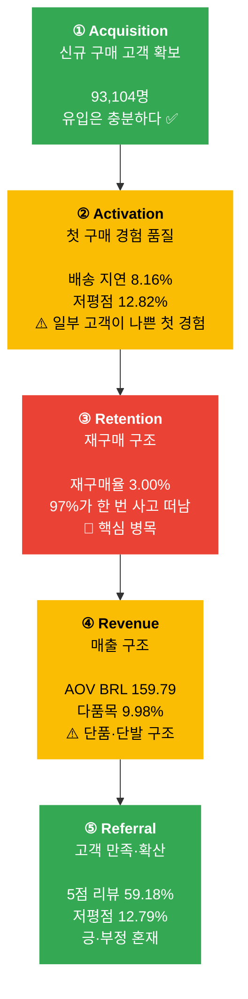

# Olist 전사 AARRR 프레임워크 — 통합 분석

> **작성일**: 2026-04-18 (최종 수정: 2026-04-18 — team 폴더 최신 자료 반영)  
> **기준 문서**: `integrated_okr_plan.md` (SSOT), `logistics_v2.md`, `marketing_promotion_0417.md`, 6개 팀 OKR  
> **분석 기간**: 2017-01-01 ~ 2018-08-31  
> **관점**: Buyer(구매자) 서비스 성과형 AARRR  
> **환율 기준**: 1 BRL ≈ 302원 (2018년 연평균)

---

## 핵심 결론 먼저

> **Olist는 고객을 잘 데려오지만, 붙잡지 못한다.**  
> 93,104명이 구매했지만 97%는 한 번 사고 떠났다.  
> 문제는 Acquisition이 아니라 **Activation 품질 → Retention 구조 부재**의 연결 고리다.

---

## 1. AARRR 퍼널 현황 — 한눈에 보기



| 단계 | 상태 | 핵심 수치 | 판단 |
|------|------|----------|------|
| **Acquisition** | ✅ 양호 | 신규 구매 고객 93,104명 | 유입 자체는 문제 없음 |
| **Activation** | ⚠️ 주의 | 배송 지연 8.16% / 저평점 12.82% | 첫 경험이 Retention을 깎는 구조 |
| **Retention** | 🚨 위험 | 재구매율 3.00% / 97% 이탈 | 전사 OKR의 핵심 병목 |
| **Revenue** | ⚠️ 취약 | 다품목 비중 9.98% / AOV BRL 159.79 | 단품·단발 구조로 확장 여지 큼 |
| **Referral** | ✅ 준수 | 5점 리뷰 59.18% / 저평점 12.79% | 긍정 우세, 부정 리스크 관리 필요 |

---

## 2. Acquisition — 신규 구매 고객 확보

### 현황 수치

| 지표 | 수치 | 의미 |
|------|------|------|
| 신규 구매 고객 수 | **93,104명** | 유입은 충분 |
| 가드레일 G1 | 신규 고객 수 **유지** | 줄이면 안 되는 하한선 |

> **데이터 한계**: 이번 raw data에는 웹 방문자 수·세션 로그·유입 채널이 없다.  
> 따라서 Acquisition = "첫 delivered 주문을 만든 구매 고객 확보"로 재정의한다.

### 구조적 진단

```
고객이 들어오는가?  → YES (93,104명, 충분)
문제는 들어온 뒤다  → 97%가 1회 구매 후 이탈
```

Acquisition 자체보다 **온 고객을 붙잡는 구조**가 없는 것이 본질적인 문제다.  
신규 유입을 더 늘리는 것보다 현재 93,104명의 재구매 전환이 먼저다.

### 팀 역할 및 액션

| 팀 | 역할 | 핵심 액션 |
|----|------|----------|
| **Marketing (프로모션)** | 리드 | BF 얼리버드·시간대별 전환 설계로 신규 고객 구조화 유입 |
| **Marketing (CRM)** | 지원 | 사전 관심 상품 캠페인으로 Pre-BF 전환율 +15% |
| **Seller Ops** | 지원 | 재구매 친화 카테고리(bed_bath_table 등) 신규 셀러 비중 40%+ |

### KR 목표

| KR | 현재 | 1년 목표 |
|----|------|---------|
| G1. 신규 구매 고객 수 | 90,315명 | **유지** (하락 방지) |
| BF-KR1. BF 기간 전환율 | — | pre-BF 대비 **+15%** |

---

## 3. Activation — 첫 구매 경험 품질

### 현황 수치

| 지표 | 수치 | 의미 |
|------|------|------|
| 첫 구매 배송 지연율 | **8.16%** | 100명 중 8명이 첫 경험에서 지연 |
| 첫 구매 저평점 비중 | **12.82%** | 100명 중 13명이 1~2점 리뷰 |
| 정시 배송 고객 재구매 전환율 | **3.04%** | 기준선 |
| 지연 배송 고객 재구매 전환율 | **2.51%** | 정시 대비 **-0.53%p** 손실 |
| 배송 지연 시 저평점 비율 | **54%** | 정시 9.2% 대비 **5.9배** |

### 구조적 진단

```
첫 구매 저평점(12.82%) 원인 분해 (딥러닝 분류 기준, 10,611건):
  ├── 미배송 / 배송 지연     42.0% + 8.7% = 50.7%  → 물류팀 주관
  ├── CS 무응답              19.8%                   → CX팀 주관
  ├── 상품 기대 불일치       ~20%                    → Seller Ops 주관
  └── UX 문제                ~18%                   → Product/UX 주관
```

> **핵심**: Product/UX가 혼자 책임지면 18%만 해결 가능하다.  
> 나머지 82%는 물류·CX·Seller Ops가 함께 움직여야 한다 → **TF2 공동 OKR**

### 배송 지연 임계점 — logistics_v2 실데이터

| EDD 오차 구간 | 평균 리뷰 점수 | 1점 비율 |
|-------------|-------------|---------|
| 조기 7일+ | 4.32점 | 6.4% |
| 정시(0일) | 4.15점 | 7.5% |
| **지연 1~3일** | **3.92점** | **10.3%** |
| **지연 3~7일** | **2.67점** | **42.5%** ← 변곡점 |
| **지연 7일+** | **1.74점** | **68.6%** |

> **지연 3일이 임계점**: 3일을 넘는 순간 1점 비율이 10% → 43%로 4배 이상 급등한다. 모든 물류 운영의 1차 목표는 이 선을 넘지 않게 하는 것.

> **EDD 설정 구조**: Olist는 EDD를 보수적으로 설정 — 90.3% 조기 도착, 평균 10.8일 여유. 그럼에도 8.1%가 지연되는 원인은 EDD 설정 문제가 아니라 악성 셀러·고지연 지역 등 현장 돌발 변수다.

### 카테고리별 Activation 리스크

| 카테고리 | 저평점 비율 | 1위 불만 원인 | 우선 액션 |
|---------|-----------|-------------|---------|
| office_furniture | **22.6%** | 기대 불일치 + 미배송(15.3%) | 화물 전문 파트너 + CS SLA 강화 |
| bed_bath_table | 16.6% (건수 1위 1,545건) | **기대 불일치 23.7%** | 색상·사이즈 실측 정보 보강 |
| health_beauty | 12.5% (볼륨 최대) | 배송 지연율 **32.6%**(전체 4배) | 지연율 우선 개선 |
| watches_gifts | 15.0% | 미배송 17.7% | 고가 CS SLA 별도 설정 |

### 팀 역할 및 액션

| 팀 | 역할 | 핵심 액션 |
|----|------|----------|
| **Product/UX** | 리드 (UX 18%) | PDP 신뢰 요소(ETA, 리뷰 요약, 반품 정책) 상단 노출, 장바구니 UX 개선 |
| **Logistics** | 배송 지연 50.7% | Total Lead Time 12.1일 → 10일(6개월) → 8일(1년), Fast-Ship 인증제 |
| **CX** | CS 무응답 19.8% | 저평점 고객 48시간 내 Recovery flow, VOC 태깅 체계 |
| **Seller Ops** | 상품 기대 불일치 ~20% | Top100 중 4.0점 미만 23명 → 15명 이상 개선 |

### KR 목표

| KR | 현재 | 3개월 | 6개월 | 1년 |
|----|------|-------|-------|-----|
| KR4. 첫 구매 배송 지연율 | 8.16% | 7.0% | 6.5% | **6.0%** |
| KR5. 첫 구매 저평점 비중 | 12.82% | 11.8% | 11.0% | **10.5%** |
| BF-KR4 (전사). BF 첫 구매 배송 지연율 | — | **7.0% 이하** | — | — |
| BF-KR4-L (물류 방어). BF 전체 배송 지연율 | 20.93% (2017 BF 기간 실측) | — | — | **15% 이하** |

> **BF-KR4 구분**: BF-KR4(전사)는 "첫 구매 고객 기준" 지연율로 전사 KR4와 동일 측정 기준. BF-KR4-L은 BF 기간 전체 주문 기준으로 물류팀 방어 목표. 2017 BF 11월 전체 기준으로는 14.39%(logistics_v2 실측)이며, BF 3일 집중 구간은 20.93%로 두 수치는 측정 기간이 다름.

---

## 4. Retention — 재구매 구조 🚨 전사 핵심 병목

### 현황 수치

| 지표 | 수치 | 의미 |
|------|------|------|
| 재구매 고객 수 | **2,789명** | 전체 구매 고객의 3% |
| 재구매율 | **3.00%** | 97%가 한 번 사고 이탈 |
| 고객당 평균 주문 수 | **1.0334** | 거의 1회로 끝남 |
| 재구매 주문 비중 | **6.13%** | 매출의 94%가 일회성 고객 의존 |

### 구조적 진단

```
신규 고객 93,104명 유입
        ↓
97%가 1회 구매 후 이탈
        ↓
재구매 유도 구조 없음:
  ① CRM (쿠폰·메시지 자동화) 미구축
  ② 구매 완료 후 재진입 UX 부재 (Thank-you 페이지 등)
  ③ 번들·연관 상품 추천 시스템 없음
  ↓
재구매 고객 2,789명만 남음 (3%)
```

**비유**: 버킷에 물을 퍼붓는데 바닥에 구멍이 뚫린 상태.  
신규 유입을 늘리는 것보다 **구멍(이탈 원인)을 막는 것이 먼저**다.

### 카테고리별 재구매율 (현황)

| 카테고리 | 재구매율 | 특징 |
|---------|---------|------|
| **bed_bath_table** | **2.8%** | 소모·교체형 → 재구매 잠재력 최고 |
| sports_leisure | 2.4% | 운동용품 소모 주기 존재 |
| computers_accessories | 1.9% | IT 액세서리 Attach 기회 |
| health_beauty | 1.7% | GMV 1위인데 재구매율 낮음 → 첫 구매 실망 가능성 |
| watches_gifts | 1.2% | 고가 선물형 → 반복 구매 구조 자체가 약함 |

### 재구매 Lifecycle Journey (TF3)

```
첫 구매 완료
│
├─ [즉시] Thank-you 페이지 (Product/UX)
│   └─ 연관 상품 추천 (MD 상품 선정)
│
├─ [D+3] 배송 완료 확인 (물류 데이터 → CRM 발송)
│   └─ 만족도 확인 + 카테고리 기반 추천
│
├─ [D+7] 리뷰 작성 유도 (CRM)
│   └─ 리뷰 작성 시 다음 구매 할인 제공
│
├─ [D+30] 재구매 주기 캠페인 (CRM)
│   └─ 구매 카테고리 기반 보충 상품 추천 (MD)
│
├─ [D+60] 재진입 캠페인 (CRM)
│   └─ 미방문 고객 타겟 (Product/UX: 재진입 UX)
│
└─ [D+90] 이탈 방지 (CRM)
    └─ 마지막 터치포인트
```

### 팀 역할 및 액션

| 팀 | 역할 | 핵심 액션 |
|----|------|----------|
| **Marketing (CRM)** | 리드 | D+7/D+30/D+60 Lifecycle 자동 발송 flow, Cluster 세그먼트 운영, cama_mesa_banho 재구매 전환율 2.80% → 6.0% |
| **Product/UX** | UX 레버 | Thank-you 페이지, 재진입 UX, Buy Again 구조 |
| **MD** | 상품 레버 | bed_bath_table 재구매율 2.8% → 3.8% (6개월), 번들·Accessory Attach |
| **Seller Ops** | 공급 품질 | 휴면 셀러 1,155명 중 20%(231명) 재활성화, 재구매 친화 카테고리 셀러 비중 40%+ |

### KR 목표

| KR | 현재 | 3개월 | 6개월 | 1년 |
|----|------|-------|-------|-----|
| KR1. 재구매율 | 3.00% | 3.5% | 4.0% | **4.5%** |
| KR2. 고객당 평균 주문 수 | 1.0334 | — | 1.05 | **1.06** |
| KR3. 재구매 주문 비중 | 6.13% | 7.0% | 8.0% | **9.0%** |
| BF-KR5. BF cohort 30일 재구매율 | 0.56% (baseline) | — | — | **1.5~2.0%** |
| BF-KR6. BF cohort 60일 재구매율 | — | — | — | **3.0%** |

---

## 5. Revenue — 매출 구조

### 현황 수치

| 지표 | 수치 | 의미 |
|------|------|------|
| Delivered GMV | **BRL 15.37M** (약 46.4억원) | 전체 거래 규모 |
| Delivered Orders | **96,211건** | 주문량 |
| AOV | **BRL 159.79** (약 48,300원) | 주문당 평균가 |
| 주문당 평균 상품 수 | **1.14개** | 단품 위주 구조 |
| 다품목 주문 비중 | **9.98%** | 10명 중 1명만 2개 이상 |
| G2. AOV 가드레일 | BRL 159.79 | 하락 방지 |

### 구조적 진단

```
현재 Revenue 구조:
  GMV = Orders(96,211) × AOV(BRL 159.79)
  
문제:
  ① 주문당 상품 수 1.14개 → cross-sell / bundle 구조 전무
  ② 다품목 비중 9.98% → 90%가 단품 구매
  ③ 재구매 주문 비중 6.13% → 매출의 94%가 일회성 고객
  
목표 구조:
  GMV 성장 = 재구매 고객 증가 × AOV 방어 + 다품목 비중 확대
```

### 매출 성장 레버 분해

| 레버 | 현재 | 목표 | 담당 팀 |
|------|------|------|---------|
| 다품목 비중 | 9.98% | 12%(3개월) → 14%(1년) | MD + Product/UX + CRM |
| BF 기간 AOV | BRL 150.51 (2017 BF 실측) | **BRL 170+** | MD + 프로모션 + CRM |
| bed_bath_table GMV 비중 | 측정 중 | 16% → 19% (중기) | MD |
| Accessory Attach GMV | 미추적 | 전체 GMV의 3% (장기) | MD + Product/UX |

### 팀 역할 및 액션

| 팀 | 역할 | 핵심 액션 |
|----|------|----------|
| **MD** | 리드 | 번들·세트 10개 이상 기획(12~18% 할인), 고가 Accessory Attach 설계 |
| **Marketing (프로모션)** | BF 설계 | BRL 120 무료배송 threshold, 무이자 할부(BRL 300+), 홈/리빙 bundle |
| **Marketing (CRM)** | 교차판매 | Dynamic NBA 콘텐츠, Cluster 0 게이미피케이션(다품목 유도) |
| **Product/UX** | UX 구현 | 장바구니 Basket-building UX, "BRL XX 더 담으면 무료배송" 노출 |

### KR 목표

| KR | 현재 | 3개월 | 1년 |
|----|------|-------|-----|
| G2. AOV | BRL 159.79 | 하락 방지 | **하락 방지** |
| BF-KR2. BF 기간 다품목 비중 | 9.98% (평시) / 11.57% (2017 BF) | — | **13~14%** |
| BF-KR3. BF 기간 AOV | BRL 150.51 (2017 BF) | — | **BRL 170+** |
| TF3 합의. 다품목 비중 | 9.98% | **12%** | **14%** |

---

## 6. Referral — 고객 만족과 확산

### 현황 수치

| 지표 | 수치 | 의미 |
|------|------|------|
| 리뷰 작성률 | **99.33%** | 거의 모든 고객이 리뷰를 남김 |
| 5점 리뷰 비중 | **59.18%** | 절반 이상이 최고 만족도 |
| 저평점(1~2점) 비중 | **12.79%** | 부정적 구전 리스크 |

> **데이터 한계**: 추천 코드·친구 초대·공유 로그가 없어 직접 Referral 측정 불가.  
> 리뷰 기반 간접 시그널(5점 비중·저평점 비중)로 대체 관리한다.

### 구조적 진단

```
5점 리뷰 59.18% → 잠재적 옹호자(Advocate)는 충분히 존재
저평점 12.79%  → 부정 구전 리스크 동시 존재
리뷰 작성률 99.33% → 고객 참여도 높음 → 양방향으로 증폭될 수 있음
```

- 5점 리뷰 고객에게 즉시 "친구 초대 시 양측 20 BRL" 이벤트 발송 → 오가닉 유입 창출
- 저평점 고객은 추가 마케팅 메시지 Suppression (마케팅 쿨링오프) 적용

### 카테고리별 Referral 리스크

| 카테고리 | 평균 리뷰 | 저평점 비율 | 특이 불만 |
|---------|---------|-----------|---------|
| office_furniture | 3.62 | **22.6%** | CS 무응답 8.8%, 미도착 |
| bed_bath_table | 3.98 | 16.6% | 기대 불일치 **23.7%** |
| watches_gifts | — | 15.0% | 미배송 17.7% |

### 팀 역할 및 액션

| 팀 | 역할 | 핵심 액션 |
|----|------|----------|
| **CX** | 리드 | VOC 태깅 체계(배송/상품/CS 분류 → 원인 팀 연결), 5점 리뷰 비중 관리 |
| **Marketing (CRM)** | 바이럴 | 5점 리뷰 고객 즉시 친구 초대 이벤트 발송, 저평점 고객 쿨링오프 |
| **Seller Ops** | 품질 개선 | Top100 리뷰 위험 셀러 코칭으로 플랫폼 평균 점수 방어 |

---

## 7. 팀 × AARRR 기여 매트릭스

| 팀 | Acquisition | Activation | Retention | Revenue | Referral | 핵심 액션 요약 |
|----|:-----------:|:----------:|:---------:|:-------:|:--------:|--------------|
| **Marketing (CRM)** | ● | ○ | ●● | ● | ○ | BF Bounce Back, Lifecycle 넛처링, 리타겟팅 |
| **Marketing (프로모션)** | ●● | ○ | ● | ●● | — | BF threshold + bundle, 얼리버드 |
| **Product/UX** | ○ | ●● | ● | ● | ○ | PDP 신뢰 UX, Thank-you 페이지, 재진입 UX |
| **MD** | — | — | ● | ●● | — | 번들 기획, 생필품 GMV 비중 확대, Accessory Attach |
| **Logistics** | — | ●● | ○ | — | ○ | Lead Time 단축, Fast-Ship 인증, BF 물량 분산 |
| **CX** | — | ● | ○ | — | ●● | 저평점 Recovery, VOC 태깅, 리뷰 관리 |
| **Seller Ops** | ○ | ●● | ○ | — | ●● | 셀러 등급제, 리뷰 위험 셀러 코칭, 재구매 친화 카테고리 셀러 확보 |

> ●● 직접 기여 / ● 간접 기여 / ○ 지원 / — 해당 없음

---

## 8. Black Friday — AARRR 전 단계 통합 이벤트

BF는 단순 매출 행사가 아닌 **"재구매 cohort를 확보하는 행사"**로 설계한다.

### 2017 BF 실측 vs 2018 BF 목표

| 지표 | 2017 BF 실측 | 2018 BF 목표 | 관련 단계 |
|------|------------|------------|---------|
| 주문량 | 평시 대비 7.94배 | 유지·증가 | Acquisition |
| 첫 구매 배송 지연율 (BF-KR4 전사) | — | **7.0% 이하** | Activation |
| 전체 배송 지연율 (BF-KR4-L 물류 방어) | **20.93%** (BF 3일 기간) / 14.39% (11월 전체) | **15% 이하** | Activation |
| AOV | BRL 150.51 (-10.1%) | **BRL 170+** | Revenue |
| 다품목 비중 | 11.57% (+0.57%p) | **13~14%** | Revenue |
| BF cohort 재구매율 (전체) | 1.55% | — | Retention |
| BF cohort 30일 생존율 | **0.56%** | **1.5~2.0%** | Retention |
| BF cohort 60일 재구매율 | — | **3.0%** | Retention |

### BF 3단계 타임라인 × AARRR

```
[9~10월 준비]           [11월 실행]             [12~1월 사후 = 진짜 승부]
────────────────        ──────────────          ──────────────────────────

Acquisition:            Acquisition:             Retention:
Pre-BF 캠페인 설계       얼리버드 D-7 오픈        BF cohort 30일 재구매 추적
관심 상품 수집           전환율 +15% 달성         D+7 카테고리 추천 발송

Activation:             Activation:              Activation (회복):
배송 SLA 강화           ETA 명확 노출            저평점 고객 Recovery
위험 셀러 사전 경고      지연 즉시 대응           BF 불만족 고객 대응

Revenue:                Revenue:                 Retention:
번들 10종 기획 확정       BRL 120 threshold        D+30 재구매 캠페인
AOV 설계                다품목 bundle 노출         1/1 시크릿 바우처 해금

                                                  Referral:
                                                  5점 리뷰 고객 친구 초대
```

---

## 9. TF(Task Force) × AARRR 연결

| TF | 주제 | 해결하는 AARRR 단계 |
|----|------|-------------------|
| **TF1** | BF 통합 전략 | Acquisition + Activation + Revenue + Retention |
| **TF2** | 첫 구매 경험 품질 개선 | Activation + Referral |
| **TF3** | 재구매 Lifecycle 설계 | Retention + Revenue |
| **TF4** | 셀러 품질 관리 통합 | Activation + Referral |
| **TF5** | 측정 체계 통일 | 전 단계 (지표 정의 표준화) |

---

## 10. AARRR 단계별 OKR 전체 정리

| AARRR | KR | 현재 | 3개월 | 6개월 | 1년 |
|-------|-----|------|-------|-------|-----|
| **Acquisition** | G1. 신규 구매 고객 수 | 90,315명 | 유지 | 유지 | 유지 |
| **Activation** | KR4. 첫 구매 배송 지연율 | 8.16% | 7.0% | 6.5% | **6.0%** |
| **Activation** | KR5. 첫 구매 저평점 비중 | 12.82% | 11.8% | 11.0% | **10.5%** |
| **Activation** | BF-KR4 (전사). BF 첫 구매 배송 지연율 | — | **7.0% 이하** | — | — |
| **Activation** | BF-KR4-L (물류). BF 전체 배송 지연율 | 20.93% (BF 기간) | — | — | **15% 이하** |
| **Retention** | KR1. 재구매율 | 3.00% | 3.5% | 4.0% | **4.5%** |
| **Retention** | KR2. 고객당 평균 주문 수 | 1.0334 | — | 1.05 | **1.06** |
| **Retention** | KR3. 재구매 주문 비중 | 6.13% | 7.0% | 8.0% | **9.0%** |
| **Revenue** | G2. AOV | BRL 159.79 | 하락 방지 | 하락 방지 | 하락 방지 |
| **Revenue** | 다품목 주문 비중 (TF3) | 9.98% | **12%** | **13%** | **14%** |
| **Referral** | (대체) 5점 리뷰 비중 | 59.18% | 유지·개선 | 유지·개선 | 유지·개선 |
| **Referral** | (대체) 저평점 비중 | 12.79% | 11.8% | 11.0% | **10.5%** |

---

## 11. 제외한 지표 (데이터 부재)

| 단계 | 제외 지표 | 이유 |
|------|---------|------|
| Acquisition | 방문자·세션·유입 채널 | 웹/앱 로그 없음 |
| Activation | 장바구니 이탈률·PDP 조회율 | 이벤트 로그 없음 |
| Retention | DAU/WAU/MAU | 앱 재방문 로그 없음 |
| Revenue | CAC·ROAS | 광고비 데이터 없음 |
| Referral | 추천 코드·친구 초대 전환율 | Referral 데이터 없음 |

---

*이 문서의 모든 수치는 `integrated_okr_plan.md`를 단일 기준(Single Source of Truth)으로 사용합니다.*  
*팀별 액션은 각 팀 OKR 문서 참조: `marketing_crm_0411.md`, `marketing_promotion_0417.md`, `merchandising.md`, `logistics_v2.md`, `cx.md`, `seller_ops.md`, `product.md`*
