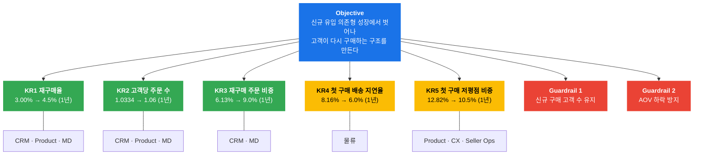
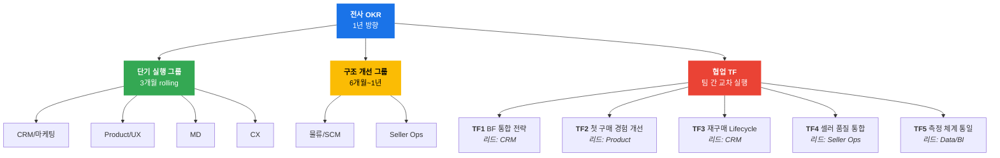
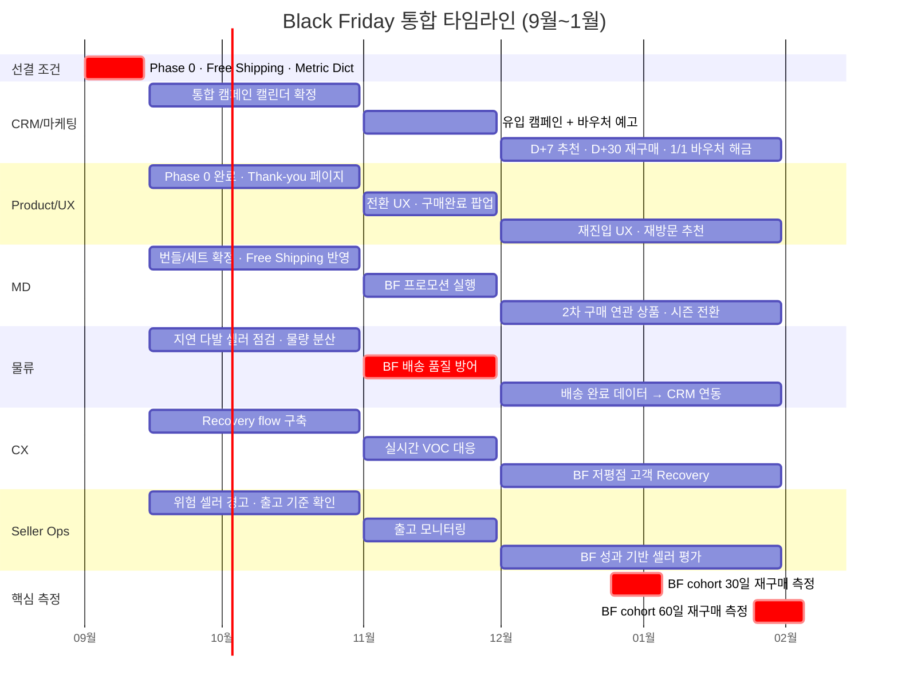
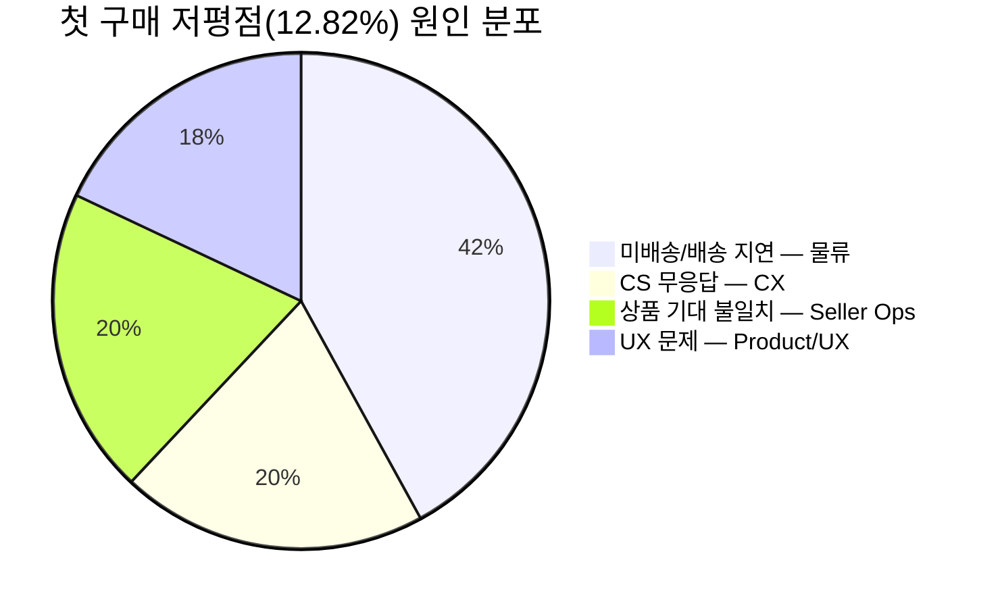
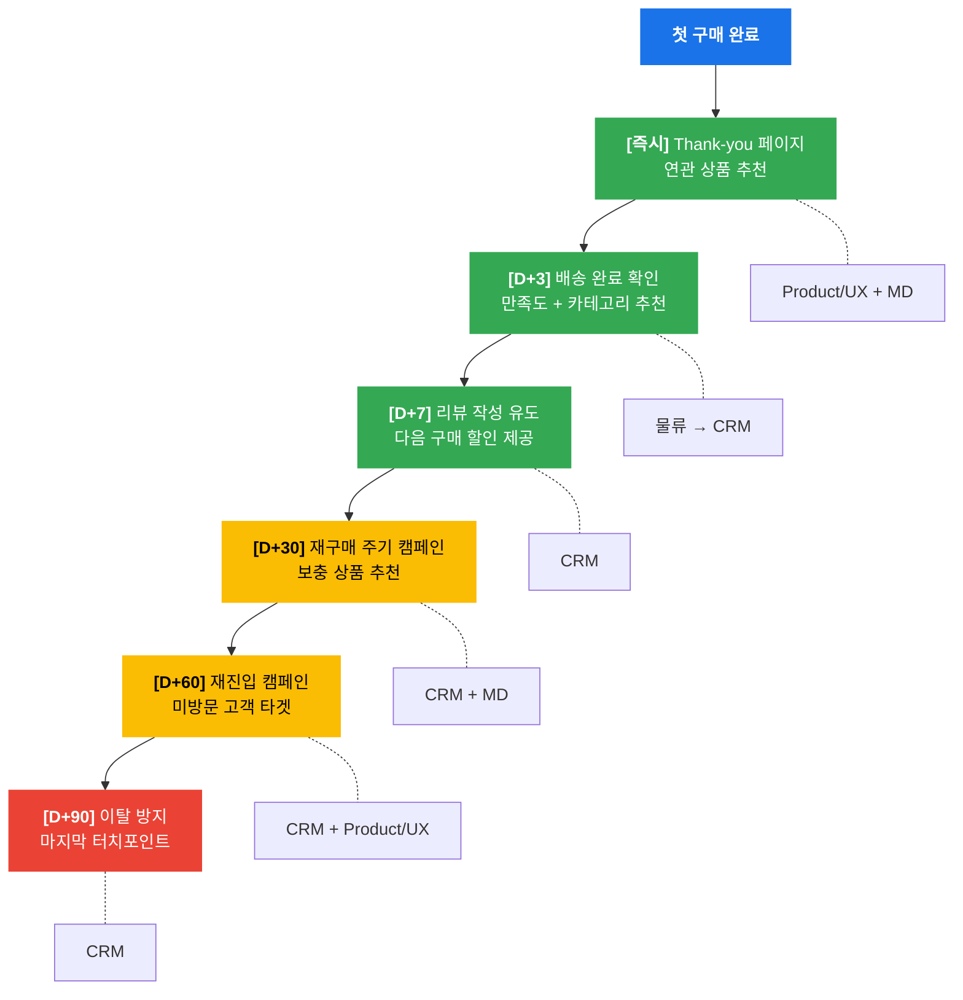
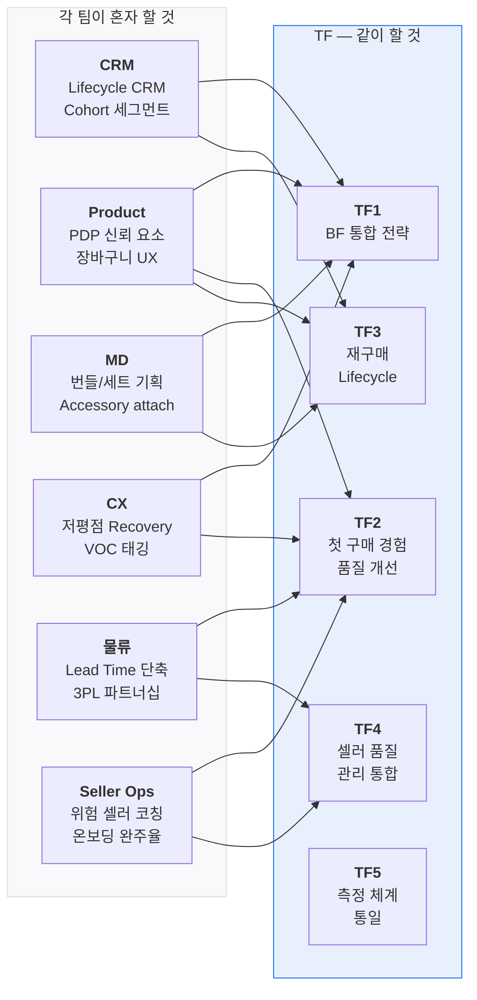

# Olist 전사 통합 OKR — 요약 시각화

> **작성일**: 2026-04-10  
> **상세 문서**: [integrated_okr_plan.md](integrated_okr_plan.md)

---

## 핵심 요약: 전사가 반드시 알아야 할 것

### 우리의 문제

Olist는 고객을 못 데려오는 회사가 아니다. **데려온 고객이 다시 오지 않는 구조**가 문제다.

| 지표 | 수치 | 의미 |
|------|------|------|
| 구매 고객 수 | 93,104명 | 유입은 충분하다 |
| 재구매 고객 수 | 2,789명 (3.00%) | **97%가 한 번 사고 떠난다** |
| 고객당 평균 주문 수 | 1.0334 | 거의 1회로 끝난다 |
| 재구매 주문 비중 | 6.13% | 매출의 94%가 일회성 고객에 의존 |

### 우리의 방향

**"신규 유입 의존형 성장에서 벗어나, 고객이 다시 구매하는 구조를 만든다"**

### 전사 공식 수치 — 모든 팀이 이 숫자를 쓴다

| 지표 | 현재 | 3개월 | 6개월 | 1년 |
|------|------|-------|-------|-----|
| 재구매율 | 3.00% | 3.5% | 4.0% | **4.5%** |
| 고객당 주문 수 | 1.0334 | - | 1.05 | **1.06** |
| 재구매 주문 비중 | 6.13% | 7.0% | 8.0% | **9.0%** |
| 첫 구매 배송 지연율 | 8.16% | 7.0% | 6.5% | **6.0%** |
| 첫 구매 저평점 비중 | 12.82% | 11.8% | 11.0% | **10.5%** |

> **원칙**: 팀별 문서에서 위와 다른 수치를 쓰고 있다면 즉시 수정한다.

### Black Friday는 매출 행사가 아니라 재구매 cohort 확보 행사다

BF에서 아무리 매출을 올려도, 그 고객이 12~1월에 다시 사지 않으면 전사 OKR에 기여하지 못한다.

### 재구매는 한 팀의 문제가 아니다

CRM이 메시지를 보내도, 물류가 지연되거나, 상품 품질이 낮거나, CX가 늦게 대응하면 재구매 구조는 만들어지지 않는다.  
따라서 **각 팀이 혼자 할 것**과 **같이 할 것(TF)**을 명확히 나눠서 움직인다.

---

## 1. 전사 OKR 구조도

> KR1~3(녹색)은 **재구매 성과 지표**, KR4~5(노란색)은 **선행 품질 지표**, G1~2(빨간색)은 **방어선**이다.

---

## 2. 팀 운영 구조

> **단기 실행**(녹색): 캠페인·UX·프로모션 등 빠른 피드백 가능  
> **구조 개선**(노란색): 인프라·제도 변경으로 시간 필요, 억지로 3개월에 맞추지 않음  
> **협업 TF**(빨간색): 여러 팀이 맞물려야 실행 가능한 과제

---

## 3. BF 3단계 타임라인

> **9월 첫 2주**(선결 조건)를 놓치면 전체 일정이 밀린다.  
> **12~1월**(사후)이 진짜 승부다 — BF cohort가 재구매로 이어지는지가 전사 OKR 기여의 본질.

---

## 4. 저평점 원인 비중 — 왜 한 팀이 못 고치는가

> Product/UX가 혼자 목표를 잡으면 18%만 통제 가능하다.  
> 나머지 82%는 물류·CX·Seller Ops가 함께 움직여야 한다 → **TF2 공동 OKR**

---

## 5. 재구매 Lifecycle Journey

> 녹색(D+0~7): **첫 경험 확보** 구간 — 여기서 실패하면 재구매 가능성 급락  
> 노란색(D+30~60): **재구매 유도** 구간 — 적극적 개입 필요  
> 빨간색(D+90): **이탈 방지** — 이 시점까지 안 오면 사실상 이탈

---

## 6. 혼자 할 것 vs 같이 할 것

> 왼쪽은 팀이 자기 영역 안에서 독립 추진. 오른쪽은 여러 팀이 맞물려야 실행 가능한 과제.  
> 화살표가 많은 팀(CRM, Product)이 TF에서 가장 많은 교차점을 갖는다.

---

> **상세 내용**: 각 팀별 독립 과제, TF별 설계 내용, 선결 조건, 수치 조정 사항은  
> [integrated_okr_plan.md](integrated_okr_plan.md)를 참고한다.
