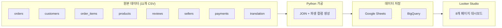
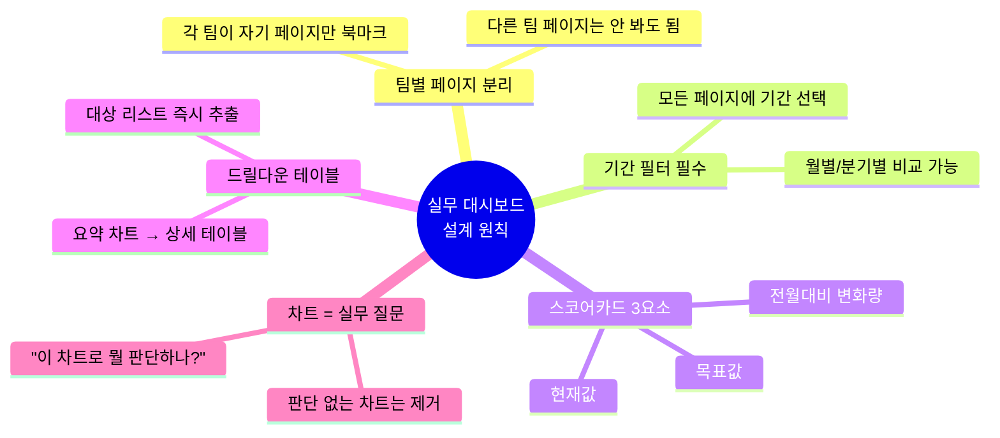
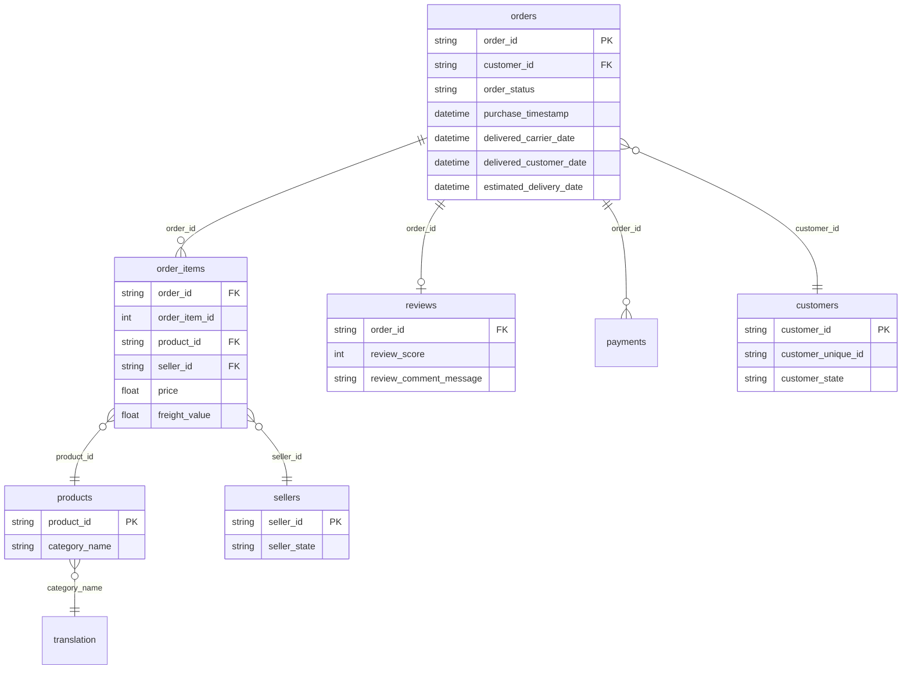
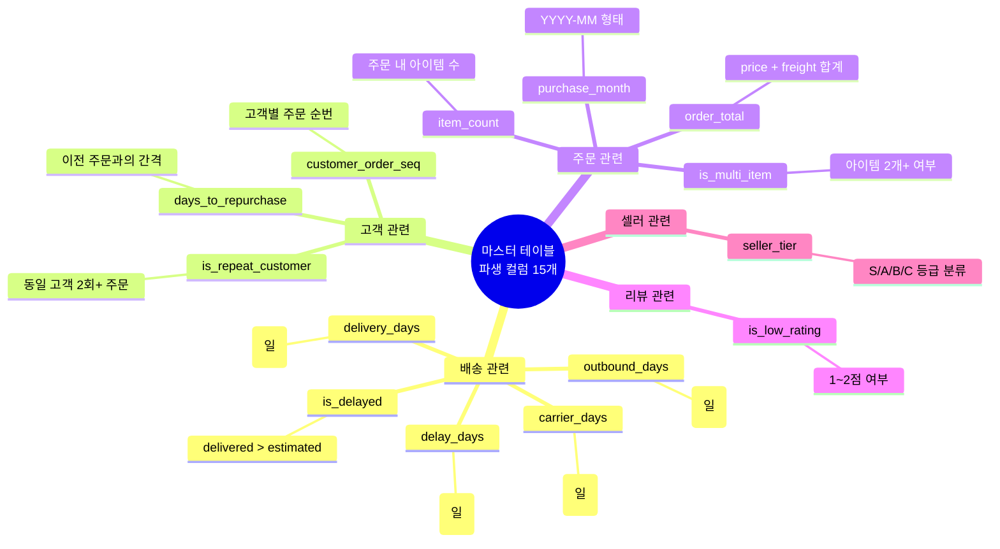
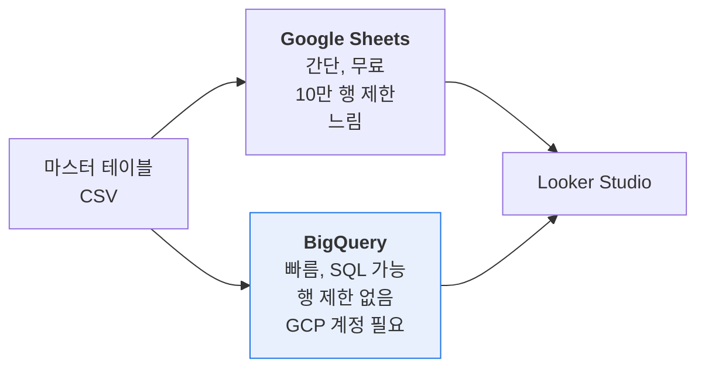
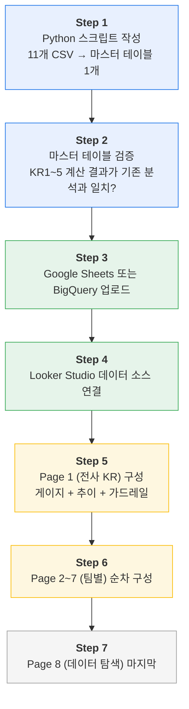

# Looker Studio 실무 대시보드 설계서

> 작성일: 2026-04-14
> 목적: 6개 팀이 각자 KR을 모니터링하고 의사결정에 활용하는 실무용 대시보드
> 참고: 발표용 자료는 별도 제작. 이 대시보드는 실무 모니터링 도구.

---

## 1. 전체 구조

### 1-1. 데이터 파이프라인



### 1-2. 대시보드 페이지 구조

| 페이지 | 이름 | 핵심 콘텐츠 | 담당 KR | 주 사용자 |
|--------|------|-----------|---------|----------|
| **P1** | 전사 KR 모니터링 | KR1~5 게이지 + 월별 추이 + 가드레일 | KR1~5 | PM, 팀 리드, 전체 회의 |
| P2 | Marketing | 코호트 리텐션 · 재구매 간격 · 카테고리 재구매율 | KR1, KR2, KR3 | CRM · 프로모션 담당 |
| P3 | MD | AOV · 다품목 · Co-purchase · 배송비 비중 | KR2, KR3, G2 | MD 기획자 |
| P4 | Logistics | 지연율 추이 · 출고/배송 분리 · 지연 셀러 TOP20 | KR4 | 물류 담당 |
| P5 | CX | 리뷰 분포 · 지연↔리뷰 상관 · VOC 테이블 | KR5 | CX 담당 |
| P6 | Seller Ops | 등급 분포 · GMV 파레토 · 지역 갭 | KR4, KR5 | 셀러 관리 담당 |
| P7 | Product/UX | 다품목↔재구매 검증 · 저평점 원인 분류 | KR5, KR3 | Product 담당 |
| P8 | 데이터 탐색 | 전체 필터 오픈 · 주문 테이블 자유 탐색 | — | 누구나 |

### 1-3. 팀 × KR 매핑 (어떤 팀이 어떤 페이지를 보는가)

| 팀 | KR1 재구매율 | KR2 주문수/인 | KR3 재구매비중 | KR4 배송지연율 | KR5 저평점비중 |
|----|:---:|:---:|:---:|:---:|:---:|
| Marketing | ●● | ● | ●● | — | — |
| MD | — | ●● | ●● | — | — |
| Logistics | — | — | — | ●● | — |
| CX | — | — | — | — | ●● |
| Seller Ops | — | — | — | ●● | ●● |
| Product/UX | — | — | ● | — | ●● |

> ●● = 직접 기여 (핵심 차트로 모니터링) / ● = 간접 기여

---

## 2. 설계 원칙



---

## 3. 페이지별 상세 설계

---

### Page 1: 전사 KR 모니터링

> **누가**: PM, 팀 리드 / **언제**: 매주·매월 정기 체크, 전체 회의 시

```
┌─ 필터 ──────────────────────────────────────────────────────────┐
│  기간: ____~____                          집계단위: 월별 ▼       │
├─────────────┬─────────────┬──────────────┬──────────┬──────────┤
│    KR1      │    KR2      │     KR3      │   KR4    │   KR5    │
│  재구매율   │  주문수/인   │  재구매비중  │ 배송지연율│저평점비중│
│ 3.00%→4.5% │ 1.03→1.06   │ 6.13%→9.0%  │8.16%→6.0%│12.82%→  │
│   달성 67%  │  달성 50%   │   달성 68%   │          │  10.5%   │
├─────────────┴─────────────┴──────────────┴──────────┴──────────┤
│           월별 KR 추이  (KR1~5 멀티라인 + 목표선 점선)           │
├──────────────────────────────────┬─────────────────────────────┤
│  G1 신규고객 추이  (라인)         │  G2 AOV 추이  (라인)        │
│  → 감소하면 경고                  │  → 하락 여부 확인           │
└──────────────────────────────────┴─────────────────────────────┘
```

| # | 차트 | 유형 | 계산 방법 | 실무 질문 |
|---|------|------|---------|----------|
| 1-1 | KR1 재구매율 | 게이지 | `customer_unique_id` 2회+ delivered / 전체 고객 | "목표 대비 어디까지 왔나?" |
| 1-2 | KR2 주문수/인 | 게이지 | delivered 주문 수 / `customer_unique_id` 수 | "고객당 주문 수가 늘고 있나?" |
| 1-3 | KR3 재구매비중 | 게이지 | 재구매 고객 주문 수 / 전체 delivered 주문 수 | "재구매 주문 비중은?" |
| 1-4 | KR4 배송지연율 | 게이지 | `delivered > estimated` 비율 | "배송 지연이 줄고 있나?" |
| 1-5 | KR5 저평점비중 | 게이지 | `review_score` 1~2점 / 전체 리뷰 | "저평점이 줄고 있나?" |
| 1-6 | 월별 KR 추이 | 멀티라인 | 월별 각 KR 값 | "트렌드: 개선/정체/악화?" |
| 1-7 | G1 신규고객 | 라인 | 월별 첫 구매 고객 수 | "재구매 올리다 신규가 깎이진 않나?" |
| 1-8 | G2 AOV | 라인 | 월별 `(price+freight)` / 주문 수 | "할인 때문에 AOV 떨어지진 않나?" |

---

### Page 2: Marketing — 재구매 & 코호트

> **누가**: CRM 담당, 프로모션 담당 / **언제**: 캠페인 설계 전, 성과 리뷰 시

```
┌─ 필터 ──────────────────────────────────────────────────────────┐
│  기간  │  카테고리  │  고객 세그먼트 (1회 / 2회+ / BF코호트)      │
├──────────────┬──────────────┬──────────────┬───────────────────┤
│  재구매율    │  재구매비중  │  재구매 고객수 │    전월대비 △      │
├──────────────┴──────────────┴──────────────┴───────────────────┤
│  코호트 리텐션 테이블                │  재구매 간격 분포          │
│  첫구매월 × 경과 N월 = 재구매율      │  히스토그램 (일 단위)      │
│  색상 진할수록 리텐션 높음           │  중앙값 29일 / D+7·D+30 선 │
│  → 어느 코호트가 잘 유지되나?        │  → 쿠폰 타이밍이 맞나?     │
├──────────────────────────────────────┼────────────────────────────┤
│  카테고리별 재구매율  (가로 막대)     │  월별 재구매율 추이 (라인) │
│  → 넛처링 타겟 카테고리는?           │  → 캠페인 효과가 나타나나? │
└──────────────────────────────────────┴────────────────────────────┘
```

| # | 차트 | 유형 | 계산 방법 | 실무 질문 |
|---|------|------|---------|----------|
| 2-1 | 코호트 리텐션 | 피벗 히트맵 | 첫 구매 월 × 경과 N월 후 재구매 여부 | "몇 월 유입 고객이 가장 잘 돌아오나?" |
| 2-2 | 재구매 간격 | 히스토그램 | 동일 고객 1차→2차 주문 날짜 차이 | "D+30 쿠폰이 맞는 타이밍인가?" |
| 2-3 | 카테고리 재구매율 | 가로 막대 | 카테고리별 2회+ 구매 고객 비율 | "어떤 카테고리 구매자에게 넛처링?" |
| 2-4 | 월별 재구매율 | 라인 | 월별 재구매율 + 전월대비 | "캠페인 효과가 나타나고 있는가?" |

---

### Page 3: MD — AOV & 카테고리 성과

> **누가**: MD 기획자 / **언제**: 번들 기획 시, 카테고리 성과 리뷰 시

```
┌─ 필터 ──────────────────────────────────────────────────────────┐
│  기간  │  카테고리  │  지역                                       │
├──────────────┬──────────────┬──────────────┬───────────────────┤
│    AOV       │  다품목 비중  │  주문당 상품수 │    전월대비 △      │
├──────────────────────────────┬──────────────────────────────────┤
│  구매 수량별 AOV  (막대 비교)  │  월별 AOV + 다품목비중 (듀얼 축)  │
│  1개: 150 / 2개: 211 (+41%)  │  → 두 지표가 함께 움직이는가?     │
│  3개+: 371 (+147%)           │                                  │
│  → 번들이 AOV를 올리는가?     │                                  │
├──────────────────────────────┼──────────────────────────────────┤
│  카테고리 성과 테이블           │  Co-purchase 매트릭스 (히트맵)   │
│  GMV · AOV · 주문수 · 재구매율 │  카테고리 × 카테고리 조합 빈도   │
│  → 프로모션 예산을 어디에?      │  → 번들 조합을 뭘로?             │
├──────────────────────────────┴──────────────────────────────────┤
│  배송비 비중 분포  (히스토그램)  freight / total 비율             │
│  → 무료배송 threshold 얼마로?                                    │
└─────────────────────────────────────────────────────────────────┘
```

| # | 차트 | 유형 | 계산 방법 | 실무 질문 |
|---|------|------|---------|----------|
| 3-1 | 수량별 AOV | 막대 비교 | item_count별 `price+freight` 합계 평균 | "번들이 실제로 AOV를 올리는가?" |
| 3-2 | AOV+다품목 추이 | 듀얼 축 라인 | 월별 AOV / 월별 다품목 비율 | "AOV와 다품목이 함께 움직이는가?" |
| 3-3 | 카테고리 성과 | 테이블 (정렬) | 카테고리별 GMV, AOV, 주문수, 재구매율 | "프로모션 예산을 어디에 쓸까?" |
| 3-4 | Co-purchase | 히트맵 | 동일 주문 내 다른 카테고리 조합 빈도 | "어떤 조합으로 번들을 만들까?" |
| 3-5 | 배송비 비중 | 히스토그램 | `freight / (price+freight)` | "threshold를 얼마로 잡아야 하나?" |

---

### Page 4: Logistics — 배송 품질

> **누가**: 물류 담당 / **언제**: 매주 배송 성과 체크, BF 준비 시
> **기준 문서**: `logistics_v2.md` (2017 BF 실측 데이터 반영)

```
┌─ 필터 ──────────────────────────────────────────────────────────┐
│  기간  │  주(州)  │  카테고리  │  셀러                           │
├──────────────┬──────────────┬────────────────┬─────────────────┤
│   지연율     │  평균배송일  │  심각지연 7일+  │    전월대비 △   │
├──────────────────────────────┬──────────────────────────────────┤
│  월별 배송 지연율 추이 (라인)  │  주(州)별 지연율 랭킹 (가로 막대) │
│  목표선 6.0% 포함             │  내림차순 / RJ 13.5% 강조        │
│  → 개선 트렌드인가?           │  → 어디가 가장 심각한가?          │
├──────────────────────────────┼──────────────────────────────────┤
│  출고 vs 배송 리드타임 (누적막대)│  배송 소요일 분포 (히스토그램)  │
│  셀러 귀책 / 캐리어 귀책 분리  │  7일 초과 빨간 강조              │
│  → 셀러 교육? 캐리어 변경?    │  → 심각 지연 비중은?             │
├──────────────────────────────┬──────────────────────────────────┤
│  카테고리별 지연율 TOP15       │  지연 셀러 TOP20 테이블          │
│  가로 막대 / health_beauty    │  셀러ID · 주문수 · 지연율        │
│  9.06% 등 상위 카테고리 강조   │  평균배송일 · 리뷰점수 · 지역    │
│  → 어떤 카테고리 우선 관리?    │  → 경고 보낼 셀러는 누구?        │
└──────────────────────────────┴──────────────────────────────────┘
```

| # | 차트 | 유형 | 계산 방법 | 실무 질문 |
|---|------|------|---------|----------|
| 4-1 | 월별 지연율 | 라인 | 월별 `delivered > estimated` 비율 | "개선 트렌드인가?" |
| 4-2 | 주별 지연율 | 가로 막대 | `customer_state`별 지연 비율 | "어디가 가장 심각한가?" |
| 4-3 | 출고 vs 배송 | 누적 막대 | `purchase→carrier` vs `carrier→delivered` | "셀러 교육이 먼저? 캐리어 변경이 먼저?" |
| 4-4 | 소요일 분포 | 히스토그램 | `delivered - purchase` (일) | "심각 지연(7일+) 비중은?" |
| 4-5 | 카테고리별 지연율 | 가로 막대 | 카테고리별 `delivered > estimated` 비율 TOP15 | "어떤 카테고리 셀러를 우선 교육?" |
| 4-6 | 지연 셀러 TOP20 | 테이블 | 셀러별 지연율 내림차순 (10건+) | "경고 보낼 셀러는 누구?" |

---

### Page 5: CX — 리뷰 & VOC

> **누가**: CX 담당 / **언제**: VOC 분석 시, 저평점 대응 대상 선정 시

```
┌─ 필터 ──────────────────────────────────────────────────────────┐
│  기간  │  리뷰점수  │  카테고리  │  지연여부                      │
├──────────────┬──────────────┬──────────────┬───────────────────┤
│  평균 리뷰   │  저평점 비중  │   1점 비율   │    전월대비 △      │
├──────────────────────────────┬──────────────────────────────────┤
│  리뷰 점수 분포 1~5 (막대)    │  월별 평균 리뷰 추이 (라인 2개)  │
│  1~2점 빨간 강조              │  정시 4.3점 vs 지연 2.5점        │
│  → 저평점 분포 모양은?         │  → 리뷰가 개선되고 있는가?       │
├──────────────────────────────┼──────────────────────────────────┤
│  카테고리별 저평점 TOP15       │  지연 여부별 리뷰 비교 (막대)    │
│  가로 막대                    │  정시: 4.3 / 지연: 2.5           │
│  → 어떤 카테고리 셀러에게 경고?│  → 지연이 리뷰에 얼마나 영향?   │
├──────────────────────────────┴──────────────────────────────────┤
│  1~2점 리뷰 목록 테이블                                          │
│  주문ID · 카테고리 · 점수 · 지연여부 · 리뷰 텍스트               │
│  → 48시간 내 대응할 케이스는?                                    │
└─────────────────────────────────────────────────────────────────┘
```

| # | 차트 | 유형 | 계산 방법 | 실무 질문 |
|---|------|------|---------|----------|
| 5-1 | 리뷰 분포 | 막대 | `review_score` 1~5점 빈도 | "저평점 분포가 어떤 모양?" |
| 5-2 | 월별 리뷰 추이 | 라인 (2개) | 정시/지연 그룹별 월별 평균 | "리뷰가 개선되고 있는가?" |
| 5-3 | 카테고리 저평점 | 가로 막대 | 카테고리별 1~2점 비율 | "어떤 카테고리 셀러에게 경고?" |
| 5-4 | 지연 vs 리뷰 | 막대 비교 | 지연 Y/N별 평균 `review_score` | "지연이 리뷰에 얼마나 영향?" |
| 5-5 | 저평점 테이블 | 테이블 | 1~2점 최신순 | "지금 대응할 케이스는?" |

---

### Page 6: Seller Ops — 셀러 성과

> **누가**: 셀러 관리 담당 / **언제**: 분기 등급 산정, 교육 대상 선정, 북동부 모니터링
> **기준 문서**: `seller_ops.md` (KR1~KR6 기준)

```
┌─ 필터 ──────────────────────────────────────────────────────────┐
│  기간  │  셀러 등급 (S/A/B/C)  │  지역  │  카테고리              │
├──────┬──────────┬────────────┬──────────────┬───────────────────┤
│활성셀러│휴면비중  │온보딩 완주율 │첫판매 소요일  │    전월대비 △      │
│  수  │ 39.2%↓  │44.7%→65%목표│ 44일→25일목표│                   │
├──────────────────────────────┬──────────────────────────────────┤
│  셀러 등급 분포 (도넛)         │  셀러 지역 vs 고객 지역 (이중막대)│
│  S/A/B/C 인원수 · 비중        │  셀러 1.3% vs 고객 9.2% (북동부) │
│  → 등급 분포가 어떤가?         │  → 북동부 유치 진행 상황?        │
├──────────────────────────────┼──────────────────────────────────┤
│  GMV 파레토 (누적 라인)        │  리뷰 vs 지연율 산점도           │
│  상위 20% → GMV 80%           │  X: 지연율 / Y: 리뷰 / 색상: 등급│
│  → 상위 셀러 의존도?           │  → 지연↓ = 리뷰↑ 상관?          │
├──────────────────────────────┬──────────────────────────────────┤
│  온보딩 퍼널 (막대)            │  셀러 성과 테이블                │
│  가입→첫등록→첫판매 완주율     │  셀러ID · 등급 · GMV · 주문수    │
│  완주율 44.7% → 목표 65%      │  지연율 · 리뷰점수 · 첫판매소요일│
│  → 어느 단계에서 이탈하나?     │  → C등급 경고 대상 리스트        │
└──────────────────────────────┴──────────────────────────────────┘
```

| # | 차트 | 유형 | 계산 방법 | 실무 질문 |
|---|------|------|---------|----------|
| 6-1 | 등급 분포 | 도넛/누적막대 | 지연율+리뷰 기준 S/A/B/C 분류 | "등급 분포가 어떤가?" |
| 6-2 | 지역 갭 | 이중 막대 | 주별 셀러 비중 vs 고객 비중 | "북동부 유치 진행 상황?" |
| 6-3 | GMV 파레토 | 파레토 | 셀러별 GMV 내림차순 누적 | "상위 셀러 의존도?" |
| 6-4 | 리뷰 vs 지연 | 산점도 | X: 지연율, Y: 리뷰, 색상: 등급 | "지연↓ = 리뷰↑ 상관?" |
| 6-5 | 온보딩 퍼널 | 막대 (단계별) | 가입→첫상품등록→첫판매 단계별 완주 셀러 수 | "어느 단계에서 이탈하나?" |
| 6-6 | 셀러 테이블 | 테이블 | 셀러별 집계 + 첫판매 소요일 포함 (정렬) | "경고 보낼 셀러 / 온보딩 지원 대상?" |

---

### Page 7: Product/UX — 전환율 & UX 품질

> **누가**: Product 담당 / **언제**: KR-P3 검증, UX 귀책 저평점 모니터링

```
┌─ 필터 ──────────────────────────────────────────────────────────┐
│  기간  │  카테고리  │  주문 유형 (단품 / 다품목)                  │
├──────────────┬──────────────┬──────────────┬───────────────────┤
│  다품목 비중  │다품목 재구매율│ 단품 재구매율  │    두 값의 차이    │
├──────────────────────────────┬──────────────────────────────────┤
│  다품목 vs 단품 비교 (그룹막대)│  월별 다품목 비중 추이 (라인)    │
│  AOV / 재구매율 / 리뷰점수    │  목표선 12% 포함                 │
│  → 다품목이 재구매에 기여?    │  → Basket UX 효과 나타나는가?    │
├──────────────────────────────┴──────────────────────────────────┤
│  저평점 원인 분류 (도넛 차트)                                    │
│  배송 42% · CS 20% · 상품 20% · UX 18%                         │
│  → Product 단독 개선 범위 = 18%                                 │
└─────────────────────────────────────────────────────────────────┘
```

| # | 차트 | 유형 | 계산 방법 | 실무 질문 |
|---|------|------|---------|----------|
| 7-1 | 다품목 vs 단품 | 그룹 막대 | 아이템 2개+ vs 1개별 AOV/재구매율/리뷰 | "다품목이 재구매에 기여?" |
| 7-2 | 다품목 추이 | 라인 | 월별 다품목 주문 / 전체 주문 | "Basket UX 효과 나타나는가?" |
| 7-3 | 저평점 원인 | 파이/도넛 | CX 리뷰 텍스트 분류 기반 | "Product가 개선할 범위는?" |

---

### Page 8: 데이터 탐색

> **누가**: 누구나 / **언제**: "이 조건의 데이터만 보고 싶을 때" ad-hoc 탐색

```
┌─ 필터 (전체 오픈) ──────────────────────────────────────────────┐
│  기간  │  카테고리  │  지역  │  셀러  │  결제수단               │
│  리뷰점수  │  지연여부  │  셀러등급                            │
├──────────┬──────────┬──────────┬──────────┬───────────────────┤
│  주문수  │  고객수  │   AOV    │  지연율  │    평균 리뷰        │
├──────────┴──────────┴──────────┴──────────┴───────────────────┤
│  전체 주문 테이블  (필터·정렬·검색 가능)                        │
│  주문ID · 주문일 · 고객지역 · 카테고리 · 금액 · 배송비          │
│  배송소요일 · 지연여부 · 리뷰점수 · 셀러지역 · 셀러등급         │
│  예) RJ + bed_bath_table + 지연=Y 주문만 보기                  │
└─────────────────────────────────────────────────────────────────┘
```

---

## 4. 마스터 테이블 설계

### 4-1. JOIN 구조



### 4-2. 파생 컬럼



### 4-3. 데이터 연결 방식



> 마스터 테이블 예상: ~99,000행 (주문 레벨). Google Sheets 한계에 근접하므로 **BigQuery 추천**.

---

## 5. 작업 순서


