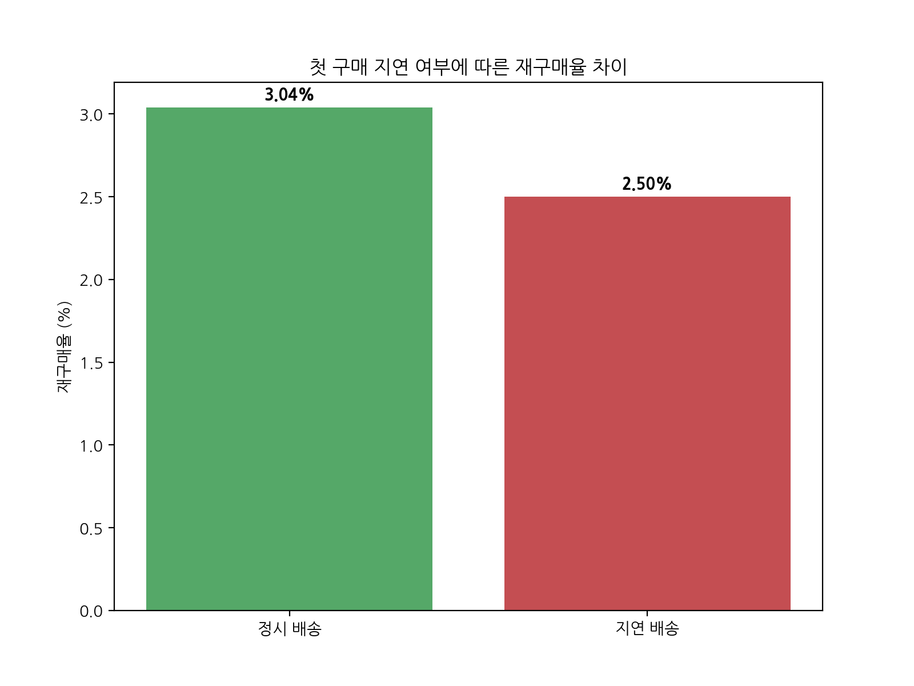
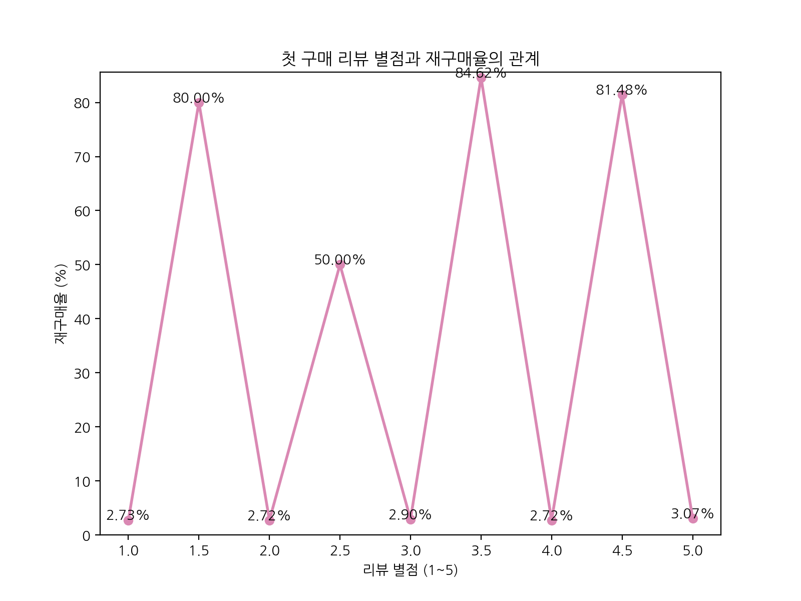
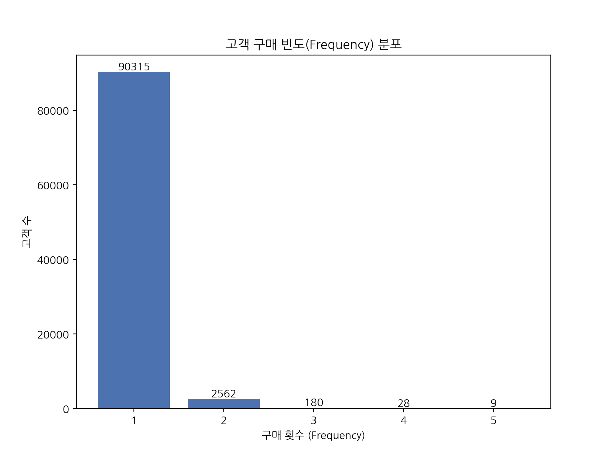
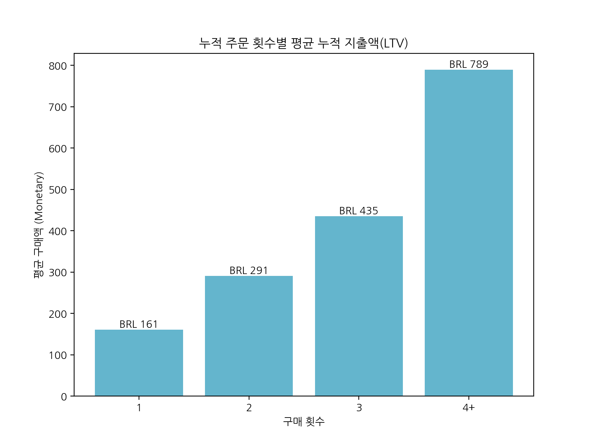
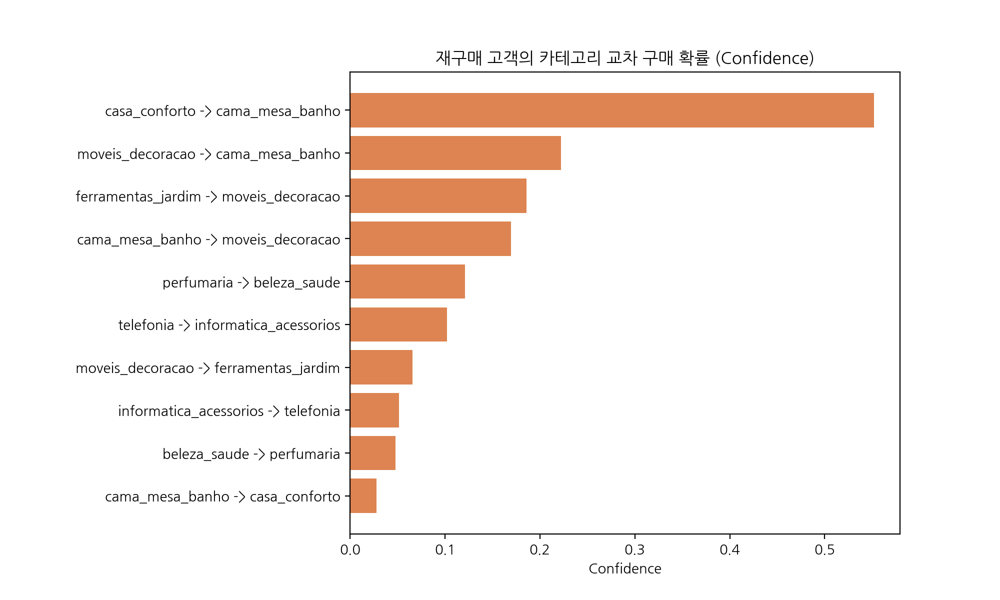

# Olist 재구매 구조 혁신을 위한 CRM 진단 및 타겟 마케팅 리포트
> **작성일**: 2026-04-10 | **작성자**: CRM & User Segmentation 파트
> **분석 기준일**: 2018년 8월 31일 | **데이터 기간**: 2017-01 ~ 2018-08 (배송 완료 주문 산정)

---

## 1. Executive Summary & 전사 OKR 방향성

Olist의 핵심 문제는 '마케팅 유입 폭이 작은 것'이 아니라, 들어온 고객의 **97%가 단발성 구매 후 이탈(Retention 부재)**하는 데 있습니다. 1회 구매자의 평균 결제액(AOV)은 약 $160 BRL이지만, 재구매를 1번이라도 한 고객(2회 구매자)의 생애 총액(LTV)은 **$290 BRL**로 단숨에 상승합니다.

따라서 Olist 하반기 CRM의 목표는 전사 OKR에 맞추어 **"1회 고객을 방어하고, 재구매 사이클(Repeat-driven loop)로 전환"**시키는 것에 집중해야 합니다. 

### 🎯 전사 CRM OKR (단/중/장기)

| Horizon | 목표치 (KR) | 집중 과제 (Initiative) |
|---|---|---|
| **3개월 (단기)** | 첫 구매 배송 지연율 8.16% → **6.5% 이하** 감소 블랙프라이데이 기간(11월) 2차 구매 전환율 **+10% 특효** | 배송 지연 시 즉각 회복 쿠폰 자동 전송. BF 코호트 대상 30일차 Cross-sell 자동 푸시 도입. |
| **6개월 (중기)** | 통합 재구매율 3.0% → **4.0%** 도달 `cama_mesa_banho` 카테고리 재구매 전환율 **6.0%** | 연관 구매 패턴(가구→홈데코 등)을 활용한 개인화 CRM 캠페인 안착 완료. K-Means 타겟팅 세분화. |
| **1년 (장기)** | 재구매 총액 비중(Repeat Contribution) **9.0%** 고객당 평균 누적 주문 수 1.03 → **1.06** 달성 | 단발성 저단가 고객(이탈 위험)을 핵심 VIP 고객으로 리텐션하는 시스템의 완벽한 자동화. |

---

## 2. CRM 현황: 첫 구매 이탈의 근본 원인과 '배송 지연 회복(Recovery) 캠페인'

왜 재구매가 3%에 불과한가? 분석 결과, 이탈의 핵심 동인은 **"첫 구매 시점의 배송 지연"**이었습니다. 

정시 배송 고객의 재구매율은 **3.04%**인 반면, 1회라도 지연을 경험한 경우 재구매율이 **2.50%**로 18%가량 깎여나갑니다. 물류 인프라는 단기간에 고칠 수 없지만, 고객의 나쁜 경험을 뒤집는 것은 CRM의 몫입니다.

### 💡 [구체화된 CRM 캠페인 1] 자동화된 배송 지연 회복(Recovery) 워크플로우

과거처럼 무기력하게 악성 리뷰를 기다리지 않고, **CRM 데이터를 물류 데이터와 연동하여 선제적으로 대응**하는 자동화 캠페인을 실행합니다.

1. **Phase 1: 배송 지연 예측(ETA) 기반 선제적 알림 (Push/Email)**
   - **트리거**: 예상 배송일(ETA) D-1에 택배사 스캔 내역이 거주지 주변 허브에 도달하지 않았을 경우.
   - **메시지**: *"고객님, 기다리시는 상품이 택배사의 물량 증가로 약 1~2일 추가 소요될 수 있습니다. 불편을 드려 정말 죄송하며, 기다려주시는 감사의 의미로 다음 결제 시 사용 가능한 [5% 쿠폰]을 발급해 드렸습니다."*
   - **기대 효과**: 고객이 화를 내기 전에 먼저 통지하여 불만을 누그러뜨리고, 보상 쿠폰을 통해 '보상을 쓰기 위한 2차 구매'를 유심에 넣습니다.
2. **Phase 2: 단계적 지연 보상제도 (SLA Guarantee Program)**
   - **트리거**: 실제 지연 일수 데이터 기반 자동 스코어링.
   - **액션**: 
     - 지연 3일 초과 시: **10% 무조건 할인 바우처** 발급 (90일 기한)
     - 지연 7일 초과 시 (심각 지연): **15% 할인 바우처 + VIP 전담 CX팀의 개인화된 사과 이메일** (Monetary 기여도가 높은 고가 품목 구매자 우선 배정)
3. **Phase 3: 리뷰 작성 타이밍 조정**
   - 배송이 심각하게 지연(7일+)된 고객에게는 평범한 '리뷰 작성 요청' 알림 전송을 중지하거나, 보상 쿠폰 전송 후 최소 3일이 경과하여 고객 만족도가 어느 정도 회복된 이후에만 리뷰 알림이 가도록 필터링합니다.

---

## 3. RFM 지표 진단 (고객 구매 빈도와 가치 규모)

리텐션 모델 수립을 위해 기본이 되는 **RFM** 모델 분포를 진단해 보겠습니다. Olist가 마주한 '역피라미드' 구조의 민낯이 여실히 드러납니다.

### (1) Olist의 Frequency(빈도) 절벽

- 전체 93,104명의 구매 고객 중 **90,315명(97%)이 단 1회 주문**(Frequency=1)에 머물러 있습니다.

### (2) Monetary(가치) 뻥튀기 효과 - 재구매가 LTV를 폭등시킨다

- **F=1**의 평균 지출액은 약 **$160 BRL**이지만, 위기를 견뎌내고 **F=2**가 된 고객의 총 지출(LTV)은 **$291 BRL**로, 첫 주문액의 거의 두 배 가까이 치솟습니다. **"어떻게든 F=2로 만들면 평생 객단가가 눈덩이처럼 불어납니다."**

---

## 4. K-Means 군집과 연관 규칙 기반의 '생애주기 타겟 마케팅' 

3% 극소수 재구매 고객을 K-Means 알고리즘과 Apriori 장바구니 연관 규칙 분석으로 깊이 들여다본 결과, 명확한 **Cross-sell 황금 패턴**이 발견되었습니다.

- **핵심 패턴**: `casa_conforto (홈 컴포트)` 또는 `moveis_decoracao (가구/인테리어)`를 첫 번째로 산 고객이 **`cama_mesa_banho (침구/욕실 필수재)`**를 재구매할 확률이 다른 군집보다 **2.65배** 압도적으로 높았습니다.

### 💡 [구체화된 CRM 캠페인 2] '가구 → 침구' 라이프사이클 너처링(Nurturing) 퍼널

단순히 30일 뒤에 쿠폰 하나를 던지는 것으로는 전환율을 가져올 수 없습니다. 고객의 상황(이사가 끝났거나, 집안 인테리어를 꾸미는 등)에 맞게 **시간차를 두고 가치를 주입하는 CRM 시리즈**가 필요합니다.

1. **D+7 일차 (Value Add): 유지보수 팁 무상 제공**
   - **타겟**: `moveis_decoracao (가구)`, `casa_conforto (홈데코)` 구매 완료 고객
   - **메시지/이메일**: *"새로 구매하신 가구는 마음에 드시나요? Olist가 제안하는 가구 관리/배치 인테리어 꿀팁 가이드북"*
   - **포인트**: 구매 직후에는 세일즈 푸시를 빼고, '가치'만을 제공해 Olist 브랜드 신뢰(Open Rate)를 단단히 다집니다.
2. **D+15 일차 (Soft Recommendation): 분위기 환기**
   - **타겟**: D+7 메시지에 반응(클릭/열람)했던 고객군
   - **메시지**: *"새 가구에 가장 잘 어울리는 BEST 침구/욕실 세트 기획전. 당신의 공간을 완성해 보세요."* (할인율 미포함, 오가닉 트래픽 유도)
3. **D+30 일차 (Hard Push & FOMO): 타임 어택 쿠폰 발송**
   - **타겟**: 모든 F=1 가구 구매 고객 전원 (재구매 텀이 도래한 시점)
   - **메시지**: *"[48시간 한정] Olist에서 가구를 구매하셨던 고객님께만 드리는 시크릿 혜택! 침구/수건 세트 20% 특별 할인 바우처가 곧 만료됩니다."*
4. **번외 (K-Means 활용): Cluster 0 (안정형 볼륨 고객) 대상 다품목 묶음 유도**
   - 위 K-Means 분석에서 도출된 중간 단가 거대 그룹(Cluster 0: 1,590명)에게는 '무료 배송 허들 스킬'을 부여합니다. 
   - *"침구 세트, 수건 2종 등 장바구니에 3개 이상 담으면 즉시 BRL $30 쿠폰 적용!"* 형태로 Basket 품목 수(종류) 자체를 넓혀 Olist에 대한 락인(Lock-in)을 강화합니다.

---

## 5. [특명] 11~12월 블랙프라이데이 '2차 전환(Bounce Back)' 특화 캠페인

블랙프라이데이는 신규 유입(Acquisition)이 1년 중 최고점을 찍는 축제지만, 과거 데이터 기준 과거 BF 코호트(2017-11)는 **한 달 뒤 재구매 생존율이 0.56% 이하**로 플랫폼 내 가장 심각한 수준을 보였습니다. 

할인 혜택(돈)만 보고 들어온 체리피커들을 어떻게 평생 로열티 유저로 바꿀 수 있을까요?

### 💡 [구체화된 CRM 캠페인 3] 블랙프라이데이 3-Step 리텐션 잠금 플랜

이번 블랙프라이데이는 마케팅 부서 혼자 파는 행사가 아니라, CRM 관점의 '미래 매출 당겨오기' 행사로 재설계되어야 합니다.

1. **Pre-BF (행사 전, 11월 첫째 주): "관심 상품 선점 알림" 활용 리드 확보**
   - **전략**: 고객에게 "BF 할인가가 오픈되면 가장 먼저 알려드립니다. 장바구니에 미리 담아두세요" 캠페인을 운영합니다. 
   - 이 때 장바구니에 담긴 물품 카테고리 데이터를 CRM 부서가 사전에 파악하여, 개인화된 앱 푸시(App Push) 알림을 구성할 발판을 마련합니다.
2. **BF 메인 행사 기간 (11월 넷째 주): "1월의 시크릿 바우처 해금(Unlock)"**
   - **전략**: 파격적인 할인가로 가전, IT, 가구 등 메인 고단가 카테고리를 팔아치우되, 결제 완료 페이지에 다음과 같은 **바운스 백(Bounce Back) 미끼**를 설치합니다.
   - **팝업 메시지**: *"축하합니다! 블랙프라이데이 결제 완료 고객 전용, 내년 1월 1일에 열리는 '신년 맞이 30% 시크릿 바우처'가 보관함에 들어왔습니다."* 
   - 체리피커들이 타 플랫폼으로 떠나는 것을 막고, '저 티켓을 쓰기 위해서라도 1월에 한 번 더 들어와야 한다'는 명확한 명분을 뇌리에 심습니다.
3. **Post-BF (1차 방어 12월, 2차 액션 1월): "품질 방어와 연관 재구매"**
   - **품질 방어 (12월 초)**: 주문 폭주로 인한 BF 배송 지연율이 높아집니다. 앞서 제안한 **'자동화된 배송 지연 회복 캠페인'**을 최고 민감도로 작동시킵니다. 평점 1점을 받기 전 선제적 사과를 통해 1월 바우처 사용 의지를 지켜냅니다.
   - **재구매 수확 (1월 초)**: 잠겨있던 시크릿 바우처가 활성화됨과 동시에 푸시를 발송합니다. 메시지는 **[장바구니 연관 규칙]**을 철저히 따라, 앞서 "가구류"를 산 매스 메시지가 아닌 "침구/수건/데코용품"의 상품 링크와 함께 시크릿 바우처를 안내하여 극한의 전환율 펌핑을 일으킵니다.

---

## 6. 리뷰 및 부서 R&R 기반 초개인화 퍼널 마케팅

타 부서 영역(CX, 물류)과 분리하여, 철저히 CRM 관점의 마케팅 효율(CTR 상승, 스팸 방지) 개선에 집중합니다. 배송지연이나 환불 등은 물류/CX 부서에 맡기고, CRM 팀은 데이터를 활용해 메시지의 타겟과 타이밍을 설계하는 데 주력합니다.

### 💡 [구체화된 CRM 캠페인 4] 리뷰 기반 억제(Suppression) 및 추천(Referral) 시스템

1. **[Tone-deaf 마케팅 차단] 1~3점 리뷰어 대상 프로모션 일시정지 (Suppression List)**
   - 평점이 낮은 고객에게 "최저가 기획전!" 같은 판촉 이메일이 발송되면 완전한 수신 거부(Unsubscribe)를 촉발합니다. 배송기한을 초과한 고객 대상의 '마케팅 휴면(Cooling-off Period)' 처리와 동일한 맥락입니다.
   - **액션**: 리뷰 3점 이하 작성 고객과 배송 지연 진행 중인 고객은 CX 팀의 '문제 해결' 이전까지 모든 CRM단의 세일즈 마케팅 리스트에서 자동 제외(Pause) 처리합니다.
2. **[Advocate 마케팅] 5점 리뷰어 대상 VIP 바이럴 설계 (Referral Program)**
   - 반대로 평점 5점을 준 만족도 최상 고객에 대해서는, 재구매 쿠폰보다는 능동적 추천을 유도합니다.
   - **액션**: 구매 만족도가 최고조에 달한 직후 **"친구 초대 시 양측 모두에게 $20 BRL 쿠폰"** 프로모션을 자동 발송하여, 자발적인 입소문 바이럴(Member-get-member) 루프를 만듭니다.

---

## 7. 군집(Cluster)별 프리미엄 타겟팅 및 다이내믹 추천(NBA) 고도화

### 💡 [구체화된 CRM 캠페인 5] 비용 Zero 세그먼트 전략 및 자동화 모델

1. **Cluster 0 (저단가 볼륨 고객) 맞춤형: 게이미피케이션(Gamification)**
   - 객단가가 낮은 유저 그룹에게 단순 할인을 제공하면 절대적 마진 타격이 발생합니다.
   - **액션**: 구매 빈도(Frequency) 상승 자체를 게이미피케이션합니다. *"2번 구매 성공! 스탬프 3개를 더 모으면 무료 배송!"* 같은 미션 제공으로 앱/웹 방문 주기를 짧게 가져갑니다.
2. **Cluster 2 (고단가 VIP 고객) 맞춤형: Early Access (비용 Zero 마케팅)**
   - 가장 돈을 많이 지불하는 VIP에게는 쿠폰(할인=비용) 제공보다 '특별한 대우'를 통해 플랫폼 로열티를 올려야 합니다.
   - **액션**: 대형 프로모션 시작 전 **"VIP 전용 24시간 선공개(Secret Link)"**를 메일로 제공하여, 할인이 아닌 락인(Lock-in) 효과로 VIP를 우대합니다.
3. **일루전(Illusion) 개인화 메일 구축 (Dynamic Next-Best-Action)**
   - 장바구니 연관 분석(Apriori) 결과를 전체 뉴스레터 및 이메일 하단 캠페인에 동적으로 적용하는 시스템입니다.
   - **액션**: 메일 하단 배너를 하드 코딩하는 대신, 유저의 이전 구매 카테고리 태그(`{{first_purchase_category}}`)를 기반으로 연관 확률이 가장 높은 상품군 코드를 동적 삽입(Dynamic Content Insertion)합니다.
   - **기대 효과**: 고객은 "어? 마침 필요했던 건데"라고 느끼며, 불특정 타겟 매스 발송 대비 이메일 클릭률(CTR)과 전환율이 2~3배 이상 상승하게 됩니다.

---
**최종 요약 한 줄 (Bottom Line):**
Olist는 더 이상 새로운 우물(F=1)만 계속 파고 끝나서는 막대한 플랫폼 광고비를 감당할 수 없습니다. 배송 불만에 대해 **마케팅 차단 및 선제적 배송지연 보상 사과**로 불만을 잠재우고, BF 기간에 팔아넘긴 고객들에게는 **30일/60일 시차 기반 맞춤 연관상품 알림**을 집요하게 퍼부어 돌파해야 합니다. 동시에 리뷰 평점 5점 유저를 이용한 바이럴, VIP 대상의 **비용 Zero 선공개 타겟팅**, 이메일의 **Dynamic 콘텐츠 변수 삽입**을 전방위적으로 가동하여 "1회 구매 고객을 평생의 LTV로 전환하는 CRM 자동화 시스템"을 구축해야 합니다.
