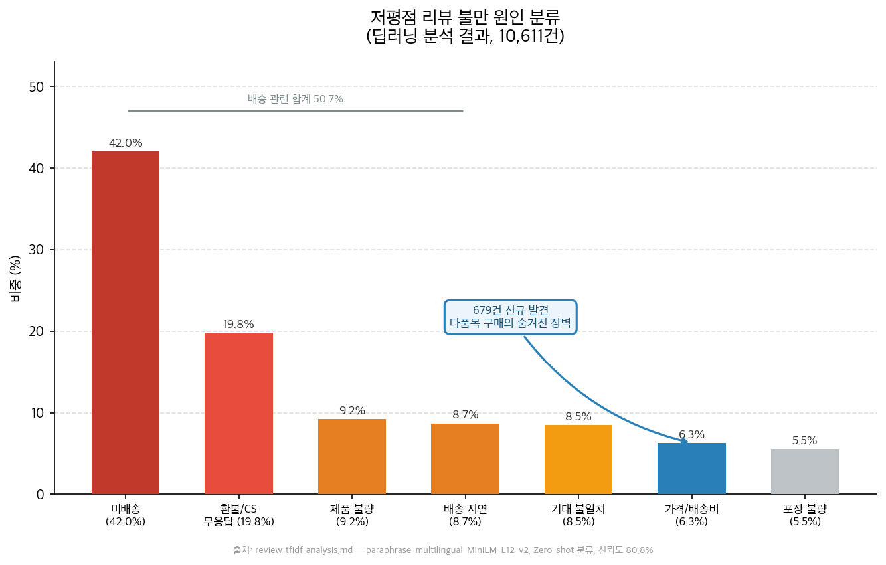
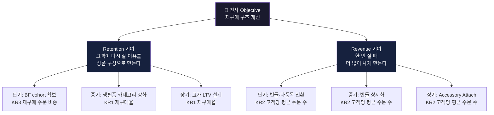
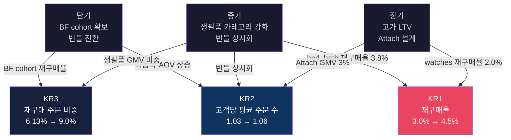
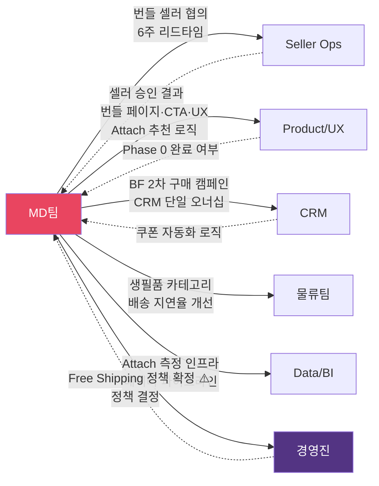
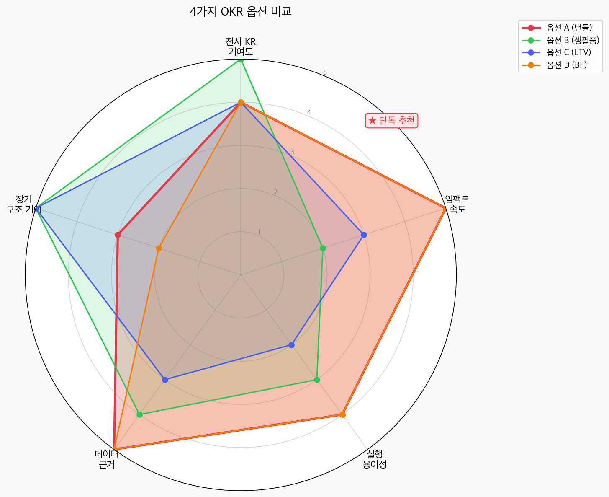
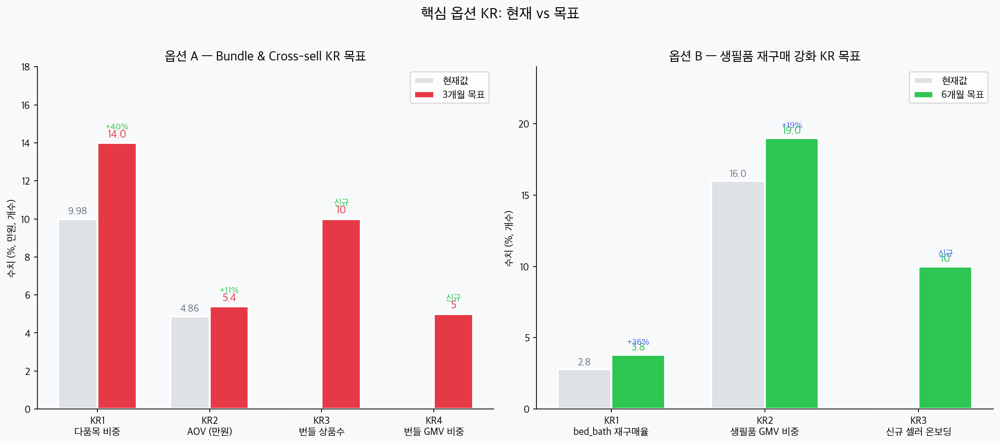
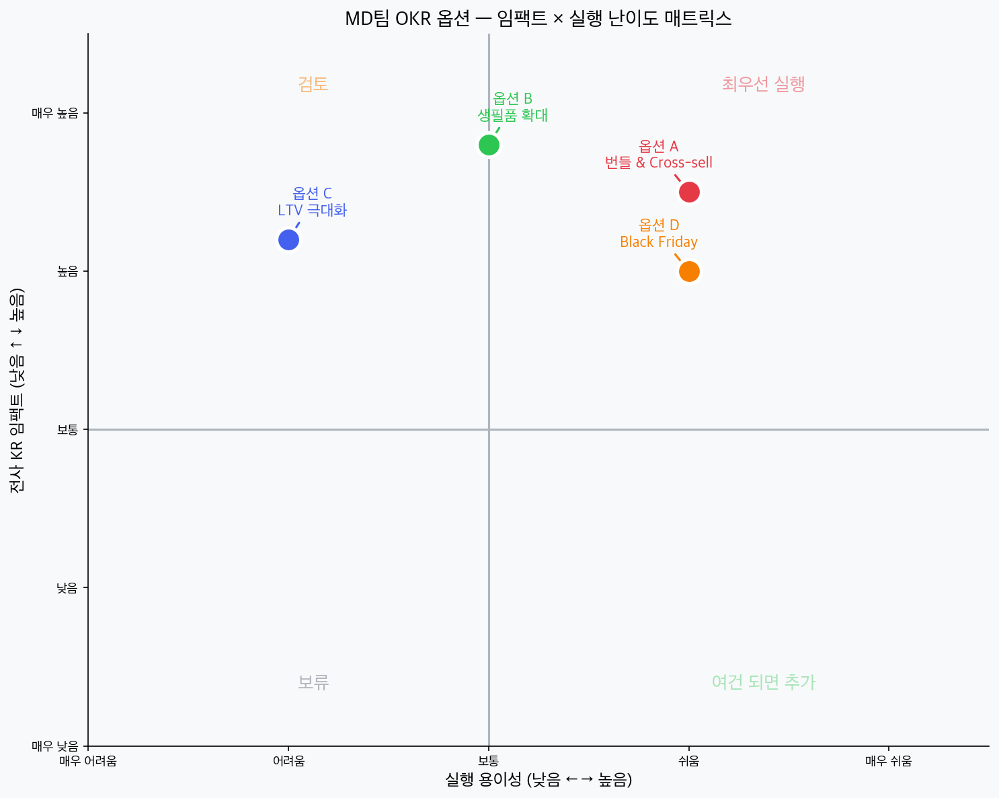
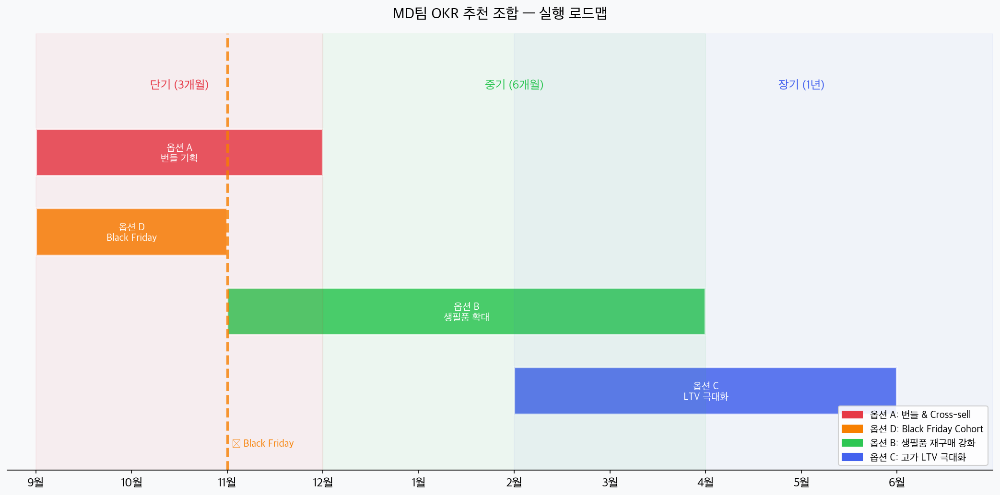
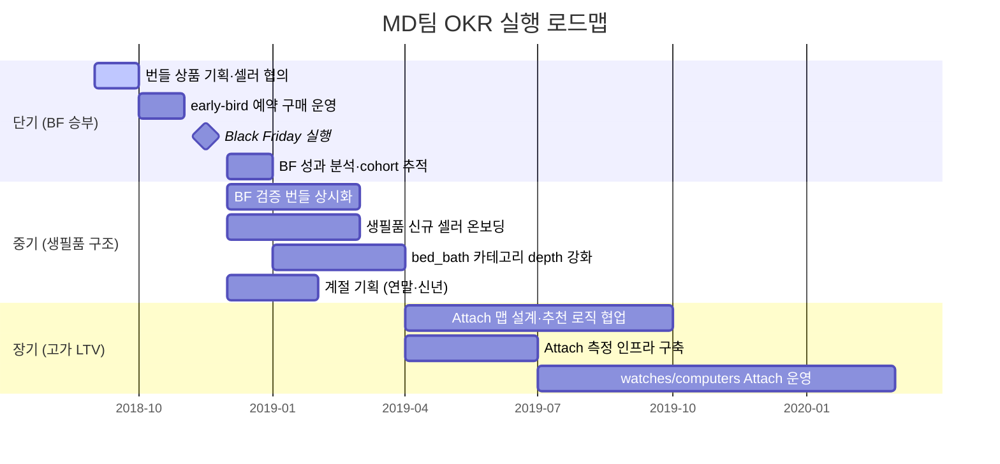

# MD팀 OKR 기획서

> **작성일**: 2026-04-07 | **최종 수정**: 2026-04-18 (전면 검증 재작성)
> **기준 문서**: `05_Company_OKR_Storyline_Draft.md`, `pm_diagnosis_report.md`, `review_tfidf_analysis.md`, `integrated_okr_plan.md`
> **담당 AARRR 구간**: Retention → Revenue
> **연결 전사 KR**: KR1 (재구매율), KR2 (고객당 평균 주문 수), KR3 (재구매 주문 비중)
> **구조**: 단기(9~11월) → 중기(12월~3월) → 장기(4월~)
> **통화 기준**: ₩(원), 1 BRL = ₩302 (2018년 연평균 환율)

---

## 전제: MD팀의 역할과 현황

전사 Objective는 **재구매 구조 개선**이다.
MD팀이 이 구조에 기여하는 방식은 두 가지다.

1. **Retention 기여**: 고객이 다시 살 이유를 상품 구성으로 만든다
2. **Revenue 기여**: 한 번 살 때 더 많이 사게 만든다

현재 MD팀에게 주어진 데이터 기반 진단은 다음과 같다.

| 지표 | 현재값 | 의미 | 데이터 출처 |
|------|--------|------|-----------|
| 주문당 평균 상품 수 | **1.14개** | 크로스셀·번들 전략 전무 | CSV 직접 분석 |
| 다품목 주문 비중 | **9.98%** | 10명 중 1명만 2개 이상 구매 | CSV 직접 분석 |
| AOV | **₩48,575** | basket 확장 여지 큼 | CSV + BRL 159.79 × ₩302 |
| bed_bath_table 재구매율 | **2.8%** | 전 카테고리 중 최고 ※1 | CSV 직접 분석 |
| watches_gifts 재구매율 | **1.2%** | 전 카테고리 중 최저 | CSV 직접 분석 |
| 배송비 불만 리뷰 | **679건 (6.3%)** | 추가 구매의 숨겨진 장벽 | 딥러닝 리뷰 분류 |

> **※1** 재구매율 측정 기준: "동일 카테고리 내 재구매"를 기준으로 함. 전체 재구매율(3.0%)은 "어느 카테고리에서든 2회 이상 구매"한 고객 비율이므로 다른 분모를 사용한다. 두 수치는 상호 모순이 아님.

> **[위 차트]** 딥러닝(Zero-shot) 분류 기반 저평점 리뷰 불만 원인 7개 카테고리. 미배송(42.0%)·배송지연(8.7%) 합산 50.7%가 배송 관련 불만. 배송비 불만 679건(6.3%)은 다품목 구매의 장벽으로 신규 확인된 항목.

---

## 단기 OKR — Black Friday 승부 & 다품목 구조 전환

> **기간**: 2018년 9월 ~ 11월 (3개월)
> **연결 전사 KR**: KR2 (주문 수), KR3 (재구매 주문 비중)

### Objective
> **Black Friday를 단순 할인 행사가 아닌 재구매 cohort 확보의 첫 번째 실험장으로 만들고,
> 다품목 구매 구조 전환의 기반을 이 기간에 완성한다.**

---

### 왜 Black Friday가 단기의 핵심인가

| 이유 | 설명 |
|------|------|
| **유일한 단기 실험 기회** | 번들·다품목 전환율을 대규모로 테스트할 수 있는 창은 연 1회 |
| **역설적 현황** | 현재 금요일이 주문이 가장 낮은 요일(13,685건, CSV 확인) → BF 반전 효과가 가장 큼 |
| **준비 리드타임** | 셀러 협의·번들 기획에 최소 6주 필요 → **9월부터 시작하지 않으면 늦는다** |

---

### 단기 KR 전체

> **수치 기준**: `integrated_okr_plan.md` §1-2 (전사 SSoT). ⚠️ 표시 항목은 TF 합의 진행 중이며 확정 후 업데이트 예정.

| # | Key Result | 기준값 | 목표값 | 측정 방법 | 비고 |
|---|-----------|--------|--------|---------|------|
| KR1 | **[BF 준비]** 번들 상품 구성 완료 | 0개 | **10개 이상** (10월 말) | 기획 완료 번들 상품 수 | CSV 카테고리 페어 분석 기반 |
| KR2 | **[BF 실행]** BF 기간 다품목 주문 비중 | 9.98% | ⚠️ **13~14%** (BF 주간) | BF 주간 다품목 주문 / 전체 주문 | TF1 합의 중 |
| KR3 | **[BF 실행]** BF 기간 AOV | ₩48,575 | ⚠️ **₩51,340+** (BRL 170+, BF 주간) | BF 주간 GMV / 주문 수 | TF1 합의 중 |
| KR4 | **[BF 사후]** BF cohort 30일 재구매 전환율 | 0.56% (CRM 실측) | ⚠️ **1.5~2.0%** | BF 구매 고객 30일 내 재구매 비중 | TF1 CRM·MD·Product 공동 합의 중 |
| KR5 | **[상시]** 다품목 주문 비중 | 9.98% | ⚠️ **12%** (3개월 누적) | 다품목 주문 / 전체 delivered 주문 | TF3 합의 완료, 오너십: Product/UX |
| G1 | **[Guardrail]** AOV 현 수준 유지 | ₩48,575 | **하락 방지** | Delivered GMV / Delivered Orders | 전사 G2와 동일 |

---

### Black Friday 전용 세부 실행 계획

#### 1단계: BF 준비 (9월~10월 말)

| 항목 | 내용 | 완료 기준 |
|------|------|---------|
| 번들 상품 기획 | 카테고리 페어 분석 기반 테마형 번들 10개 이상 설계 | 상품 페이지 등록 완료 |
| 번들 할인율 확정 | 개별 구매 대비 12~18% 할인 ※2 | 셀러 협의 및 마진 시뮬레이션 완료 |
| Free Shipping 정책 | ⚠️ 물류팀·경영진 결정 대기 (아래 정책 비교 참조) | 경영진 확정 후 MD 실행 |
| BF 번들 예시 | 방 꾸미기 패키지 (침대+침구+조명) | |
| | 홈짐 패키지 (러닝머신+아령+매트) | |
| | 주방 완성 패키지 (식탁+의자세트) | |
| early-bird 예약 구매 | 10월 중 예약 접수 운영 | 예약 건수 확인 → BF 수요 사전 검증 |
| CRM 협업 | BF 구매 고객 전용 "2차 구매 쿠폰" 설계 | 쿠폰 발송 자동화 로직 완성 |

> **※2** 번들 할인율 12~18%: 마진 시뮬레이션 완료 후 셀러별 확정. 현재는 범위만 설정된 상태. 실제 적용 전 셀러 협의 필수.

**Free Shipping 정책 비교** (경영진 결정 대기)

| 옵션 | 기준 | Olist 구조 적합성 | 조건 |
|------|------|----------------|------|
| **A (권장)** | 동일 셀러 내 2개 이상 구매 시 배송비 무료 | ✅ 합포장 불가 구조에 현실적 | 셀러별 시행 |
| **B** | 전체 주문 금액 ₩50,000+ 시 배송비 무료 | ⚠️ Olist가 배송비 차액 보조해야 함 | 경영진 예산 확정 필요 |

> **Olist 배송 구조 이해**: 고객이 여러 셀러의 상품을 함께 주문하면 셀러별로 개별 발송·개별 배송비 부과됨(합포장 불가). 따라서 다품목 구매는 배송비가 절감되지 않고 오히려 셀러 수만큼 증가한다. **다품목 구매의 핵심 유인은 배송비 절감이 아닌 번들 할인(12~18%) 자체임.** 이 구조적 사실을 고객 커뮤니케이션에서 명확히 할 것.

#### 2단계: BF 실행 (11월 4주)

| 항목 | 내용 |
|------|------|
| 번들 집중 노출 | 메인 배너, 카테고리 상단 번들 상품 우선 노출 |
| 긴급감 연출 | "오늘까지" "재고 한정" 카운트다운 적용 |
| Free Shipping 배너 | ⚠️ 정책 확정 후 실행 |
| 실시간 모니터링 | 다품목 비중·AOV 일별 추적 (목표 미달 시 즉시 프로모션 조정) |

#### 3단계: BF 사후 관리 (12월 첫 4주)

| 항목 | 내용 |
|------|------|
| 2차 구매 쿠폰 발송 | ⚠️ CRM 단일 오너십 — TF1 캘린더 확정 후 실행 |
| cohort 추적 시작 | BF 구매 고객 집단의 30일·60일 재구매율 별도 관리 |
| 번들 성과 분석 | 어떤 번들 조합이 가장 높은 전환율 → 중기 OKR 반영 |

```mermaid
flowchart LR
    subgraph P1["1단계: BF 준비 (9~10월)"]
        A1["번들 상품 10개\n기획·설계"]
        A2["번들 할인율 확정\n12~18%"]
        A3["Free Shipping\n정책 결정 ⚠️"]
        A4["early-bird\n예약 구매 운영"]
        A5["CRM 2차 쿠폰\n설계 협업"]
    end

    subgraph P2["2단계: BF 실행 (11월)"]
        B1["번들 집중 노출\n메인 배너·카테고리 상단"]
        B2["긴급감 연출\n카운트다운·재고 한정"]
        B3["실시간 모니터링\n다품목·AOV 일별 추적"]
    end

    subgraph P3["3단계: BF 사후 (12월)"]
        C1["2차 구매 쿠폰\nCRM 오너십 ⚠️"]
        C2["BF cohort 추적\n30일·60일 재구매율"]
        C3["번들 성과 분석\n→ 중기 OKR 반영"]
    end

    P1 --> P2 --> P3

    style P1 fill:#1a1a2e,color:#fff
    style P2 fill:#16213e,color:#fff
    style P3 fill:#0f3460,color:#fff
```

---

### 실행 방향

- **카테고리 페어 분석 기반 번들 설계**: CSV 데이터로 확인된 동반 구매 패턴 활용
  - 침대 → 침구류 / 소파 → 쿠션 / 컴퓨터 → 주변기기
- **번들 할인(12~18%)이 핵심 유인**: Olist 합포장 불가 구조상 배송비 절감은 다품목 구매 논거로 사용 불가. 가격 혜택 논거는 번들 할인으로 한정.
- **"함께 구매하면 15% 할인"** 단위 프로모션을 핵심 메시지로 설정

---

### 비즈니스 임팩트

> **⚠️ 주의**: 아래 수치는 명시된 가정 하의 추정치임. 가정이 달라지면 수치도 달라짐. 사업 계획 확정 전 반드시 실측 검증 필요.

| 항목 | 계산 근거 | 추정 효과 | 가정 및 한계 |
|------|---------|---------|------------|
| **BF 주간 추가 GMV** | 정상 주간 GMV ₩5,400만 ※A × BF 2배 주문 ※B × AOV ₩51,340 적용 | 단 1주에 약 **+₩6,000만** | ★ BF 2배 주문: 업계 벤치마크, Olist 미검증 |
| **BF cohort 재구매** | BF 구매 ~2,240명 ※C × 1.5~2.0% 전환 ※D = 34~45명 × ₩48,575 | **₩170만~₩220만** (30일 내) | ★ 2배 주문 가정 + TF1 합의 목표 기준 |
| **다품목 비중 12% 효과** | 월 주문 4,900건 × +2%p 전환 × 추가 아이템 단가 | ⏳ **카테고리 페어 분석 완료 후 산출** | ★ 추가 아이템 단가 데이터 없음 — 실측 전 계산 불가 |
| **번들 마진 시뮬레이션** | 할인율 12~18% × 번들별 원가 | ⏳ **셀러 협의 후 산출** | ★ 셀러별 마진 구조 확인 필요 |

> **가정별 주석**:
> - **※A 정상 주간 GMV ₩5,400만**: CSV 기준 delivered 주문 96,211건 / 약 20개월 ÷ 4.33주 ≈ 1,110건/주 × ₩48,575 ≈ ₩5,392만. 데이터 기반 수치.
> - **※B BF 2배 주문**: 업계 평균 벤치마크 기반 가정. Olist 2018년 BF 실제 데이터는 분석 기간(2017-01~2018-08) 이후이므로 검증 불가. 발표 시 반드시 "추정치"로 명시할 것.
> - **※C BF cohort 2,240명**: 정상 주 1,110건 × 2배 = 2,220건 반올림. ※B와 동일한 가정 의존.
> - **※D 1.5~2.0% 전환율**: CRM 실측 baseline 0.56% 기반, TF1 개입 효과 감안한 현실적 목표. `integrated_okr_plan.md` SSoT 기준.

---

### 트레이드오프

- 번들 할인(12~18%)으로 인한 단기 마진율 하락 → GMV는 오르지만 수익성 모니터링 필요
- 셀러 협의 리드타임: 번들 기획은 셀러 동의가 필요하므로 9월 착수가 전제조건
- BF cohort 재구매율은 단기 지표 → 전사 KR1(재구매율)과 분리 관리하지 않으면 착시 발생 가능

---

## 중기 OKR — 생필품 재구매 구조 강화

> **기간**: 2018년 12월 ~ 2019년 3월 (4개월, BF 실험 결과 반영)
> **연결 전사 KR**: KR1 (재구매율), KR2 (주문 수), KR3 (재구매 주문 비중)

### Objective
> **BF 실험으로 검증된 번들 전략을 상시화하고,
> 재구매율이 구조적으로 높은 생필품 카테고리의 셀러·상품 폭을 확대해 고객 재진입 구조를 만든다.**

---

### 배경

단기 OKR BF 실험에서 "어떤 번들 조합이, 어떤 가격대에서, 어떤 고객에게 통했는지" 데이터가 축적된다.
중기 OKR은 이 데이터를 기반으로 **번들을 상시 구조로 전환**하고,
동시에 재구매율이 데이터로 증명된 생필품 카테고리의 **공급 폭을 확대**한다.

| 카테고리 | 재구매율 | 전략 방향 | 데이터 출처 |
|---------|---------|---------|-----------|
| bed_bath_table | **2.8%** (동일 카테고리 내 최고) | 셀러 다양성·SKU 확대 → 자연 재구매 가속 | CSV 직접 분석 |
| sports_leisure | **2.4%** | 계절·취미 반복 구매 타이밍 설계 | CSV 직접 분석 |
| housewares | 측정 중 | 생필품 GMV 비중 확대 대상 | 추가 분석 필요 |
| garden_tools | 측정 중 | 생필품 GMV 비중 확대 대상 | 추가 분석 필요 |

---

### 중기 KR

> ⚠️ 아래 목표값은 단기 BF 실험 결과를 반영하여 조정될 수 있음. 확정은 12월 BF 결과 리뷰 후.

| # | Key Result | 기준값 | 목표값 | 측정 방법 | 설정 근거 |
|---|-----------|--------|--------|---------|---------|
| KR1 | bed_bath_table 재구매율 | 2.8% | **3.8%** ※E | bed_bath_table delivered 주문의 재구매 고객 비중 | 셀러 다양성 확대 효과 추정치. BF 실험 결과로 조정 예정 |
| KR2 | 생필품 카테고리 GMV 비중 | 16.0% | **19.0%** ※F | (bed_bath + housewares + garden_tools) GMV / 전체 GMV | +3%p: 셀러 온보딩 효과 추정. 실측 후 조정 |
| KR3 | 고빈도 카테고리 신규 셀러 온보딩 | 기준 미설정 | **각 카테고리 10개 이상** ※G | 신규 셀러 입점 수 (3개월 내) | Seller Ops와 공동 설정 필요 |
| KR4 | BF 검증 번들 상시화 | 0개 | **BF 상위 5개 번들 상시 운영** | 상시 번들 상품 페이지 유지 수 | BF 전환율 상위 5개 기준 |
| KR5 | 다품목 주문 비중 (유지·성장) | 12.0% (단기 목표) | **13.0%** (중기) | 다품목 주문 / 전체 delivered 주문 | TF3 합의안 6개월 목표 |

> **※E~G 추정 근거**: 데이터 기반 방향 설정은 가능하나 구체적 목표치는 실측 전 가설임.
> - **※E** bed_bath 3.8%: 셀러 다양성·SKU 확대 시 기대 효과. BF 결과 리뷰 후 상향·하향 조정.
> - **※F** 생필품 GMV 19%: 현재 16% + 신규 셀러 온보딩 효과 추정. Seller Ops 협업 결과에 의존.
> - **※G** 신규 셀러 10개: 현재 카테고리별 셀러 현황 데이터 확보 후 비율 기반으로 재설정 예정.

---

### 실행 방향

- **BF 결과 분석 → 번들 상시화**: BF에서 전환율 상위 5개 번들을 상시 상품으로 전환
- **셀러 acquisition 우선순위 재설정**: B2B 셀러 파이프라인에서 생필품 카테고리 셀러 비중 확대
- **category depth 강화**: bed_bath_table 내 색상·사이즈 옵션 확대 (기대 불일치 리뷰 해소)
- **계절 기획**: 연말(gifts), 신년(리뉴얼) 시즌 카테고리 기획으로 재방문 트리거 설계

---

### 비즈니스 임팩트

> **⚠️ 주의**: 아래는 중기 KR 달성 시 예상 효과이나, KR 목표값 자체가 추정치이므로 이중 불확실성 존재.

| 항목 | 계산 근거 | 추정 효과 | 가정 및 한계 |
|------|---------|---------|------------|
| **bed_bath 재구매율 3.8%** | bed_bath 구매 고객 약 9,000명 ※H × +1%p 전환 = +90명 × ₩48,575 ※I | 약 **+₩437만** (직접 수익) | ★ KR1 목표 달성 가정. 9,000명은 CSV 추정치. |
| **생필품 GMV 비중 19%** | 전체 GMV ₩46.7억 ※J × +3%p 비중 이동 | 생필품 GMV **+₩1.4억** | ★ KR2 목표 달성 + 전체 GMV 유지 가정 |
| **번들 상시화 효과** | BF 검증 번들 × 4개월 유지 | 다품목 비중 12% → 13% 유지 | ⏳ 추가 아이템 단가 데이터 확보 후 정밀 계산 |

> **가정별 주석**:
> - **※H** 약 9,000명: CSV bed_bath_table 구매 고객 집계값. 데이터 기반 수치.
> - **※I** 재구매 고객 AOV ₩48,575 적용: bed_bath 전용 AOV(별도 집계: BRL 111.12 ≈ ₩33,558)가 있으나, 재구매 시 추가 구매 품목 포함 가능성으로 전체 AOV 적용. 보수적으로 보면 효과는 더 낮을 수 있음.
> - **※J** 전체 GMV ₩46.7억: CSV 분석 기간 전체 delivered GMV 합계. 데이터 기반 수치.

---

### 트레이드오프

- 생필품 카테고리 확대는 단기 GMV 임팩트가 적다. 4~6개월 호흡이 필요하다
- 셀러 다양성 확대는 동시에 품질 관리 부담을 높인다 → Seller quality KPI 병행 필요
- 중기 OKR은 BF 실험 결과에 의존한다 → 단기 BF가 실패하면 중기 방향 재조정 필요

---

## 장기 OKR — 고가 고객 LTV 극대화 (Accessory Attach)

> **기간**: 2019년 4월 ~ (1년 이상, Data/BI 협업 전제)
> **연결 전사 KR**: KR1 (재구매율), KR2 (주문 수)

### Objective
> **고가 카테고리(watches_gifts, computers) 구매 고객의 연관 상품 구매를 설계하여
> 1회 고가 구매를 다회 구매로 전환하고 고객 LTV를 극대화한다.**

---

### 배경

watches_gifts(AOV ₩64,413, CSV 확인)와 computers_accessories는 **AOV가 가장 높지만 재구매율이 가장 낮은 카테고리**다.
이 고객들은 이미 높은 구매력을 가진 고가치 고객이지만, 구매 후 재진입 설계가 없어 이탈하고 있다.

리뷰 분석에서 드러난 이 고객들의 특이점:
- **watches_gifts**: CS 무응답 두드러짐 → 구매 후 경험 설계 자체가 없음
- **computers_accessories**: 정품 의심 리뷰, 주변기기 미구매 패턴 → accessory attach 기회 명확

---

### 장기 KR

> **⚠️ 중요**: 장기 KR의 목표값은 현재 측정 인프라가 없어 baseline 자체가 없는 항목이 포함됨.
> 아래 목표값은 전략적 방향 설정을 위한 초기 가설이며, **Data/BI 협업으로 추적 체계 구축 후 실측 기반으로 전면 재설정**해야 함.

| # | Key Result | 기준값 | 목표값 | 측정 방법 | 상태 |
|---|-----------|--------|--------|---------|------|
| KR1 | watches_gifts 재구매율 | 1.2% | **2.0%** ※K | 해당 카테고리 재구매 고객 비중 | ⚠️ 추정치, 실측 후 조정 |
| KR2 | 고가 구매 고객 Accessory Attach 비중 | **미추적** | **8%** ※L | watches/computers 구매 후 30일 내 연관 카테고리 재구매 비중 | ⏳ 인프라 구축 후 재설정 |
| KR3 | 카테고리별 추천 세트 기획 완료 | 0개 | **카테고리별 3개 이상** (2개월 내) | 추천 세트 기획 완료 수 | 실행 가능 |
| KR4 | Accessory Attach GMV | **미추적** | 전체 GMV의 **3%** ※L | Attach 연관 GMV / 전체 GMV | ⏳ 인프라 구축 후 재설정 |

> **※K~L 추정 근거**:
> - **※K** watches 재구매율 2.0%: 1.2%에서 +0.8%p. Attach 캠페인 개입 효과 가정. Accessory Attach 캠페인 실적 데이터 없어 검증 불가. 6개월 추적 후 조정.
> - **※L** Attach 8%·GMV 3%: baseline이 "미추적"이므로 현재 수치 자체가 의미 없음. Data/BI 추적 인프라 구축 후 3개월 baseline 측정 → 목표 재설정하는 것이 올바른 순서.

---

### 실행 방향

- **카테고리별 Attach 맵 설계**: 고가 상품 구매 후 자연스럽게 연결되는 연관 상품 기획
  - 시계 → 시계 케이스, 관리 용품
  - 노트북 → 파우치, 마우스, 키보드
  - 소파 → 쿠션, 러그, 사이드 테이블
- **Post-purchase 추천 연동**: 배송 완료 후 7일 이내 연관 상품 추천 소재 기획 (Product/CRM 협업)
- **Bundle Pre-order**: 고가 상품 구매 시 "함께 구매 시 10% 할인" 즉시 노출

---

### 비즈니스 임팩트

> **⚠️ 주의**: KR2·KR4 baseline 없음. 아래 계산 중 Attach 관련 수치는 KR 재설정 후 전면 재계산 필요.

| 항목 | 계산 근거 | 추정 효과 | 상태 |
|------|---------|---------|------|
| **watches 재구매율 2.0%** | watches 구매 고객 약 5,000명 ※M × +0.8%p 전환 = +40명 × ₩64,413 | 약 **+₩258만** (직접) | ⚠️ 추정치 |
| **Attach GMV 3%** | 전체 GMV ₩46.7억 × 3% | 약 **+₩1.4억** | ⏳ baseline 측정 후 재계산 |
| **연간 총 추가 GMV** | Attach GMV + watches 재구매 개선 합산 | ⏳ **baseline 측정 후 산출** | baseline 없어 현재 계산 불가 |

> **※M** 약 5,000명: CSV watches_gifts 구매 고객 집계값. 데이터 기반 수치.

---

### 트레이드오프

- Attach 비중 측정을 위한 데이터 인프라가 필요 → **Data/BI 협업 없으면 실행 불가**
- watches처럼 선물용 카테고리는 구매자 ≠ 사용자 → 추천 정확도 한계
- 장기 OKR이기 때문에 단기·중기 성과가 쌓이지 않으면 경영진 설득 어려움

---

## 전사 KR 연결 정리

| 전사 KR | 기여하는 MD 단계 | MD 레버 |
|---------|--------------|---------|
| **KR1** 재구매율 3.0% → 4.5% | 중기 + 장기 | 생필품 카테고리 확대, Attach 설계 |
| **KR2** 고객당 평균 주문 수 1.03 → 1.06 | 단기 + 중기 + 장기 | 번들·다품목 구매 구조 → 주문 빈도 상승 + Accessory Attach GMV |
| **KR3** 재구매 주문 비중 6.13% → 9.0% | 단기 + 중기 | BF cohort 확보 + 생필품 GMV 비중 확대 |

> **MD팀만으로 전사 KR 전체를 달성할 수 없다.** CRM(Post-purchase 메시지), 물류(배송 SLA), Product(추천 로직)의 협업이 전제다.

---

## 타팀 협업 의존 관계

### 실행 전 확정이 필요한 항목

| 항목 | 의존 팀 | 현재 상태 | 필요 조치 |
|------|--------|---------|---------|
| **Free Shipping 정책** | 물류팀 + 경영진 | ⚠️ 미확정 | 경영진 결정 후 MD 실행 |
| **BF 사후 쿠폰 설계** | CRM (TF1 리드) | ⚠️ TF1 진행 중 | CRM 단일 오너십으로 통합, 9월 확정 |
| **결제 완료 페이지 존재 여부** | Product/UX | ⚠️ Phase 0 미완료 | Phase 0 결과 수신 후 실행 여부 결정 |
| **BF cohort 30일 재구매율 목표** | CRM + Product/UX | ⚠️ TF1 합의 중 | 3팀 공동 합의 (1.5~2.0% 방향) |
| **다품목 비중 측정 오너십** | Product/UX | ✅ TF3 합의 완료 | 측정: Product/UX, 기획: MD, 캠페인: CRM |

### 단계별 협업 구조

| MD 단계 | 핵심 협업 | 내용 |
|--------|---------|------|
| **단기 — BF 준비** | Seller Ops | 번들 기획을 위한 셀러 협의·승인 (최소 6주 리드타임) |
| **단기 — BF 실행** | Product/UX | 번들 상품 페이지, 번들 할인 CTA, Free Shipping UX 노출 |
| **단기 — BF 사후** | CRM (TF1) | BF 구매 고객 전용 2차 구매 캠페인 (CRM이 오너십 보유) |
| **중기** | Seller Ops | 생필품 카테고리(bed_bath, sports_leisure) 신규 셀러 온보딩 |
| **중기** | 물류 | 재구매 친화 카테고리 배송 지연율 개선 |
| **장기** | Product/UX | Accessory Attach 추천 로직 (Post-purchase 추천 연동) |
| **장기** | Data/BI | Attach 비중 측정 인프라 구축 (데이터 파이프라인 협업 전제) |

---

## 옵션 비교 시각화

### 4가지 전략 레이더 비교

> 단기(번들+BF), 중기(생필품), 장기(LTV) 각 단계에서 활용하는 전략의 강약점을 비교. 단기 전략은 임팩트 속도와 실행 용이성이 강하고, 중기는 장기 구조 기여가 가장 높으며, 장기는 실행 난이도가 높다.

### KR 현재값 vs 목표값

> 회색이 현재값, 색상 막대가 목표값. 왼쪽(단기 KR)은 다품목 비중·AOV, 오른쪽(중기 KR)은 bed_bath 재구매율·생필품 GMV 비중.

### 임팩트 × 실행 난이도 매트릭스

> 오른쪽 위(높은 임팩트 + 쉬운 실행)가 최우선 구간. 단기 전략(번들·BF)은 즉시 실행 가능한 위치, 중기(생필품)는 임팩트 높지만 난이도도 높음, 장기(LTV)는 인프라 투자 필요 구간.

### 실행 로드맵

> 단기(9~11월)는 번들 기획 + BF 집중. BF 이후(12월~)는 생필품 구조 강화로 전환. 4월 이후부터 고가 LTV 전략을 점진적으로 추가. Black Friday(11월)가 전략 전환의 피벗 포인트.

---

## 변경 이력

| 날짜 | 변경 내용 | 사유 |
|------|---------|------|
| 2026-04-07 | 최초 작성 | |
| 2026-04-11 | `integrated_okr_plan.md` 기준 추가, 불일치 각주 기재 | TF 합의 과정 문서화 |
| 2026-04-18 | **전면 재작성** | 데이터 검증 결과 반영 |
| | — SSoT 불일치 수치 전면 수정 (BF-KR2·3·4·5, 다품목 상시) | `integrated_okr_plan.md` 기준 정렬 |
| | — 이미지 `md_okr_06_option_a_logic.png` 제거 | 합포장 불가 구조에서 무효한 배송비 절감 수치 포함 |
| | — 배송비 절감 다품목 유인 논거 삭제 | Olist 합포장 불가 구조상 성립 불가 |
| | — 비즈니스 임팩트 테이블 가정 명시 및 재계산 | 검증 불가 수치 혼용 방지 |
| | — 장기 KR 목표값에 "baseline 없음" 명시 | 측정 인프라 미구축 상태에서 수치 설정 부적절 |

---

> **[문서 원칙]**
> - **데이터 기반 수치**: CSV 직접 분석 또는 `pm_diagnosis_report.md` 기반
> - **추정치**: 반드시 가정과 한계를 명시하고 ⚠️ 또는 ★ 표시
> - **미확정 항목**: ⏳ 표시 후 확정 조건 명시
> - **SSoT**: 모든 전사 KR 수치는 `integrated_okr_plan.md` §1을 기준으로 함
