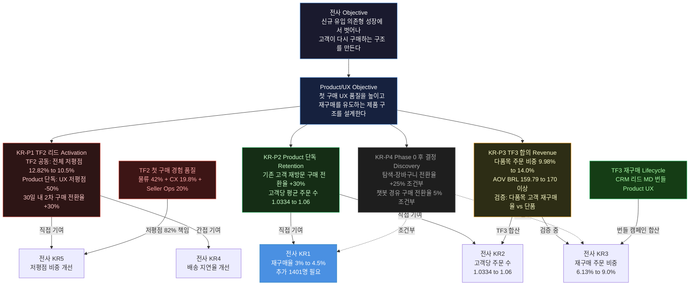
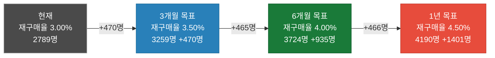
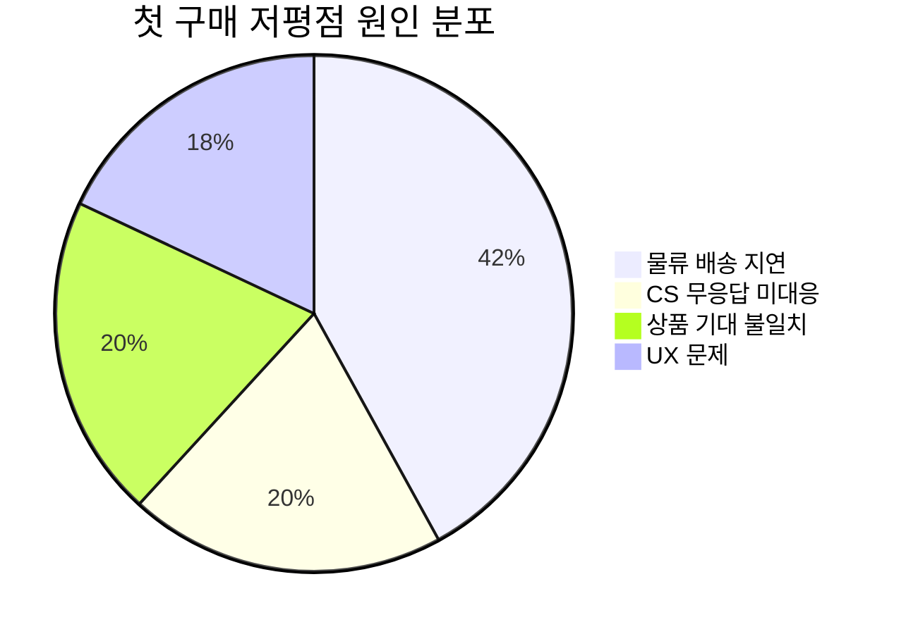
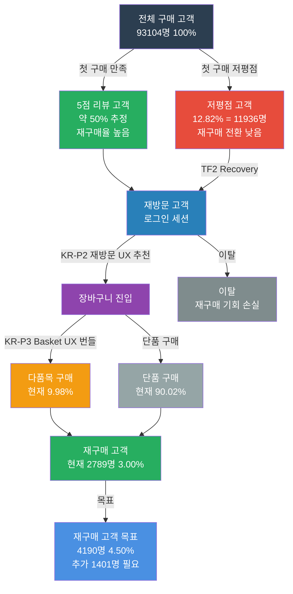
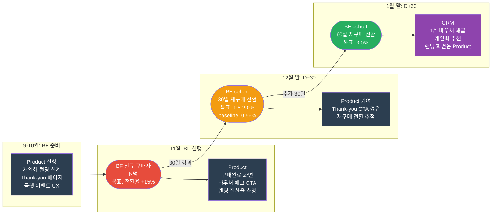
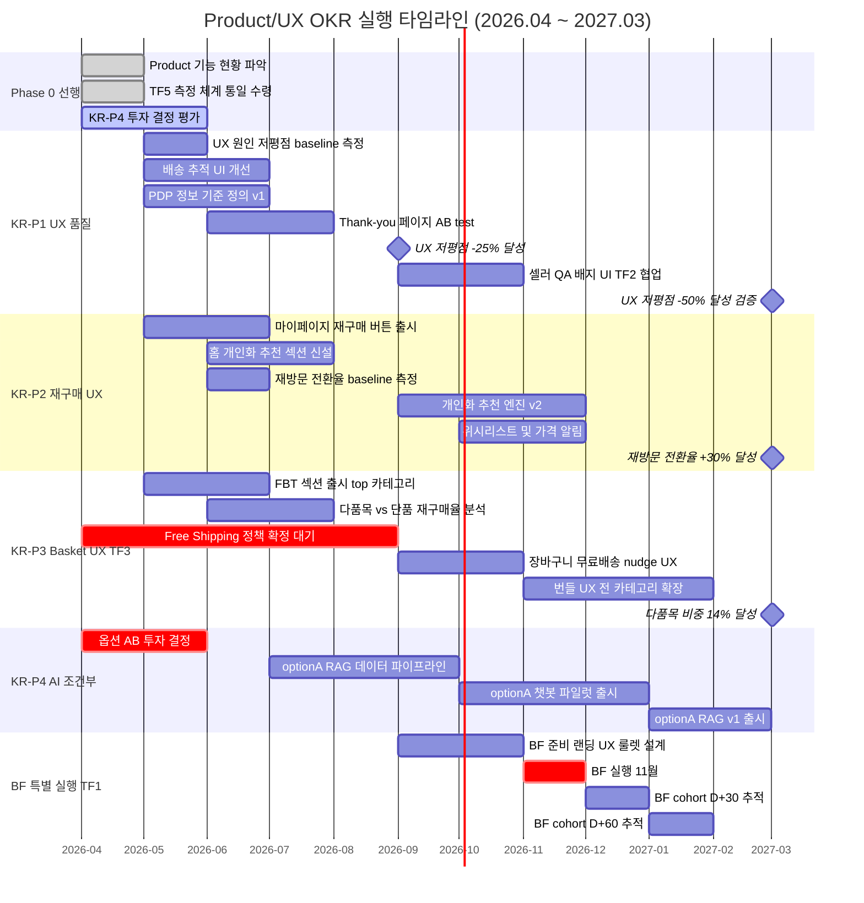
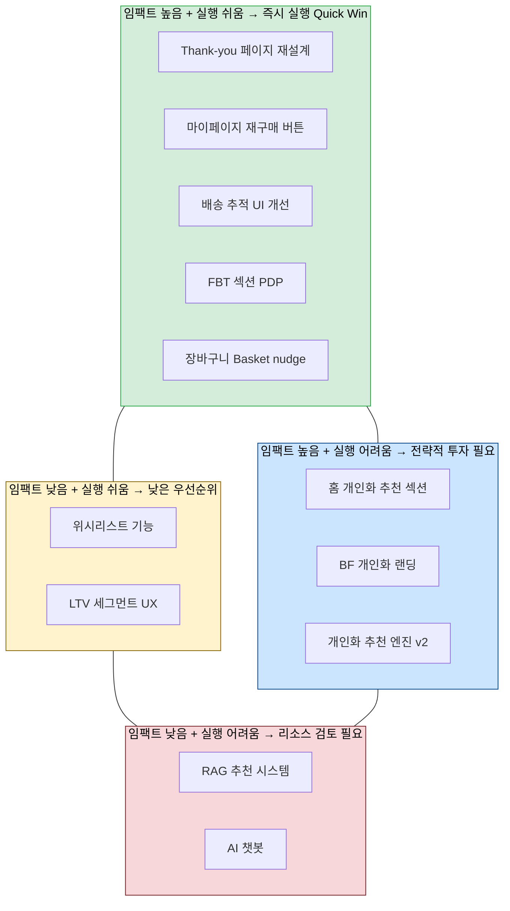
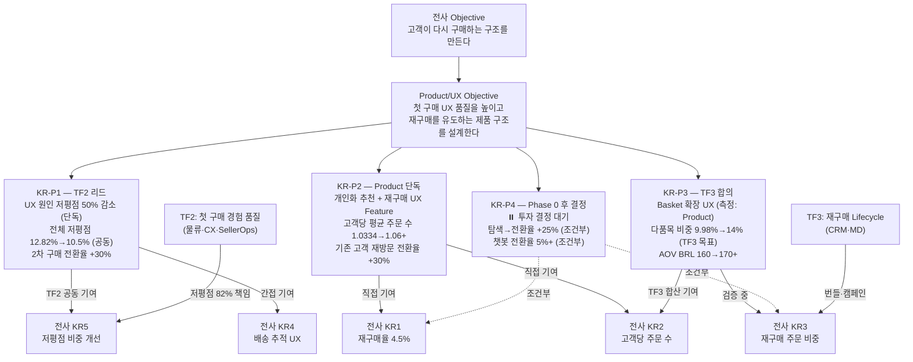

# Product/UX 관리자 OKR

> 작성 관점: Product/UX 관리자 입장에서 전사 Objective에 기여하는 4가지 KR  
> 연계 기준: `05_Company_OKR_Storyline_Draft.md` — 전사 OKR (Section 6) 및 기간별 운영 원칙 (Section 6-10~13)

---

## 전사 Objective 연계 맥락

전사 Objective: **신규 유입 의존형 성장에서 벗어나, 고객이 다시 구매하는 구조를 만든다.**

Product/UX 팀은 이 목표에 네 가지 축으로 기여한다.

| 축 | Product/UX 역할 | 연계 전사 KR |
|----|----------------|-------------|
| Activation | 첫 구매 경험 품질 안정화 → 재구매 기반 마련 | KR4, KR5 |
| Retention | 재구매를 유도하는 Product 구조 설계 | KR1, KR2 |
| Revenue | Basket 확장 UX 설계 → Revenue per customer 확대 | KR2, KR3, Guardrail AOV |
| Discovery | AI 기반 상품 발견성 강화 → 탐색→구매 전환율 개선 | KR1, KR2, KR3 |

---

## 전사 재구매율 4.5% 달성 정합성 체크

### 수치 역산

전사 KR1 달성을 위해 필요한 재구매 고객 수를 역산하면 다음과 같다.

| 구분 | 수치 |
|------|------|
| 현재 전체 구매 고객 | 93,104명 |
| 현재 재구매 고객 (3.00%) | 2,789명 |
| 목표 재구매 고객 (4.50%) | **4,190명** |
| **필요 추가 재구매 고객** | **+1,401명** |

Product/UX 팀의 4가지 KR은 이 +1,401명을 만들기 위한 선행 조건과 직접 레버를 커버한다.

### KR별 정합성 검토 (전사 통합 OKR 기준 재정렬)

| KR | 기여 경로 | 판정 | 오너십 조정 사항 |
|----|-----------|------|----------------|
| **KR-P1** 첫 구매 UX 품질 개선 | UX 원인 저평점 감소 → 첫 구매 만족 → 2차 구매 전환 증가 | ✅ 선행 지표 직접 기여 | **전체 저평점(12.82%)은 TF2 공동 KR**. Product 단독 KR은 UX 원인 저평점(~18%)만 담당. 셀러 교육·배송 알림 자동화는 타팀 영역 |
| **KR-P2** 재구매 유도 Product Feature | 재방문 고객 구매 전환율 개선 → 재구매 고객 수 직접 증가 | ✅ 가장 직접적 기여 | 기존 구매 고객 세그먼트 한정 추적 필수. push 알림 발송은 CRM 영역 — Product는 재진입 UX 화면만 담당 |
| **KR-P3** Basket 확장 UX | 다품목 구매 → engagement 상승 → 재구매율 상관 검증 필요 | ⚠️ 간접 기여 (검증 중) | 다품목 비중 목표는 **TF3 합의안 기준**(3M 12%, 1Y 14%)으로 조정. 번들 상품 기획은 MD 영역. Free Shipping 정책 확정 후 장바구니 nudge UX 구현 |
| **KR-P4** AI 탐색/추천 | 탐색 전환 개선 → 재방문 시 구매 진입 장벽 완화 | ⏸️ **Phase 0 이후 투자 결정 대기** | 투자 결정(옵션 A/B) 확정 전 타팀 연동 설계 금지. 3개월 로드맵은 현황 파악 + 옵션 평가로 대체 |

### 핵심 보완 결론

1. **KR-P1**: 저평점 원인의 82%가 물류·CX·Seller Ops 영역 → Product 단독 KR은 "UX 원인 저평점"으로 범위 한정. 전체 저평점 개선은 TF2 리드로 기여
2. **KR-P2**: 기존 구매 고객 세그먼트 분리 추적 필수. push 알림·쿠폰 설계는 CRM에 위임하고, Product는 재진입 시 랜딩 UX와 마이페이지 재구매 기능에 집중
3. **KR-P3**: TF3 합의 수치(3M 12%)로 목표 조정. 다품목 고객의 30일 재구매율 비교 분석으로 KR-P3의 전사 KR1 기여 여부를 검증
4. **KR-P4**: Phase 0 완료 후 투자 결정 게이트 통과 시에만 실행 계획 확정. 현재 OKR에서 실행 타임라인 제거

---

## 시각화 대시보드

---

### 📊 Chart 1 — KPI Tree: 전사 Objective → Product/UX KR 계층 구조



---

### 📊 Chart 2 — 재구매 고객 수 Gap 분석 (KR1 달성 역산)



```
재구매율 달성을 위한 추가 고객 수 (누적)

현재   ████████████████████░░░░░░░░░░░  2,789명 (3.00%)
3개월  ████████████████████████░░░░░░░  3,259명 (+470명)
6개월  ████████████████████████████░░░  3,724명 (+935명)
1년    █████████████████████████████████  4,190명 (+1,401명 ← 전사 목표)
                                         ↑
                               Product/UX 직접 기여 목표:
                               KR-P2 재방문 전환 개선으로
                               약 400~600명 확보 (추정)
```

---

### 📊 Chart 3 — 저평점 원인 분포 & TF2 책임 분리 (Pie + 히트맵)

**원인별 비중 (전체 저평점 12.82% 기준)**



**팀별 저평점 개선 책임 매트릭스**

| 저평점 원인 | 비중 | 책임 팀 | Product 역할 | 개선 레버 |
|------------|:----:|:-------:|:------------:|----------|
| 미배송 · 배송 지연 | **42%** | 🚛 물류 | 배송 추적 UI 표시 | Lead Time 단축, ETA 정확도 |
| CS 무응답 | **19.8%** | 📞 CX | recovery 랜딩 화면 | 48h Recovery flow |
| 상품 기대 불일치 | **~20%** | 🏷️ Seller Ops | PDP 필드 기준 정의 | 셀러 교육, 등록 QA |
| **UX 문제** | **~18%** | **✅ Product 단독** | **전체 직접 해결** | 배송 추적 UI, PDP 정보, Thank-you 페이지 |

> Product/UX가 단독으로 통제 가능한 저평점 비중은 전체의 **~18%**. 나머지 82%는 TF2 협업 구조에서 각 팀이 책임진다.

---

### 📊 Chart 4 — 팀 × KR 책임 히트맵 (RACI)

```
범례: 🔴 Responsible(실행) · 🟡 Accountable(최종책임) · 🟢 Consulted(협의) · ⚪ Informed(공유)
      ⏸️ 대기중 · — 미해당
```

| KR / 지표 | Product/UX | CRM | MD | 물류 | CX | Seller Ops |
|-----------|:----------:|:---:|:--:|:----:|:--:|:----------:|
| **KR-P1 UX 원인 저평점** | 🔴🟡 | — | — | — | — | — |
| KR-P1 전체 저평점 (TF2) | 🟡 리드 | ⚪ | ⚪ | 🔴 | 🔴 | 🔴 |
| KR-P1 배송 추적 UI | 🔴🟡 | ⚪ | — | 🟢 데이터 | — | — |
| KR-P1 셀러 QA 기준 정의 | 🟡 기준 | — | — | — | — | 🔴 집행 |
| KR-P1 Thank-you 페이지 UI | 🔴🟡 | 🟢 쿠폰 | 🟢 상품 | — | — | — |
| **KR-P2 재방문 전환율** | 🔴🟡 | ⚪ | — | — | — | — |
| KR-P2 마이페이지 재구매 UX | 🔴🟡 | ⚪ | — | — | — | — |
| KR-P2 push 알림 실행 | 🟢 랜딩화면 | 🔴🟡 | — | — | — | — |
| KR-P2 개인화 추천 엔진 | 🟡 UX | — | — | — | — | — |
| **KR-P3 다품목 비중** (TF3) | 🟡 측정 | 🟢 캠페인 | 🔴 상품기획 | — | — | — |
| KR-P3 장바구니 UX | 🔴🟡 | — | 🟢 | — | — | — |
| KR-P3 번들 노출 화면 | 🔴🟡 | ⚪ | 🟢 상품Pool | — | — | — |
| KR-P3 AOV 유지 | 🔴🟡 | 🟢 | 🟢 | — | — | — |
| **KR-P4 AI 추천/챗봇** | ⏸️ 대기 | ⏸️ | ⏸️ | — | — | — |
| **BF 개인화 랜딩 UX** | 🔴🟡 | 🟢 | ⚪ | — | — | — |
| BF Thank-you 재구매 CTA | 🔴🟡 | 🟢 쿠폰 | 🟢 | — | — | — |
| BF cohort 추적 대시보드 | 🔴🟡 | ⚪ | ⚪ | ⚪ | ⚪ | — |

---

### 📊 Chart 5 — 재구매 Cohort Funnel (첫 구매 → 재구매 여정)



**Cohort 전환율 수치 요약**

| 단계 | 현재 | 1년 목표 | Product 레버 |
|------|:----:|:--------:|-------------|
| 전체 구매 고객 → 재방문 | 측정 필요 (baseline) | — | KR-P2 재방문 UX |
| 재방문 → 장바구니 | 측정 필요 (baseline) | +30% | KR-P2 개인화 추천 |
| 장바구니 → 구매 완료 | 측정 필요 (baseline) | 유지 이상 | KR-P3 Basket UX |
| 첫 구매 → 30일 내 재구매 | 측정 필요 (baseline) | +30% | KR-P1 포스트 구매 UX |
| **전체 구매 고객 대비 재구매율** | **3.00%** | **4.50%** | KR-P1 + KR-P2 |

---

### 📊 Chart 6 — BF Cohort 재구매 전환 퍼널 (전사 BF-KR5, BF-KR6)



**BF Cohort KR 달성 기여 분해**

| KR | 전사 목표 | Product 기여 지표 | CRM 기여 지표 |
|----|----------|-----------------|--------------|
| BF-KR5 (30일 재구매) | 1.5~2.0% | Thank-you 페이지 CTA 클릭률 15%+ | D+7 카테고리 추천 캠페인 |
| BF-KR6 (60일 재구매) | 3.0% | 재진입 UX 랜딩 전환 | 1/1 바우처 해금 + 개인화 추천 |
| BF-KR1 (신규 전환율 +15%) | +15% vs pre-BF | 개인화 랜딩 페이지 전환율 | 유입 캠페인 |

---

### 📊 Chart 7 — 로드맵 Gantt (전체 1년 실행 타임라인)



---

### 📊 Chart 8 — KR 목표 수치 진행 트래킹 (현재 vs 목표)

**지표별 현재값 · 목표값 비교**

```
KR-P1 | 전체 저평점 비중 (TF2 공동)
  현재   ████████████░░░░░░░░  12.82%
  3개월  ██████████░░░░░░░░░░  11.8%  (-8%)
  6개월  ████████░░░░░░░░░░░░  10.5%  (-18%)  ← 전사 KR5 목표
  1년    ████████░░░░░░░░░░░░  10.5%  ← 공동 상한

KR-P1 | 기존 고객 30일 내 2차 구매 전환율 (Product 단독)
  현재   [baseline 미측정 → Phase 0에서 확정]
  6개월  목표: baseline 대비 +10%
  1년    목표: baseline 대비 +30%  ← Product 단독 핵심 KR

KR-P2 | 고객당 평균 주문 수
  현재   ██░░░░░░░░░░░░░░░░░░  1.0334
  3개월  ██░░░░░░░░░░░░░░░░░░  1.04   (+0.7%)
  6개월  ███░░░░░░░░░░░░░░░░░  1.05   (+1.6%)
  1년    ███░░░░░░░░░░░░░░░░░  1.06+  (+2.6%)  ← 전사 KR2 목표

KR-P3 | 다품목 주문 비중 (TF3 합의)
  현재   ████████░░░░░░░░░░░░   9.98%
  3개월  ██████████░░░░░░░░░░  12.0%  (+20%)  ← TF3 합의
  6개월  ███████████░░░░░░░░░  13.0%  (+30%)
  1년    ████████████░░░░░░░░  14.0%  (+40%)

KR-P3 | AOV (가드레일)
  현재   ████████████░░░░░░░░  BRL 159.79
  6개월  ████████████░░░░░░░░  BRL 163    (+2.0%)
  1년    █████████████░░░░░░░  BRL 170+   (+6.4%)

KR-P4 | ⏸️ 투자 결정 대기 — 수치 목표 미확정
  탐색→장바구니 전환율:  결정 후 +25% (1년 조건부)
  챗봇 경유 구매 전환율: 결정 후 5%+ (1년 조건부)
```

---

### 📊 Chart 9 — Product/UX 실행 우선순위 매트릭스 (임팩트 × 실행 난이도)



> **읽는 법**: 우상단(Quick Win) = 임팩트 높고 빠른 실행 가능 → 3개월 우선 착수. 좌상단(전략 투자) = 임팩트 높지만 난이도 높음 → 6개월~1년 단계적 실행. Thank-you 페이지·마이페이지 재구매 버튼·홈 개인화 추천이 가장 먼저 실행해야 할 항목임.

---

### 📊 Chart 10 — 재구매 Lifecycle Journey Map (터치포인트 × 팀 책임)

```mermaid
graph LR
    subgraph pre["첫 구매 전"]
        S1["상품 탐색\n검색/카테고리\nProduct"]
        S2["PDP 신뢰 요소 확인\nProduct"]
        S3["장바구니 담기\nProduct + MD"]
        S4["결제 완료\nProduct"]
    end
    subgraph post0["구매 직후 D+0"]
        S5["Thank-you 페이지\nProduct"]
        S6["2차 구매 쿠폰 CTA\nProduct + CRM"]
    end
    subgraph ship["배송 중"]
        S7["배송 추적 UI\nProduct"]
        S8["배송 지연 배너\nProduct"]
    end
    subgraph d7["D+3 to D+7"]
        S9["리뷰 요청 화면\nProduct"]
        S10["카테고리 추천 랜딩\nProduct + CRM"]
    end
    subgraph d30["D+30 재구매 유도"]
        S11["재방문 개인화 홈\nProduct"]
        S12["마이페이지 재구매 버튼\nProduct"]
        S13["소모품 재구매 알림\nProduct + CRM"]
    end
    subgraph d90["D+60 to D+90 재진입"]
        S14["이탈 방지 랜딩\nProduct"]
        S15["시즌 추천 화면\nProduct + MD + CRM"]
    end
    pre --> post0 --> ship --> d7 --> d30 --> d90
    style pre fill:#e8f4f8,stroke:#4a90e2,color:#000
    style post0 fill:#e8f8e8,stroke:#28a745,color:#000
    style ship fill:#fff8e8,stroke:#f0a500,color:#000
    style d7 fill:#f8e8f8,stroke:#9b59b6,color:#000
    style d30 fill:#e8ffe8,stroke:#27ae60,color:#000
    style d90 fill:#ffe8e8,stroke:#e74c3c,color:#000
```



---

## KR-P1: 첫 구매 UX 품질 개선

> **오너십 구분 (TF2 연계)**  
> - **TF2 공동 KR**: 전체 첫 구매 저평점 비중 12.82% → 10.5% (1년) — 물류·CX·Seller Ops 기여 포함, Product/UX가 리드  
> - **Product 단독 KR**: UX 원인 저평점 비중 (배송 추적 불가·상품 정보 부족·포스트 구매 UX 부재 등, 전체의 ~18%) — Phase 0 이후 별도 baseline 측정 후 목표 수치 확정

**KR 정의 (Product 단독):**
UX 원인 저평점 비중을 Phase 0 baseline 측정 후 `1년 내 50% 감소`시키고, 첫 구매 고객의 30일 내 2차 구매 전환율을 baseline 대비 `+30%` 개선한다.

**연계 전사 KR:** KR5 (첫 구매 저평점 12.82% → 10.5%), KR4 (배송 지연율 — 배송 추적 UX 측면에서 간접 기여)

> **[오너십 원칙]** 저평점 원인별 책임은 TF2에서 분리되어 있다. Product/UX는 UX 레이어(화면·정보 구조·포스트 구매 플로우)에서 발생하는 저평점만 단독 KR로 갖는다. 셀러 교육·상품 등록 기준 집행은 Seller Ops, 배송 지연 감지·알림 발송 자동화는 물류+CRM, CS 무응답 대응은 CX 영역이다.

### 근거

첫 구매 경험은 재구매 여부를 결정하는 가장 중요한 선행 지표다.

- 첫 구매 저평점 비중 `12.82%`는 10명 중 1명 이상이 첫 구매에서 실망했다는 신호
- UX로 해결 가능한 저평점 원인(~18%): 상품 상세 정보 부족·배송 추적 UI 부재·포스트 구매 커뮤니케이션 없음
- 나머지 82%는 물류(42%)·CX(19.8%)·상품 기대 불일치(~20%) → TF2 협업으로 대응
- 첫 구매 만족 경험이 없으면 CRM 캠페인을 아무리 잘 해도 재구매 전환이 어렵다

### 상세 방안 (Product 단독 실행 영역)

1. **상품 상세 페이지(PDP) 정보 구조 개선** ← Product 단독
   - 카테고리별 기대 불일치 유발 핵심 필드 식별 (e.g. 전자기기: 호환성, 의류: 사이즈/핏)
   - 상품 상세 페이지 정보 표시 기준 정의 및 누락 필드 UI 강조 처리
   - ~~셀러 가이드라인 개정·등록 시 QA 체크 집행~~ → **Seller Ops 이관** (TF2)

2. **배송 상태 투명성 UX 강화** ← Product 단독 (화면 설계)
   - 배송 추적 UI 개선: 현재 추적 불명확 구간을 단계별 상태 표시로 해소
   - 예상 도착일 표시 방식 개선: "3~7일 내" → "4월 7일(화) 예정"처럼 날짜 고정 노출
   - ~~배송 지연 발생 시 앱/이메일 사전 알림 자동화~~ → **물류(데이터) + CRM(발송) 영역** — Product는 알림 수신 후 노출되는 인앱 배너 UI만 담당

3. **포스트 구매 UX 설계 (Thank-you 페이지)** ← Product 단독 (UX 구현)
   - 구매 완료 → Thank-you 페이지: "다음 구매를 위한 추천" 섹션 삽입 (추천 상품은 MD 협의)
   - 배송 완료 후 리뷰 요청 진입 화면 설계 (리뷰 요청 발송 타이밍은 CRM이 결정)
   - "2차 구매 쿠폰" CTA UI 구현 — 쿠폰 내용·발행 조건은 CRM이 설계, Product는 화면 삽입만 담당

### 타사 예시

| 회사 | 전략 | 효과 |
|------|------|------|
| **Shopee (동남아)** | 상품 QA score 시스템으로 낮은 품질 셀러 노출 제한, 배송 실시간 트래킹 전면화 | 첫 구매 저평점 감소 및 재구매율 개선 |
| **Mercado Libre** | Full Envios(자체 물류) 도입 후 배송 예측 정확도 향상, 배송 완료 후 자동 review prompt 설계 | 재구매율 및 리뷰 품질 향상 |
| **Coupang (한국)** | "로켓배송" = 배송 ETA 정확도 최우선 → 기대 대비 초과 달성으로 만족도 구조화 | 충성 고객 비율 및 재구매율 시장 최상위 수준 |

---

## KR-P2: 재구매 유도 Product Feature 도입

**KR 정의:**
개인화 추천, 재방문 유도 UX, 마이페이지 재구매 진입점 개선을 통해 **기존 구매 고객의** 재방문 후 구매 전환율을 현재 대비 `30% 개선`하고, 고객당 평균 주문 수를 `1.0334 → 1.06+`으로 끌어올린다.

**연계 전사 KR:** KR1 (재구매율 3.00% → 4.50%), KR2 (고객당 평균 주문 수 1.0334 → 1.06)

> **[정합성 체크 노트]** "재방문 후 구매 전환율 +30%"는 신규 방문자와 기존 구매 고객이 혼재될 경우 재구매율 기여를 정확히 측정할 수 없다. 측정 시 반드시 **기존 구매 고객(1회 이상 구매 이력 보유) 세그먼트를 분리**해서 추적해야 전사 KR1(재구매율) 기여도를 검증할 수 있다. 대시보드 설계 시 cohort 조건 명시 필수.

### 근거

재구매율이 3%에 머무는 가장 큰 원인 중 하나는 고객이 "다시 올 이유"를 Product이 만들어주지 않는다는 것이다.

- 재구매율 `3.00%`, 고객당 평균 주문 수 `1.0334` → 사실상 모든 고객이 한 번 사고 이탈
- CRM 캠페인만으로 재구매를 유도하는 데는 한계가 있음: 앱/웹에 돌아온 고객도 다음 구매 진입점이 명확하지 않으면 이탈
- 이전 구매 이력 기반 추천 → 재방문 고객의 구매 전환이 가장 효율이 높은 재구매 경로
- 추천 UX와 마이페이지의 재구매 트리거는 Paid 채널 없이 organic으로 재구매 구조를 만드는 핵심 Product 레버

### 상세 방안

1. **개인화 추천 엔진 강화**
   - 홈 화면: "내가 구매한 상품 기반 추천" 섹션 신설
   - 상품 상세: "이 상품을 산 사람이 다음에 구매한 것" 섹션 추가
   - 카테고리별 재구매 주기 분석 → 소모품 카테고리에 "재구매 알림" 기능 도입

2. **마이페이지 재구매 UX 개선**
   - "주문 내역" → "다시 구매하기" 1-click 재주문 버튼 추가
   - 찜 목록 / 위시리스트 기능 도입 + 가격 하락 알림 연동
   - "최근 본 상품 + 가격 변동 알림" 기능 신설

3. **재방문 첫 화면 최적화** ← Product 단독 (화면 설계)
   - 재방문 고객 세그먼트 감지 후 홈 화면 개인화 (구매 이력 기반 — 알고리즘은 개발팀 협업)
   - 비로그인 재방문 고객에게도 쿠키 기반 추천 노출 (개발팀 협업)
   - ~~구매 완료 후 30일/60일 재방문 유도 push 알림~~ → **CRM 영역** — Product는 push 클릭 후 랜딩되는 "재진입 UX 화면"만 설계

### 타사 예시

| 회사 | 전략 | 효과 |
|------|------|------|
| **iHerb** | 구매 주기 기반 "다시 구매할 시간이 됐어요" 자동 알림 + 1-click 재주문 | 소모품 카테고리 재구매율 40%+ 유지 |
| **Amazon** | "Buy Again" 탭 전면 배치, Subscribe & Save 정기 구독 유도, 홈 개인화 피드 | 전체 주문의 60% 이상이 재구매 고객 기반 |
| **Shopee** | Flash deal + 개인화 feed 결합, 위시리스트에 담긴 상품 가격 하락 알림 | 재방문율 및 구매 전환율 동반 개선 |

---

## KR-P3: Basket 확장 UX 설계

> **오너십 구분 (TF3 합의)**  
> - 다품목 비중 **측정 오너**: Product/UX (UX 레버 보유)  
> - 번들 상품 기획: MD  
> - 번들 캠페인 실행: CRM  
> - Free Shipping 정책 기준: 물류+경영진 확정 후 UX 구현 가능

**KR 정의:**
다품목 주문 비중을 `9.98% → 14.0%`로 개선하고 (TF3 합의안 기준), AOV를 `BRL 159.79 → BRL 170+`으로 향상시킨다.  
보조 지표: 다품목 구매 고객의 30일 내 재구매율을 단품 구매 고객 대비 추적하여 KR-P3의 전사 KR1 기여 여부를 검증한다.

**TF3 합의 수치 (팀 간 공동 목표):**

| 시점 | 다품목 비중 목표 |
|------|----------------|
| 3개월 | **12.0%** (UX + MD 번들 효과 합산) |
| 6개월 | **13.0%** |
| 1년 | **14.0%** |

**연계 전사 KR:** KR2 (고객당 평균 주문 수), KR3 (재구매 주문 비중), Guardrail (AOV 하락 방지)

> **[정합성 체크 노트]** KR-P3의 핵심 지표(다품목 비중, AOV)는 Revenue 개선에는 직접 기여하지만, 전사 KR1(재구매율 4.5%) 달성과의 인과 경로는 검증이 필요하다. 다품목 구매 고객의 30일 재구매율이 단품 구매 고객보다 유의하게 높을 경우에만 KR-P3를 재구매율 레버로 정당화할 수 있다. 이 비교 분석을 3개월 내에 완료해 전사 KR1 기여 여부를 확정한다.

### 근거

다품목 주문 비중 `9.98%`, 주문당 평균 상품 수 `1.14개`는 대부분의 고객이 목적 상품만 구매 후 이탈함을 의미한다.

- Basket 확장은 재구매율만큼 중요한 Revenue 레버: "자주 오는 고객"만큼이나 "올 때 더 많이 사는 고객"도 매출 구조에 기여
- 연관 상품 추천 UX가 없거나 약하면 고객은 목적 상품만 구매하고 이탈
- AOV Guardrail을 지키면서 매출을 늘리는 가장 안전한 경로가 basket 확장
- 다품목 주문 고객은 단품 주문 고객보다 재구매율이 높은 경향이 있음 → 카테고리 탐색 행동 자체가 engagement 신호

### 상세 방안 (Product 단독 실행 영역)

1. **상품 상세 페이지(PDP) Cross-sell UX** ← Product 단독
   - "함께 구매하면 좋은 상품" (Frequently Bought Together) 섹션 추가 — 상품 데이터는 개발팀과 협업
   - 번들 할인 CTA 화면 삽입 — 번들 상품 선정과 할인율 설계는 MD 담당, Product는 UI 구현만
   - 카테고리별 공동 구매 데이터 기반 자동 추천 섹션 (데이터 파이프라인은 개발팀)

2. **장바구니 페이지 Basket-building UX** ← Product 단독 (정책 확정 후 구현)
   - 장바구니 진입 시 "이 상품도 어때요?" 관련 상품 추천 섹션 추가
   - **[TF1 Free Shipping 정책 확정 후 구현]** 무료 배송 기준 금액까지 부족한 금액 표시 nudge (정책이 옵션 A이면 "동일 셀러 상품 추가", 옵션 B이면 "총 금액 기준 잔여 금액")
   - 최근 본 상품 / 위시리스트 상품을 장바구니 페이지에 함께 노출

3. **번들 기획 연동 UX 화면** ← Product 단독 (MD 산출물 수령 후 구현)
   - ~~번들 상품 기획·리뷰 데이터 기반 시리즈 기획~~ → **MD 영역** — Product는 MD가 확정한 번들 상품을 화면에 노출하는 UX 컴포넌트 구현만 담당
   - 번들 배너/컬렉션 페이지 UI 구현 (콘텐츠 기획은 MD)

### 타사 예시

| 회사 | 전략 | 효과 |
|------|------|------|
| **Magazine Luiza (브라질)** | 가전 구매 시 "설치 서비스 + 연장보증 + 연관 액세서리" 패키지 추천 전면화 | AOV 및 attach rate 개선 |
| **Amazon** | 장바구니에 "무료 배송까지 XX 남았어요" + 관련 상품 추천으로 basket 유도 | 다품목 주문 비중 대폭 향상 |
| **Mercado Libre** | "Compradores también vieron" (함께 본 상품) + 번들 할인 시스템 | 평균 basket size 개선 및 GMV 확대 |

---

## KR-P4: AI 기반 상품 발견성 강화 (투자 결정 대기)

> ⏸️ **현재 상태: Phase 0 완료 후 투자 결정 게이트 통과 시 실행 계획 확정**  
> `integrated_okr_plan.md` 2-2. Product/UX팀 수정 필요 사항: "KR-P4 RAG+챗봇 → 투자 결정(옵션 A/B)을 Phase 0 이후 확정. **미결 상태에서 타팀 연동 설계 금지**"

### 배경 및 방향 (실행 전 레퍼런스용)

현재 Olist의 상품 탐색 구조는 키워드 검색과 카테고리 브라우징 위주다. 발견성이 약한 상황은 다음과 같다:

- 고객이 원하는 것을 정확히 표현하지 못할 때 (e.g., "아이 첫 생일 선물용 장난감, 안전한 것")
- 카테고리 경계를 넘는 연관 상품 탐색 시
- 구매 이력 기반 "다음에 살 만한 것"을 능동적으로 찾고 싶을 때

이 문제를 해결할 수 있는 방향은 두 가지 옵션으로 나뉜다.

### 투자 결정 전 평가 항목 (Phase 0 과제)

| 평가 항목 | 옵션 A: 자체 구축 (RAG+챗봇) | 옵션 B: 외부 솔루션 도입 |
|----------|------------------------------|--------------------------|
| 초기 투자 | 높음 (데이터팀·개발팀 인력 투입) | 낮음 (SaaS 구독) |
| 데이터 전제 조건 | 상품 설명·리뷰 텍스트 정제 필요 | 솔루션에 따라 다름 |
| 타팀 연동 필요성 | 데이터팀 파이프라인 구축 선행 | 최소화 가능 |
| KR1 기여 경로 | 기존 고객 재구매 추천 경유율 별도 세그먼트 필요 | 동일 |
| 기대 효과 | 탐색→장바구니 전환율 +25% (1년), 챗봇 구매 전환율 5%+ | 옵션 A 대비 효과 제한적이나 빠른 실행 가능 |

### Phase 0 이후 게이팅 조건

```
Phase 0 완료 (데이터 인프라 현황 확인)
    │
    ├── 상품 설명·리뷰 데이터 정제 상태 ✅ + 데이터팀 리소스 확보 ✅
    │       → 옵션 A 자체 구축 실행 계획 확정
    │         3개월: vector DB 구축 + 챗봇 파일럿
    │         6개월: RAG v1 출시
    │         1년: 추천 정확도 고도화
    │
    └── 데이터 정제 불완전 or 데이터팀 리소스 부족
            → 옵션 B 외부 솔루션 평가 후 도입
              또는 KR-P4 실행 일정 전면 재산정

투자 결정 확정 전: 타팀(데이터팀·개발팀) 연동 설계 보류
```

### 타사 예시 (방향성 참고)

| 회사 | 전략 | 효과 |
|------|------|------|
| **Shopee (동남아)** | AI 기반 개인화 검색 결과 + 챗봇 CS 통합 운영 | 검색 → 구매 전환율 개선, CS 응답 시간 단축 |
| **Zalando (유럽)** | 자연어 기반 패션 추천 → RAG 유사 구조 | 탐색 시간 단축 및 구매 만족도 향상 |
| **Magazine Luiza (브라질)** | "Lu" AI 챗봇 전면 운영 — 상품 추천·주문 추적·프로모션 안내 통합 | 챗봇 경유 매출 비중 확대, CS 비용 절감 |

---

## Product/UX OKR 실행 전 전제 조건 점검

> **배경:** 현재 Olist의 실제 Product/UX 구성 상태(기능 존재 여부, 데이터 인프라, 측정 환경)가 확인되지 않은 상태다.  
> 이 OKR의 대부분은 "기존 기능의 개선" 관점으로 설계되어 있어, 실제 Product 현황에 따라 실행 기간과 목표치가 전면 재조정될 수 있다.

### 전제 조건별 리스크 분류

| KR | 핵심 전제 | 전제가 맞을 경우 | 전제가 깨질 경우 (기능 부재 시) |
|----|-----------|-----------------|-------------------------------|
| **KR-P1** | 배송 추적 UI, Thank-you 페이지가 존재함 | 개선 작업 → 3개월 내 가능 | 신규 구축 → 6개월 이상 소요 |
| **KR-P1** | 리뷰 데이터 및 저평점 원인 분석 인프라 존재 | 즉시 분석 가능 | 데이터 수집 체계부터 구축 필요 |
| **KR-P2** | 마이페이지, 주문 내역 화면이 존재함 | 재주문 버튼 추가 → 간단 | 회원 기반 UX 전체 설계부터 필요 |
| **KR-P2** | 재방문 고객 세그먼트 측정 가능 | cohort 분석 즉시 가능 | 사용자 인증/로그 인프라 구축 선행 필요 |
| **KR-P3** | 장바구니 페이지, 상품 상세 페이지 존재함 | UX 추가 삽입 → 빠름 | 페이지 자체 설계부터 필요 |
| **KR-P3** | 공동 구매 데이터(Frequently Bought Together) 존재 | 추천 섹션 즉시 구현 가능 | 데이터 파이프라인 구축 선행 필요 |
| **KR-P4** | 상품 설명, 리뷰 텍스트 데이터 정제 상태 | vector DB 구축 → 3개월 PoC 가능 | 데이터 클렌징부터 시작 → 일정 지연 |
| **KR-P4** | 챗봇 연동 가능한 API/채널 인프라 존재 | 기능 구현에 집중 가능 | 채널 인프라 구축 병행 필요 |

### 전제 조건 확인 전 KR 목표치 신뢰 수준

| 구분 | 현재 상태 | 목표치 신뢰도 |
|------|-----------|-------------|
| 기능이 이미 존재하는 경우 | baseline 측정 가능, 개선 여지 예측 가능 | **높음** — 목표치 그대로 유효 |
| 기능 일부 존재하는 경우 | 기존 기능 개선 + 신규 기능 병행 | **중간** — 일정 조정 필요 |
| 기능이 전혀 없는 경우 | 0→1 빌딩이 선행되어야 함 | **낮음** — 목표치 및 로드맵 전면 재설계 필요 |

---

## Phase 0: Product 현황 파악 (로드맵 시작 전 필수)

> 3개월 로드맵 진입 전, 아래 항목을 먼저 확인해야 한다.  
> 이 단계 없이 KR 목표치를 그대로 실행하면 일정 초과 또는 측정 불가 상황이 발생할 수 있다.

### 확인 항목 체크리스트

#### Product 기능 현황
- [ ] 회원가입 / 로그인 / 마이페이지 구조 존재 여부
- [ ] 주문 내역 화면 및 배송 추적 기능 존재 여부
- [ ] 상품 상세 페이지 구성 요소 (이미지, 설명, 리뷰, 배송 정보)
- [ ] 장바구니 및 결제 플로우 구성 여부
- [ ] 구매 완료 Thank-you 페이지 존재 여부
- [ ] 검색 기능 구조 (키워드 검색 / 카테고리 필터 수준)

#### 데이터 인프라 현황
- [ ] 사용자 행동 로그 수집 여부 (클릭, 페이지뷰, 전환 이벤트)
- [ ] 구매 이력 기반 cohort 분석 가능 여부
- [ ] 리뷰 데이터 수집 및 분류 체계 존재 여부
- [ ] 배송 상태 데이터 실시간 연동 여부

#### 측정 환경 현황
- [ ] Analytics 도구 연동 여부 (GA, Mixpanel, Amplitude 등)
- [ ] A/B test 실행 인프라 존재 여부
- [ ] KR 지표(저평점 비중, 재구매율, 전환율 등) 현재 측정 가능 여부

### Phase 0 결과에 따른 로드맵 분기

```
Phase 0 결과
    ├── 기능 대부분 존재 + 측정 가능
    │       → 현재 로드맵 그대로 실행 (3개월 Early Win 유효)
    │
    ├── 기능 일부 존재 + 측정 부분 가능
    │       → 3개월: 측정 인프라 구축 + 존재하는 기능 개선 병행
    │         6개월: 신규 기능 출시
    │         1년: 전사 KR 기여 검증
    │
    └── 기능 대부분 부재 + 측정 불가
            → 3개월: Product 0→1 설계 및 핵심 기능 구축
              6개월: 기능 안정화 + baseline 측정 시작
              1년: KR 목표치 재설정 후 개선 측정
```

---

## Product/UX OKR 로드맵

### 기간별 목표 수치 요약

| KR | 기준값 | 3개월 목표 | 6개월 목표 | 1년 목표 | 전사 KR1 기여 방식 | 오너십 |
|----|--------|-----------|-----------|---------|------------------|--------|
| KR-P1: **TF2 공동** 전체 저평점 비중 | 12.82% | 11.8% | 10.5% *(전사 KR5)* | **10.5%** | 선행 지표 — 전체 저평점 개선 | TF2 공동 (Product 리드) |
| KR-P1: **Product 단독** UX 원인 저평점 비중 | Phase 0 측정 | baseline 확정 | baseline 대비 -25% | **-50%** | UX 만족도 → 2차 구매 전환 | Product 단독 |
| KR-P1: 기존 고객 30일 내 2차 구매 전환율 | baseline 미측정 | baseline 측정 완료 | +10% | **+30%** | 직접 재구매 고객 수 증가 | Product 단독 |
| KR-P2: 고객당 평균 주문 수 | 1.0334 | 1.04 | 1.05 | **1.06+** *(전사 KR2 일치)* | 직접 재구매 횟수 증가 | Product 단독 |
| KR-P2: 기존 고객 재방문 후 구매 전환율 | baseline 미측정 | baseline 측정 완료 | +15% | **+30%** | 직접 재구매 고객 수 증가 | Product 단독 |
| KR-P3: 다품목 주문 비중 | 9.98% | **12.0%** *(TF3 합의)* | **13.0%** | **14.0%** | 간접 — engagement → 재구매 상관 검증 | 측정: Product / 상품: MD / 캠페인: CRM |
| KR-P3: AOV | BRL 159.79 | 유지 (하락 없음) | BRL 163 | **BRL 170+** | Guardrail 수호 | Product 단독 (UX 레버) |
| KR-P3: 다품목 고객 30일 재구매율 (검증 지표) | baseline 미측정 | baseline 측정 | 단품 고객 대비 차이 확인 | 인과 관계 확정 | KR-P3 → KR1 기여 경로 검증 | Product 분석 |
| KR-P4: 탐색 → 장바구니 전환율 | baseline 미측정 | **⏸️ 투자 결정 대기** | Phase 0 결과에 따라 확정 | +25% *(조건부)* | 간접 — 발견성 개선 | Phase 0 후 결정 |
| KR-P4: 챗봇 경유 구매 전환율 | — | **⏸️ 투자 결정 대기** | Phase 0 결과에 따라 확정 | 5%+ *(조건부)* | 간접 — 이탈 방지 → 재구매 | Phase 0 후 결정 |

> **[전사 KR1 달성 경로 요약]** 재구매율 3.00% → 4.50% (+1,401명) 달성은 KR-P1(TF2 리드)과 KR-P2(Product 단독)가 직접 기여한다. KR-P3는 TF3 합의 목표(3M 12%)를 기준으로 MD·CRM과 합산 기여하며, KR-P4는 Phase 0 이후 투자 결정 후 기여 경로가 확정된다. **KR-P2의 "기존 고객 재방문 후 구매 전환율"이 Product 팀 핵심 선행 지표**이며, 이 지표가 정체될 경우 전사 KR1 달성이 어려워지는 조기 경보 신호로 해석한다.

---

### 3개월 로드맵: 기반 측정 + Early Win 확보 (Black Friday 시즌 포함)

**목표 성격:** 데이터 기반 설정, 빠른 실험 가동, 초기 개선 신호 확인  
**주의:** 3개월 시점이 Black Friday 시즌과 겹침 → 이벤트 전환 극대화와 재구매 cohort 확보를 동시에 설계

> **전제:** Phase 0에서 핵심 기능(마이페이지, 장바구니, 상세 페이지, 배송 추적)이 존재하고 측정 환경이 일부 갖춰진 것으로 확인된 경우에 한해 아래 목표치가 유효하다. 기능 부재 확인 시 각 항목을 "구축"으로 재분류하고 일정을 재산정해야 한다.

#### KR-P1 (3개월) — Product 단독 실행 항목

- [ ] **UX 원인 저평점 baseline 측정**: 리뷰 텍스트 분석으로 "배송 추적 불가", "상품 정보 부족" 유발 저평점 비중 분류 완료 (TF2 공용 기준서 수령 후 시작)
- [ ] **배송 추적 UI 개선**: 단계별 배송 상태 표시 + 예상 도착일 날짜 고정 노출 (데이터 연동은 물류팀 협업) — ~~배송 지연 알림 자동화 제외 → 물류+CRM 담당~~
- [ ] **PDP 정보 표시 기준 정의**: 카테고리별 필수 필드 정의 및 누락 필드 UI 강조 처리 (셀러 교육·가이드라인 집행은 Seller Ops 이관)
- [ ] **Thank-you 페이지 재설계 + A/B test 시작**: 추천 섹션 + 쿠폰 CTA 화면 구현 (쿠폰 내용은 CRM 협의), Variant A vs Variant B 30일 전환율 비교
- **목표 (TF2 공동):** 전체 저평점 비중 12.82% → **11.8%** / **Product 단독:** UX 원인 저평점 baseline 측정 완료

#### KR-P2 (3개월) — Product 단독 실행 항목

- [ ] **마이페이지 "다시 구매하기" 1-click 재주문 버튼** 출시 (Phase 0에서 마이페이지 존재 확인 후)
- [ ] **홈 화면 "최근 구매 기반 추천" 섹션** 신설 (알고리즘은 개발팀 협업, UX 배치·인터랙션은 Product 단독)
- [ ] **기존 고객 재방문 후 구매 전환율 baseline 측정 인프라 구축** (cohort 세그먼트 분리 대시보드 — TF5 지표 정의 수령 후 시작)
- [ ] **재방문 고객 개인화 홈 A/B test 시작** (구매 이력 있는 재방문 vs 신규 방문 화면 분리)
- ~~재방문 유도 push 알림~~ → CRM 담당. Product는 push 클릭 후 랜딩 화면(재진입 UX)만 설계
- **목표:** 2차 구매 전환율 **baseline 측정 완료**, 고객당 주문 수 **1.04**

#### KR-P3 (3개월) — Product 단독 실행 항목 (TF3 합의 수치 적용)

- [ ] **PDP "Frequently Bought Together" 섹션** 출시 (top 5 카테고리 우선, 상품 데이터 파이프라인은 개발팀)
- [ ] **장바구니 관련 상품 추천 섹션** A/B test 시작
- [ ] **[TF1 Free Shipping 정책 확정 후]** 장바구니 무료 배송 nudge UX 구현 — 정책 미확정 시 이 항목은 대기
- [ ] **다품목 vs 단품 구매 고객 30일 재구매율 비교 분석** (KR-P3 → KR1 기여 검증)
- **목표:** 다품목 주문 비중 9.98% → **12.0%** *(TF3 합의안)*

#### KR-P4 (3개월) — 투자 결정 평가 단계

- [ ] **Phase 0 데이터 인프라 현황 확인**: 상품 설명·리뷰 텍스트 정제 상태, vector DB 구축 가능 여부 점검
- [ ] **옵션 A vs 옵션 B 비용/효과 분석**: 자체 구축(RAG+챗봇) vs 외부 솔루션 도입 비교안 작성
- [ ] **경영진 투자 결정 완료** → 이후 실행 계획 확정
- ~~상품 데이터 vector DB 구축 시작~~ → 투자 결정 후 착수  
- ~~AI 챗봇 파일럿 출시~~ → 투자 결정 후 착수. 타팀 연동 설계 보류
- **목표:** 투자 결정 게이트 통과 여부 확정

#### Black Friday 시즌 특별 실행 (3개월 로드맵 연계)

> 전사 OKR 원칙 준수: BF를 단기 매출 행사가 아닌 **재구매 cohort 확보 행사**로 정의 (TF1 리드: CRM, Product 역할: UX 구현)

- [ ] **BF 전용 개인화 랜딩 페이지** ← Product 단독 구현
  - 기존 구매 고객: 이전 구매 카테고리 기반 BF 특가 상품 노출
  - 신규 방문 고객: 인기 상품 + 리뷰 기반 큐레이션 노출

- [ ] **BF 구매 완료 → Thank-you 페이지 재구매 설계** ← Product 단독 구현
  - 구매 완료 화면: "1월 시크릿 바우처 예고" CTA + 연관 상품 추천 섹션 삽입 (바우처 설계는 CRM)
  - ~~배송 완료 D+7 추천 자동 발송~~ → CRM 담당. Product는 CRM이 보내는 메시지의 랜딩 화면만 설계

- [ ] **룰렛 / 스핀 이벤트 UX 구현** ← Product 단독 구현 (쿠폰 보상 내용은 CRM 설계)
  - 비로그인 참여 → 로그인 유도 funnel (Phase 0에서 로그인 인프라 확인 후)
  - 이벤트 참여 고객 cohort 분리 태깅 (측정 인프라는 개발팀 협업)

- [ ] **BF cohort 재구매 전환율 추적 화면 구현** ← Product 단독 (측정 설계)
  - BF 구매 고객 → 30일/60일 재구매 전환율 별도 cohort 추적 대시보드 (TF5 지표 정의 기준 적용)

- **목표 (Product 기여분):** Thank-you 페이지 쿠폰 CTA 클릭률 **15%+**, BF 개인화 랜딩 전환율 uplift 측정 완료

---

### 6개월 로드맵: 구조 변화 확인 + Feature 고도화

**목표 성격:** 실행 누적 효과가 수치에 나타나기 시작, A/B test 결과 기반으로 기능 확장

#### KR-P1 (6개월) — Product 단독 실행 항목

- [ ] **UX 원인 저평점 baseline 대비 25% 감소**: 3개월 baseline 확정 후 개선 실행 (PDP 정보 표시·배송 추적 UI·Thank-you 페이지 A/B test 결과 적용)
- [ ] **TF2 협업: 카테고리별 저평점 개선율 추적 대시보드 공동 운영** (CX가 수집한 VOC 태깅 데이터 수신 → Product UX 기여 분리 측정)
- [ ] ~~셀러 상품 QA 자동 체크 시스템 도입~~ → **Seller Ops 영역** (TF2). Product는 QA 체크 결과를 PDP에 노출하는 배지 UI 구현만 담당
- [ ] ~~첫 구매 저평점 고객 48시간 내 recovery flow~~ → **CX 영역** (TF2). Product는 recovery 진입 화면(쿠폰 수령 랜딩) 구현만 담당
- [ ] ~~포스트 구매 CRM 시퀀스 전면 가동~~ → **CRM 영역** (TF3). Product는 CRM 메시지 랜딩 화면(재진입 UX) 구현
- **목표 (TF2 공동):** 전체 저평점 비중 → **10.5%** / **Product 단독:** UX 원인 저평점 baseline 대비 **-25%**, 30일 내 2차 구매 전환율 **+10%**

#### KR-P2 (6개월) — Product 단독 실행 항목

- [ ] **개인화 추천 엔진 v2** 출시 (구매 이력 + 탐색 이력 + 카테고리 친화도 통합 — 알고리즘 개발팀 협업, UX 배치·개인화 화면은 Product 단독)
- [ ] **위시리스트 / 찜 기능** 도입 + 가격 하락 인앱 알림 (발송 타이밍 설계는 CRM 협의, 화면 구현은 Product 단독)
- [ ] **A/B test 결과 기반 추천 모델 승자 고정** + 전체 카테고리 확장 적용
- [ ] ~~재구매 주기 예측 기반 push 알림 시스템 가동~~ → **CRM 영역**. Product는 push 클릭 후 재진입 화면 최적화
- **목표:** 고객당 평균 주문 수 **1.05**, 기존 고객 재방문 후 구매 전환율 **+15%**

#### KR-P3 (6개월) — Product 단독 실행 항목 (TF3 합의 수치)

- [ ] **번들 상품 노출 UX 전체 카테고리 확장** (MD가 확정한 번들 상품을 화면에 적용 — 번들 기획은 MD)
- [ ] **고가 상품 구매 완료 직후 "관련 액세서리 추천" 팝업/섹션** 자동화 (상품 선정은 MD)
- [ ] **장바구니 이탈 → 재방문 시 랜딩 화면** 최적화 ("아직 담아두셨어요" 화면 — 리타겟팅 광고 집행은 CRM)
- [ ] **다품목 vs 단품 재구매율 비교 분석 결과 적용**: 3개월 분석 결과 기반으로 KR-P3 리소스 투입 규모 재조정
- **목표:** 다품목 주문 비중 → **13.0%** *(TF3 합의)*, AOV → **BRL 163**

#### KR-P4 (6개월) — 투자 결정 결과에 따라 분기

```
3개월 투자 결정 결과
    ├── 옵션 A 확정 (자체 구축)
    │       → RAG 기반 추천 시스템 v1 출시 (검색 결과 + 홈 화면)
    │         챗봇 기능 구현 (상품 추천 + FAQ 응답)
    │         챗봇 → 장바구니 직접 추가 CTA 연동
    │         목표: 탐색→장바구니 전환율 +15%, 챗봇 구매 전환율 2%+
    │
    └── 옵션 B 확정 (외부 솔루션) or 보류
            → 외부 솔루션 도입 후 integration UX 설계
              또는 KR-P4 전체 일정 재산정
```

---

### 1년 로드맵: 체질화 + 재구매 구조 정착

**목표 성격:** 단발 캠페인이 아닌 Product 구조 자체가 재구매를 만드는 상태 달성

#### KR-P1 (1년) — Product 단독 실행 항목

- [ ] **셀러 품질 스코어링 → 노출 알고리즘 연동 파일럿** (상위 리스크 셀러 10% 노출 제한) — Seller Ops와 TF2 협업으로 기준 설계, Product는 알고리즘 연동 화면 및 UX 구현 담당
- [ ] **첫 구매 UX 전 여정 개인화**: 카테고리 친화도 기반 랜딩 페이지 최적화 (개발팀 알고리즘 협업)
- [ ] **UX 원인 저평점 비중 baseline 대비 50% 감소** 달성 확인 + 전사 TF2 기여분 리포트
- [ ] **첫 구매 만족도 → 2차 구매 전환율 상관관계 정기 리포트** 체계화 (TF2 합동 리뷰 월 1회)
- **목표 (TF2 공동):** 전체 저평점 비중 → **10.5%** / **Product 단독:** UX 원인 저평점 baseline 대비 **-50%**, 30일 내 2차 구매 전환율 **+30%**

#### KR-P2 (1년) — Product 단독 실행 항목

- [ ] **추천 시스템 + CRM 연동 자동화 완성**: CRM이 보내는 메시지 → Product 추천 화면으로 seamless 연결 (CRM과 API 연동 설계)
- [ ] ~~정기 구독 서비스 파일럿 출시~~ → **경영진 투자 결정 필요**. OKR에 포함 불가. 결정 완료 시 별도 Product 로드맵으로 분리
- [ ] **LTV 기반 고객 세그먼트별 UX 분기**: 고가치 재구매 고객 전용 화면 및 혜택 CTA (혜택 내용은 CRM 설계)
- [ ] **추천 경유 구매 비중 정기 추적 대시보드** 운영 및 전사 월별 공유
- **목표:** 고객당 평균 주문 수 **1.06+**, 기존 고객 재방문 후 구매 전환율 **+30%**

#### KR-P3 (1년)
- [ ] **Basket-building UX 전 카테고리 롤아웃** (3개월 파일럿 카테고리 → 전체 확장)
- [ ] **AI 기반 동적 번들 추천**: 고객별 구매 이력 + 시즌 + 재고 연동 (개발팀 협업, 번들 상품 Pool은 MD 제공)
- [ ] **다품목 구매 고객 재구매율 vs 단품 구매 고객 인과 관계 확정**: 분석 결과를 전사 공유하고 KR-P3 → KR1 기여 경로 공식화 또는 포지셔닝 변경
- **목표:** 다품목 주문 비중 → **14.0%** *(TF3 합의)*, AOV → **BRL 170+**

#### KR-P4 (1년) — 투자 결정 결과에 따라 분기

```
6개월 투자 결정 + 실행 결과
    ├── 옵션 A 정상 진행 시
    │       → RAG 추천 + 구매 이력 + 실시간 재고 통합 → 추천 정확도 고도화
    │         챗봇 멀티턴 대화 지원 (조건 수집 → 상품 제안 → 구매 완료 연속)
    │         챗봇 대화 로그 → 상품 정보 gap 분석 → Seller Ops에 피드백 연동
    │         목표: 탐색→장바구니 전환율 +25%, 챗봇 구매 전환율 5%+
    │
    └── 옵션 B 또는 보류 시
            → 외부 솔루션 고도화 or KR-P4 지표 재설정
```

---

## Product/UX OKR 전사 연계 구조



---

## 이 문서의 한계점

> 이 문서는 팀 내부 공유 및 논의를 위한 초안이다.  
> 아래 한계점을 인지한 상태에서 읽고, 실행 전 추가 검증이 필요하다.

### 1. Olist Product 현황 미확인

이 문서의 KR과 실행 방안은 **Olist의 실제 Product/UX 구성이 어느 정도 갖춰져 있다는 가정** 위에 작성되었다.

- 마이페이지, 장바구니, 상품 상세 페이지, 배송 추적 UI 등의 기능이 **실제로 존재하는지 확인되지 않았다.**
- 기능이 부재할 경우 대부분의 KR은 "개선"이 아닌 "신규 구축"으로 재분류되어야 하며, 로드맵 전체 일정이 재산정되어야 한다.
- **Phase 0 (Product 현황 파악)** 완료 전까지 KR 목표치를 확정 수치로 보지 않도록 한다.

### 2. Baseline 지표 미측정

이 문서에 명시된 목표 수치(UX 원인 저평점 -50%, 전환율 +30%, 다품목 비중 14% 등)는 **Olist 공개 데이터셋의 EDA 결과 및 TF3 팀 간 합의안을 기반으로 한 추정치**이며, 실제 측정 환경에서 수집된 baseline이 아니다.

- 사용자 행동 로그, A/B test 인프라, cohort 분석 환경이 갖춰지지 않으면 지표를 추적할 수 없다.
- 목표 수치는 실제 baseline 측정 후 재검토해야 한다.
- 특히 "2차 구매 전환율", "재방문 후 구매 전환율"은 별도 세그먼트 분리 없이는 재구매율 기여를 정확히 측정할 수 없다.

### 3. 단일 팀 실행 불가 KR 포함

이 문서의 KR 중 일부는 **Product/UX 팀 단독으로 달성할 수 없으며** 타 팀과의 긴밀한 협업이 필요하다.

| KR | 협업 필요 팀 |
|----|------------|
| KR-P1: 배송 지연 사전 알림 | 물류팀, 데이터팀 |
| KR-P1: 셀러 QA 자동화 | Seller Ops, 개발팀 |
| KR-P1: 포스트 구매 쿠폰 CTA | CRM팀 |
| KR-P2: 재구매 주기 push 알림 | CRM팀, 데이터팀 |
| KR-P3: 번들 기획 | Merchandising팀 |
| KR-P4: RAG 데이터 파이프라인 | 데이터팀, 개발팀 |

협업 팀의 우선순위 및 리소스 상황에 따라 실행 가능 범위와 일정이 달라질 수 있다.

### 4. 타사 예시의 규모 차이

이 문서에서 인용한 타사 사례(Amazon, Coupang, Shopee, Mercado Libre 등)는 **Olist와 비교했을 때 규모, 기술 인프라, 운영 인력에서 상당한 격차**가 있다.

- 타사의 효과 수치는 참고 방향으로만 활용하며, Olist에서 동일한 효과를 단기간에 기대하는 것은 무리가 있다.
- 특히 RAG 기반 추천 시스템, AI 챗봇은 해당 기업들이 수년간의 데이터 축적과 인프라 투자를 거친 결과물이다.

### 5. 재구매율 4.5% 목표의 외생 변수

재구매율은 Product/UX 개선만으로 달성할 수 있는 지표가 아니다.

- CRM의 캠페인 실행 품질, 물류의 배송 안정성, 셀러 상품 품질, 마케팅의 신규 유입 유지가 **동시에** 작동해야 한다.
- Product/UX 팀이 4가지 KR을 모두 달성하더라도, 타 팀의 실행이 따라오지 않으면 전사 KR1(재구매율 4.5%)은 달성되지 않을 수 있다.
- 이 문서는 전사 OKR 달성을 위한 **Product/UX 팀의 기여 계획**이며, 전사 목표 달성 보장 문서가 아니다.

---

*문서 작성 기준일: 2026년 4월*  
*작성 관점: Product/UX 관리자 (가상 시나리오 기반)*  
*기준 데이터: Olist Brazilian E-Commerce Public Dataset (EDA 기반 추정치)*

---

## 전사 통합 OKR 관점 진단: 문제점 · 인사이트 · 액션 플랜

> **진단 기준 문서**: `integrated_okr_plan.md` (전사 통합 OKR & 협업 프로젝트 플랜, 2026-04-10)  
> **목적**: 전사 통합 관점에서 본 문서의 정합성 문제를 식별하고, 추가해야 할 비즈니스 인사이트와 구체적 액션 플랜을 수립한다.

---

### 1. 발견된 문제점 (전사 통합 OKR과의 정합성 이슈)

---

#### [문제 1] KR-P1 목표 수치 이중 구조 — TF2 공동 KR과 Product 단독 KR 경계 미분리

**현황**  
본 문서는 KR-P1을 "첫 구매 저평점 비중 12.82% → 9.5%"로 설정하고 이를 Product/UX 팀 단독 KR처럼 기술하고 있다.

**문제**  
`integrated_okr_plan.md`는 이를 명확히 분리하도록 지시한다:
- **전체 저평점** 12.82% → 10.5% 개선은 **TF2 공동 OKR** (리드: Product/UX, 참여: 물류·CX·Seller Ops)
- **UX 원인 저평점만** (전체의 약 18%에 해당하는 영역)을 Product/UX 단독 KR로 설정해야 함

현재 문서는 "Stretch goal"이라 주석을 달았지만, 저평점 원인의 82%가 물류(42%)·CX(19.8%)·Seller Ops(~20%)에 있는 상황에서 9.5% 달성을 Product/UX 단독 책임처럼 기술하는 것은 실행 혼선과 책임 소재 불명확으로 이어진다.

**액션 플랜**
1. KR-P1을 공식적으로 두 층으로 분리한다:
   - **공동 KR (TF2 오너십)**: 전체 첫 구매 저평점 비중 12.82% → 10.5% (1년) — 물류·CX·Seller Ops 기여 포함
   - **Product 단독 KR**: UX 원인 저평점 비중 (배송 추적 불가, 상품 정보 부족 등) — Phase 0 이후 별도 baseline 측정 후 목표 설정
2. 로드맵 체크리스트에서 물류·Seller Ops 의존 항목(배송 지연 선제 알림, 셀러 QA 자동화)은 "Product 실행 항목"이 아닌 "TF2 협업 산출물"로 재분류한다.
3. 월 1회 TF2 합동 리뷰에서 원인별 추이를 확인하고, 이 문서의 단독 KR 목표치는 그 결과로 조정한다.

---

#### [문제 2] KR-P3 다품목 비중 수치 — TF3 합의안과 불일치

**현황**

| 시점 | 본 문서 (Product_UX_OKR) | TF3 합의안 (integrated_okr_plan) |
|------|--------------------------|----------------------------------|
| 3개월 | 11.0% | **12.0%** |
| 6개월 | 12.0% | **13.0%** |
| 1년   | 13.0% | **14.0%** |

**문제**  
`integrated_okr_plan.md` TF3("재구매 Lifecycle 설계")에서 Product/UX·MD·CRM 3팀이 다품목 비중 목표를 합의했는데, 본 문서는 그보다 낮은 수치를 유지하고 있다. 팀 간 목표가 다르면 번들 상품 기획(MD)과 번들 캠페인(CRM)의 실행 규모가 어긋난다.

**액션 플랜**  
본 문서 KR-P3 목표치를 TF3 합의안으로 일치시킨다 (3개월 12%, 6개월 13%, 1년 14%). 단, 본 문서 현재 수치가 낮은 이유(UX 레버만의 기여분 반영)가 있다면 TF3에서 "UX 기여분 / MD 기여분 / CRM 기여분" 별도 분해 후 공동 목표를 재확정한다.

---

#### [문제 3] KR-P4 투자 결정 전 구체적 실행 계획 선행 문제

**현황**  
본 문서는 3개월 로드맵에 "AI 챗봇 파일럿 출시", "vector DB 구축 시작", "RAG PoC 완료"를 구체적으로 계획하고 있다.

**문제**  
`integrated_okr_plan.md`는 KR-P4에 대해 다음과 같이 명시한다:
> "투자 결정(옵션 A/B)을 Phase 0 이후 확정. **미결 상태에서 타팀 연동 설계 금지**"

RAG+챗봇은 데이터팀·개발팀과의 연동이 필수인데, 투자 결정 전에 구체적인 실행 계획을 외부에 공유하면 타팀이 리소스를 예약하거나 의존성을 전제한 설계를 시작할 위험이 있다.

**액션 플랜**  
1. KR-P4 3개월 로드맵을 "옵션 평가 및 투자 결정"으로 대체한다:
   - Phase 0 완료 (데이터 인프라 현황 확인)
   - 옵션 A (RAG+챗봇 자체 구축) vs 옵션 B (외부 솔루션 도입) 비용/효과 분석
   - 경영진 투자 결정 완료 → 이후 실행 계획 확정
2. 결정 전까지 타팀에 연동 설계 요청 보류 조항을 문서에 명시한다.
3. 투자 결정 이후 실행 로드맵을 별도 문서로 분리한다.

---

#### [문제 4] Free Shipping 정책 미결 상태에서 장바구니 UX 방향 선확정

**현황**  
KR-P3 장바구니 UX에 "무료 배송까지 BRL XX 더 담으면 무료 배송" nudge UX가 포함되어 있다.

**문제**  
`integrated_okr_plan.md` TF1의 선결 조건으로 Free Shipping 정책 기준 통일이 9월 2주차까지 확정되어야 한다:
- **옵션 A** (동일 셀러 기준): 같은 셀러 내 2개 이상 구매 시 무료 → UX에서 "동일 셀러 상품 더 담기" nudge
- **옵션 B** (전체 금액 기준): BRL 기준 초과 시 무료 → UX에서 "총 금액 기준 잔여 금액" 표시

두 옵션은 UX 로직이 완전히 다르다. 정책 결정 전에 UX를 구현하면 재개발 비용이 발생한다.

**액션 플랜**  
1. KR-P3 장바구니 UX 항목에 "Free Shipping 정책 확정 (TF1) 이후 구현 가능" 의존성 조건을 명시한다.
2. TF1 선결 조건 확정(9월 2주차) 이전에는 두 옵션에 대한 UX 와이어프레임을 병렬로 준비하되, 구현은 보류한다.
3. 정책이 옵션 A로 결정될 경우 "셀러별 묶음 구매 유도 UX" 설계를 MD의 번들 상품 기획과 연계해 진행한다.

---

#### [문제 5] BF cohort Product 기여 목표 미설정

**현황**  
본 문서 BF 특별 실행의 목표가 "BF cohort 30일 재구매 전환율 baseline 확보"로만 설정되어 있다.

**문제**  
`integrated_okr_plan.md`는 BF-KR5(BF cohort 30일 재구매 전환율)의 전사 목표를 **1.5~2.0%** (현재 baseline 0.56%)로 명시하며, 이를 전사 핵심 KR로 지정했다. Product/UX가 Thank-you 페이지, BF 랜딩 페이지, 룰렛 이벤트 등 핵심 UX를 담당함에도 기여 목표가 "baseline 확보"에 머물러 있다면, Product 팀의 BF 기여도를 사후에 측정하기 어렵다.

**액션 플랜**  
1. BF Product/UX 기여 목표를 구체화한다:
   - BF 기간 신규 구매 완료 → Thank-you 페이지 쿠폰 CTA 클릭률 목표 설정 (e.g., 15%+)
   - BF 룰렛 이벤트 참여 후 당일 구매 전환율 목표 설정 (e.g., 3%+)
   - BF 개인화 랜딩 페이지 A/B test: 이전 구매 고객 전환율 uplift 측정
2. BF cohort 30일 재구매 전환율(BF-KR5)에 대한 Product 기여분을 별도 추적한다: "BF Thank-you 페이지 경유 재구매 전환" vs "CRM 캠페인 경유 재구매 전환"을 분리 측정해 Product UX의 독립 기여도를 검증한다.

---

#### [문제 6] TF5 측정 체계 통일 의존성 미명시

**현황**  
본 문서 전체에서 baseline 측정, cohort 분석, A/B test 인프라를 3개월 내에 구축하는 것을 전제로 로드맵이 설계되어 있다.

**문제**  
`integrated_okr_plan.md` TF5("측정 체계 통일")는 2주 내 완성을 목표로 즉시 착수해야 하며, 지표 정의 통일(재구매율 = buyer 기준인지 order 기준인지 등)이 모든 팀 KR baseline 측정의 선행 조건이다. 본 문서가 TF5 결과를 기다리지 않고 독립적으로 측정 인프라를 설계하면 지표 정의 불일치로 전사 리뷰 시 숫자가 충돌할 수 있다.

**액션 플랜**  
1. Phase 0 체크리스트에 "TF5 지표 정의서 v1 수령" 항목을 추가한다.
2. 본 문서의 모든 KR 지표(재구매율, 전환율, 저평점 비중 등)의 측정 정의를 TF5 확정 후 본 문서에 반영하는 절차를 명시한다.
3. TF5 완성 전까지 팀 내 임시 정의로 측정한 수치는 "TF5 확정 전 내부 참고치"로 구분하여 전사 공유를 보류한다.

---

### 2. 추가되면 좋을 비즈니스 인사이트

---

#### [인사이트 A] 카테고리별 재구매 주기 분석이 전사 전략의 핵심 자산

현재 본 문서는 "소모품 카테고리에 재구매 알림 기능 도입"을 언급하지만, 어떤 카테고리가 소모품인지, 실제 재구매 주기가 얼마인지에 대한 데이터 분석 계획이 없다.

**왜 중요한가**  
- 재구매 주기를 알면 CRM의 D+7/D+30 캠페인 타이밍을 카테고리별로 최적화할 수 있다
- health_beauty(평균 재구매 주기 ~30일 추정), pet_shop(~45일), bed_bath_table(~90일+)은 캠페인 타이밍이 달라야 한다
- Product/UX가 이 분석을 먼저 수행하고 CRM과 MD에 제공하면, 전사 재구매 캠페인의 정확도가 올라간다

**추가 액션**  
- Phase 0 산출물에 "카테고리별 실제 재구매 간격 분포 분석"을 추가한다 (구매 이력 데이터 기반)
- 상위 5개 카테고리(거래량 기준)의 재구매 주기를 30/60/90일 버킷으로 분류하고 CRM 타이밍 기준안을 TF3에 제공한다
- 재구매 주기가 짧은 카테고리(≤30일)를 소모품 재구매 알림 1차 타겟으로 확정한다

---

#### [인사이트 B] Basket 확장 UX의 재구매율 기여 가설 검증이 전략 분기점

KR-P3의 보조 지표 "다품목 구매 고객의 30일 내 재구매율 vs 단품 구매 고객"은 단순한 보조 지표가 아닌 전략 방향을 결정하는 핵심 실험이다.

**두 가지 시나리오**

| 검증 결과 | 전략적 의미 | Product 대응 |
|----------|------------|-------------|
| 다품목 구매 고객의 재구매율이 단품 고객보다 유의하게 높음 (e.g., 2배+) | Basket 확장이 재구매 구조에 직접 기여 → KR-P3에 더 많은 리소스 투입 정당화 | Cross-sell/Bundle UX를 6개월 내 전 카테고리 확장으로 앞당김 |
| 유의한 차이 없음 | Basket 확장은 Revenue(AOV) 레버이지, 재구매율 레버는 아님 → KR-P3의 재구매율 기여 주장 철회 | KR-P3를 전사 KR1이 아닌 Guardrail(AOV 하락 방지) 달성 수단으로 재포지셔닝 |

**추가 액션**  
- 3개월 로드맵에 "다품목 구매 고객 vs 단품 구매 고객 재구매율 비교 분석"을 KR-P3의 핵심 선행 과제로 격상한다
- 분석 결과를 Q2 전략 리뷰에서 전사 공유하고, KR-P3와 KR-P2의 리소스 배분을 재조정한다

---

#### [인사이트 C] 비로그인 재방문 고객이 재구매율의 숨겨진 병목

현재 재구매율(3.00%)은 로그인 상태에서 측정된 구매 이력 기반 수치다. 만약 재방문 고객의 상당수가 비로그인 상태로 돌아왔다가 로그인 없이 이탈한다면, 실제 재구매 의향은 측정값보다 높을 수 있다.

**가설**  
- 재방문 고객이 앱/웹에 돌아왔지만 로그인 마찰로 이탈 → 재구매 의향은 있으나 측정 불가
- 비로그인 → 로그인 전환율이 낮을수록 재구매율이 실제보다 낮게 측정될 가능성

**추가 액션**  
- 비로그인 재방문 세션 수 vs 로그인 전환율을 별도 지표로 추적하는 인프라를 Phase 0에 포함한다
- 로그인 마찰 감소 실험(소셜 로그인 원클릭 추가, 게스트 → 회원 전환 인센티브)을 3개월 로드맵 KR-P2에 추가한다
- 이 지표가 낮으면 재구매율 개선의 첫 번째 레버가 "로그인 전환율 개선"임을 전사에 공유한다

---

#### [인사이트 D] Thank-you 페이지가 재구매 funnel의 가장 저비용 고효율 진입점

`integrated_okr_plan.md` TF1에서 Thank-you 페이지는 BF 선결 조건의 핵심으로 언급되며, 재구매 Lifecycle 여정의 첫 번째 터치포인트다. 그러나 본 문서에서 Thank-you 페이지 재설계는 KR-P1의 체크리스트 항목 4개 중 하나에 불과하다.

**왜 격상이 필요한가**  
- 구매 완료 직후는 고객 engagement가 가장 높은 순간이다
- CRM D+7 캠페인보다 Thank-you 페이지 → 즉시 추천 → 장바구니 추가 funnel이 시간 비용 없이 작동한다
- BF 기간에는 Thank-you 페이지가 "2차 구매 쿠폰 예고 + 바우처 해금 예약" 역할을 하므로 BF-KR5(30일 재구매 전환율) 달성의 핵심 변수다

**추가 액션**  
1. Thank-you 페이지를 KR-P1 내 독립 실험 항목으로 격상하고, 3개월 내 A/B test 결과를 확보한다
2. A/B test 설계: 
   - Control: 현재 Thank-you 페이지 (또는 Phase 0 기능 없음 확인 시 신규 구축)
   - Variant A: 연관 상품 추천 섹션 추가
   - Variant B: "배송 완료 후 사용 가능한 쿠폰" CTA + 추천 섹션 동시 삽입
3. 전환율 측정 지표: Thank-you 페이지 이탈 없이 추가 상품 장바구니 담기 비율, 30일 내 2차 구매 전환율 차이

---

#### [인사이트 E] 셀러 품질 스코어링 → 노출 알고리즘 연동을 1년 → 6개월로 앞당겨야 하는 근거

KR-P1 1년 로드맵에 "셀러 품질 스코어링 시스템 → 노출 알고리즘 연동"이 포함되어 있지만, 이것이 KR-P1의 가장 systemic하고 효과적인 레버다.

**왜 앞당겨야 하는가**  
- 저평점의 82%(물류 42% + CX 19.8% + 상품 기대 불일치 ~20%)는 UX 개선으로 해결이 안 된다
- 그러나 저품질 셀러를 노출에서 제한하면 Product이 직접 개입하지 않아도 저평점 고객 경험 자체를 차단할 수 있다
- Shopee가 이 방식으로 첫 구매 저평점을 줄인 사례가 이미 타사 예시에 포함되어 있다

**추가 액션**  
1. KR-P1 6개월 로드맵에 "셀러 품질 스코어 v1 노출 알고리즘 연동 파일럿 (상위 리스크 셀러 10%)" 항목을 추가한다
2. 이 기능 개발에 필요한 Seller Ops·개발팀 리소스를 TF2 운영 계획에 포함시킨다
3. 파일럿 결과(노출 제한 셀러의 저평점 비중 변화)를 3개월 후 전사 공유해 1년 목표 전면 적용 여부를 결정한다

---

### 3. 통합 액션 플랜 요약

| 우선순위 | 액션 | 담당 | 기한 | 연계 이슈/인사이트 |
|----------|------|------|------|------------------|
| **즉시** | TF5 측정 체계 통일 참여 — 지표 정의서 v1 수령 후 본 문서 KR 정의 업데이트 | Product/UX | 2주 내 | 문제 6 |
| **즉시** | KR-P4 3개월 로드맵을 "투자 결정 평가"로 대체, 타팀 연동 설계 보류 공지 | Product/UX 리드 | 즉시 | 문제 3 |
| **Phase 0 착수 시** | 카테고리별 재구매 주기 분포 분석 → CRM·MD에 제공 | Product/UX (데이터 분석) | Phase 0 완료 시 | 인사이트 A |
| **Phase 0 착수 시** | 비로그인 재방문 → 로그인 전환율 측정 인프라 구축 | Product/UX (개발 협업) | Phase 0 완료 시 | 인사이트 C |
| **3개월 내** | KR-P1을 TF2 공동 KR / Product 단독 KR로 공식 분리하고 본 문서 업데이트 | Product/UX (TF2 리드) | 3개월 로드맵 시작 전 | 문제 1 |
| **3개월 내** | KR-P3 다품목 비중 목표를 TF3 합의안(3개월 12%)으로 조정 | Product/UX (TF3 참여) | 3개월 로드맵 시작 전 | 문제 2 |
| **3개월 내** | Thank-you 페이지 A/B test 설계 및 결과 확보 | Product/UX | 3개월 내 | 인사이트 D |
| **3개월 내** | 다품목 구매 고객 vs 단품 구매 고객 재구매율 비교 분석 완료 | Product/UX (데이터 분석) | 3개월 내 | 인사이트 B |
| **BF 준비 전 (9월 2주차)** | Free Shipping 정책 확정 대기 후 장바구니 UX 구현 방향 확정 | Product/UX (TF1 참여) | 9월 2주차 | 문제 4 |
| **BF 준비 전** | BF Product 기여 목표 수치 설정 (Thank-you 페이지 CTA 클릭률, 룰렛 전환율 등) | Product/UX (TF1 리드) | 9월 2주차 | 문제 5 |
| **6개월 내** | 셀러 품질 스코어 → 노출 알고리즘 연동 파일럿 (1년 로드맵에서 앞당기기) | Product/UX + Seller Ops | 6개월 milestone | 인사이트 E |

---

> **진단 요약**: 본 문서는 Product/UX 팀 관점에서 잘 설계되어 있으나, 전사 통합 OKR 관점에서 보면 ① KR 오너십 경계의 불명확함, ② 팀 간 합의 수치와의 불일치, ③ 선행 조건 의존성 미명시의 세 가지 구조적 문제가 있다. 이 세 가지를 먼저 해결하지 않으면 실행 단계에서 팀 간 혼선이 발생하고, OKR 달성 여부를 사후에 측정할 수 없는 상황이 만들어진다.
