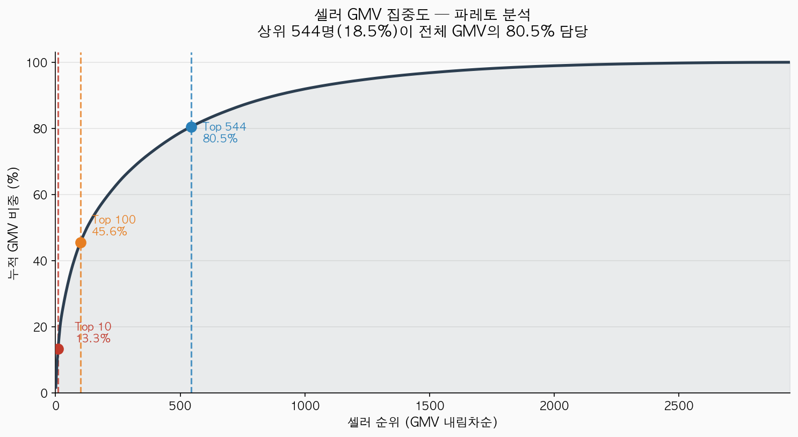
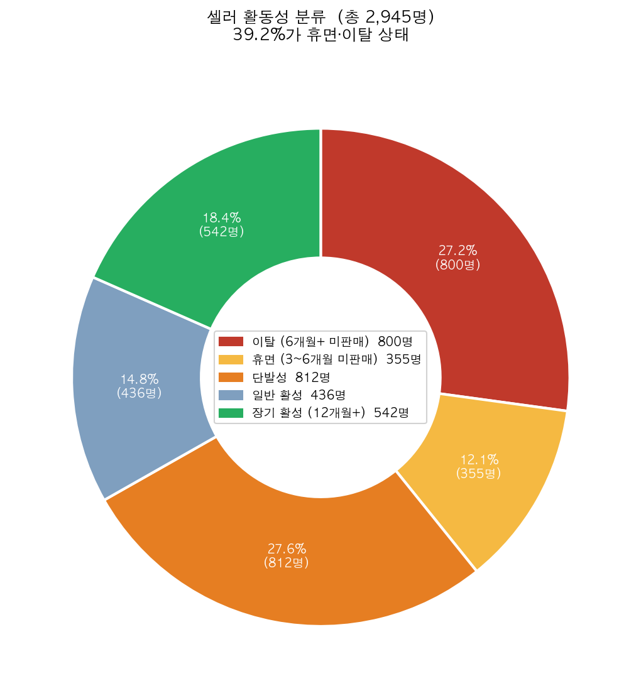
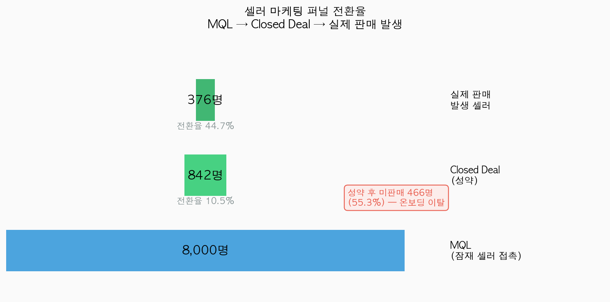
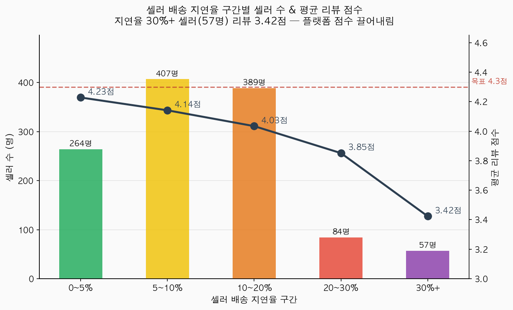
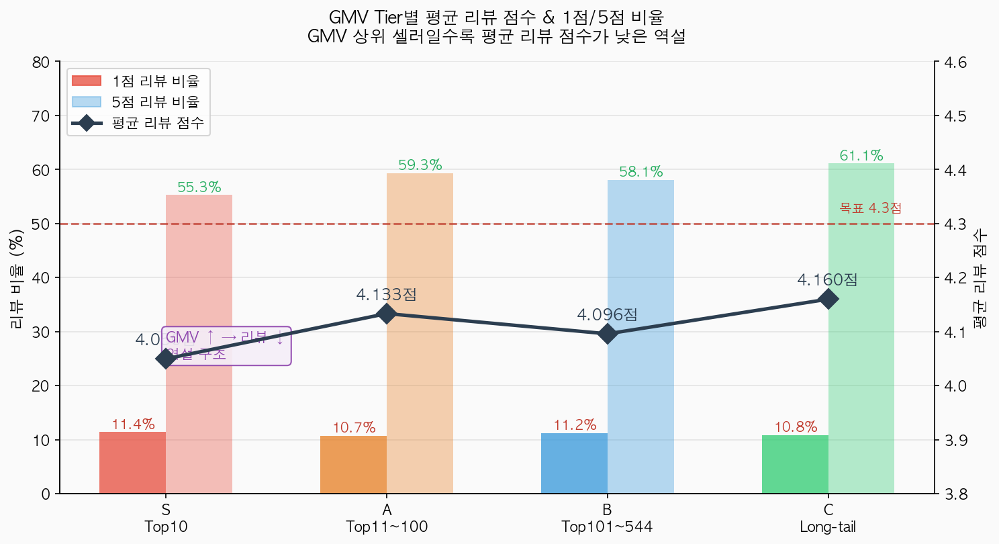
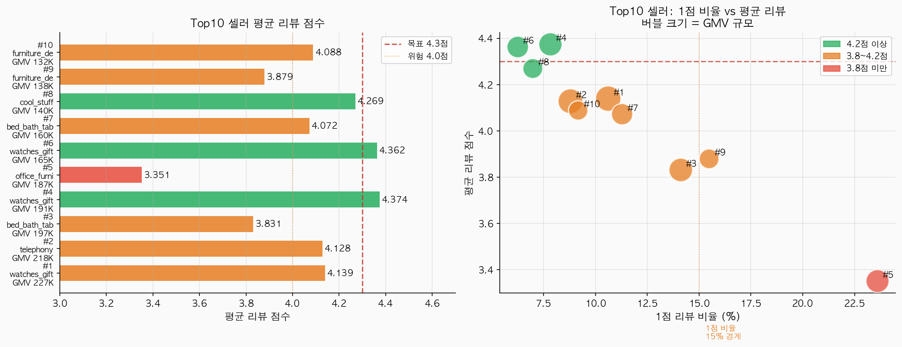
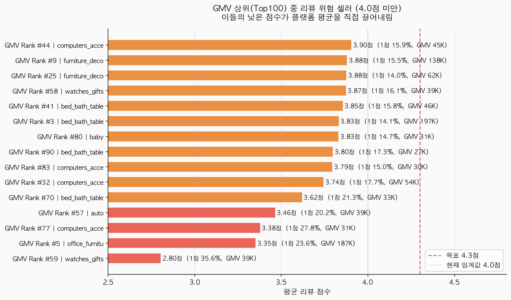
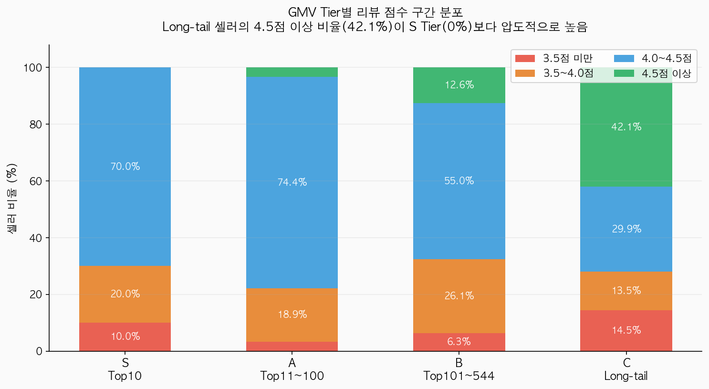
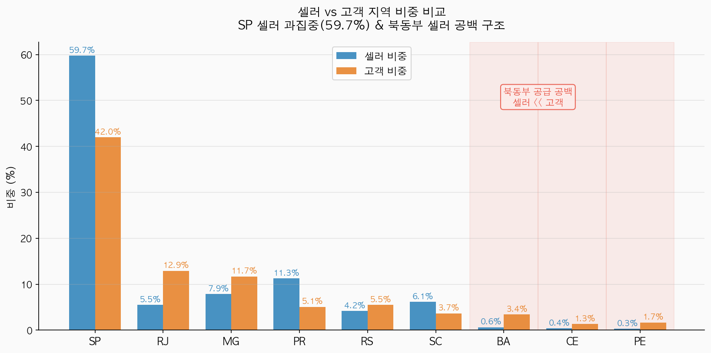

# Seller 팀 OKR

> 작성일: 2026-04-07 (2026-04-10 통합 OKR 기준 수정)
> 전사 Objective: 재구매율 증가 (현재 3.0%)
> 운영 주기: 6개월 checkpoint + 1년 목표 (구조 개선 그룹)
> 참고 데이터: pm_diagnosis_report.md, AARRR Framework, KPI Tree, B2B 마케팅 관점 정리
> 통합 기준 문서: integrated_okr_plan.md

---

## 전사 Objective와의 연결 구조

**"신규 유입 의존형 성장에서 벗어나, 고객이 다시 구매하는 구조를 만든다"**

```
전사 Objective: 재구매율 증가 (현재 3.0%)
        ↑
        │ Seller가 공급하는 상품 품질/카테고리/배송이
        │ buyer의 재구매 경험을 직접 결정
        │
Seller 팀 Objective  ← 구조 개선 그룹 (6개월 checkpoint + 1년 목표)
```

### 전사 공식 KR 기준 수치

> 모든 팀이 동일 기준으로 사용하는 수치. Seller Ops는 아래 수치에 기여하는 방식으로 KR을 설정한다.

| 전사 KR | 지표 | 현재 | 6개월 | 1년 |
|--------|------|------|-------|-----|
| KR1 | 재구매율 | 3.00% | 4.0% | **4.5%** |
| KR2 | 고객당 평균 주문 수 | 1.0334 | 1.05 | **1.06** |
| KR3 | 재구매 주문 비중 | 6.13% | 8.0% | **9.0%** |
| KR4 | 첫 구매 배송 지연율 | 8.16% | 6.5% | **6.0%** |
| KR5 | 첫 구매 저평점 비중 | 12.82% | 11.0% | **10.5%** |
| G1 | 신규 구매 고객 수 | 90,315명 | 유지 | 유지 |
| G2 | AOV | BRL 159.79 | 하락 방지 | 하락 방지 |

> **Seller Ops 기여 포인트**: 전사 KR4(배송 지연율)·KR5(저평점)에 공급 측에서 직접 기여하고, KR1(재구매율)·G1(고객 수 유지)에 공급 다양성 확보로 간접 기여한다.

---

## Seller 팀 Objective

**재구매를 지속시키는 고품질 공급 생태계를 구축한다**

> Seller 팀은 buyer를 직접 상대하지 않지만, 재구매가 일어날 수 있는 조건(카테고리 다양성, 빠른 배송, 좋은 경험)을 공급 측에서 만든다. 전사 재구매율 3%의 핵심 원인 중 하나가 seller의 배송 품질과 카테고리 구조에 있다는 데이터 진단에 근거한다.

---

## 데이터 분석 근거

> CSV 직접 분석 기반. 아래 데이터가 각 KR의 설정 근거가 된다.

### 셀러 공급 구조

**① GMV 집중도 — 파레토**
 

**② 셀러 활동성 분류 — 39.2%가 휴면·이탈**
 

**④ 마케팅 퍼널 — 성약 후 55.3%가 실제 판매 없음**



| 항목 | 수치 | 의미 |
|------|------|------|
| Closed Deal → 실제 판매 | 842명 → 376명 (**44.7%**) | 성약 후 **55.3%(466명)**이 실제로 팔지 않는다 |
| 휴면 셀러 (3개월+ 미판매) | **1,155명(39.2%)** | 신규 유치보다 재활성화가 비용 효율적 |
| 6개월+ 이탈 셀러 | **800명** | 장기 이탈로 회복 가능성 낮은 그룹 |
| 단발성 셀러 | **812명(27.6%)** | 한 번 팔고 사라지는 구조 |
| 12개월+ 장기 활성 셀러 | **542명(18.4%)** | 플랫폼 공급의 실질적 근간 |

---

### 리뷰·품질 구조

**③ 배송 지연율 구간 × 리뷰 점수 — 지연 30%+ 셀러가 플랫폼 점수를 끌어내림**


**⑦ GMV Tier별 평균 리뷰 & 1점/5점 비율 — GMV ↑ → 리뷰 ↓ 역설**


**⑧ Top10 셀러 리뷰 프로파일 — 10명 중 3명이 3.8점 미만 위험권**


**⑨ GMV 상위(Top100) 중 리뷰 위험 셀러 (4.0점 미만 23명)**


**⑩ GMV Tier별 리뷰 점수 분포 — Long-tail 셀러가 오히려 고평점**


> **핵심 역설**: GMV가 높을수록 평균 리뷰 점수가 낮다.
> S(Top10) = **4.050점** < A(Top11~100) = **4.133점** < C(Long-tail) = **4.160점**
> 대량 판매 셀러일수록 품질·배송 일관성 유지가 어려워지는 구조.

| 항목 | 수치 | KR 연결 |
|------|------|---------|
| 배송 지연율 0~5% 셀러 평균 리뷰 | **4.23점** | KR4: 셀러 귀책 지연율 감소가 리뷰에 직결 |
| 배송 지연율 30%+ 셀러 평균 리뷰 | **3.42점** (격차 **0.81점**) | 지연 다발 57명 개선 시 플랫폼 평균 점수 직접 견인 |
| Top100 중 4.0점 미만 위험 셀러 | **23명(23%)** | KR5: 15명 이상 4.0점 달성이 플랫폼 평균의 최대 장애물 제거 |
| Long-tail 셀러 4.5점 이상 비율 | **42.1%** vs S Tier **0%** | 집중 관리·소규모 운영이 만족도를 만든다 |

**Top10 개별 위험 셀러**

| 셀러 | 카테고리 | 평균 리뷰 | 1점 비율 | 위험도 |
|------|---------|---------|---------|-------|
| #5 | office_furniture | **3.351점** | **23.6%** | 최대 리스크 |
| #3 | bed_bath_table | **3.831점** | — | 재구매 친화 카테고리인데 리뷰 위험 |
| #9 | furniture_decor | **3.879점** | — | GMV 높지만 고객 만족도 낮음 |

---

### 지역·공급 공백

**⑤ 셀러 vs 고객 지역 비중 — 북동부 공급 공백**


| 항목 | 수치 | 구조적 문제 |
|------|------|-----------|
| 셀러 SP 집중도 | **59.7%** (고객 SP 비중 42%보다 편중) | 셀러-고객 동일 주 거래 비율 **36.2%**에 불과 |
| 북동부(BA·CE·PE) 고객 비중 | **9.2%** | 고객은 있는데 공급이 없는 구조 |
| 북동부 셀러 비중 | **1.3%(38명)** | 장거리 배송 → 지연 → 재구매율 하락의 직접 원인 |

> 북동부 셀러 확보는 TF4에서 물류팀 3PL 계약 이후 순차 진행. 셀러만 먼저 유치하면 배송 지연 위험이 그대로 전가된다.

---

## Key Results

> Seller Ops는 **구조 개선 그룹**으로 3개월 rolling KR을 갖지 않는다.
> **9월 착수(선결 조건 확정) → 6개월 checkpoint(2~3월) → 1년 목표**의 흐름으로 운영한다.

---

### KR1. 재구매 친화 카테고리 신규 입점 비중 확대
**신규 activated seller 중 재구매 친화 카테고리(bed_bath_table · sports_leisure · housewares) 비중을 40% 이상으로 달성**

- **현황 근거**: bed_bath_table은 충성 고객(3회+) 비중 1위(16.3%), 재구매율이 상대적으로 가장 높은 카테고리(2.8%). 반면 watches_gifts(1.2%), furniture_decor(일시 피크 후 이탈)는 1~2회 구매로 끝나는 구조
- **왜 이 KR인가**: 재구매 구조를 바꾸려면 seller acquisition 단계에서 소모품·반복 구매 카테고리 판매자를 전략적으로 유치해야 함
- **측정 방법**: 분기별 신규 activated seller의 카테고리 분류 비율 트래킹

| 기간 | 목표 수치 | 주요 액션 |
|------|---------|---------|
| **9월 착수** | 측정 기준 수립 + 카테고리 필터링 적용 시작 | 카테고리별 재구매율 기준으로 "재구매 친화 카테고리" 정의 및 내부 기준 확정. MQL 단계부터 카테고리 필터링 적용. acquisition 채널(organic/paid)별 카테고리 분포 분석 |
| **6개월 CP** | 재구매 친화 카테고리 비중 35% 달성 | 재구매 친화 카테고리 판매자 대상 인센티브(수수료 우대, 노출 우선권) 설계 및 적용. 해당 카테고리 MQL 볼륨 집중 캠페인 운영. 분기 성과 리뷰로 카테고리 범위 재조정 |
| **1년 목표** | 재구매 친화 카테고리 비중 **40%+** 안착 | 카테고리별 seller 확보 전략이 acquisition 프로세스에 표준화. 재구매율 기여도 기준으로 seller 포트폴리오 정기 점검 체계 운영. 신규 재구매 친화 카테고리 발굴(garden_tools, toys 등) 검토 |

**핵심 전환점**: 9월에 측정 기준이 없으면 6개월 목표 설정 자체가 불가. 카테고리 기준 수립이 가장 먼저.

---

### KR2. Seller Activation Rate 개선
**계약 완료(Closed Deal) seller의 실제 판매 시작 비율을 44.66% → 65% 이상으로 개선**

- **현황 근거**: MQL 8,000 → Closed Deal 842(전환율 10.52%) → 실제 판매 시작 376명(44.66%). 계약 후 절반 이상(55%)이 실제 판매로 이어지지 않음 — seller funnel의 핵심 병목
- **왜 이 KR인가**: 계약 seller가 실제 상품을 공급해야 buyer 선택지가 늘고 재구매 가능성이 높아짐. 특히 재구매 친화 카테고리 seller의 activation이 중요
- **측정 방법**: 계약 후 90일 이내 첫 delivered order 발생 비율

| 기간 | 목표 수치 | 주요 액션 |
|------|---------|---------|
| **9월 착수** | 미활성 원인 분석 완료 + 전담 onboarding 프로세스 설계 | 계약 후 미활성 seller 원인 분석(상품 등록 미완료 / 시스템 문제 / seller 의지 부재 구분). 계약 완료 즉시 전담 onboarding 담당자 배정 프로세스 설계. 활성화 실패 seller 대상 인터뷰 착수 |
| **6개월 CP** | Activation rate **55%** 달성 | 계약~첫 판매 단계별 체크포인트 모니터링 시스템 구축(상품 등록 → 첫 노출 → 첫 주문). 미활성 위험 seller 조기 감지 알림 운영. 활성화 성공 seller 패턴 분석 후 best practice 가이드 배포 |
| **1년 목표** | Activation rate **65%+** 안착 | activation 프로세스 전면 표준화 및 자동화(알림, 체크리스트, 가이드). 계약 조건 재설계(activation 실패 시 계약 자동 종료 조항 검토). activation rate가 MQL→Deal 전환율만큼 핵심 funnel 지표로 관리됨 |

**핵심 전환점**: 9월의 원인 분석 없이는 6개월 프로세스 설계가 방향을 잃음. 왜 안 되는지 먼저 파악.

---

### KR3. 신규 seller Onboarding 속도 단축
**계약 후 첫 판매 시작까지 소요일(days to first order)을 중앙값 44일 → 25일 이내로 단축**

- **현황 근거**: 첫 주문까지 평균 51.49일, 중앙값 44.33일. 이 기간 동안 공급 공백이 발생하고 seller 이탈 가능성도 높아짐
- **왜 이 KR인가**: onboarding이 빠를수록 buyer에게 상품이 노출되는 시점이 앞당겨지고, seller도 빠른 첫 성과를 경험해 retention 가능성이 높아짐. KR2와 시너지
- **측정 방법**: 분기별 신규 Closed Deal seller의 첫 delivered order 소요일 중앙값

| 기간 | 목표 수치 | 주요 액션 |
|------|---------|---------|
| **9월 착수** | 단계별 소요시간 측정 + 병목 구간 특정 | 계약~첫 판매 구간의 단계별 소요시간 측정(계약 완료 → 상품 등록 → 심사 → 노출 → 첫 주문). 상품 등록 가이드 및 템플릿 제공으로 seller 측 준비 시간 단축 착수 |
| **6개월 CP** | 첫 판매 소요일 중앙값 **30일 이내** | 심사·승인 프로세스 내부 SLA 설정(상품 등록 후 3영업일 이내 검토 완료). 신규 seller 전용 fast-track 심사 도입. 계약 직후 "첫 판매 30일 달성" 가이드 키트 발송 |
| **1년 목표** | 첫 판매 소요일 중앙값 **25일 이내** 안착 | onboarding 전 과정 자동화(상품 등록 → 심사 → 노출까지 시스템 처리). 첫 판매 소요일이 seller 품질 평가 지표로 포함. KR2 activation rate와 함께 funnel 효율 통합 관리 |

**핵심 전환점**: 내부 심사 프로세스 개선 없이 seller 측 가이드만 강화해도 한계. 6개월 CP에 내부 SLA 설정이 필수.

---

### KR4. Seller 귀책 배송 지연율 감소
**셀러 귀책 배송 지연율을 8.13% → 5% 이하로 감소**

> **범위 구분**: 이 KR은 출고 지연 등 셀러 귀책으로 발생하는 배송 지연만 대상으로 한다. 전체 배송 지연율(8.16%) 관리는 물류/SCM팀 영역이며, Seller Ops는 셀러 측 출고 이슈에 집중한다. (TF4에서 물류팀과 기준 통합 예정)

- **현황 근거**: 셀러 귀책 배송 지연율 8.13% (심각 지연 7일+ 3.47%). 지연 배송 → 리뷰 평점 0.5~1.0점 하락 → buyer 재구매 회피로 이어지는 인과관계가 데이터로 확인됨. 특히 첫 구매 지연 경험은 2차 구매 전환을 막는 핵심 요인
- **왜 이 KR인가**: buyer의 첫 경험(Activation 단계)을 결정하는 것은 대부분 seller의 배송 처리 속도. 셀러 귀책 지연 개선이 재구매율에 직결됨
- **측정 방법**: 월별 order_delivered_customer_date > order_estimated_delivery_date 비율 중 셀러 출고 지연 귀책 건. 지연 다발 seller(상위 10%) 경고/SLA 강화 조치 이행 건수 병행 트래킹

> **전사 기준 연계**: 전사 KR4 첫 구매 배송 지연율(8.16% → 6개월 6.5% → 1년 6.0%)에서 셀러 귀책 구간을 Seller Ops가 담당. 전체 지연율 목표는 물류팀 관할.

| 기간 | 목표 수치 | 주요 액션 |
|------|---------|---------|
| **9월 착수** | 지연 다발 셀러 리스트업 + BF 사전 경고 발송 | 지연율 상위 10% seller 리스트업 및 1차 경고 발송. 카테고리별·지역별 지연 패턴 분석. BF 대비 출고 기준 및 SLA 재확인. 지연 다발 seller에 예상 배송일 buffer(+1~2일) 의무 적용 |
| **6개월 CP** | 셀러 귀책 지연율 **6.5% 이하** (전사 KR4 6개월 목표 동일 수준) | 지연율 기준 seller 등급제 도입(3개월 연속 지연율 10% 이상 → 노출 제한). 개선 의지 있는 seller 대상 물류 파트너 연결 지원. 월별 seller별 배송 성과 리포트 자동 발송. TF4에서 물류팀과 등급 기준 통합 |
| **1년 목표** | 셀러 귀책 지연율 **5.0% 이하** 안착 (전사 KR4 6.0% 대비 초과 달성) | 셀러 귀책 지연율이 seller 입점 유지 조건으로 계약서에 명시. 지연율 낮은 seller 인센티브(수수료 우대, 프로모션 우선 참여권). 신규 seller 계약 시 배송 SLA 동의 필수화 |

**핵심 전환점**: 9월 데이터 분석 없이 6개월 등급제를 도입하면 기준이 자의적이 됨. 실제 지연 패턴 파악이 선행 필수.

---

### KR5. 핵심 Seller 유지율 100% + 품질 기준 유지
**상위 GMV 기여 seller 100명의 이탈율 0% 유지, 이들의 평균 리뷰 점수 4.3점 이상 유지**

- **현황 근거**: 상위 100명 seller가 GMV의 45.1%를 책임짐. 상위 544명이 80% 담당. 소수 이탈 시 GMV 급락 위험. 충성 고객의 리뷰 평점 4.37점이 이탈 재구매자(4.20점)보다 유의미하게 높아 seller 품질과 buyer 충성도가 연결됨
- **왜 이 KR인가**: 재구매율 증가는 단순히 고객을 자주 오게 만드는 것만이 아님. 고객이 돌아왔을 때 믿을 수 있는 seller가 그 자리에 있어야 함. 핵심 seller의 이탈 방지와 품질 유지가 동시에 필요
- **측정 방법**: 분기별 상위 100명 seller 활동 여부 + 해당 seller 발생 주문의 평균 리뷰 점수

> **전사 기준 연계**: 전사 KR5 저평점(12.82% → 6개월 11.0% → 1년 10.5%)에서 상품 기대 불일치(~20%) 원인은 Seller Ops 담당. Top100 리뷰 위험 셀러 개선이 핵심 기여 경로.

| 기간 | 목표 수치 | 주요 액션 |
|------|---------|---------|
| **9월 착수** | 상위 100명 현황 파악 + 모니터링 체계 수립 + 리뷰 위험 23명 개선 플랜 수립 | 상위 100명 seller 현황 파악(활동 여부, 최근 리뷰 추이, 계약 만료일). 전담 account manager 배정. 월 1회 정기 컨택 시작. 이탈 위험 신호(주문 급감, 리뷰 하락) 모니터링 체계 수립. Top100 중 4.0점 미만 23명 개별 원인 분석 착수 |
| **6개월 CP** | 이탈 0건 + 리뷰 **4.3점** 이상 + 리뷰 위험 셀러 **15명 이상** 4.0점 달성 | VIP seller 프로그램 공식 런칭(전담 지원, 수수료 우대, 신상품 우선 노출). 리뷰 위험 셀러 집중 코칭(상품 설명·포장·배송 개선 지원). 셀러 교육 콘텐츠 v1 배포(TF2 연계). 분기 성과 공유 미팅으로 seller 로열티 강화 |
| **1년 목표** | 이탈 0건 + 리뷰 **4.3점** 이상 + GMV 비중 **45%+** 유지 | VIP seller 프로그램 정례화 및 tier 확장(상위 100명 → 상위 200명). seller 성과 기반 tier 승급/강등 기준 명문화. 상위 seller 이탈 리스크를 분기 경영 리뷰 지표로 포함 |

**핵심 전환점**: 9월에 모니터링 체계가 없으면 이탈을 사후에야 인지함. 조기 감지 체계와 위험 셀러 식별이 먼저.

---

### KR6. 휴면 Seller 재활성화
**휴면 seller 1,155명 중 20%(231명) 재활성화**

- **현황 근거**: 과거 활동 이력이 있으나 현재 비활성 상태인 seller 1,155명 존재. 이들은 이미 플랫폼 온보딩을 완료한 상태로, 신규 seller 유치 대비 재활성화 비용이 낮고 공급 다양성 확보에 즉각 기여 가능
- **왜 이 KR인가**: 전사 Guardrail G1(신규 구매 고객 수 유지)을 위해 공급 풀 확대가 필요. 신규 seller 유치만으로는 속도에 한계가 있어 휴면 seller 재활성화를 병행
- **측정 방법**: 6개월 이상 미활성 seller 중 90일 이내 delivered order 발생 건수 기준

| 기간 | 목표 수치 | 주요 액션 |
|------|---------|---------|
| **9월 착수** | 휴면 셀러 세그먼트 분류 완료 | 휴면 원인별 분류(플랫폼 이탈 vs 일시 중단 vs 경쟁사 이동). 6개월 이하 미활성 그룹 우선 선별. 재활성화 캠페인 메시지 설계 |
| **6개월 CP** | 휴면 seller **115명(10%)** 재활성화 | 재활성화 캠페인 발송(수수료 한시 우대, 재입점 가이드). 반응 seller 대상 전담 온보딩 지원. G1(신규 구매 고객 수 유지) 기여 여부 확인 |
| **1년 목표** | 휴면 seller **231명(20%)** 재활성화 | 재활성화 성공 패턴 분석 후 자동화. 재활성화 seller의 카테고리 분포 모니터링(재구매 친화 카테고리 유도). KR1과 연계하여 공급 포트폴리오 최적화 |

**핵심 전환점**: 휴면 원인을 먼저 분류해야 재활성화 메시지가 달라짐. 9월 세그먼트 분류 없이 캠페인 발송하면 이탈 확정 셀러에게 비용 낭비.

---

## 요약표

| # | Key Result | 현재 → 목표 | 전사 OKR 연결 |
|---|-----------|-----------|-------------|
| KR1 | 재구매 친화 카테고리 신규 seller 비중 | 측정 기준 수립 → 40%+ | 재구매 가능한 상품 공급 확대 |
| KR2 | Seller activation rate | 44.66% → **65%+** | 공급 다양성 확보 |
| KR3 | 첫 판매까지 소요일 (중앙값) | 44일 → 25일 이내 | 빠른 공급 확보 → buyer 접점 확대 |
| KR4 | **셀러 귀책** 배송 지연율 | 8.13% → 5% 이하 | 첫 경험 개선 → 재구매 전환율 향상 |
| KR5 | 핵심 seller 100명 이탈율 + 리뷰 점수 | 이탈 0% + 4.3점 이상 유지 | GMV 안정성 + buyer 신뢰 유지 |
| KR6 | 휴면 seller 재활성화 | 1,155명 중 20%(231명) | G1 (공급 풀 확대 → 신규 구매 고객 접점 유지) |

---

## 핵심 논리 한 줄 요약

> Seller 팀이 "재구매 친화 카테고리 seller를 빠르게 활성화하고, 셀러 귀책 배송 품질을 높이고, 핵심 seller를 지키고, 휴면 seller를 재활성화해야" 전사의 재구매율 3% 개선이 가능하다. (TF4 리드로 물류팀과 셀러 관리 기준을 통합하는 것이 중장기 구조의 핵심)

---


## 기간별 통합 체크포인트

| 기간 | 핵심 달성 조건 | 전사 KR 기여 |
|------|-------------|-----------|
| **9월 착수** | ① 측정 기준 확립 (KR1 카테고리 정의, KR4 지연 귀책 기준) <br>② 문제 셀러 파악 (지연 상위 10%, 리뷰 위험 23명) <br>③ 모니터링 체계 수립 (KR5 VIP 100명 조기 감지) <br>④ BF 사전 경고 발송 (위험 셀러, 출고 SLA 재확인) | 직접 효과 미미, 인프라 구축 단계 |
| **6개월 CP** | ① KR2 Activation rate 55% + KR3 첫 판매 30일 이내 <br>② KR4 셀러 귀책 지연율 6.5% 이하 + 등급제 운영 <br>③ KR5 VIP 프로그램 런칭 + 리뷰 위험 셀러 15명 4.0점 달성 <br>④ KR6 휴면 seller 115명(10%) 재활성화 <br>⑤ TF4 셀러 성과 프레임워크 v1 완성 | 전사 KR4(배송 지연율) 6.5% 기여 <br>전사 KR5(저평점) 11.0% 기여 <br>재구매율 3.0% → 3.5% 수준 |
| **1년 목표** | ① KR2 65%+ / KR3 25일 / KR4 5.0% / KR5 리뷰 4.3점 <br>② KR6 휴면 seller 231명(20%) 재활성화 <br>③ KR1 재구매 친화 카테고리 40%+ <br>④ TF4 셀러 등급/SLA/인센티브 체계 전사 표준화 | 전사 KR4 6.0% 달성 기여 <br>전사 KR5 10.5% 달성 기여 <br>재구매율 3.0% → 4.0%+ (CRM 팀 병행 시) |

---

## Black Friday 역할 (BF 구간)

> **운영 구조**: Seller Ops는 BF 단기 실행 그룹이 아닌 구조 개선 그룹에 속하지만, BF 배송 품질 방어를 위한 셀러 관리 역할을 수행한다.

| 단계 | 기간 | Seller Ops 역할 |
|------|------|----------------|
| **준비** | 9월~10월 | 위험 셀러(지연율 상위 10%) 사전 경고 발송. 출고 기준 및 SLA 재확인. 재구매 친화 카테고리 셀러 BF 참여 유도 |
| **실행** | 11월 (BF) | 출고 현황 실시간 모니터링. 배송 지연 위험 셀러 즉시 알림 대응 |
| **사후** | 12월~1월 | BF 성과 기반 셀러 평가 반영. 우수 셀러 인센티브·지연 다발 셀러 페널티 적용 |

> **연계**: BF-KR4(BF 기간 배송 지연율 7.0% 이하 방어)에서 물류팀과 역할 분담. 물류팀은 전체 지연 모니터링, Seller Ops는 셀러 출고 귀책 관리.

---

## TF 참여 역할

### TF2. 첫 구매 경험 품질 개선 (참여팀)

**리드**: Product/UX | **Seller Ops 역할**: 상품 기대 불일치 원인(저평점 ~20%) 개선

| Seller Ops 기여 KR | 내용 | 목표 |
|-------------------|------|------|
| 리뷰 위험 셀러 4.0점 이상 달성 | Top100 중 4.0점 미만 23명 → 15명 개선 | 6개월 |
| 셀러 교육 콘텐츠 운영 | 상품 정보 품질이 리뷰·검색에 미치는 영향 데이터 공유 | 6개월 |

- 월 1회 TF2 합동 리뷰 참여: 저평점 원인별 추이 확인
- CX가 수집한 VOC 태깅 데이터 → 상품 기대 불일치 원인 분석 후 셀러 피드백
- 상품 정보 품질 기준(Product/UX 정의) → 셀러 교육 실행

### TF4. 셀러 품질 관리 체계 통합 (리드팀)

**Seller Ops가 리드** | **참여**: 물류

| 영역 | Seller Ops (오너) | 물류 (지원) |
|------|------------------|------------|
| 셀러 등급 기준 설계 | 등급 프레임워크 설계 + 집행 | 배송 성과 데이터 제공 |
| SLA 기준 | SLA 기준 확정 + 경고/페널티 | Fast-Ship 인증 기술 판정 |
| 셀러 교육 | 교육 콘텐츠 제작 + 실행 | 카테고리별 불만 데이터 제공 |
| 북동부 확장 | 셀러 유치 실행 | 3PL 계약 (선행 조건) |

> **원칙**: 물류팀의 북동부 3PL 인프라가 준비된 지역부터 셀러를 유치한다. 셀러만 먼저 유치하면 배송 지연 → 저평점 → 재구매 저하로 이어진다.

**산출물**:
- [ ] 셀러 성과 관리 프레임워크 (등급/SLA/인센티브/페널티 통합)
- [ ] 북동부 확장 공동 타임라인
- [ ] 셀러 교육 콘텐츠 v1
